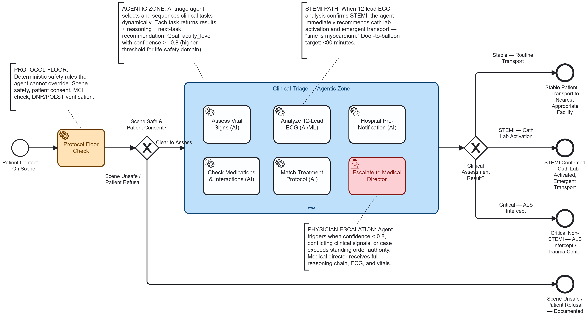
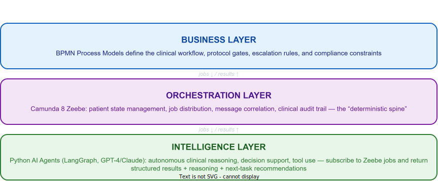
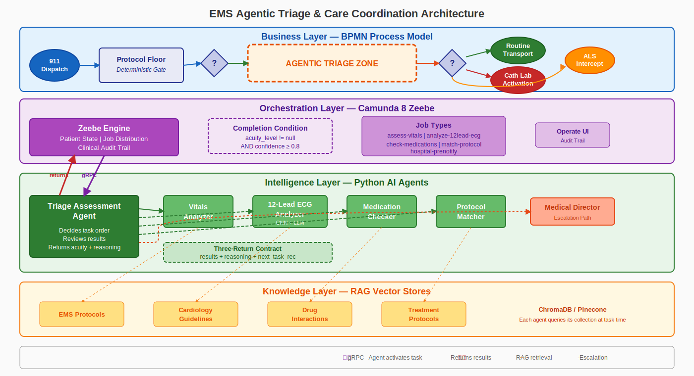

# Agentic AI in Emergency Medicine: Orchestrating STEMI Detection with Deterministic Guardrails


**Author:** Gary Samuelson
**Date:** March 22, 2026
**Status:** Living Document — EMS Domain Adaptation
**Blog:** [garysamuelson.github.io](https://garysamuelson.github.io)

---

## The Process Model

Before defining terms, look at the process. The BPMN diagram below models a complete EMS patient encounter — from initial contact through clinical triage to a transport decision. Everything discussed in this document maps back to what you see here.



Reading left to right: the process starts at **Patient Contact — On Scene**, passes through a deterministic **Protocol Floor Check** and a gateway that enforces scene safety and patient consent. If those hard gates pass, the flow enters the large dashed-border box in the center — **Clinical Triage — Agentic Zone** — a BPMN ad-hoc subprocess. Inside that zone, six tasks are visible but *not connected by sequence flows*: five AI service tasks (**Assess Vital Signs**, **Analyze 12-Lead ECG**, **Check Medications & Interactions**, **Match Treatment Protocol**, **Hospital Pre-Notification**) and one human escalation task (**Escalate to Medical Director**). After the agentic zone completes, a routing gateway evaluates the clinical assessment result and directs to one of three outcomes: **Stable — Routine Transport**, **STEMI — Cath Lab Activation**, or **Critical — ALS Intercept**.

The two definitions that follow — *Agency* and *Agentic Pattern* — map directly onto this diagram.

---

## Defining "Agentic" — Two Complementary Forms

The term *agentic* carries two distinct-but-complementary meanings in enterprise AI. Both are valid; neither is complete without the other.

---

### Form 1 — Agency: AI with Autonomous Action Capability

An AI component is given **agency** — the ability to take actions independently, without being explicitly directed step-by-step by a human or hardcoded script.

> **The agent can *decide to do something*, not just *respond when asked.***

**Properties of Agency**:

| Property | Definition | Process Implication |
|----------|------------|---------------------|
| **Autonomy** | Operates without constant human control | Executes tasks without per-decision approval |
| **Perception** | Perceives environment through sensors/APIs | Monitors patient state, vitals, clinical context |
| **Persistence** | Continues operating over time | Maintains state across the patient encounter |
| **Adaptation** | Adjusts behavior in response to change | Updates assessment as new clinical data arrives |
| **Goal-Seeking** | Creates and pursues goals proactively | Optimizes for patient outcomes, not just task completion |

**Examples:**
- A triage agent that autonomously monitors vital signs, detects STEMI patterns on a 12-lead ECG, and activates a cath lab notification — triggered by data, no human in the loop
- A coding agent that detects a failing test, reads the error, edits the file, re-runs the test, and commits on its own
- A medication safety agent that cross-references a patient's current medications against proposed field interventions and flags contraindications before the paramedic acts

This is the **capability layer** — it defines what an individual agent *can do.*

**In the diagram:** Each AI service task inside the agentic zone is a Form 1 agent. The **Analyze 12-Lead ECG (AI/ML)** task, for example, has autonomy (it runs a CNN + LLM pipeline without human approval), perception (it reads the ECG tracing data), persistence (it retains context across the encounter), adaptation (it adjusts its interpretation based on clinical context from other tasks), and goal-seeking (it actively pursues a STEMI determination, not just a generic response). The same properties apply to **Assess Vital Signs**, **Check Medications & Interactions**, and the other AI tasks. Each operates as an autonomous agent within its clinical scope.

---

### Form 2 — Agentic Pattern: Orchestrated Collaborative Workflow

This is the **architectural pattern** — how multiple AI-enabled tasks are coordinated into a structured workflow where each sub-agent returns structured output that feeds an orchestrator.

Each sub-agent returns three components:

| Return Component | Purpose | Consumer |
|---|---|---|
| **Results** | Machine-ingestible data for the orchestrator | Orchestration engine (e.g., Camunda Zeebe) |
| **Next Task Recommendation** | What should happen next in the sub-process | Orchestrator or agentic reasoning layer |
| **Reasoning** | Human-readable explanation of *why* — traceable, auditable | Clinical audit trail, physician reviewers, QA/QI |

This is the **coordination layer** — it defines how agents *work together.*

**In the diagram:** The entire **Clinical Triage — Agentic Zone** box is a Form 2 pattern in action. It is a BPMN ad-hoc subprocess — the tasks inside have no sequence-flow arrows connecting them. An orchestrating triage agent decides which tasks to activate, in what order, based on evolving clinical findings. When **Assess Vital Signs** returns results showing hemodynamic instability, the orchestrator activates **Analyze 12-Lead ECG** next. When the ECG confirms STEMI, the orchestrator activates **Check Medications & Interactions** before committing to a treatment protocol. Each task feeds its structured three-part return back to the orchestrator, which uses the accumulated picture to decide the next move — or to escalate to the **Escalate to Medical Director** user task when confidence stays below 0.8. The ad-hoc subprocess completes when the orchestrator has assigned an acuity level with sufficient confidence, and the process flows to the routing gateway on the right.

---

### How They Relate

| | Agency (Form 1) | Agentic Pattern (Form 2) |
|---|---|---|
| **Focus** | What the agent can do autonomously | How agents are orchestrated together |
| **Scope** | Single agent with broad capability | Multi-agent workflow |
| **Output** | Action taken | Structured result + recommendation + reasoning |
| **Control** | Agent decides within guardrails | Orchestrator directs, agents recommend |
| **Governance** | Embedded in agent prompts/constraints | Enforced by BPMN process model and orchestration engine |

**In practice, Form 2 pipelines are built from Form 1 agents.** You need agents with agency to compose an agentic workflow. The orchestration layer (BPMN/Camunda) governs *when* and *how* those agents are invoked, while the agents themselves bring autonomous reasoning *within* their scope of action.

---

## The Agentic Workflow Architecture

### Three Layers



The architecture rests on a clean separation of concerns across three layers, connected by a single integration pattern: **jobs flow down, results flow up.**

The **Business Layer** owns the *what* and the *when* — BPMN process models define which clinical tasks exist, what governance gates protect them, and under what conditions the process escalates or completes. This layer is entirely declarative: a process analyst can read and modify it without touching code.

The **Orchestration Layer** owns the *how* — Camunda 8 Zeebe acts as the deterministic spine of the system. It manages patient encounter state, distributes job assignments to workers, correlates messages between process instances, and writes the clinical audit trail. Critically, Zeebe has no opinion about *what decision an agent should make*. It tracks which jobs have been created, which have been completed, and what variables were returned — nothing more.

The **Intelligence Layer** owns the *why* — Python AI agents subscribe to Zeebe job types, receive context variables (patient vitals, ECG data, medication history), reason autonomously within their clinical scope, and return structured results plus an explanation of their reasoning. This is where LLMs, CNNs, RAG retrieval, and LangGraph orchestration live.

**Key insight:** Camunda doesn't "run" AI code. Python agents **subscribe to jobs** from Camunda, make intelligent decisions, and **signal back** what to do next. This preserves the deterministic clinical audit trail while enabling autonomous reasoning.

### The Full Architecture



The detailed diagram above expands those three layers into four — adding a Knowledge Layer at the bottom — and shows every component in the running system, read top to bottom.

The **Business Layer** (blue) — the *what* and the *when* from the simplified view — now shows its concrete workflow. The **Protocol Floor Check** from the BPMN process model is the first service task: hard-coded safety rules (scene safety, patient consent, MCI override, DNR/POLST verification) that no AI agent can override. An exclusive gateway evaluates the results — if the scene is unsafe or the patient refuses, the process terminates immediately. Only when the floor clears does the flow enter the dashed-border **Agentic Triage Zone**, the BPMN ad-hoc subprocess whose five AI service tasks and one human escalation task appear in the process model above. After the zone completes, a routing gateway directs to one of three clinical outcomes: Routine Transport, Cath Lab Activation, or ALS Intercept.

Zooming into the Orchestration Layer's *how*, we can now see the machinery behind that deterministic spine. The Zeebe Engine manages patient state and distributes jobs. The five job types — `assess-vitals`, `analyze-12lead-ecg`, `check-medications`, `match-protocol`, `hospital-prenotify` — map one-to-one to the service tasks declared inside the BPMN ad-hoc subprocess; each task's `zeebe:taskDefinition` names its job type, making the process model the single source of truth for what jobs exist and which workers subscribe to them. A **Completion Condition** governs when the ad-hoc subprocess resolves: the orchestrator requires both an assigned acuity level *and* a confidence score at or above 0.8 before the process can exit. The Operate UI provides the clinical audit trail.

The **Intelligence Layer** (green) answers the *why* with specific agents. The **Triage Assessment Agent** on the left is the orchestrating agent — it receives jobs from Zeebe via gRPC, decides which task agents to activate, reviews their results, and returns its final assessment back up to Zeebe. The four task agents (Vitals Analyzer, 12-Lead ECG Analyzer, Medication Checker, Protocol Matcher) each handle a specific clinical domain. The dashed arrows from the orchestrating agent indicate that task activation is *dynamic* — not every agent runs for every patient — and this is precisely what the BPMN ad-hoc subprocess enables: because the tasks inside have no sequence-flow connections, the orchestrating agent is free to activate them in whatever order the clinical picture demands. When confidence stays below 0.8 after all assessments, the dashed orange escalation path routes to the **Medical Director** for human-in-the-loop review. Every agent returns via the **Three-Return Contract**: structured results, human-readable reasoning, and a next-task recommendation.

The **Knowledge Layer** (yellow) is the fourth concern that grounds the *why* in evidence. The RAG vector stores — EMS Protocols, Cardiology Guidelines, Drug Interactions, and Treatment Protocols — are backed by ChromaDB or Pinecone. Each task agent queries its own collection at inference time — a binding declared in the BPMN itself via `zeebe:taskHeaders` on each service task (e.g., the ECG Analyzer's header points to `cardiology_guidelines`, the Medication Checker's to `drug_interactions`). The process model wires agent to knowledge store, so the Intelligence Layer's reasoning draws on domain-specific clinical knowledge rather than relying solely on the LLM's training data.

### The Job Worker Pattern

```
Orchestrator (Camunda Zeebe) creates job: "triage-assessment-agent"
    │
    ├─► Python Job Worker receives job + context variables
    │     { chiefComplaint: "chest_pain", age: 62, hr: 110,
    │       bp: "88/54", spo2: 94, onset: "45min_ago" }
    │
    ├─► AI Agent reasons autonomously within its scope
    │     - Analyzes clinical indicators
    │     - Decides which assessment tasks to activate
    │     - Produces confidence-scored triage assessment
    │
    └─► Returns structured response to Camunda:
          {
            results: { acuity_level: "RED", confidence: 0.91 },
            next_task: "analyze_12lead_ecg",
            reasoning: "62yo male, crushing chest pain 45min onset,
                        tachycardic at 110, hypotensive 88/54, SpO2 94%.
                        Presentation highly suspicious for acute MI.
                        Immediate 12-lead ECG required for STEMI
                        rule-in/rule-out."
          }
```

---

## Illustrative Example: EMS Patient Encounter — Chest Pain / Suspected STEMI

### The Scenario

A 911 call comes in: *62-year-old male, crushing chest pain, diaphoretic.* The ambulance arrives on scene. After initial scene safety confirmation and patient contact (deterministic protocol floor), the encounter enters the **Clinical Triage Agentic Zone** — an ad-hoc subprocess where an AI triage agent orchestrates multiple clinical assessment tasks collaboratively.

### Why This Domain?

Emergency medicine is a compelling domain for illustrating agentic patterns because:

- **Time-critical autonomy matters** — "Time is myocardium." Every minute of delay in STEMI identification increases mortality. The agent must reason fast, within protocols, without waiting for human approval on every step. Huyen emphasizes that real-time ML inference demands end-to-end latency budgets where every millisecond counts — exactly the constraint governing prehospital STEMI detection (Huyen, *Designing Machine Learning Systems*, 2022).
- **Protocols are governance** — EMS operates under standing orders from medical directors, directly analogous to BPMN governance gates. The agent works *within* protocol boundaries, just as a banking agent works within regulatory constraints.
- **Escalation is intuitive** — Paramedic → Medical Director maps naturally to the human-in-the-loop escalation pattern. Everyone understands why an edge case should go to a physician.
- **Audit trails are mandatory** — Every clinical decision must be documented for quality improvement, legal, and regulatory review — the same observability requirement as financial services. The Google SRE framework provides the canonical treatment of service-level objectives (SLOs) and latency budgets that underpin this kind of clinical system accountability (Beyer et al., *Site Reliability Engineering*, 2016).

### What Makes This "Agentic"

The Clinical Triage subprocess uses a BPMN **ad-hoc subprocess** — the tasks inside are *not* connected by predefined sequence flows. Instead, an AI triage agent:

1. Evaluates the patient presentation
2. **Decides which clinical tasks to activate** (not all tasks run for every patient)
3. Reviews intermediate clinical results
4. **Recommends what to do next** based on accumulated findings
5. Determines when the goal is met (acuity_level assigned with confidence >= 0.8)

Note the **higher confidence threshold (0.8 vs. 0.7)** compared to a financial services example. In a life-safety domain, we demand stronger confidence before autonomous action. When in doubt, escalate to a physician.

This is the agentic pattern in action: the orchestrator (Camunda) provides governance and process state, while the agent provides intelligent task selection and clinical reasoning.

### The Tasks Within the Agentic Zone

| Task | Job Type | AI Capability | What It Returns |
|---|---|---|---|
| **Assess Vital Signs** | `assess-vitals` | Analyzes HR, BP, SpO2, RR, GCS, EtCO2; calculates shock index; trends over encounter | `{ vital_summary: "hemodynamically unstable", shock_index: 1.25, critical_flags: ["hypotension", "tachycardia"] }` |
| **Analyze 12-Lead ECG** | `analyze-12lead-ecg` | CNN-based STEMI detection + LLM clinical reasoning across all 12 leads — the inference pipeline design follows production ML serving principles (Huyen, 2022; Panesar, *ML and AI for Healthcare*, 2020) | `{ stemi_detected: true, st_elevation_leads: ["II", "III", "aVF"], interpretation: "inferior_STEMI" }` |
| **Check Medications** | `check-medications` | Reviews patient meds against proposed interventions; flags contraindications | `{ contraindications: ["nitro_contraindicated_sildenafil"], safe_interventions: ["aspirin", "heparin"], anticoag_status: "none" }` |
| **Match Treatment Protocol** | `match-protocol` | Matches clinical picture to local EMS treatment protocol; determines transport priority | `{ matched_protocol: "CARDIAC-STEMI-01", interventions: ["aspirin_324mg", "heparin_bolus", "12lead_transmit"], transport_priority: "EMERGENT" }` |
| **Hospital Pre-Notification** | `hospital-prenotify` | Generates MIST/SBAR report; activates cath lab if STEMI confirmed | `{ destination: "St. David's — South", cath_lab_activated: true, eta_minutes: 12, notification_format: "MIST" }` |

### Agent Decision Flow Example

```
Patient: { age: 62, chiefComplaint: "chest_pain", onset: "45min",
           hr: 110, bp: "88/54", spo2: 94, diaphoretic: true }

Agent Iteration 1:
  ► Activates: Assess Vital Signs, Analyze 12-Lead ECG
  ► Reasoning: "62yo male with chest pain, diaphoretic, hemodynamically
                concerning. Vital sign formal assessment and immediate
                12-lead ECG are co-priority — time is myocardium."

Agent Iteration 2 (after vitals + ECG results return):
  ► Activates: Check Medications
  ► Reasoning: "Vitals confirm hemodynamic instability: shock index 1.25,
                hypotensive at 88/54. ECG shows ST-elevation in II, III,
                aVF — inferior STEMI pattern. Before initiating STEMI
                protocol interventions, must check medication history
                for contraindications (especially PDE5 inhibitors
                before nitroglycerin, and anticoagulant status)."

Agent Iteration 3 (after medication check returns):
  ► Activates: Match Treatment Protocol, Hospital Pre-Notification
  ► Reasoning: "Nitro contraindicated — patient took sildenafil 18hrs ago.
                No other contraindications. Proceeding with modified STEMI
                protocol (aspirin + heparin, hold nitro). Activating cath
                lab pre-notification in parallel — door-to-balloon clock
                starts when we notify."

Agent Final Assessment:
  ► Returns to orchestrator:
    {
      acuity_level: "RED",
      stemi_detected: true,
      confidence_score: 0.93,
      reasoning: "Inferior STEMI confirmed (ST-elevation II, III, aVF).
                  Hemodynamically unstable (SI 1.25, BP 88/54). Modified
                  STEMI protocol — nitro held due to sildenafil. Aspirin
                  324mg + heparin bolus administered. Cath lab activated
                  at St. David's South, ETA 12 minutes. All clinical
                  findings documented for receiving team.",
      next_task: "emergent_transport_with_continuous_monitoring",
      tasks_executed: ["assess-vitals", "analyze-12lead-ecg",
                       "check-medications", "match-protocol",
                       "hospital-prenotify"]
    }
```

### When the Agent Escalates

Not all paths lead to autonomous completion. The BPMN model includes an **Escalate to Medical Director** user task that the agent can activate when:

- Confidence score remains below 0.8 after all clinical assessments
- Conflicting clinical signals (e.g., STEMI criteria met but atypical presentation suggesting STEMI mimic)
- Edge case exceeds standing order authority (pediatric cardiac emergency, requested intervention outside protocol)
- Patient condition changes rapidly and requires real-time physician guidance

This is **governance by design** — the escalation path is modeled in the process, not buried in agent prompt engineering. In EMS, this maps directly to "online medical control" — the paramedic contacts the medical director for orders that exceed standing protocol authority. The agentic architecture makes this pattern explicit and auditable.

---

## Production Foundations

The agentic patterns described in this document are grounded in production experience building the systems they model.

The `analyze-12lead-ecg` agent task models a real production pattern: a CNN-based model analyzing prehospital 12-lead ECG tracings to identify ST-elevation patterns before hospital arrival. This is what Huyen calls "online prediction" — inference that must happen in real-time, with latency budgets measured in seconds (*Designing Machine Learning Systems*, O'Reilly, 2022, Ch. 7). Panesar validates the clinical architecture: models that augment judgment rather than replace it, with human-in-the-loop escalation as a safety requirement (*Machine Learning and AI for Healthcare*, Apress, 2020, Ch. 8–10). Bohr & Memarzadeh contextualize the regulatory framework — HIPAA/HITRUST compliance — that governs any clinical AI deployment (*Artificial Intelligence in Healthcare*, Academic Press, 2020).

The triage assessment agent models the same class of system at the workflow level: ML-powered acuity classification routing patients to the appropriate level of care. Hopp & Lovejoy provide the operations research foundation — queuing theory, triage categorization, and resource allocation under uncertainty — that underpins the probabilistic triage assessment (*Hospital Operations*, Pearson, 2012, Part III).

Both patterns share an infrastructure requirement: the agentic workflow needs a **sub-second data platform** underneath it. An agent that takes 25 minutes to receive vital signs data cannot make time-critical triage decisions. Real-time streaming architectures — Kafka event streams feeding ML inference pipelines feeding agent decision loops — *create the infrastructure precondition* for these agentic patterns, all within clinically meaningful time windows.

---

## O'Reilly References

| Title | Authors | Year | Link |
|---|---|---|---|
| *Enterprise Process Orchestration* | Bernd Ruecker, Leon Strauch | 2025 | [View](https://learning.oreilly.com/library/view/-/9781394309672/) |
| *Practical Process Automation* | Bernd Ruecker | 2021 | [View](https://learning.oreilly.com/library/view/-/9781492061441/) |
| *Machine Learning and AI for Healthcare* | Arjun Panesar | 2020 | [View](https://learning.oreilly.com/library/view/-/9781484265376/) |
| *Artificial Intelligence in Healthcare* | Adam Bohr, Kaveh Memarzadeh | 2020 | [View](https://learning.oreilly.com/library/view/-/9780128184394/) |

> Ruecker's two books are foundational for the Camunda-based orchestration layer. The healthcare titles ground the clinical AI patterns in a body of practice specific to the EMS and acute-care domain.
