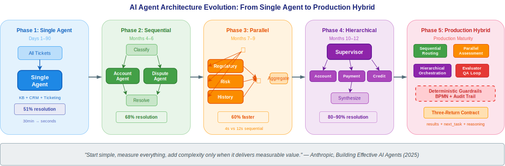
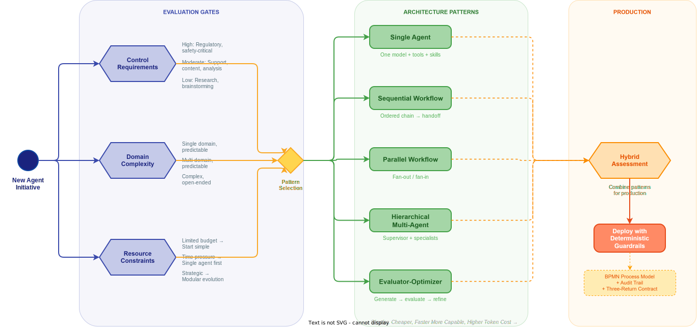

# AI Agent Architecture Patterns: Scaling from Single Agent to Multi-Agent Orchestration



**Author:** Gary Samuelson
**Date:** July 2025
**Status:** Living Document — Architecture Pattern Synthesis
**Blog:** [garysamuelson.github.io](https://garysamuelson.github.io)
**Source Material:** Anthropic, *Building Effective AI Agents: Architecture Patterns and Implementation Frameworks* (2025)

---

## The Architecture Landscape

Before diving into individual patterns, look at the decision flow. The diagram below models the architecture selection process — from an initial business requirement through a structured evaluation to a recommended pattern. Everything discussed in this document maps back to what you see here.



Reading left to right: the process starts at **New Agent Initiative**, passes through three evaluation gates — **Control Requirements**, **Domain Complexity**, and **Resource Constraints** — each producing a structured assessment. These evaluations feed a **Pattern Selection Gateway** that routes to one of five architecture patterns: **Single Agent**, **Sequential Workflow**, **Parallel Workflow**, **Hierarchical Multi-Agent**, or **Evaluator-Optimizer**. A final **Hybrid Assessment** determines whether the selected pattern should combine with others for production deployment.

The patterns that follow — five distinct architectures, plus a decision framework for choosing among them — are drawn from Anthropic's whitepaper and placed into a deterministic orchestration context that connects them to the BPMN governance and three-return contract patterns introduced in the [companion EMS document](agentic-agency-and-workflows.md).

---

## The Five Architecture Patterns

Anthropic's whitepaper identifies a progression of architecture patterns, from the simplest single-agent system to sophisticated multi-agent orchestration. The critical insight is not which pattern is "best" — it is that **the right pattern matches technical complexity to business value**. Over-engineering increases cost without proportional return; under-engineering fails under real-world load.

### Pattern 1 — Single Agent

A single AI model with access to tools, skills, and a defined prompt scope. The agent reasons autonomously, selects tools, and iterates until the task is complete.

**Architecture components:**

- One AI model as the reasoning engine
- A prompt defining the agent's role and capabilities
- A toolkit of integrations (APIs, databases, search)
- Optional Agent Skills for domain-specific expertise

**When to use:** Open-ended problems where the solution path is not predetermined. Customer service for well-defined product categories. Document processing with clear business rules. Code review and routine analysis.

**When to avoid:** When you need perfect accuracy on every request, or when complexity spans multiple domains that would overwhelm a single agent's context.

**Production example:** Augment Code deploys a single-agent system on Google Cloud's Vertex AI that helps developers navigate complex codebases with millions of interdependent lines. One enterprise customer completed a project in two weeks that their CTO estimated would take four to eight months (Anthropic, 2025, p. 7).

---

### Pattern 2 — Sequential Workflow

Multiple agents arranged in a predetermined control flow with defined execution paths. Each agent completes its task and hands off to the next. This is the closest pattern to a traditional BPMN sequence flow — and the most natural fit for deterministic orchestration.

**Architecture components:**

- Ordered chain of specialized agents
- Software-defined or AI-driven decision points between stages
- Clear audit trail through each stage transition

**When to use:** Multi-step approval processes. Content creation pipelines (draft → review → publish). Data transformation and validation. Compliance checking with multiple criteria. Any process where tasks have clear linear dependencies.

**When to avoid:** When agents need to collaborate rather than hand off, when the workflow requires backtracking or iteration, or when a single agent can handle all stages effectively.

**BPMN connection:** Sequential workflows map directly onto BPMN sequence flows with exclusive gateways at decision points. Each agent becomes a service task; each handoff becomes a sequence flow. The orchestration engine (Camunda Zeebe) manages state transitions and provides the audit trail. This is **the same deterministic spine** described in the EMS architecture — the business layer owns the *what* and *when*, individual agents own the *why*.

---

### Pattern 3 — Parallel Workflow

Independent tasks distributed across multiple agents simultaneously, with results merged or processed concurrently. This resembles the fan-out/fan-in cloud design pattern.

**Architecture components:**

- Multiple agents operating simultaneously on the same input or independent subtasks
- An aggregation layer that collects, weights, and synthesizes results
- Optional voting or consensus mechanisms

**When to use:** When multiple perspectives improve quality. When independent analyses can run simultaneously. When speed matters more than coordination overhead. Risk assessment requiring diverse viewpoints. Guardrail architectures where one model processes queries while another screens for inappropriate content.

**When to avoid:** When agents need to build on each other's work or require cumulative context. When shared-state coordination is unreliable. When result aggregation logic is too complex.

**BPMN connection:** Parallel workflows map onto BPMN parallel gateways — fork to multiple service tasks, join when all complete. The aggregation layer is a service task after the joining gateway. This is also the pattern inside a BPMN **ad-hoc subprocess**: the tasks within the EMS Clinical Triage Zone run in parallel because they have no sequence-flow connections — the orchestrating agent activates them based on clinical need, and results converge through the three-return contract.

---

### Pattern 4 — Hierarchical / Supervisory Multi-Agent

A central controller coordinates multiple role-specific agents through intelligent task delegation. A supervisor agent analyzes incoming requests, routes them to appropriate specialists, and synthesizes responses.

**Architecture components:**

- Supervisor agent with oversight and delegation authority
- Specialist agents treated as tools invokable by the supervisor
- Communication via direct invocation or shared memory / message queues
- Agent Skills distributed to create deep specialization

**When to use:** Complex problem-solving requiring diverse expertise. Dynamic customer interactions spanning multiple systems. Research and analysis projects across multiple domains. Strategic planning and decision support. Anthropic's internal research shows multi-agent systems outperform single-agent systems by **90.2%** on complex tasks requiring pursuit of multiple independent directions simultaneously (Anthropic, 2025, p. 14).

**When to avoid:** When token costs are a binding constraint (multi-agent systems consume roughly 10–15× more tokens than single agents). When a single agent with specialized skills can achieve the required accuracy.

**Key challenge — Context management:** The supervisor must maintain coherent understanding across all specialist outputs without exceeding context limits. Subagents can have their own subagents, with groups abstracted from the supervisor — it only interacts with team leaders and remains unaware of further delegation.

**BPMN connection:** This maps onto BPMN call activities and sub-processes. The supervisor is the parent process; each specialist is a called sub-process with its own internal logic. The parent manages correlation and state, specialists return structured results. In the three-layer architecture, the Business Layer declares which specialists exist and under what conditions the supervisor engages them — the Intelligence Layer provides the reasoning.

---

### Pattern 5 — Evaluator-Optimizer

Two AI systems in iterative cycles: one generates content, another evaluates and provides feedback, repeating until quality standards are met. This resembles a writer-editor collaboration.

**Architecture components:**

- Generator agent that creates initial responses and incorporates feedback
- Evaluator agent that assesses against predefined criteria and provides actionable guidance
- Iteration control with defined quality thresholds and maximum cycle counts

**When to use:** When clear evaluation criteria exist and iterative refinement provides demonstrable value. Content creation requiring nuance (literary translation, professional communications). Code generation with security requirements. Research tasks needing multi-step reasoning with validation. Typically runs two to four cycles.

**When to avoid:** When first-attempt quality already meets requirements. When evaluation criteria are subjective or unclear. When time and cost constraints outweigh quality improvements. Real-time applications requiring immediate responses.

**BPMN connection:** This maps onto a BPMN loop activity or an event-based subprocess with a conditional boundary event. The loop repeats until the evaluator's quality score meets the threshold — the same completion condition pattern as the EMS ad-hoc subprocess, where the process cannot exit until confidence ≥ 0.8.

---

## The Three-Return Contract Across Patterns

Regardless of which architecture pattern is selected, every agent in a production system should return the same structured output. This is the **three-return contract** introduced in the [EMS document](agentic-agency-and-workflows.md):

| Return Component | Purpose | Consumer |
|---|---|---|
| **Results** | Machine-ingestible data for the orchestrator | Orchestration engine |
| **Next Task Recommendation** | What should happen next in the workflow | Orchestrator or routing logic |
| **Reasoning** | Human-readable explanation of *why* — traceable, auditable | Audit trail, reviewers, compliance |

This contract is what makes patterns **composable**. A single agent returning these three components can be embedded inside a sequential workflow, parallelized alongside other agents, or supervised by a hierarchical controller — without changing its interface. The orchestration layer consumes the same structure regardless of the architecture around it.

---

## Pattern Selection Framework

Anthropic's whitepaper proposes three critical questions that every engineering team must answer before selecting an architecture. A fourth question — domain expertise — determines whether to use Agent Skills or multi-agent specialization.

### Question 1: What level of control do you need?

| Control Level | Characteristics | Recommended Pattern |
|---|---|---|
| **High** | Regulatory compliance, financial transactions, safety-critical | Single agent or sequential workflow |
| **Moderate** | Customer support, content creation, data analysis | Hierarchical multi-agent |
| **Low** | Research, brainstorming, complex analysis | Collaborative multi-agent |

> If you need to explain exactly why the system made a specific decision to auditors, regulators, or executives, you want predictable, traceable behavior. (Anthropic, 2025, p. 23)

This is precisely where **BPMN governance** adds value. A BPMN process model makes control requirements *visible and modifiable* by business analysts — not buried in agent code or prompt engineering. The deterministic spine enforces control; agents reason freely within the scope the model grants them.

### Question 2: How complex is your problem domain?

| Domain Complexity | Characteristics | Recommended Pattern |
|---|---|---|
| **Single domain, predictable** | Product questions, returns processing, reports | Single agent |
| **Multi-domain, predictable** | Employee onboarding, compliance workflows | Sequential or parallel workflows |
| **Complex, open-ended** | Strategic analysis, research, system troubleshooting | Multi-agent architectures |

### Question 3: What are your resource constraints?

| Constraint | Guidance |
|---|---|
| **Limited budget / tokens** | Single agents or carefully designed parallel workflows. Do the math on expected volume before committing to complex architectures. |
| **Time-to-market pressure** | Start with single agents. You can deploy a single agent in weeks; multi-agent systems take months to get right. |
| **Long-term strategic initiative** | Design for modular evolution. Build the first single agent with interfaces that support adding more agents later. |

### Question 4: Do you need deep domain expertise?

| Expertise Need | Recommendation |
|---|---|
| **Single domain, established workflows** | Single agent with specialized Agent Skills |
| **Multiple domains requiring coordination** | Multi-agent with distributed Skills |

> Before jumping to multi-agent architectures, consider whether a single agent equipped with domain-specific skills can solve your problem. Skills provide deep expertise without the complexity of multi-agent coordination. (Anthropic, 2025, p. 24)

---

## Illustrative Example: Customer Support Ticket Resolution — Architecture Evolution

### The Scenario

A financial services firm handles 50,000 customer support tickets per month across four categories: account inquiries, transaction disputes, product questions, and compliance-related requests. They want to implement AI agents to reduce resolution time while maintaining regulatory audit trails.

### Why This Domain?

Customer support is a compelling domain for illustrating architecture evolution because:

- **Resolution rates are measurable** — Intercom's Fin AI agent achieves up to 86% resolution rates with human-quality responses across 25,000+ customers. Assembled's Assist platform achieved a 20% increase in CSAT while reducing escalations by 50% (Anthropic, 2025, pp. 7–8).
- **Complexity varies naturally** — Simple account inquiries need a single agent; multi-system transaction disputes need orchestration; compliance requests need specialized knowledge. The same ticket queue surfaces all five architecture patterns.
- **Audit trails are mandatory** — Financial customer interactions require documentation for regulatory review — the same observability requirement as clinical systems.
- **Evolution is intuitive** — The path from a single FAQ bot to a multi-agent orchestration system mirrors how real organizations scale.

### Phase 1: Single Agent (First 90 Days)

Deploy one agent with access to the knowledge base, CRM, and ticketing system. It handles all four categories.

```
Ticket: { category: "account_inquiry", customer: "C-4892",
          question: "What is my current credit card balance?" }

Agent Response:
  {
    results: { balance: "$3,247.18", statement_date: "2025-06-15",
               minimum_due: "$64.94", due_date: "2025-07-10" },
    next_task: "close_ticket",
    reasoning: "Routine balance inquiry. Retrieved from CRM API.
                No authentication issues. No follow-up required."
  }
```

**Metrics:** 51% resolution rate out of the box (Anthropic baseline). Average response time drops from 30 minutes to seconds. Proves ROI before investing in complexity.

### Phase 2: Sequential Workflow (Months 4–6)

Simple routing separates ticket categories. A classification agent routes to specialized agents in sequence.

```
Ticket: { category: "transaction_dispute", customer: "C-7213",
          amount: "$847.00", merchant: "TechStore Online",
          claim: "I did not authorize this transaction" }

Classification Agent → Fraud Check Agent → Resolution Agent

Fraud Check Agent:
  {
    results: { fraud_score: 0.23, device_match: true,
               geo_match: false, velocity_check: "normal" },
    next_task: "dispute_resolution",
    reasoning: "Low fraud probability. Device fingerprint matches
                customer history. Geographic anomaly — transaction
                from Portland, customer based in Austin. Not
                sufficient alone for fraud flag. Routing to
                dispute resolution for standard process."
  }

Resolution Agent:
  {
    results: { provisional_credit: true, investigation_id: "INV-20250701-7213",
               estimated_resolution: "10 business days" },
    next_task: "notify_customer",
    reasoning: "Provisional credit issued per Reg E (10-day
                investigation window). Customer notified.
                Investigation ticket created for back-office
                review team."
  }
```

**Metrics:** Resolution rate climbs to 68%. Each agent is simpler and more accurate because it handles a narrower scope.

### Phase 3: Parallel Workflow (Months 7–9)

Compliance-related tickets trigger parallel assessments — regulatory check, risk assessment, and customer history analysis run simultaneously.

```
Ticket: { category: "compliance", customer: "C-1156",
          request: "Why was my wire transfer to Dubai flagged?" }

Parallel Agents (simultaneous):
  ├─► Regulatory Compliance Agent
  ├─► Transaction Risk Agent
  └─► Customer History Agent

Aggregated Result:
  {
    results: { flag_reason: "OFAC screening match — partial name overlap",
               risk_level: "medium", customer_risk_profile: "low",
               false_positive_probability: 0.82 },
    next_task: "escalate_to_compliance_officer",
    reasoning: "Wire flagged due to partial OFAC name match (0.73
                similarity score). Customer has 8-year relationship,
                consistent transaction patterns, and prior cleared
                wire transfers to UAE. High probability of false
                positive, but OFAC match requires human compliance
                officer review per bank policy — cannot be
                auto-resolved regardless of confidence."
  }
```

**Metrics:** Compliance response time drops by 60%. Parallel execution completes in 4 seconds versus 12 seconds sequential. Note the deterministic guardrail: OFAC matches **always** escalate to a human compliance officer, regardless of the AI's confidence level. This is governance by process model, not agent discretion.

### Phase 4: Hierarchical Multi-Agent (Months 10–12)

A supervisor agent manages the full ticket lifecycle. Specialist agents handle their domains; the supervisor synthesizes, escalates, and ensures cross-category coherence.

```
Ticket: { category: "complex", customer: "C-3301",
          issue: "My mortgage payment was applied to the wrong
                  account and now I'm showing as delinquent" }

Supervisor Agent:
  ► Delegates to: Account Research Agent, Payment Tracing Agent,
                   Credit Reporting Agent (parallel)
  ► Reviews results, identifies: payment misrouted to closed account
  ► Delegates to: Correction Agent (applies payment to correct account)
  ► Delegates to: Credit Bureau Agent (initiates dispute with bureaus)

Final Response:
  {
    results: { payment_corrected: true, delinquency_removed: true,
               credit_dispute_filed: true, bureau_case_ids:
               ["EQ-294817", "TU-182934", "EX-039182"] },
    next_task: "close_ticket_with_followup",
    reasoning: "Payment of $2,847.00 was misrouted to closed account
                ending 4471. Corrected to active mortgage account
                ending 8823. Delinquency flag removed from internal
                systems. Credit bureau disputes filed with all three
                bureaus — estimated 30-day resolution. Follow-up
                scheduled at 15 and 30 days to confirm bureau
                corrections."
  }
```

**Metrics:** Complex ticket resolution rate reaches 80–90% (matching Gradient Labs benchmarks, Anthropic 2025, p. 4). The supervisor ensures no step falls through the cracks — each specialist returns via the three-return contract, the supervisor aggregates and orchestrates.

### Phase 5: Production Maturity

Evaluator agents audit a random sample of resolved tickets for quality assurance. The architecture becomes a hybrid: sequential routing at the front, parallel assessment for compliance, hierarchical orchestration for complex cases, and evaluator-optimizer loops for continuous improvement.

> "Start simple, measure everything, add complexity only when it delivers measurable value. The best architecture is the simplest one meeting today's requirements while providing a path to tomorrow's capabilities." — Anthropic, 2025, p. 25

---

## Production Foundations

The architecture patterns described in this document are grounded in production data from organizations deploying AI agents at scale.

Anthropic's whitepaper documents measurable outcomes across industries: Coinbase's agentic customer support handles millions of interactions with 99.99% availability. Intercom's Fin AI agent resolves up to 86% of tickets with human-quality responses. Inscribe's AI Risk Agents reduce fraud review time by 20× — from 30 minutes to 90 seconds — while increasing output by 70× (Anthropic, 2025, pp. 4–8). A retail bank deploying AI agents for credit risk memos reports 20–60% productivity gains (p. 5). These are not pilot metrics; they represent production systems handling real transaction volume.

The pattern selection framework reflects an operations research insight: the right level of architectural complexity is the minimum that satisfies both the accuracy requirement and the control requirement. Hopp & Lovejoy formalize this as the capacity-flexibility tradeoff — systems should not carry more structural complexity than the variability in demand warrants (*Hospital Operations*, Pearson, 2012). The same principle applies to agent architecture: a single agent handling 10,000 predictable tickets per day outperforms a multi-agent system burning 15× the tokens for marginal accuracy gains.

Both the EMS triage system and this customer operations system share an infrastructure requirement: **sub-second data access**. An agent that takes 25 seconds to query a CRM cannot resolve tickets in real time. Real-time architectures — event-driven APIs, cached knowledge stores, streaming data pipelines — create the infrastructure precondition for agentic patterns at scale. The Anthropic paper's design principle — "start simple, scale intelligently" — applies to infrastructure as much as to architecture.

---

## References

| Title | Authors / Source | Year | Link |
|---|---|---|---|
| *Building Effective AI Agents: Architecture Patterns and Implementation Frameworks* | Anthropic | 2025 | [View](https://www.anthropic.com/research/building-effective-agents) |
| *Enterprise Process Orchestration* | Bernd Ruecker, Leon Strauch | 2025 | [View](https://learning.oreilly.com/library/view/-/9781394309672/) |
| *Practical Process Automation* | Bernd Ruecker | 2021 | [View](https://learning.oreilly.com/library/view/-/9781492061441/) |
| *Designing Machine Learning Systems* | Chip Huyen | 2022 | [View](https://learning.oreilly.com/library/view/-/9781098107956/) |
| *Hospital Operations* | Wallace Hopp, William Lovejoy | 2012 | [View](https://learning.oreilly.com/library/view/-/9780132908665/) |

> Anthropic's whitepaper provides the architecture pattern taxonomy and production data. Ruecker's books ground the deterministic orchestration layer. Huyen covers ML system design principles that apply to agent infrastructure. Hopp & Lovejoy provide the operations research foundation for the capacity-complexity tradeoff.
