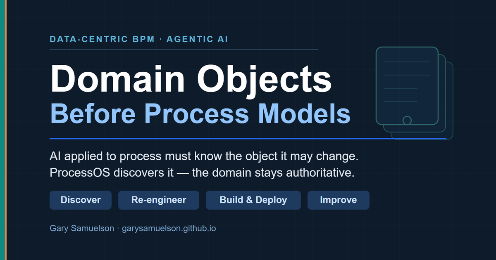
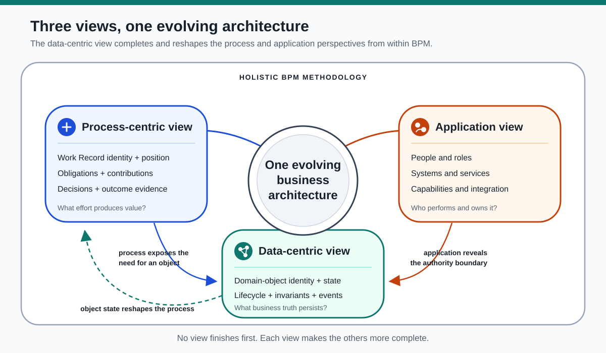
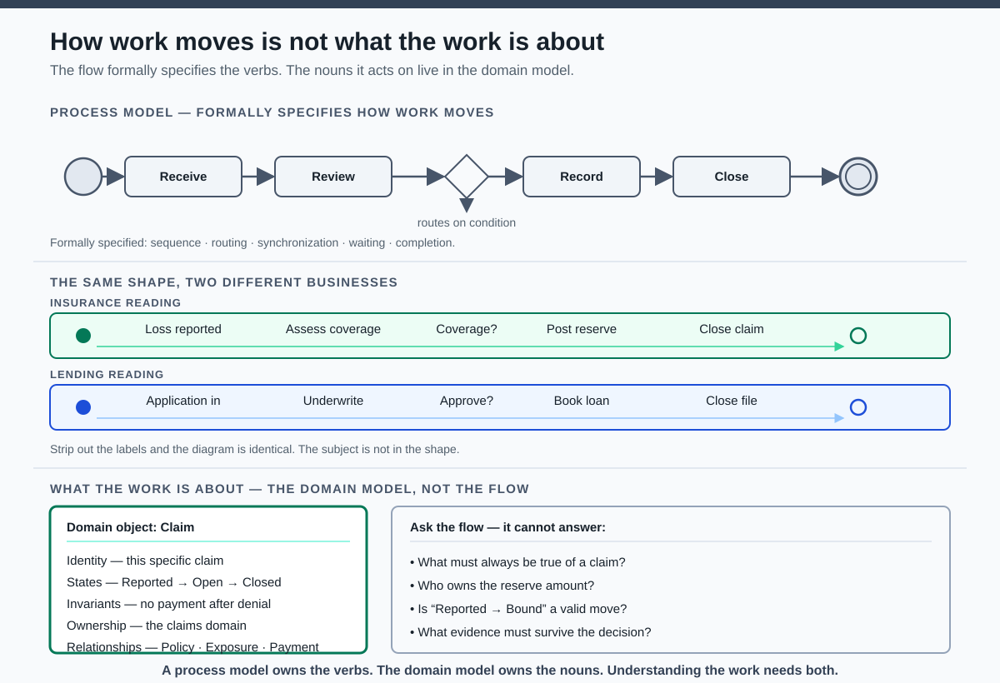
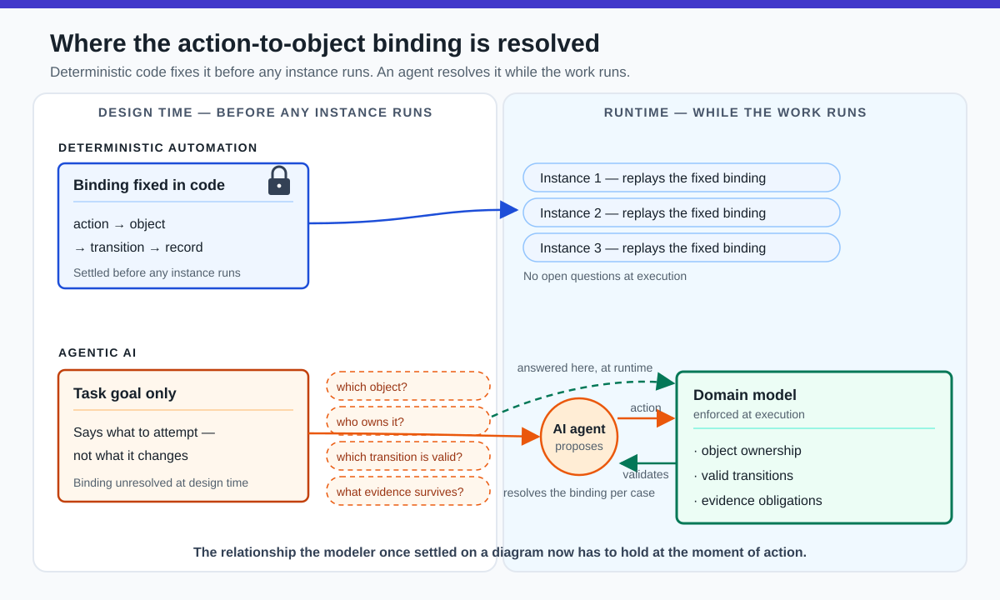
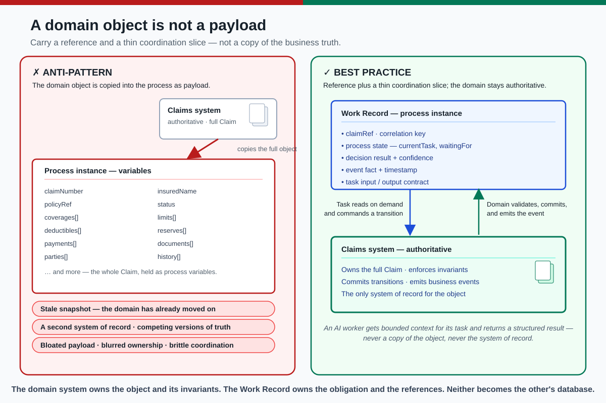
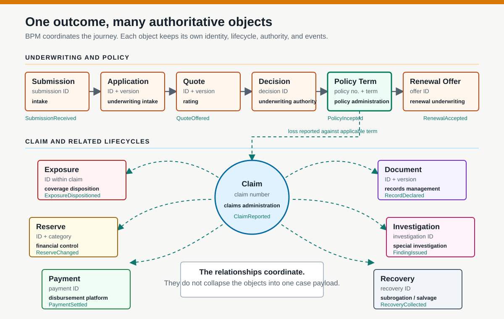
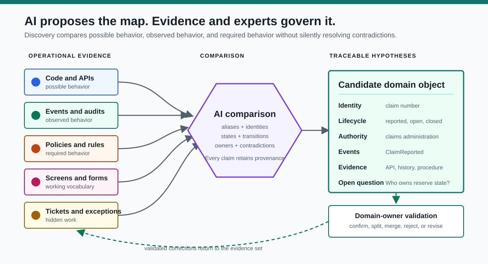
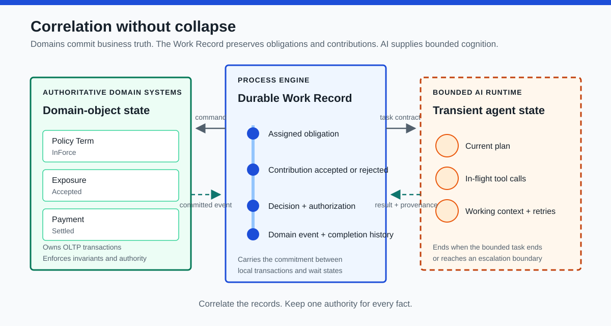

# Domain Objects Before Process Models
## A Contemporary Data-Centric BPM Architecture for Agentic AI in Insurance

**Author:** Gary Samuelson  
**Date:** August 9, 2026  
**Original article:** *A Data-centric View on Traditional BPM* — April 29, 2014  

---

## Abstract

The data-centric view belongs inside a holistic BPM methodology, not beside it as a competing modeling technique. The process-centric view establishes obligations, sequence, and outcome. The application view identifies the people, systems, and services that perform the work. The data-centric view identifies what the work acts upon and which business change would make the work consequential. Object identity ties each contribution to a specific policy, claim, exposure, reserve, or payment. Object state and lifecycle determine which changes are valid. Relationships explain how a change in one object creates obligations involving another. The three views iterate toward one architecture: process exposes the need for an object, application reveals its authority boundary, and object state reshapes the process.



*Figure 1. The process-centric view defines the Work Record, the data-centric view defines authoritative domain objects, and the application view reveals the capabilities and ownership boundaries that connect them. The three views advance one evolving business architecture.*

Agentic AI shifts this relationship from a design-time modeling concern to a runtime execution concern. Deterministic automation binds each action to a specific object, transition, and record in code before any instance runs. An agent instead resolves its next action while the work runs, so a task description can tell it what to attempt but cannot establish which durable business object the action may change, who owns that object, which transitions are valid, or what evidence must survive the decision. Those answers depend on the domain model, and the architecture must supply and enforce them during execution rather than assume them from code.

The architecture contains two durable records with different authority. Domain objects retain committed business truth and enforce invariants through local OLTP transactions. The Work Record retains the organization's long-running commitment: what must happen, which contribution each task returned, what was accepted or rejected, which domain transition resulted, and what remains unresolved. AI fits around that boundary in three ways. Before execution, it discovers candidate objects and process obligations from fragmented evidence. During execution, it performs bounded cognitive work and returns proposed contributions. After execution, it compares Work Record histories with committed domain events to find patterns and redesign opportunities. AI does not become either record's authority.

Commercial property insurance makes the architecture concrete. One business journey crosses a submission, application, quote, underwriting decision, policy term, claim, exposure, reserve, payment, document, investigation, recovery, and renewal offer. Each object carries a distinct identity, lifecycle, authority, and timescale. Treating that network as one `ClaimData` payload does more than obscure the domain; it leaves process coordination brittle and gives AI an unstable representation of the work. Organizations cannot govern agentic work until they identify the objects that the work changes.

**Keywords:** data-centric BPM, domain objects, agentic AI, insurance, process orchestration, Work Record, process mining, object-centric event data, BPMN, ProcessOS

---

## 1. Introduction

A process model tells us how work moves. It does not, by itself, tell us what the work is about.

The claim is precise, and it holds. A BPMN model formally specifies control flow: the order of tasks, the branches a gateway takes, the parallelism it allows, the events it waits for, and the condition that marks work complete. Its labels — "Review claim," "Approve loan" — carry meaning, but only to a human who already knows the domain. The notation does not formally encode what a claim is: its identity, its valid states, the rules that must hold when its state changes, who owns it, or how it relates to a policy, an exposure, or a payment. That knowledge is not in the diagram. It lives in the domain model.

The demonstration is simple. Strip the labels from a flow — receive, review, decide, record, close — and the same shape fits a claim, a loan application, or a support ticket. One control-flow skeleton serves many subjects. The reverse also holds: one business object participates in many processes. A claim appears in first notice of loss, in litigation, in subrogation, and in a reopen months later. The object exceeds any single flow. Because the mapping runs many-to-many in both directions, neither side determines the other, and the subject cannot be read off the shape.



*Figure 2. The same control-flow skeleton reads as an insurance claim or a lending application; the subject is not encoded in the shape. What the work is about — identity, states, invariants, ownership, and relationships — lives in the domain model, and the flow cannot answer questions about it.*

This is why the statement matters rather than merely sounding clever. Ask the process model what must always be true of a claim, who owns the reserve amount, whether "Reported → Bound" is a valid transition, or what evidence must survive the decision. Control flow has no answer, because every one of those questions is about the object, not its movement. The data-centric view exists to answer them — and an agent handed a task with no object model behind it falls straight into that gap.

That distinction drove the original question: where does the data-centric view fit within BPM? It fits after neither process nor application as a finished phase. It develops with them. Process modeling identifies work and obligation. Application modeling identifies actors and capabilities. Data-centric modeling identifies the objects that persist across both, the states that matter, and the events that cause work to continue, branch, wait, or end.

The distinction matters more now than it did in 2014. An AI agent can read documents, call services, classify requests, and propose a next action. None of those capabilities establishes the durable business object whose state the organization intends to change. Before AI can improve a process, the architecture must determine whether the work concerns a customer request, an application, a claim, a policy, a shipment, a payment, or some combination of these objects.

This is what it means to call the relationship an execution concern. Traditional automation settles it before any instance runs: a developer decides at design time which object each task reads and writes, which state transition it triggers, and which record it leaves behind, and those bindings compile into code that holds for every execution. An agent resolves its next action differently. It interprets the current inputs and proposes an action at runtime, so the binding from attempted action to affected object, owning authority, valid transition, and required evidence is no longer fixed in advance. The agent reconstructs it, case by case, while the work runs. The relationship the modeler once settled on a diagram now has to hold at the moment of action. The domain model, object ownership, valid transitions, and evidence obligations must therefore be present and enforced during execution as governance the agent acts within, not as documentation it may or may not consult.



*Figure 3. Deterministic automation fixes the action-to-object binding in code at design time, and each instance replays it unchanged. An agent leaves the binding open until runtime and resolves it per case, which forces the domain model to be present and enforced during execution.*

The hardest part of AI-enabled process design may not be generating BPMN. It may be finding and segmenting the domain objects that give the process meaning.

The original data-centric view argued that process analysis should move beyond control flow and make business data visible to every necessary participant [1]. That argument still holds. The modern version goes further: data becomes useful when architecture organizes it into objects with identity, state, behavior, ownership, relationships, and lifecycle. AI can accelerate the discovery of those objects. BPM can coordinate the work performed against them. Domain systems must remain authoritative for the objects themselves.

This paper begins where the earlier Work Record papers stop. *Work Record* established the process instance as the anchor that connects AI capability to a discrete unit of enterprise work. *Process-First AI: Dimensions of the Running Work Record* then explained the record's presence, gravity, and persistence and placed AI into four forms of participation [16]. Neither paper resolved the next architectural question: when one running process contributes to several independently persistent business objects, which state belongs to the Work Record and which state belongs to the authoritative domain? This paper addresses that boundary and adds AI-assisted domain discovery as the method for finding it.

The argument proceeds in three movements. Sections 2 and 3 place the data-centric view inside BPM and separate the two durable records — the authoritative domain object and the Work Record — with a practical test for landing each state element. Sections 4 and 5 map commercial insurance as a network of objects and give the tests for segmenting them. Sections 6 and 7 supply the method: AI-assisted discovery of the object boundaries, then a full insurance journey run against them. Sections 8 through 12 convert validated objects into a process architecture, place AI within and above it, and define the governance that keeps discovery and execution accountable.

---

## 2. Where the Data-Centric View Fits Within BPM

The 2014 article places three perspectives inside one iterative BPM methodology [1]:

1. **Process-centric view:** identify the work, sequence, decisions, handoffs, and outcomes.
2. **Application view:** identify the people, systems, services, and integrations that participate in the work.
3. **Data-centric view:** identify the business objects, state changes, events, and information required across those participants.

This framing consolidates a long BPM tradition rather than inventing one. Curtis, Kellner, and Over distinguished the functional, behavioral, organizational, and informational perspectives of a process model [17], and process-mining practice separates the control-flow, organizational, data, and time perspectives of an event log [9]. The three views used here map onto that tradition and adapt it for an object-centric, agentic setting: the process-centric view carries the functional and behavioral perspectives; the application view carries the organizational; and the data-centric view carries the informational, or data, perspective — extended from passive information into full object identity, lifecycle, invariants, and ownership. The contribution is the extension and its consequence for agentic execution, not the triad itself.

No view completes the architecture alone. A process model without application boundaries becomes an abstract flow. An application model without process context becomes an integration diagram. A data model without behavior becomes a static inventory of nouns. Contemporary BPM still treats models, execution, information, resources, and organizational context as interdependent concerns [2, 3].

The views develop together. A process task exposes a required business object. An application boundary reveals who owns it. A state transition exposes a missing event. A newly discovered object may force the process model to split one activity into several lifecycles.

The article's concerns map to five properties that data-intensive work requires:

- **Data access:** participants need the appropriate business context without tunneling complete object copies through every task.
- **State reaction:** processes and applications must react when relevant object state changes.
- **Object-instance coordination:** related object instances must synchronize without becoming one tightly coupled transaction.
- **Data-oriented granularity:** work should decompose and compose around meaningful business boundaries.
- **Data integrity:** process execution must not weaken the authority or invariants of domain systems.

Those properties align with object-centered, case-handling, and object-aware process research that treated data and object lifecycle as active participants in execution rather than passive task payloads [4–7]. They now provide a strong foundation for agentic AI. Agents need context, events, coordination, bounded tasks, and trusted state. Data-centric BPM already asked the architectural questions that agentic systems must answer.

---

## 3. A Domain Object Is Not a Payload

Traditional workflow implementations often treat data as variables attached to a process instance. The engine receives a request payload, copies values into process context, passes those values between tasks, and eventually writes a result back to a system of record.

That approach works for small, stable data. It becomes dangerous when long-running work carries a copied representation of volatile domain state. A claim may remain active for months while reserves, coverage decisions, documents, payments, and legal conditions change in their authoritative systems. The process cannot safely treat the object snapshot captured at startup as current truth.

The opposite mistake places complete domain objects inside the process engine. That turns process variables into a second system of record, blurs ownership, increases payload size, and creates competing versions of business truth.

A domain-centered process carries only what it needs to coordinate the work:

- stable object identifiers and correlation keys;
- the process state needed to determine what happens next;
- decision results and confidence values that affect routing;
- references to authoritative records;
- relevant event facts and timestamps;
- task input and output contracts.

The domain system owns the complete object and enforces its invariants. The process instance owns the position and obligations of the running work. An AI worker receives the bounded context required for its task, retrieves additional authorized detail when necessary, and returns structured results rather than an ungoverned narrative.

This boundary turns the object from passive payload into an active source of business meaning without making the process engine its database.



*Figure 4. The anti-pattern copies the full domain object into the process instance, producing a stale snapshot, a second system of record, and blurred ownership. The best practice keeps the claims system authoritative and carries only a thin coordination slice — a reference and correlation key, process state, decision result, event fact, and task contract — while the task reads authorized detail on demand and the domain validates, commits, and emits the event.*

### 3.1 Two kinds of persistence

Both sides persist, but they persist different truths.

**Domain persistence is transactional persistence.** An OLTP transaction changes one authoritative model while protecting atomicity, consistency, isolation, and durability. A reserve adjustment either commits under the reserving domain's rules or it does not. A payment either reaches a recognized transaction state or it does not. The domain object answers: *what is true now about this policy, exposure, reserve, or payment?* OLTP systems optimize large volumes of short, concurrent transactions and protect data integrity; their individual transactions cannot remain half-committed while a business process waits for days [13].

**Work Record persistence is commitment persistence.** Underwriting, claim settlement, and recovery cross people, systems, waits, and many local transactions. The process engine cannot hold one database transaction open across that span. It persists token position, pending obligations, accepted task results, decisions, authorization evidence, correlation references, exceptions, and completion history between local commits. If a later step fails, the process retries, escalates, waits, or invokes a compensating action rather than rolling back weeks of business reality. This matches the saga principle: long-running work coordinates a sequence of local transactions and explicitly handles failure across their boundaries [14].

The Work Record is therefore more than a route through tasks, but less than a surrogate domain database. It is the durable account of **value-producing contribution**. Each task receives a contract, expends human, system, or AI effort, and returns a result. The Work Record records the obligation, the contribution, its provenance, its acceptance or rejection, and the domain event that confirms any resulting business change. A recommendation can persist in the Work Record even when the domain rejects the requested transition. Conversely, `PaymentSettled` belongs to the payment domain as authoritative truth while the Work Record records why settlement was required, how it contributed to the claim outcome, and which obligation that event discharged.

### 3.2 The state-landing test

The design problem is not choosing one container for the whole case. It is landing each state element in the record whose authority matches its meaning.

| Test | State lands in | Insurance example |
|---|---|---|
| Must this fact remain authoritative after the process ends, and must every update satisfy business invariants atomically? | Domain object and its owning OLTP capability | `Reserve.amount`, `Payment.status`, policy-term dates |
| Does this fact describe an obligation, position, handoff, deadline, contribution, decision path, or evidence for one business outcome? | Work Record | coverage review due, AI recommendation returned, examiner approval, payment correction pending |
| Is this state needed only while a worker reasons or calls tools? | Human or AI task runtime | current plan, retrieved passages, intermediate calculation, retry context |
| Is this an inferred boundary, lifecycle, or redesign opportunity awaiting validation? | Governed discovery artifact | candidate `Exposure` lifecycle with links to supporting schemas and events |

Some facts appear in more than one record by reference, but only one boundary owns their truth. The Work Record may retain the payment ID and the immutable fact that `PaymentSettled` discharged an obligation. The payment system retains the transaction, settlement state, ledger references, and rules that made that event valid. Correlation is required; duplicated authority is not.

---

## 4. Insurance Is a Network of Objects, Not One Case File

Many process programs begin with verbs: receive, review, approve, notify, and close. The verbs produce a plausible flow, but they can conceal several independent lifecycles.

Consider the instruction "process the insurance claim." The apparent process contains at least these candidate objects:

- **Claim:** the administrative record of a reported demand for an insurance response, potentially involving insureds or third-party claimants.
- **Policy:** the contract that determines coverage.
- **Exposure:** one alleged loss involving a person, property, or coverage.
- **Reserve:** the financial estimate attached to an exposure or claim.
- **Payment:** a financial transaction with its own authorization and settlement state.
- **Document:** evidence with provenance, classification, and retention obligations.
- **Investigation:** a bounded body of work created when facts require additional review.

These objects do not share one lifecycle. A claim may close while a recovery action remains open. A payment may fail after the claim decision becomes final. One claim may contain several exposures, each with a separate reserve and disposition. A document may support several decisions but remain governed by a distinct retention policy.

If the model treats all of this as one `ClaimData` payload, process logic accumulates conditions that belong to the domain. If the architecture identifies the objects first, each task can state precisely which object it reads, which transition it requests, which event it emits, and which system owns the result.

Object discovery therefore precedes detailed process design. The first question is not "What tasks should the AI perform?" It is "Which business object changes because this work exists?"

The object map below presents an illustrative conceptual model for commercial property insurance. A carrier must validate its identities, states, authority boundaries, and terminology against its products, jurisdictions, and operating model:



*Figure 5. One insurance outcome crosses multiple authoritative objects. Events and references coordinate their independent lifecycles without turning them into one case payload.*

| Object | Identity | Illustrative lifecycle | Authoritative capability | Independently significant event |
|---|---|---|---|---|
| Submission | submission ID | received → triaged → withdrawn, declined, or advanced | submission intake | `SubmissionReceived`, `SubmissionAdvanced` |
| Application | application ID and version | initiated → incomplete or complete → attested → superseded | underwriting intake | `ApplicationCompleted`, `ApplicationAttested` |
| Quote | quote ID and version | requested → rated → offered → accepted, declined, revised, or expired | rating and underwriting | `QuoteOffered`, `QuoteAccepted` |
| Underwriting Decision | decision ID | pending → referred → approved, declined, or superseded | underwriting authority | `RiskApproved`, `RiskDeclined` |
| Policy Term | policy number and term | bound → pending effective → in force → cancelled, expired, or rescinded | policy administration | `PolicyBound`, `PolicyIncepted`, `EndorsementIssued` |
| Renewal Offer | renewal offer ID | prepared → offered → accepted, declined, revised, or expired | renewal underwriting | `RenewalOffered`, `RenewalAccepted` |
| Claim | claim number | reported → open → closed or reopened | claims administration | `ClaimReported`, `ClaimClosed`, `ClaimReopened` |
| Exposure | exposure ID within a claim | identified → investigated → accepted or denied → resolved | claims administration | `ExposureCreated`, `ExposureDispositioned` |
| Reserve | reserve ID and financial category | proposed → approved → adjusted → released | reserving and financial control | `ReserveEstablished`, `ReserveChanged` |
| Payment | payment ID | requested → authorized → issued → settled, voided, or failed | payment platform | `PaymentAuthorized`, `PaymentSettled`, `PaymentFailed` |
| Document | document ID and version | captured and versioned → classified → declared or managed as a record → retained → disposition eligible → disposed; legal hold suspends disposition until release | content and records management | `DocumentReceived`, `RecordDeclared`, `LegalHoldApplied`, `LegalHoldReleased` |
| Investigation | investigation ID | opened → evidence gathering → finding issued → closed | special investigation or claims | `InvestigationOpened`, `FindingIssued` |
| Recovery | recovery ID | identified → pursued → collected or abandoned | subrogation, salvage, or collections | `RecoveryOpportunityIdentified`, `RecoveryCollected` |

The map does not prescribe thirteen microservices. It exposes thirteen semantic boundaries. A carrier may implement several boundaries inside one platform or database. The architectural requirement is more modest and more important: preserve each object's identity, lifecycle, invariants, and ownership even when one application stores several of them.

---

## 5. How to Segment a Domain Object

A candidate noun does not automatically deserve its own object boundary. Architecture should test each candidate against a consistent set of questions.

| Test | Architectural question |
|---|---|
| Identity | Can the business distinguish one instance from another over time? |
| Lifecycle | Does it move through named states with valid and invalid transitions? |
| Invariants | Which rules must remain true whenever its state changes? |
| Authority | Which system or domain owns the definitive representation? |
| Behavior | Which operations belong with the object rather than with process coordination? |
| Events | Which state changes matter outside the owning boundary? |
| Relationships | Does it aggregate, reference, or depend on other objects? |
| Timescale | Can it begin, change, or end independently of the surrounding process? |
| Accountability | Which role or service may authorize each transition? |
| Evidence | What records prove that a transition occurred correctly? |

The tests prevent two common failures. Under-segmentation creates a giant object whose fields, rules, and lifecycle vary by scenario. Over-segmentation turns every noun or database table into a domain object and replaces useful boundaries with distributed chatter.

A strong object boundary encloses behavior and rules that change together, consistent with the domain-driven emphasis on explicit bounded models and a shared domain language [8]. It exposes events when other domains need to react. It does not leak internal fields merely because a process task can consume them.

---

## 6. AI-Assisted Domain Discovery from Operational Evidence

The introduction named the hardest problem: finding and segmenting the domain objects that give the process meaning. This section gives that problem a method. Discovery is not a brainstorm and not a document-summarization exercise. It is a comparison across evidence the organization already owns, producing falsifiable hypotheses that domain experts confirm, split, merge, or reject.

### 6.1 The evidence already exists

No one has to invent the domain model. The organization has been writing it down for years — in fragments, in different languages, for different purposes. Four classes of evidence matter:

| Evidence class | Sources | What it testifies to |
|---|---|---|
| **Structural** | database schemas, API specifications, message contracts, source code | what the systems *permit* |
| **Behavioral** | event streams, audit records, status histories, process-mining logs | what operations *actually did* |
| **Normative** | policy documents, procedures, decision tables, regulatory text | what the business *requires* |
| **Vernacular** | screens, forms, field labels, tickets, exception queues, workarounds | what people *actually call things* — and where the current model already fails them |

The fourth class deserves emphasis. A recurring manual workaround is a fossil of a missing object or a misplaced boundary. An exception queue that never empties marks a lifecycle the model does not represent.

### 6.2 One comparison, three behaviors

The discovery move is a single disciplined comparison. Structural evidence shows **possible** behavior. Behavioral evidence shows **observed** behavior. Normative evidence shows **required** behavior. Where the three agree, the model is probably right. Where they diverge, the divergence is the finding — not noise to smooth over. If source code permits twelve status values and production history uses seven, the discovery system reports the discrepancy rather than silently choosing one version. Domain experts decide which combination should govern the future model.



*Figure 6. AI compares possible, observed, and required behavior, then produces evidence-linked object hypotheses. Domain owners validate the boundaries and return corrections to the evidence set.*

AI earns its place here because the comparison is exactly the work large models do well: reading across heterogeneous artifacts, proposing aliases, flagging overloaded terms, inferring candidate identifiers and state vocabularies, and connecting events to the objects they describe. What once required months of workshops — asking experts to articulate what they believe they do — becomes a review of what the evidence says they actually did.

### 6.3 The output is a falsifiable hypothesis

The useful output is not a paragraph that summarizes the business. It is a structured hypothesis an expert can test, with every assertion citing its evidence and every uncertainty stated as an open question:

```yaml
candidate_object: Claim
identity: [claim_number]
authoritative_system: [claims_platform]
states: [reported, open, closed]
commands: [register_claim, close_claim, reopen_claim]
events: [ClaimReported, ClaimClosed]
related_objects: [Policy, Exposure, Payment]
evidence:
  - api/claims.yaml
  - claim_status_history
  - adjuster_work_instructions.pdf
open_questions:
  - Does each exposure own its reserve lifecycle?
  - Can recovery continue after ClaimClosed?
```

The format is the governance. Evidence links make each claim checkable. Open questions route ambiguity to the people with authority to resolve it. Conflicting sources remain visible in the artifact instead of disappearing into a confident summary.

### 6.4 What the same comparison finds beyond the inventory

The object catalog is the primary deliverable, but the same evidence comparison surfaces four further findings:

- **Hidden lifecycles.** Where records carry reliable identifiers, correlated logs and status histories reveal the observed lifecycle — common paths, rare variants, loops, waits, and dead ends [9]. The documented process may describe one lifecycle while production runs several.
- **Misplaced behavior.** Validation logic repeated across user interfaces, process scripts, and integration services signals a missing domain capability. The finding proposes one governed operation in the owning domain.
- **Semantic collisions.** "Case" may mean a service request in one system, a legal matter in another, and a process instance in a third. Similarity search finds the related language; the architecture must preserve the distinctions where identity, lifecycle, or ownership differs.
- **Event and task candidates.** State histories reveal which changes already trigger downstream behavior — candidates for explicit event contracts. And the object model itself separates work suited to AI (interpretation, comparison, classification, bounded investigation) from work that belongs in rules, domain services, or human approval (deterministic invariants, financial postings, irreversible authority).

### 6.5 Validation closes the loop

AI accelerates the comparison. It does not acquire authority to define the business merely because it can read every artifact. Underwriting, claims, actuarial, finance, and records specialists confirm, split, merge, or reject each hypothesis, and their corrections return to the evidence set for the next pass. Section 10 sequences this into a governed method; Section 11 names the failure modes the governance must catch.

The payoff is Section 7: the insurance journey below runs against object boundaries a carrier could have discovered this way.

---

## 7. Insurance Case: From Submission to Claim Settlement

This section deliberately returns to the commercial-property scenario used in the earlier Work Record research [16]. The repeated setting creates continuity, not a second claims-processing walkthrough. The earlier analysis followed one running record to show how process state persists and how AI enters task slots. The analysis below changes the unit of examination. It decomposes the same journey into underwriting, policy, claim, exposure, reserve, payment, document, investigation, and recovery objects, then asks where each identity, state transition, contribution, and invariant belongs.

A commercial real estate investor submits an application to insure a six-building mixed-use portfolio in Austin. The submission creates an underwriting Work Record, `UW-TX-2026-004821`. It does not create the policy yet. The work exists before the contract does.

### 7.1 Submission and underwriting

The intake task references an `Application`, applicant parties, scheduled locations, requested coverages, prior loss documents, and inspection reports. An AI extraction worker classifies the documents, extracts candidate property facts, and returns each value with source provenance. The task does not authorize the AI to create coverage, set a premium, or bind a policy. Its output contract contains extracted values, confidence scores, unresolved conflicts, and document references.

The rating service calculates a premium from validated risk characteristics and exposure measures. A rules service evaluates mandatory filing and eligibility constraints. An AI underwriting assistant compares the submission, loss runs, inspection findings, and appetite guidance, then drafts a recommendation. The commercial underwriter accepts, modifies, or rejects that recommendation. The process records both the AI result and the human decision.

When every bind precondition succeeds, the policy administration system creates the bound term for `Policy CPP-TX-2026-004821`. The term becomes `InForce` on its effective date. The underwriting Work Record records completion at the modeled business outcome. The policy term now follows its own lifecycle. The process did not become the policy, and the policy record did not become the process history. At renewal, the carrier prepares and binds a successor term rather than changing the expiring term to `Renewed`.

### 7.2 First notice of loss

Eighteen months later, a water loss occurs at the Eastside property. First notice of loss creates `Claim CLM-TX-2027-01984` and a claims Work Record correlated to the policy, reported location, claimant, and loss event. Coverage does not follow from the presence of a policy number alone. The claims process must identify the applicable policy term, forms, endorsements, limits, deductibles, exclusions, and insured interests at the time of loss.

The initial report also creates candidate exposures. Building damage, business interruption, and third-party property damage may each require separate investigation, reserve, and disposition. The architecture should not hide these differences inside one claim status. The claim coordinates the reported loss; each exposure represents a distinct alleged obligation.

An AI triage worker can classify the loss description, detect missing information, propose exposure types, and flag possible subrogation. It returns hypotheses. The claims domain validates creation of each exposure. A deterministic coverage rule may resolve a straightforward condition. Ambiguous endorsement language routes to an examiner or a bounded coverage-analysis agent with approved retrieval tools and a mandatory human decision.

### 7.3 Reserving, payment, and recovery

The carrier establishes reserves by exposure and financial category. A reserve records an estimate, not a payment and not the claim's final value. Reserve changes require authority thresholds and reasons. An AI severity model may recommend an amount or range, but the reserving service enforces approval limits and commits the change. The process records who or what supplied the recommendation, which evidence supported it, who approved it, and which reserve event resulted.

Settlement creates another separation. The claims domain authorizes the obligation and amount under applicable authority limits. The payment capability validates the payee and disbursement controls, performs sanctions screening where required, issues the transaction, and records settlement, failure, void, and reconciliation. `PaymentFailed` does not reverse the coverage decision. It creates a new obligation in the Work Record to correct or reissue the transaction.

A separately governed recovery matter may continue after indemnity payment and, where carrier practice permits, after administrative claim closure or reopening. A contractor's negligence may create a subrogation opportunity; damaged equipment may produce salvage. Recovery therefore has its own identity and lifecycle. Closing the claim must not silently destroy the carrier's continuing right to pursue another party.

### 7.4 Renewal closes the information loop

At renewal, underwriting needs selected claim outcomes, not a copied claims database. The renewal Work Record references the expiring policy term, verified loss history, open material claim exposures, paid and reserved amounts, and relevant risk-control findings. Domain events connect those facts to the renewal decision while access policies limit unnecessary claims detail.

The portfolio now demonstrates why object segmentation matters. One customer journey crossed underwriting, policy administration, claims, reserving, payments, recovery, content management, and renewal. BPM coordinated the obligations. No single process variable bundle became authoritative for every object. AI participated at several task boundaries without owning the contract, claim, reserve, or payment.

---

## 8. From Candidate Objects to a Process Architecture

Once the team validates the object boundaries, process design becomes more precise. Each BPMN element can declare a relationship to the domain while retaining its defined execution semantics [11]:

| Process element | Domain meaning |
|---|---|
| Start event | A business event creates an obligation to act on an object |
| Task | A human, service, or AI worker performs bounded work against an object |
| Gateway | Controls divergence or convergence through conditions, events, or synchronization semantics |
| Message event | Another participant or domain reports a fact relevant to the running work |
| Timer | A modeled commitment becomes due |
| End event | Marks the modeled completion or termination of a path or process scope |

This mapping separates domain state from process state. `Policy.status = InForce` describes the contract. `UnderwritingProcess.waitingForCompliance = true` describes unfinished work. `Payment.status = Settled` describes the transaction. `ClaimProcess.currentTask = ReconcilePayment` describes the organization's current obligation.

Conflating these states creates brittle systems. A status column becomes a hidden workflow engine. A BPMN token becomes a surrogate domain object. A queue name becomes the only record of accountability. Clear object boundaries allow each state machine to do its own job while events and process correlation coordinate their interaction.

Three kinds of state coexist in the insurance case:

| State type | Insurance example | Owner | Governing question |
|---|---|---|---|
| Domain-object state | `Policy = InForce`, `Exposure = Accepted`, `Payment = Settled` | authoritative domain system | What committed business fact is true, and which invariants govern its next local transaction? |
| Work Record state | assigned obligation, task contribution, acceptance or rejection, decision, provenance references, resulting domain event, escalation, and completion history | process engine | Which obligation comes next, what value-producing effort occurred, and what durable evidence did it produce? |
| Agent runtime state | current plan, in-flight tool calls, transient working context, retries, and checkpoints | bounded agent runtime under process control | How is the assigned worker progressing toward its task contract? |



*Figure 7. Domain systems commit business truth, the process engine retains the durable Work Record, and the agent runtime holds only the transient state required to complete its bounded task.*

The boundaries permit correlation without collapse. The process may wait for a payment event, but it should not infer settlement by setting its own `paymentStatus`. An agent may conclude that an endorsement appears applicable, but it should not mutate policy or coverage state directly. The relevant domain service validates and commits the transition, emits the event, and allows the process to continue. The Work Record then closes the corresponding obligation and preserves the causal chain from requested work through contribution to committed result.

---

## 9. Where Agentic AI Belongs in Insurance

AI belongs at three distinct moments: **before the work, within the work, and across the history of work**.

**Before execution, AI discovers candidate boundaries.** It compares schemas, code, APIs, screens, documents, status histories, event logs, and policy language. It can infer candidate identities, lifecycles, invariants, owners, and process obligations, then attach every hypothesis to evidence for expert validation. This may be AI's most consequential contribution because a badly placed boundary corrupts every task, integration, and agent built above it. AI accelerates the search; domain and process owners decide what becomes authoritative.

**During execution, AI contributes bounded effort.** The domain map creates precise places for AI to act.

An AI worker can classify an incoming document against the `Document` taxonomy, extract candidate facts, and return provenance with every value. Another can compare a `Claim` against `Policy` coverage terms and draft a coverage recommendation. A bounded agent can investigate an `Exposure` by selecting approved tools until it satisfies defined completion criteria. A human can review low-confidence or high-consequence results before the engine requests a domain transition.

The process supplies what the agent cannot establish for itself:

- the identity of the current work;
- the object references relevant to the task;
- the valid operation and expected output schema;
- the task's delegated scope and the authorization decision supplied by the governing identity, policy, or domain service;
- the deadline, escalation, and retry policy;
- the conditions that require human review;
- the durable history of what happened before and after the agent acted.

The domain service supplies what the process should not invent:

- authoritative object state;
- invariants and transition rules;
- access controls tied to the object;
- transactional integrity inside the domain boundary;
- business events produced by completed transitions.

The agent interprets, proposes, extracts, compares, and plans inside those boundaries. The process engine coordinates the obligation and records the returned contribution. The domain service decides whether the requested state transition is valid and commits it. Camunda's current agentic execution model follows this separation: the LLM selects tools, while the process runtime executes ordinary tasks and retains variables, retries, incident handling, and audit history [15]. This division gives AI useful agency without allowing inference to become the system of record.

Contemporary process architecture supports four distinct placements:

| Placement | Insurance example | Runtime boundary |
|---|---|---|
| Form One: AI assists a human task | draft underwriting or coverage recommendation for human review | human closes the task and owns the decision |
| Form Two: AI performs a service task | classify an incoming loss document and return structured provenance | engine validates the output contract before advancing |
| Form Three: AI operates as a bounded agent | investigate an ambiguous exposure using approved policy, document, and loss-history tools | process defines the goal, tool boundary, escalation, and completion criteria |
| Form Four: AI operates on process models | discover recurring late endorsement review and propose moving it to first-notice triage | human governance approves the redesigned model before deployment |

Forms One through Three participate inside a running Work Record. Form Four operates on populations of completed and active histories to improve the model those records execute. The ProcessOS architecture described in [12] motivates this fourth placement; in this paper, a ProcessOS-style governed lifecycle connects discovery evidence, approved process artifacts, deployment versions, and production measurements. Object identities make that lifecycle more informative than anonymous task-completion records alone.

**Across execution history, AI learns where the architecture should change.** Joined Work Record and domain-event histories reveal more than either record alone. The Work Record shows the intended obligation, worker contribution, decision path, wait, retry, and exception. Domain events show which business transitions actually committed. AI can detect recommendations that humans routinely reject, accepted contributions that fail to produce the intended domain event, duplicate work across object lifecycles, and process steps whose outputs add no measurable value. It can propose a revised task contract, object boundary, decision rule, or process model. A governance gate still determines what changes production.

The fit is therefore precise: AI discovers the map, works inside the map, and learns from the traces the map produces. The Work Record supplies purpose, context, and accountability. Domain objects supply truth and transaction integrity. AI supplies interpretation and adaptive search. None can substitute for the others.

---

## 10. A Governed Discovery and Design Method

A team can combine domain analysis, process mining, and AI-assisted extraction through a governed sequence:

1. **Choose an outcome.** Define the business result and the population of work to study.
2. **Collect evidence.** Gather models, schemas, APIs, code, events, procedures, screens, and representative cases.
3. **Extract candidate objects.** Ask AI to identify identities, states, commands, events, rules, owners, and relationships with source citations.
4. **Compare evidence types.** Separate what systems permit, what operations actually do, and what policy requires.
5. **Segment lifecycles.** Apply the identity, lifecycle, invariant, authority, timescale, and accountability tests.
6. **Validate with domain experts.** Resolve ambiguous terms, false aggregates, missing objects, and contested ownership.
7. **Define contracts.** Specify object references, commands, events, task inputs, task outputs, and confidence thresholds.
8. **Model the running work.** Build BPMN around obligations and outcomes rather than around screen navigation or application calls.
9. **Assign workers.** Place humans, deterministic services, rules, AI workers, and bounded agents into appropriate task slots.
10. **Measure production.** Compare the designed model with execution and object-event history, then refine both.

A ProcessOS-style governed lifecycle, extending the architecture in [12], can support this sequence by connecting discovered operational behavior, approved process artifacts, deployment versions, and measurements of the deployed result. An event log that says `task_17 completed` supports flow analysis. An event that says `CoverageDetermined` for `Exposure EXP-3` within `Claim CLM-20481` connects execution to domain meaning.

The method should produce an evidence package rather than one diagram. For the insurance case, that package contains:

- a candidate object catalog with identities, owners, invariants, and lifecycle states;
- an object relationship map showing policy, claim, exposure, reserve, payment, recovery, and document links;
- a terminology conflict register with source-specific meanings;
- command and event contracts with correlation keys and provenance;
- current-state process models grounded in event history;
- BPMN and decision models for the approved future state;
- task contracts for human, service, AI-worker, and bounded-agent assignments;
- conformance, outcome, exception, confidence, and human-override measures.

An object-centric event log strengthens the method because one event can relate to several objects without forcing one case identifier to represent the entire business situation [10]. `PaymentSettled` may relate to a payment, claim, exposure, policy, and payee. The event preserves those relationships while each object retains its own history. Object-centric process mining can then analyze coordination across the network rather than flattening every event into one claim trace.

---

## 11. Governance and Failure Boundaries

Domain discovery introduces risks alongside its value. AI can merge distinct insurance concepts because their labels resemble one another. It can treat database normalization as domain design, mistake an implementation status for a business state, infer causality from event sequence, or elevate a common workaround into a required future behavior. Sparse logs can erase manual work. Historical records can preserve discriminatory or obsolete practices.

The architecture therefore requires explicit controls:

- **Evidence traceability:** every proposed object, state, relationship, and rule cites its source artifacts.
- **Contradiction retention:** the discovery system reports disagreements instead of resolving them silently.
- **Domain-owner approval:** underwriting, claims, actuarial, finance, legal, compliance, and records specialists validate the boundaries they own.
- **Least-privilege retrieval:** an agent receives only the object data required for its assigned task.
- **Transition enforcement:** authoritative services validate commands and invariants before committing domain state.
- **Confidence and consequence routing:** uncertainty and material impact determine when a human must decide.
- **Model versioning:** prompts, models, decisions, task contracts, BPMN, and event schemas remain versioned and auditable.
- **Outcome monitoring:** the organization measures leakage, cycle time, rework, override rate, exception frequency, recovery yield, and compliance deviation after deployment.

Insurance accountability cannot end at model accuracy. A coverage recommendation can be statistically plausible and contractually wrong. A severity estimate can be well calibrated and outside a user's reserve authority. A document extraction can be accurate and lack admissible provenance. Process and domain controls convert those failure modes into visible exceptions rather than silent state changes.

---

## 12. What the Architecture Changes

**First, the unit of work is not automatically the domain object.** An underwriting Work Record coordinates the creation of a policy. A claims Work Record coordinates obligations involving a claim and its related objects. The process instance and domain object may share a business identifier, but they carry different responsibilities.

**Second, object segmentation determines agent scope.** "Analyze the claim" grants no useful boundary. "Classify this document," "propose exposure types," "compare this loss fact with these policy provisions," and "recommend a reserve range" identify separate objects, evidence, permissions, outputs, and escalation rules.

**Third, events provide the contract between lifecycles.** A claim does not own payment settlement, and a policy does not own document classification. Events allow each domain to announce a committed fact while BPM correlates that fact to running work.

**Fourth, process data gains value when it carries domain semantics.** Activity timestamps support bottleneck analysis. Object identities, state transitions, decisions, provenance, and relationships support explanation, conformance, process redesign, and AI evaluation in business terms.

**Fifth, AI discovery and AI execution require different governance.** Discovery proposes the map from populations of evidence. Execution acts inside one Work Record. The former requires comparison, lineage, and expert validation; the latter requires task contracts, authorization, runtime controls, and durable history.

**Sixth, process architecture makes AI measurable.** The event history connects an AI recommendation or action to the human decision, committed domain transition, downstream exception, and final business outcome. The carrier can determine whether AI reduced first-notice-to-reserve time, increased rework, changed leakage, improved recovery identification, or shifted work into later exceptions.

---

## 13. Limits and Research Agenda

The architecture remains a synthesis and illustrative insurance case, not an empirical evaluation. Carriers differ in product structure, jurisdiction, distribution model, platform boundaries, terminology, reserving practice, and claims authority. Each carrier must validate the proposed object map within its own operating context.

Further work should test the method against real insurance artifacts and measure four questions: how accurately AI proposes object boundaries; how much expert effort validation saves; whether object-centric evidence improves discovered process quality; and whether domain-bounded agent tasks reduce exceptions compared with payload-centered automation. A useful evaluation should include incomplete logs, contradictory schemas, policy changes, legacy status codes, human work outside the platform, and objects that span multiple systems of record.

---

## 14. Conclusion: The Modern Data-Centric View

The data-centric view no longer means moving more data into the process. It means giving process execution a precise relationship to the business objects it coordinates.

The process model defines the Work Record; the running process instance carries it. That record preserves the identity, position, obligations, returned contributions, decisions, resulting domain events, and history of one business outcome [12]. Domain systems carry the authoritative objects whose state gives that outcome meaning. Events connect committed object changes to running work. Humans, services, and AI agents enter through bounded tasks and act with explicit authority.

AI adds a new capability above this architecture. It can help discover the domain itself. It can compare evidence of how the organization names, changes, and coordinates its business objects. It can propose boundaries that application silos and inherited schemas have obscured. It can expose contradictions between documented policy, possible code paths, and actual operations.

AI-assisted comparison of code, operational records, policies, and schemas may reduce the effort required to identify candidate domain boundaries, provided every proposal remains traceable and expert-validated. Generating a process diagram is useful. Finding the right objects, separating their lifecycles, and giving every task a trustworthy business context changes the architecture.

The process tells the organization when work must happen. The domain object tells it what the work changes. Deterministic code once fixed that relationship before any instance ran; agentic AI resolves it while the work runs, which is exactly why the domain model must now be discovered, validated, and enforced rather than assumed. AI becomes dependable when it can participate in both records without confusing them.

---

## References

1. Gary Samuelson. "A Data-centric View on Traditional BPM." April 29, 2014. https://garysamuelson.com/blog/?p=1169
2. Marlon Dumas, Marcello La Rosa, Jan Mendling, and Hajo A. Reijers. *Fundamentals of Business Process Management*. 2nd ed. Springer (2018).
3. Mathias Weske. *Business Process Management: Concepts, Languages, Architectures*. 3rd ed. Springer (2019).
4. Rui Henriques and Antonio Silva. "Object-Centered Process Modeling: Principles to Model Data-Intensive Systems." *Business Process Management Workshops* (2010).
5. Wil van der Aalst, Mathias Weske, and Dolf Grünbauer. "Case Handling: A New Paradigm for Business Process Support." *Data & Knowledge Engineering* 53 (2005).
6. Vera Künzle and Manfred Reichert. "Towards Object-Aware Process Management Systems: Issues, Challenges, Benefits." *Enterprise, Business-Process and Information Systems Modeling*, LNBIP 29 (2009).
7. Vera Künzle and Manfred Reichert. "PHILharmonicFlows: Towards a Framework for Object-Aware Process Management." *Journal of Software Maintenance and Evolution: Research and Practice* 23 (2011).
8. Eric Evans. *Domain-Driven Design: Tackling Complexity in the Heart of Software*. Addison-Wesley (2003).
9. Wil M. P. van der Aalst. *Process Mining: Data Science in Action*. 2nd ed. Springer (2016).
10. Alessandro Berti, István Koren, Jan Niklas Adams, Gyunam Park, Benedikt Knopp, Nina Graves, Majid Rafiei, Lukas Liß, Leah Tacke genannt Unterberg, Yisong Zhang, Christopher Schwanen, Marco Pegoraro, and Wil M. P. van der Aalst. "OCEL 2.0 Specification." (2023). https://www.ocel-standard.org/2.0/
11. Object Management Group. *Business Process Model and Notation (BPMN), Version 2.0.2*. OMG (2014).
12. Gary Samuelson. "From Request to Record: Process Management Architecture with ProcessOS Acceleration." July 26, 2026. https://garysamuelson.github.io/agentic/from-request-to-record/
13. IBM. "What Is Online Transactional Processing (OLTP)?" https://www.ibm.com/think/topics/oltp
14. Chris Richardson. "Pattern: Saga." *Microservices.io*. https://microservices.io/patterns/data/saga.html
15. Camunda. "Processes: Process Execution and Agent-Driven Steps." *Camunda 8.9 Documentation*. https://docs.camunda.io/docs/components/concepts/processes/
16. Gary Samuelson. "Process-First AI: Dimensions of the Running Work Record." June 7, 2026. https://garysamuelson.github.io/agentic/process-first-ai-dimensions/
17. Bill Curtis, Marc I. Kellner, and Jim Over. "Process Modeling." *Communications of the ACM* 35, no. 9 (1992): 75–90.

---

*© 2026 Gary Samuelson | CC BY-NC-ND 4.0 — Share freely with attribution. No commercial use. No derivatives without permission.*
