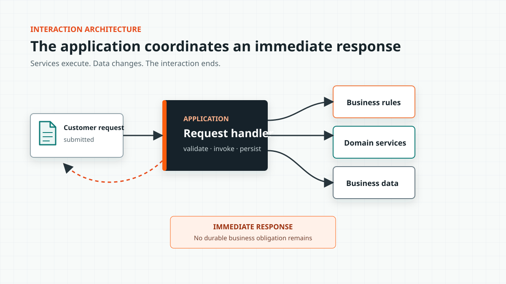
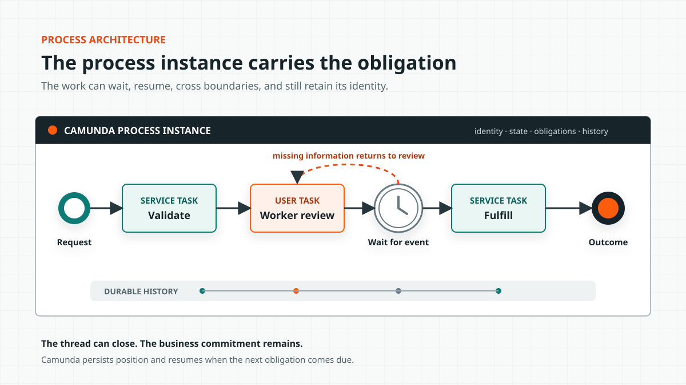
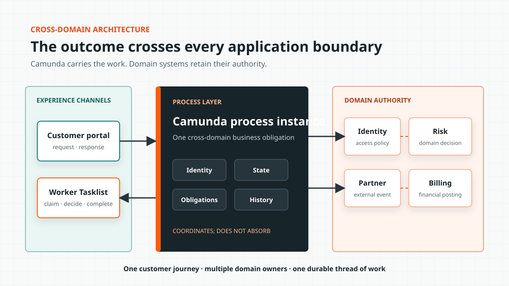

# From Request to Record: A Process Management Architecture
## Methods, Features, and Runtime Responsibilities

**Author:** Gary Samuelson  
**Date:** July 26, 2026  

---

Process-management architecture begins when work must outlive the application request that started it. Camunda carries that work until the business outcome is complete.

A conventional application can validate a request, call services, update a database, and return a result. Process management adds the ability to maintain a specific unit of work after the original interaction has ended. Camunda provides the running process instance that carries the work's identity, state, current obligations, and execution history.

The application services continue to perform their specialized functions. The process instance determines when those functions are required, which participant is responsible, and what must occur before the business outcome is complete. This keeps domain behavior inside the applications that own it while Camunda manages the end-to-end work.

---

## Begin With the Ordinary Application

A reasonably mature customer-facing application typically authenticates the customer, validates a submitted request, applies business rules, invokes domain services, persists data, and returns a response. This architecture is appropriate when the business transaction begins and ends within the interaction.

The requirements change when the response does not represent the completed outcome. A back-office worker may need to review the request. Missing information may return the work to the customer. A timer may start while the organization waits for a response. A risk threshold may require another approval, or a partner system may return an event several hours later. The complete unit of work may remain active for days, months, or years.

An application team can implement each of these requirements by adding status columns, scheduled jobs, callback handlers, assignment tables, retry logic, and audit records. These additions solve immediate requirements, but together they reproduce the state management and coordination responsibilities of a process engine inside the application.

The application can call every required service and still lack a component responsible for the work after the request ends. Camunda supplies that component and carries the work through the final business outcome.

---

## Service Orchestration Is Not Process Management

Service orchestration connects APIs and coordinates an immediate set of technical operations. An application may call a rules service, invoke a transaction, request an identity check, and combine the results before returning control to the client. This is useful orchestration, but it does not by itself provide process management.

A service invocation operates on the current request. A process instance maintains the position of a specific unit of work across completed tasks, active assignments, wait states, events, and failures. The difference becomes visible when execution must pause and later resume without losing business context.

*Figure 1. An ordinary application invokes rules, domain services, and business data before returning an immediate response. The interaction coordinates services but does not create a durable unit of work.*

The process-aware architecture adds a running instance responsible for carrying the business obligation after the interaction ends.

*Figure 2. The process instance carries one business obligation through human work, a wait state, an external event, and final fulfillment. The services remain responsible for their functions while the process manages the lifecycle.*

The process instance does not replace the application or its services. It coordinates their participation in the running work. Camunda can persist the instance while no technical thread is active and resume execution when a message arrives or a timer becomes due. The instance retains the active task, the route already taken, the accumulated process variables, and the conditions required for completion.

---

## The Running Process Instance

When Camunda starts a BPMN model, the engine creates a specific unit of work. A claims model defines the lifecycle for claims in general; a process instance represents this claim, including its current state, events, assignments, and history. The model functions as the definition, while the process instance represents the running object created from that definition.

The instance carries:

- **Identity**: which request, case, order, claim, or application this is.
- **State**: where the token sits and which variables describe the work now.
- **Obligations**: which human or system task must act next.
- **Constraints**: which rules, gateways, deadlines, and completion conditions govern advancement.
- **History**: what happened, in what order, and through which participant.

An application record describes the state of a business object. The process instance describes the organization's active commitment to move that object toward an outcome. It connects tasks, business context, security decisions, events, transactions, domain information, and execution history to the same unit of work.

That active commitment is the **Work Record**: the process instance viewed as the organization's running record of one business outcome. Once instantiated, it acquires three runtime properties. **Presence** gives the work identity, state, and history. **Gravity** generates obligations for people and systems. **Persistence** carries the commitment across wait states, failures, deployments, and time. Camunda executes the commitment represented by the record.

---

## The BPMN Task as a Unit of Work

A BPMN task represents a unit of work and provides a container for the human or technical services required to complete it. Its architectural value comes from its placement inside the process model.

For example, a document check performed before approval prevents incomplete work from advancing. The same technical service invoked after approval identifies a control failure. The implementation may be identical, but the task's position establishes different business context and value.

The process model defines why the task runs, which process state it receives, which role or worker is responsible, and what completion allows to happen next. The task therefore connects technical behavior to business intent.

For a Camunda implementation, that container can resolve to several kinds of workers:

- A user task placed in a person's Tasklist.
- A service task activated for a job worker.
- A connector invoking an external system.
- A business rule task evaluating a decision.
- An AI-enabled worker producing a structured result for the engine to validate.

The task defines the required work independently of the worker type. At runtime, the task may resolve to a person, conventional service, connector, rules engine, or AI-enabled worker. This separation allows different workers to participate in the same process while the model continues to define the expected result and accountability boundary.

---

## Process Architecture Crosses the Silos the Applications Created

Applications commonly align to products, systems, or organizational domains, while a customer request crosses several of those boundaries before reaching completion. A request may begin in a portal, move through identity verification, enter a back-office queue, call a risk platform, wait for a partner, return to a worker, and close in a billing system.

Each participating system performs a specialized function, but the customer experiences one service journey. The process model crosses the application boundaries because the business outcome crosses them. From an aspect-oriented perspective, the process represents a concern that cuts across functional modules and coordinates their participation without absorbing their domain responsibilities.

*Figure 3. Camunda manages movement of the work across channels and domain boundaries. Each application retains the behavior and data appropriate to its domain.*

Camunda provides visibility and control for the cross-domain obligation. The portal owns the customer interaction, the risk service owns risk behavior, and the billing system owns financial posting. Camunda coordinates the order, state, and completion of their participation.

This boundary prevents domain logic from accumulating inside BPMN simply because the engine can invoke it. It also prevents process state from becoming scattered across the applications that happen to participate. The process coordinates the outcome while each domain service retains responsibility for its own decisions and actions.

---

## Business Events and the Running Process

A business event represents an observation taken from the state of something at a point in time. A payment posts, a document arrives, a shipment crosses a threshold, a policy expires, a customer withdraws consent, or a sensor reports a condition. Each event may require a running process to react.

Camunda's message, signal, and timer semantics connect those changes to the running work. Messages correlate an event to the intended process instance. Signals broadcast a condition to every matching subscription. Timers resume work when a modeled commitment comes due. Each event must reach the appropriate subscription in the process lifecycle.

An event broker transports and distributes the message. Camunda places the message into the context of a specific unit of work and applies the modeled response. The responsibilities divide as follows:

- Event infrastructure transports and distributes observations.
- The process engine correlates an observation to running work.
- The BPMN model defines how that work reacts.
- Domain services determine the business effect inside their boundary.

Complex event processing belongs in infrastructure designed to combine observations across time windows and detect patterns, causality, or correlation. Camunda does not need to replace that infrastructure. It receives the resulting business event, correlates it where appropriate, and applies it within the process context.

---

## Long-Running Work Is Not an OLTP Transaction

A database transaction protects a short-lived technical change. Business work can outlive the transaction, the service deployment, and the people who initiated it. Holding database locks across that duration would damage transaction-processing capacity and would incorrectly treat the complete business activity as one atomic technical operation.

Process architecture uses a different transaction model. Each technical step commits within its local boundary, and the process instance records progress between those commits. If a later step fails, the model can retry the work, route it to a person, wait for correction, escalate the condition, or invoke compensation. BPMN error, escalation, timer, transaction, and compensation semantics describe business recovery rather than a database rollback.

An order shipped yesterday cannot be rolled back like an uncommitted row. It can be recalled, replaced, credited, or escalated. Each response is new work with its own accountability.

Camunda persists the position of the work between technical transactions. The process survives because the engine records its state and resumes from the appropriate position, not because one database transaction remains open until the business is satisfied.

---

## Process Context for Authorization

Security discussions often begin with applications and endpoints. A process model adds the business position at which authorization must apply.

Who may see this task? Who may claim it? Which worker group may complete it? Which service identity may activate a job type? Who may send the message that advances the instance? Which variables should a participant receive?

These questions have business meaning because the process identifies the work, its current stage, and the obligation now due. A person may have access to the claims application but lack authority to approve this claim at its current stage. A service identity may be allowed to read customer data but lack authority to complete a settlement task.

Camunda adds process context to application security, identity management, and domain authorization; it does not replace them. The process model makes the handoff and decision point visible, while the appropriate identity or policy service determines whether the action is allowed. Authorization policy should remain in the system equipped to govern it, with the process invoking and recording the decision where it affects the work.

---

## Business Domain Data in the Process Instance

The process model should not become a second enterprise data model. It needs enough domain structure to carry meaning between participants, including identifiers, relevant state, decision results, and references to authoritative records. These process variables form the contract of the running work.

The domain systems remain authoritative for the full objects and behaviors they own. Camunda carries the process state required to coordinate them.

Carrying too little process data forces each task to reconstruct context from source systems, leaving no coherent record of the work. Carrying complete domain objects turns process variables into another system of record, increases payload size, blurs ownership, and creates stale copies.

The process should carry the identity, state, decisions, and references required to advance the work. A task can retrieve additional domain detail from the authoritative system when needed and return the result that changes the process state. The process instance is not the business domain; it is the running context that connects domain behavior to an outcome.

---

## Actionable Knowledge Begins With an Event History

Actionable knowledge presents information with an immediate path toward thoughtful action. Process execution data provides the evidence needed to create it.

Every completed task, timer, message, route, retry, and exception leaves evidence. Across one instance, that history explains what happened. Across thousands of instances, it reveals how the organization actually works.

Execution history shows where work waits and which routes generate rework. It also shows whether a partner regularly misses a service level and whether a human task requires judgment or has become a routine confirmation. The same evidence can measure whether an AI recommendation improves the outcome or creates another review cycle.

Camunda users already sit on this evidence. Operate exposes the running and failed work needed for operational intervention. Tasklist exposes human obligations. Optimize and process-intelligence tooling can examine flow across instance populations. The model provides the expected path; the runtime history records the path taken.

A dashboard identifying a bottleneck provides information. A governed process change that addresses the bottleneck and can be measured against subsequent instances provides a path to action. Process improvement becomes continuous when execution evidence changes the model and the revised model produces new evidence.

---

## What Belongs Where

Camunda should own the running process state, not every capability used by the process. The following boundaries keep domain behavior in its applications while giving the process layer enough responsibility to manage the work:

| Concern | Primary home | Camunda's role |
|---|---|---|
| Domain behavior | Domain service or application | Invoke it at the correct point in the work |
| Process state | Camunda process instance | Persist position, variables, incidents, and history |
| Human obligation | BPMN user task and Tasklist | Assign, wait, escalate, and record completion |
| Business decision | DMN or governed rules service | Evaluate the decision and route on its result |
| Event transport | Event broker or integration platform | Receive meaningful events; correlate messages to running instances |
| Short technical transaction | Database or service boundary | Record completion and continue from durable state |
| Long-running business transaction | BPMN model | Coordinate retries, compensation, correction, and escalation |
| Operational intervention | Operate and support tooling | Expose incidents and allow governed recovery |
| Process improvement | Runtime history and analysis | Compare designed flow with actual execution |

Camunda manages the lifecycle of the work without becoming the owner of every capability that participates in it.

---

## AI Makes the Process Boundary More Important

An AI agent can call tools, interpret documents, draft a decision, and select a next action. These capabilities do not provide a durable business object, a valid lifecycle, a timer that survives the agent session, a named owner, or an organizational definition of completion. Technical capability does not supply business context.

Placing the agent inside a Camunda task makes the agent a participant in the running process. The process instance identifies the work, the task defines the expected result, and the model defines the valid continuation. The engine records the attempt, manages failure, and preserves process state after the model context has ended.

AI inherits the runtime properties of the Work Record by entering through a modeled task. The task supplies the assignment boundary. The process instance supplies presence, gravity, and persistence. Together they keep AI activity connected to live business state, an enforceable obligation, and a history that survives the agent session.

This structure gives the agent sufficient context and authority to complete its assigned work while allowing the organization to govern when it acts, which tools it may use, what output it must return, and which decisions require human review. Agentic AI extends the set of available process workers; it does not remove the need for process architecture.

---

## Process Awareness Requires Running Work

Process awareness requires more than a BPMN diagram. It requires a running object that carries business work across applications, people, events, failures, and time.

Camunda executes the BPMN lifecycle and preserves the process state between each participant. Human tasks, service calls, messages, signals, and timers all operate against the same running instance. The resulting execution history explains how the outcome developed and provides the process data needed for operational improvement.

The surrounding applications, domain services, event platform, identity system, rules, data, and user experience remain necessary. Each performs a specific function. The Work Record connects those functions to an organizational commitment and maintains that commitment until the business outcome is complete.

---

*© 2026 Gary Samuelson | CC BY-NC-ND 4.0 — Share freely with attribution. No commercial use. No derivatives without permission.*