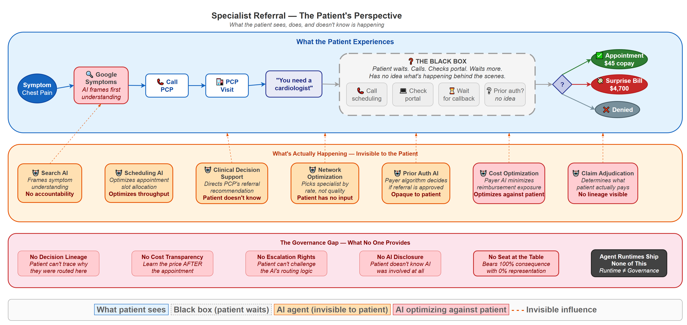
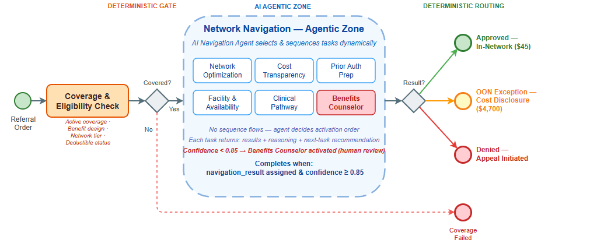
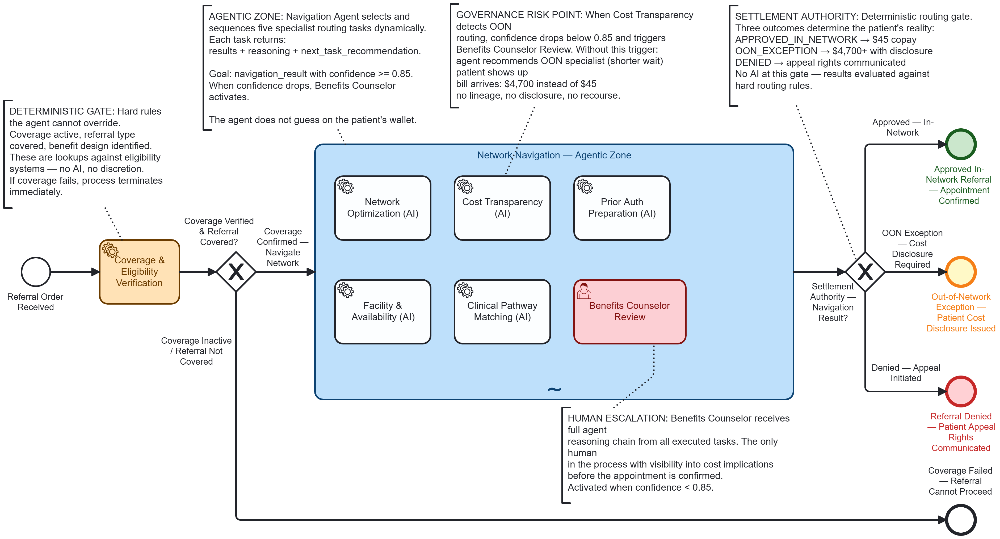
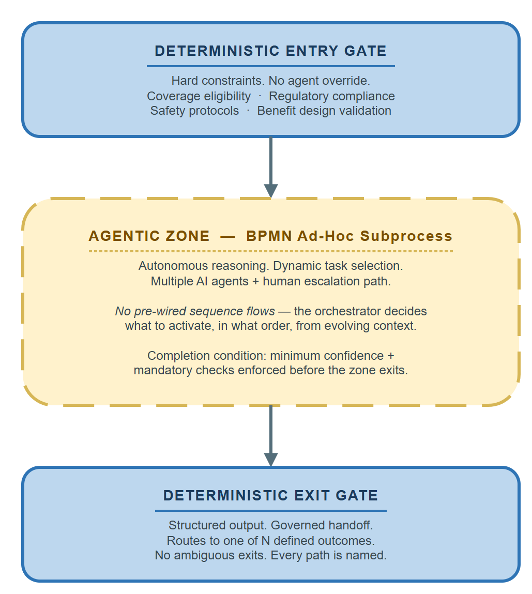

# The Governance Gap: What Enterprises Need Above the Agent Runtime

**Author:** Gary Samuelson  
**Date:** March 27, 2026  
**Part 2 of 2** — This piece follows [Who Is Accountable When AI Gets Healthcare Wrong?](../healthcare/healthcare-accountability.md), which examines the accountability gap from the patient's perspective. That paper asks the questions. This one opens the hood and shows how the technology actually plays out — where today's agent runtimes fit, and where they fall short.

---

## When the Agent Gets It Wrong, the Patient Gets the Bill

A patient's primary care physician orders a referral to a cardiologist. Between that order and the patient sitting in the specialist's office, six parties, three regulatory layers, and a maze of negotiated rates, benefit designs, and prior authorization requirements determine where that patient goes — and what they'll pay.

An autonomous AI agent navigates this process. It picks a specialist with a shorter wait time and a higher quality score. Sound reasoning. The patient shows up. The bill arrives: **\$4,700 instead of \$45.**<sup>ii</sup> The agent didn't trace the cost transparency decision through the patient's specific benefit design. No lineage. No audit trail. No evidence the patient was informed of the cost differential before the appointment was booked.<sup>iii</sup>

A state insurance commissioner asks: *"Was the patient informed of the out-of-network cost before the appointment?"*

Without a governance substrate, the answer is a three-week forensic investigation through log files.<sup>iv</sup> With one, the answer is a three-second query.

That's the governance gap. And every enterprise deploying autonomous agents today is operating inside it.<sup>i</sup>

<small><sup>i</sup> Appendix A1 — AI in prior authorization (ProPublica, 2023; Reuters, 2023; Senate Finance Committee, 2023–2024) · <sup>ii</sup> Appendix A2 — Surprise billing (KFF, 2021; No Surprises Act) · <sup>iii</sup> Appendix A3 — Missing patient notification (HHS OIG, 2022; CMS-0057-F, 2024) · <sup>iv</sup> Appendix A4 — Absent audit trails (NAIC, 2023; ONC HTI-1, 2024)</small>

---

## The Patient's Perspective

Before the architecture, the experience. The governance gap doesn't live in diagrams — it lives in what happens to the person caught inside the process.



*Figure: What the patient sees, does, and doesn't know is happening. The top layer (blue) is the patient's visible journey — symptom through black-box waiting to outcome. The middle layer (orange) shows the seven AI agents operating invisibly on the patient's referral. The bottom layer (red) names the governance gaps that leave the patient without recourse. Note the three possible outcomes: a \$45 copay, a \$4,700 surprise bill, or outright denial — and the patient has no visibility into which AI decisions determined their path.*

The patient's experience is defined by what they *can't* see. They Google symptoms (an AI frames their understanding before they ever call the doctor). They get a referral ("you need a cardiologist"). Then they enter the **black box** — calling scheduling lines, checking portals, waiting for callbacks, with no idea whether prior authorization has been requested, approved, or denied. Behind that black box, seven AI agents are making decisions about their care, their cost, and their access. Two of those agents — Cost Optimization and Claim Adjudication — are explicitly optimizing *against* the patient's financial interest. The patient has no seat at the table, no escalation rights, and no AI disclosure.

The patient bears 100% of the financial consequence and has 0% visibility into the AI decisions shaping their outcome. The party with the most at stake has the least information. Companion papers examine this same referral from the provider's perspective *(coming soon)* and the insurance company's perspective *(coming soon)* — each reveals a different set of AI touchpoints and a different set of governance questions that no current agent runtime answers.

---

## The Patient's Journey

The governance gap isn't abstract. It plays out in the process below — a specialist referral network navigation that touches every insured American and that almost nobody understands. The domain and its failure modes are real (see Appendix); the governed architecture is illustrative — designed to show what should exist, not what does.



*Figure: A patient referral navigated through the "agentic sandwich" — deterministic gates (blue) bracket an autonomous reasoning zone (amber) where five AI agents and one human escalation path coordinate the navigation. Three outcomes emerge on the right: approved in-network (\$45 copay), out-of-network exception with mandatory cost disclosure, or denied with appeal rights. The governance gap lives inside the agentic zone — where AI agents make decisions that determine the patient's financial outcome, and no current architecture makes those decisions auditable.*

### The Process: What You're Looking At



*Figure: The full BPMN 2.0 executable model for specialist referral network navigation — the "agentic sandwich" pattern. Left: a deterministic coverage gate the agent cannot override. Center: an ad-hoc subprocess where five AI agents and one human escalation path navigate the network autonomously. Right: a deterministic routing gate that settles the referral into one of three outcomes. This is what the process looks like when it's engineered for governance. Most deployed systems skip the model entirely.*

Reading left to right: the process starts at **Referral Order Received** from the PCP. It passes through a **Coverage & Eligibility Verification** gateway — a deterministic gate that checks whether the patient has active coverage, whether the referral type requires authorization, and whether the benefit design (HMO, PPO, EPO, tiered network) permits self-referral or mandates PCP gatekeeping. This is a hard constraint. No agent overrides it.

If the eligibility gate passes, the flow enters the large dashed-border box in the center — **Network Navigation — Agentic Zone** — a BPMN ad-hoc subprocess. Inside that zone, five tasks are visible but *not connected by sequence flows*:

- **Network Optimization Agent** (AI service task)
- **Cost Transparency Agent** (AI service task)
- **Prior Authorization Preparation Agent** (AI service task)
- **Facility & Availability Agent** (AI service task)
- **Clinical Pathway Matching Agent** (AI service task)
- **Benefits Counselor Review** (human escalation task)

After the agentic zone completes, a **Settlement Authority Gateway** evaluates the navigation result and routes to one of three outcomes: **Approved In-Network Referral**, **Out-of-Network Exception with Patient Cost Disclosure**, or **Referral Denied — Appeal Initiated**.

### What Makes This Domain Unforgiving

Healthcare insurance network navigation exposes the governance gap because:

- **The patient bears the cost of errors.** When an agent routes a patient to an out-of-network facility because it didn't trace the negotiated rate through the correct benefit tier, the patient gets a $47,000 surprise bill. This isn't a compliance inconvenience — it's financial devastation.

- **The regulatory surface is enormous.** State insurance commissioners, CMS, the No Surprises Act, ERISA for employer plans, state network adequacy requirements — each jurisdiction imposes different rules on the same navigation decision. An agent that applies Texas network adequacy rules to a Florida patient has violated state insurance law.

- **The multi-party coordination is real.** Patient, PCP, specialist, insurance company UM department, facility, pharmacy benefit manager, and state regulator all touch the same referral. This is the cross-cutting ecosystem orchestration problem — not a theoretical one — that no current agent runtime addresses.

- **Everyone has lived this process.** Every reader has navigated insurance networks, fought a denied referral, or been surprised by an out-of-network bill. The governance gap is immediately recognizable.

### The Tasks Inside the Agentic Zone

An orchestrating Navigation Agent receives the referral context from the process engine and decides which tasks to activate, in what order, based on the specific clinical referral and the patient's benefit design.

| Task | Job Type | What the Agent Does | What It Returns |
|------|----------|-------------------|----------------|
| **Network Optimization** | `optimize-network` | Searches contracted provider directory for the requested specialty within the patient's specific network tier; ranks by distance, quality scores, wait time, and negotiated rate; checks network adequacy against state minimums | `{ recommended_providers: [...], network_tier: "preferred", negotiated_rate_schedule: "2026-Q1-v3", state_adequacy_met: true }` |
| **Cost Transparency** | `calculate-cost-share` | Applies the patient's specific benefit design (deductible status, copay vs coinsurance, out-of-pocket max progress, accumulator status) to calculate the patient's actual cost for each recommended provider | `{ patient_cost_estimate: "$45_copay", deductible_remaining: "$1,200", oop_max_progress: "62%", cost_basis: "PPO_tier1_negotiated" }` |
| **Prior Auth Preparation** | `prepare-prior-auth` | Determines if the referral type + payer + diagnosis combination requires prior authorization; if yes, assembles the clinical documentation package against the payer's specific criteria | `{ auth_required: true, payer_criteria_version: "UHC-2026-cardiology-v2", documentation_complete: true, submission_ready: true }` |
| **Facility & Availability** | `check-availability` | Queries facility scheduling systems for appointment availability; cross-references with the patient's urgency level and the clinical pathway's recommended timeframe | `{ earliest_available: "2026-04-02", facility: "Austin Heart — South", urgency_match: true, scheduling_hold_id: "AH-2026-04-8841" }` |
| **Clinical Pathway Matching** | `match-pathway` | Matches the referral diagnosis against evidence-based clinical pathways; determines if the referral destination, sequencing (e.g., imaging before specialist visit), and timing align with clinical best practice | `{ pathway_match: "ACC_chest_pain_eval_v4", recommended_sequence: ["stress_echo", "cardiology_consult"], alignment_score: 0.94 }` |

When the orchestrating agent's confidence drops below 0.85 — because the benefit design is ambiguous, the network has adequacy gaps, or the clinical pathway suggests a different routing — the process escalates to the **Benefits Counselor Review** human task. A human reviews the agent's reasoning, makes the call, and the process continues. The agent doesn't guess when the stakes are the patient's wallet.

### The Job Worker Pattern

```
Orchestrator (Camunda Zeebe) creates job: "network-navigation-agent"
    │
    ├─► Python Job Worker receives job + context variables
    │     { referral_type: "cardiology_consult", diagnosis: "R07.9",
    │       payer: "UHC_Choice_Plus_PPO", network_tier: "tier_1",
    │       patient_zip: "78745", urgency: "routine",
    │       deductible_met: false, deductible_remaining: 1200,
    │       oop_ytd: 3100, oop_max: 5000 }
    │
    ├─► Navigation Agent reasons autonomously within its scope:
    │     - Activates Network Optimization (must run first — provider options
    │       constrain everything downstream)
    │     - Activates Cost Transparency + Prior Auth Prep in parallel
    │       (independent once providers are known)
    │     - Activates Facility Availability + Clinical Pathway in parallel
    │     - Reviews accumulated results, calculates confidence
    │
    └─► Returns structured three-part response to Camunda:
          {
            results: {
              recommended_provider: "Dr. Mehta — Austin Heart South",
              network_status: "tier_1_in_network",
              patient_cost: "$45_copay",
              auth_status: "approved_auto",
              appointment: "2026-04-02T09:30"
            },
            next_task: "confirm_with_patient",
            reasoning: "Patient's UHC Choice Plus PPO plan covers
                        cardiology consult at Tier 1 in-network rate.
                        Dr. Mehta is 4.2 miles from patient, quality
                        score 94th percentile, 8-day wait vs 22-day
                        average. Prior auth auto-approved per UHC
                        criteria v2 — diagnosis R07.9 with PCP referral
                        meets all documentation requirements. Patient
                        cost: $45 specialist copay (deductible waived
                        for in-network specialist visits per plan design).
                        No out-of-pocket surprise risk."
          }
```

### Where the Governance Gap Hits

The architecture above shows the governed version — what *should* happen. Here's what happens today, when the same referral runs on an agent runtime *without* that governance substrate.

Return to the referral that opened this paper — the agent that recommended Dr. Chen because of shorter wait times and a higher quality score. The patient got a \$4,700 bill. No lineage. No audit trail. The commissioner asks: *"Was the patient informed?"* With seven-layer semantic lineage, the answer is a three-second query:

- **Layer 1 (Instance):** Navigation completed 2026-03-28T14:22, recommended Dr. Chen (out-of-network)
- **Layer 2 (Class):** Network Optimization activity class shows OON recommendations have 34% patient complaint rate vs 2% for in-network — pattern should have triggered escalation
- **Layer 3 (Policy):** Patient cost disclosure policy v3.1 requires explicit patient acknowledgment before OON routing
- **Layer 4 (Regulatory):** Texas Insurance Code §1467 and No Surprises Act §2799A-1 impose specific disclosure requirements for OON referrals
- **Layer 5 (Historical):** 847 prior navigations for this payer/plan combination — 96.2% routed in-network successfully
- **Layer 6 (ML):** Model confidence 0.71 on OON recommendation (below 0.85 threshold) — should have escalated to Benefits Counselor
- **Layer 7 (Agent Reasoning):** "Selected Dr. Chen due to 3-day wait vs 8-day for in-network options. Did not weight cost transparency results sufficiently."

Every layer present. Every question answered. The system *knows* it made a mistake — and more importantly, it knows *why*, which means the activity class gets updated and the next navigation won't repeat it.

That's the difference between an agent runtime and a governed architecture. The runtime executed perfectly. The governance substrate would have caught the error before the patient ever walked into the wrong office.

---

## What's Missing From the Patient's Journey

What you just saw — the agent that routed a patient to the wrong specialist because it optimized for one variable without tracing the cost through the patient's benefit design — is a symptom. Here's the architectural diagnosis.

No agent runtime ships with the governance substrate that would have caught this. The runtime executes decisions. It doesn't trace them, learn from them, or enforce boundaries around them. From the patient's perspective, four things are missing — and each one maps directly to a moment in their journey where the system failed them.

### Missing: Decision Lineage

The patient got a $4,700 bill. When they call to dispute it, nobody can explain *why* the agent chose Dr. Chen over Dr. Mehta. What policy was in effect? What version of that policy? What data informed the selection? What was the agent's confidence score? Was a human ever in the loop?

The agent executed the decision. Nothing traced its lineage. The patient's appeal becomes a three-week forensic investigation — if anyone agrees to investigate at all.

### Missing: Class-Level Learning

This patient isn't the first to be routed out-of-network for this payer and plan combination. 847 prior navigations exist. 96.2% routed in-network successfully. But the system doesn't *know* that — because no agent runtime maintains an activity class library that learns from activity instances. Every navigation starts from zero. The patient's bad outcome doesn't teach the system anything.

### Missing: Governed Autonomy Boundaries

The Cost Transparency Agent returned data showing the out-of-network cost differential. The orchestrating agent weighted wait time over cost. In a governed architecture, the process engine would enforce a hard constraint: *no OON routing without explicit patient acknowledgment of the cost differential.* That's not a guideline in a system prompt — it's a deterministic gate that no amount of LLM reasoning can override.

Agent runtimes give agents freedom to act. They don't give patients the architecture that defines *where* that freedom must stop.

### Missing: Cross-Cutting Coordination

Five agents worked this referral — Network Optimization, Cost Transparency, Prior Authorization, Facility & Availability, and Clinical Pathway. Each returned structured results. But no architecture ensured that Cost Transparency's out-of-network finding *actually influenced* Network Optimization's final recommendation. The agents operated in parallel. They didn't coordinate. The patient paid for the gap.

---

## The Three Values Worth Preserving — and How to Encode Them

The governance gap creates dependency on external consultants — pattern libraries, compliance framing, integration architecture — but that dependency is architectural, not inherent. Three capabilities currently delivered at partner rates can be encoded: domain pattern libraries become learned process intelligence *(coming soon)*, compliance gatekeeping dissolves under seven-layer semantic lineage, and proprietary integration accelerators yield to a governed agentic mesh *(coming soon)* built on standard protocols. One capability genuinely can't be automated: **organizational change sponsorship** — the executive coalition-building and political navigation that determines whether any architecture gets deployed. The governance gap is an *architecture* gap, not a change management gap. Both matter. They're different disciplines.

*For the full treatment — including why this dependency is structural and how each architectural replacement works — see "Consulting Dependency as Architecture" (forthcoming).*

---

## Appendix: Evidentiary Basis — "When the Agent Gets It Wrong"

The opening scenario in this paper — an AI agent navigating a referral, selecting a specialist, booking an appointment, and generating a surprise out-of-network bill with no cost transparency lineage — is not hypothetical. It is a composite of four independently documented patterns, each with named AI systems, federal legislation, or congressional investigation attached.

---

### A1. AI/Automated Systems Navigating Prior Authorization Without Human Review

**Cigna — PXDX Algorithm**
McLaughlin, B., Rucker, P., and Miller, M. "How Cigna Saves Millions by Having Its Doctors Reject Claims Without Reading Them." *ProPublica*, March 25, 2023.
Cigna's PXDX system auto-matched diagnosis codes to coverage policies and surfaced pre-scored denial decisions. Physicians approved at an average of **1.2 seconds per claim** — no chart review, no patient contact. Over 300,000 claims rejected in two months. The AI system is named explicitly; physicians described their role as confirmatory, not evaluative.

**UnitedHealth Group — nH Predict**
"UnitedHealth's AI Model Denies Elderly Patients Needed Care, Lawsuit Says." *Reuters*, November 14, 2023.
Class action: *Estate of Gene Lokken et al. v. UnitedHealth Group, Inc.* (D. Minn. 2023).
UnitedHealth's **nH Predict ML model** — trained on the company's own claims data — predicted when post-acute care patients were ready for discharge, overriding treating physicians at a documented >90% rate. The model is named in the complaint; this is a machine learning system, not a rules engine.

**U.S. Senate Finance Committee — Algorithmic Prior Authorization Investigation (2023–2024)**
Sen. Ron Wyden, Chairman, Senate Finance Committee. Letters to Humana, UnitedHealth Group, and Cigna requesting documentation of AI/algorithm use in prior authorization decisions and denial rate data. Humana's response confirmed use of AI-assisted coverage determination. Public record at *finance.senate.gov*.

---

### A2. The Patient Receives a Large Bill Because Network Status Was Not Checked

**No Surprises Act**
Consolidated Appropriations Act, 2021, Division BB (Public Law 116-260). Effective January 1, 2022.
Congress passed federal legislation specifically because referral and booking processes — automated and manual — routinely failed to verify network status before scheduling. The legislative record explicitly identifies the patient harm pattern: a referred appointment booked without confirming in-network status, resulting in bills the patient could not have anticipated. The law's *existence* is the citation; the problem was widespread enough to require a federal fix.

**KFF (Kaiser Family Foundation) Health System Tracker, 2021**
"Surprise Medical Bills: New Protections for Consumers Take Effect in 2022."
Survey finding: **1 in 5 insured adults** had received a surprise out-of-network bill. In specialist and hospital facility contexts, amounts regularly exceeded \$1,000; documented cases ranged into the \$3,000–\$10,000+ range. The \$45/\$4,700 ratio used in this paper is conservative — some documented cases were 500–1,000× the expected in-network cost.

---

### A3. No Evidence the Patient Was Informed Before the Appointment

**HHS Office of Inspector General**
OIG Report OEI-09-18-00260. "Medicare Advantage Organizations Inappropriately Denied Beneficiaries Access to Services." April 2022.
13% of denied prior authorization requests met Medicare coverage rules and should have been approved. OIG found documentation gaps: plans could not demonstrate that members received adequate notice of cost or coverage consequences before services were rendered.

**CMS Final Rule — Electronic Prior Authorization**
"Improving Access to Prior Authorization Processes in Medicare Advantage, Medicaid, CHIP, and FFE QHP Issuers." CMS-0057-F, February 2024.
Requires electronic prior authorization with **reasoning attached to decisions**. The regulatory requirement for queryable reasoning and audit trails was created explicitly because it did not previously exist. The rule names "automated decision-making" as the triggering problem class.

---

### A4. No Audit Trail → Multi-Week Forensic Investigation

**ONC Health Data, Technology, and Interoperability (HTI-1) Final Rule**
"Health Data, Technology, and Interoperability: Certification Program Updates, Algorithm Transparency, and Information Sharing." ONC, January 2024.
Requires decision support interventions in certified EHR systems to surface algorithm logic and evidence basis at point of care. Motivated in part by the documented inability of providers, patients, and regulators to reconstruct *why* an automated system made a routing or authorization recommendation after the fact.

**NAIC Artificial Intelligence in Insurance — Model Bulletin**
National Association of Insurance Commissioners. December 2023.
State insurance commissioners adopted a model bulletin requiring insurers to document AI decision logic and maintain audit trails for AI-assisted claims and authorization decisions. The bulletin explicitly acknowledges that as of 2023, most AI-assisted systems **lacked queryable governance records** — validating the "three-week forensic investigation" scenario described in this paper.

---

### A5. On the \$45 / \$4,700 Amounts

These figures are illustrative but within documented norms:
- Typical in-network specialist copay: **\$30–\$75** (KFF Employer Health Benefits Survey, annual)
- Out-of-network specialist charges prior to No Surprises Act protections: routinely **\$2,000–\$12,000+** depending on specialty and geography
- The ~100× ratio is conservative; documented surprise bills before the NSA ranged 500–1,000× expected in-network cost

Note: The No Surprises Act caps some of this exposure but contains significant carve-outs: self-funded employer plans retain opt-out pathways, ground ambulance is excluded, and cost-sharing still applies across all plan types.

---

## Appendix B: The Agentic Sandwich — Anatomy of a Governance Pattern<sup>v</sup>

The agentic sandwich brackets an autonomous AI reasoning zone between two deterministic constraint layers — entry gates the agent cannot override, exit gates that enforce completion conditions, and a BPMN 2.0 ad-hoc subprocess that gives agents freedom to reason while the process engine owns the state.



The pattern emerged from a collision between two trajectories: agentic AI frameworks that assume unbounded autonomy, and regulated industries that require every consequential decision to be reconstructable after the fact. BPMN's ad-hoc subprocess — standardized in 2011, largely ignored by the AI community — was designed for exactly this problem. The sandwich didn't invent a new container. It recognized that the container already existed.

*For the full treatment — what the pattern is, how it emerged, how it behaves in practice, and what architectural fixes look like — see "The Agentic Sandwich — Anatomy of a Governance Pattern" (forthcoming).*

---

## References & Further Reading

**Practitioner & Architecture References**

- Bernd Ruecker, *Practical Process Automation* and *Enterprise Process Orchestration* (O'Reilly) — The definitive treatment of process orchestration engines in enterprise architecture
- Michael Albada, *Building Applications with AI Agents* (O'Reilly, 2025) — Practical patterns for agent-based application development
- Chip Huyen, *AI Engineering* (O'Reilly, 2024) — Engineering discipline for production AI systems
- Valliappa Lakshmanan and Hannes Hapke, *Generative AI Design Patterns* (O'Reilly, 2025) — Guardrails, routing, and constraint patterns for production generative AI
- Ali Arsanjani and Juan Pablo Bustos, *Agentic Architectural Patterns for Building Multi-Agent Systems* (Packt, 2026) — Multi-agent coordination patterns including bounded autonomy

**Governance & Trust**

- James Sayles, *Principles of Artificial Intelligence Governance* (O'Reilly, 2025) — Governance frameworks for enterprise AI
- Beena Ammanath, *Trustworthy AI* (Wiley, 2022) — Enterprise framework for AI trust and accountability

**Healthcare Domain**

- Andrew Nguyen, *Hands-On Healthcare Data* (O'Reilly, 2022) — Healthcare data architectures and interoperability patterns
- Bohr & Memarzadeh (eds.), *Artificial Intelligence in Healthcare* (Academic Press, 2020) — Clinical AI governance and patient safety considerations

---

*Gary Samuelson is a VP — Senior Manager, Software Engineering with 20+ years in AI architecture, process orchestration, and enterprise data platforms. He writes about semantic process intelligence, governed agentic orchestration, and the architectural foundations for enterprise AI at [garysamuelson.github.io](https://garysamuelson.github.io).*

---

*© 2026 Gary Samuelson | CC BY-NC-ND 4.0 — Share freely with attribution. No commercial use. No derivatives without permission.*
