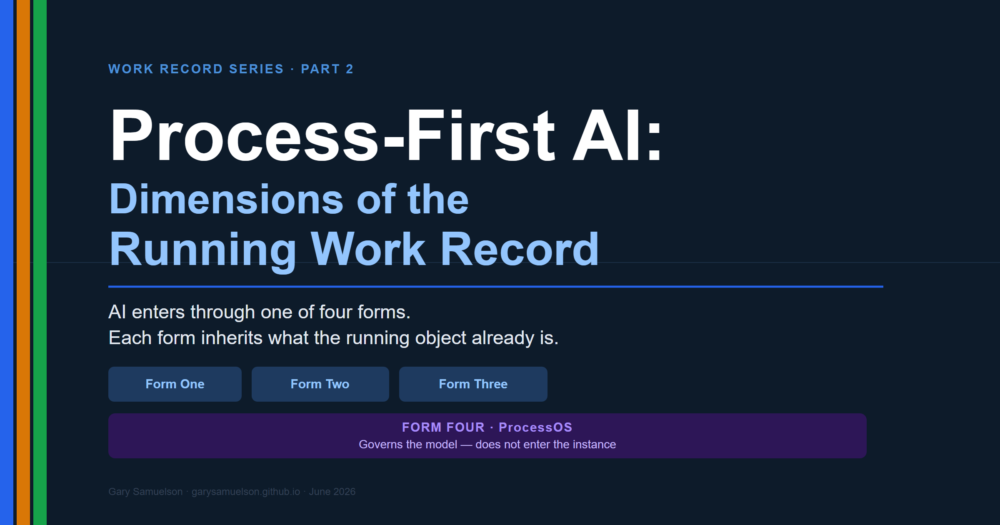
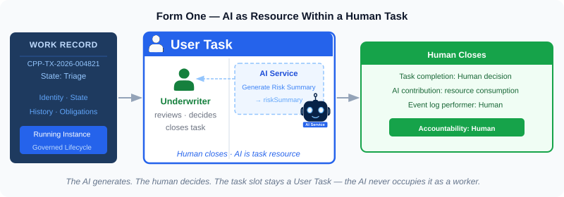
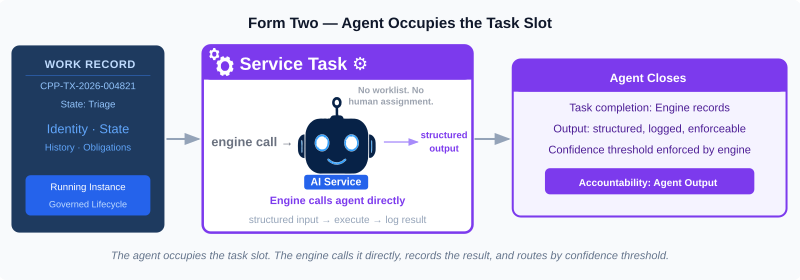
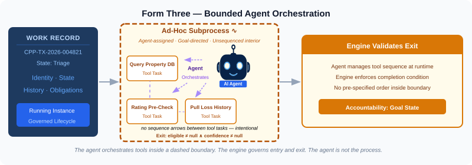
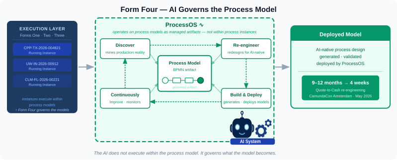
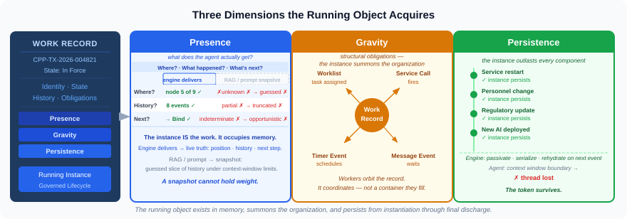
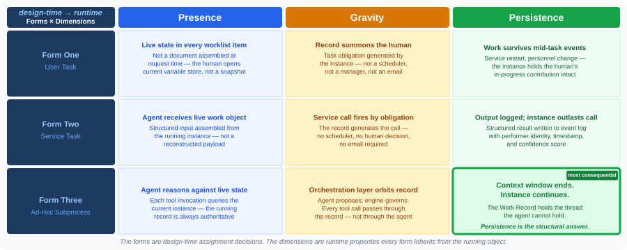
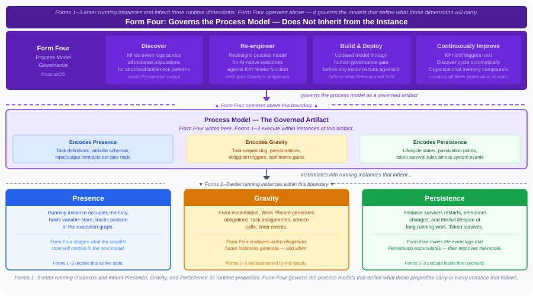

# Process‑First AI: Dimensions of the Running Work Record

**Author:** Gary Samuelson  
**Date:** June 7, 2026  
**Part 2 of the Work Record Series** — This piece follows [*Work Record*](work-record-is-bpm-task.md) [Samuelson 2026a], which established what a Work Record is, where it sits in the enterprise architecture, and why agents without one cannot close work. This piece defines what the Work Record becomes when it runs — and what AI gains by entering it. Four forms map how AI participates, from task-slot assignment through the AI system that governs process models themselves. The insurance policy walkthrough that grounds these concepts in a real commercial operation appears in Part 3.

---

A specification transforms from a design concept into a concrete object the moment the BPM engine instantiates it. It becomes a running entity — consuming resources, laying down history, and existing as an observable part of a live system that people and agents interact with. The Work Record now occupies memory, claims CPU cycles, holds handles to organizational resources, and exerts gravitational pull on every person, system, and AI component carrying an obligation to the work it represents. It has weight. It has form. It exists.

Enterprise AI discussions tend to stop one step short of this moment. The conversation lives in the design — process diagrams, agent specifications, task taxonomies — and ends where the object begins. What happens past that line is the thing itself.

---

## RECAP: Four Forms of AI in Process Execution

>This is a recap of my earlier discussion of the Four Forms of AI integration. For the full treatment of each form — including the research trajectory, the Agentic BPM Manifesto, and the Camunda ProcessOS announcement — see [*The ProcessOS Horizon*](process-os-horizon.md) [Samuelson 2026b].  

Enterprise AI enters the Work Record through a task — a modeling element that specifies what gets done and what constitutes completion, with the worker resolved at runtime. That assignment takes four forms. The first three operate within running process instances; the fourth governs the process models those instances execute.

**Form One — User Task.** The engine assigns the task to a human participant's worklist. The AI enters as a service call invoked mid-task — generating a draft, surfacing a recommendation, summarizing prior state. The human reviews and closes the task. The AI generates; the human closes.

**Form Two — Service Task.** The engine calls the AI service directly, passes the work object's structured input, receives structured output, and records the completion in the event log. No human interaction. The AI occupies the task slot; the engine records the result.

**Form Three — Ad-Hoc Subprocess.** The engine activates the subprocess and assigns it to an AI agent with a goal and a bounded toolset. The agent selects which tool to call next; the orchestration layer intercepts each call, applies the configured guardrail, and controls whether and how it executes. The LLM proposes. The execution engine decides. The agent governs its own tool sequence within the boundary the process model defines.

**Form Four — Process Model Governance.** The AI system operates *on* process models as governed artifacts — not within running instances of them. It discovers how processes actually run (process mining across event logs), re-engineers them for AI-native outcomes, deploys the updated models, and monitors production continuously. On May 19, 2026, Camunda named this layer **ProcessOS**.

For the full treatment of each form — including the research trajectory, the Agentic BPM Manifesto, and the Camunda ProcessOS announcement — see [*The ProcessOS Horizon*](process-os-horizon.md) [Samuelson 2026b].

---

## The Running Object Acquires Three Dimensions

AI changes how organizations function and adapt to our shifting horizon — actively reshaping how we operate within this new landscape. Both economically and functionally. It changes how people perform work, how teams make decisions, and how leaders assign accountability across the enterprise. At that scale, we need clear evidence of benefit. We must determine whether AI actually improves outcomes, using the same operational metrics we already trust: cycle time, error rate, escalation rate, throughput, and compliance deviation frequency.

BPM already has that measurement infrastructure. The event log captures every task completion, every token transition, every agent invocation. Conformance checking compares what actually ran against what the process model required. Fitness functions define what "better" means in operational terms. KPI monitoring measures it continuously across every live instance. These are not new constructs built for AI — they are the instruments BPM developed to manage process quality at scale, now available to measure AI's contribution to that quality.

Form Four connects AI to this infrastructure. The examples in Part 3 show what a post‑deployment AI performance report looks like when it is grounded in process data: event‑log evidence, conformance scores, and KPI deltas that measure AI's operational contribution against trusted benchmarks. Without Form Four — without BPM as the formal substrate — that report does not exist. When AI runs on its own island, without the necessary process infrastructure, the organization makes an expensive, structurally significant shift in how work is done without instrumentation.

Without that substrate, an AI deployment is not a faster path to the same destination. It is reinventing what BPM already provides — state management, obligation generation, event history, audit trail — under time pressure, and leaving behind the details that make the original work: the pre-conditions that gate bad outputs, the confidence thresholds that route to human review, the event log entries that answer the regulator's question. Reinvention under those conditions produces something that performs in demos and fails at scale.

The BPM practitioner arguing for process infrastructure and the AI engineer building the pipeline are both making decisions about the same set of properties. Presence, gravity, and persistence are what BPM as a discipline has formalized over decades of production deployment and process management research: the structural properties required to coordinate long-running work reliably across humans, systems, and organizational boundaries [2]. The only question is whether those properties are enforced by purpose-built infrastructure or reconstructed case by case in application code — and whether the organization can measure the result either way.

Three properties. Each one answers a different failure mode.

**Presence.** The process instance occupies memory, holds its variable store, maintains its event history, and tracks its position in the execution graph. When a task activates, the engine passes the instance's variable scope directly — the complete typed state accumulated from every prior step, not a best‑effort reconstruction from scattered documents, logs, and chat transcripts. An agent that receives a work object gets live state: where the work is, what has happened to it, and what can happen next. An agent that operates on RAG and prompts gets a snapshot — a guess at the relevant slice of history under a strict context‑window budget. A snapshot can be useful, but it cannot carry the full weight of organizational memory for long‑running work.

**Gravity.** From the moment of instantiation, the Work Record generates obligations. Task assignments appear in worklists. Service calls fire. Timer events schedule. Message events wait. The mechanism is structural, not managerial: user tasks assign because the engine's token reaches a ready state; service calls fire because execution reaches the point where that obligation comes due; timer events belong to the engine's timer service, not to someone's calendar or a bespoke cron job. The instance does not sit passively, waiting for the organization to remember it — it summons the organization. Workers, human and AI alike, orbit the record. The record is not a container workers occasionally update; it is the coordinator that tells them when to act, what to do, and what the output must satisfy before the work can advance. In an ad‑hoc AI pipeline, this gravity lives outside the work object: orchestration spreads across scripts, schedulers, and callbacks, and every missed trigger becomes a dropped obligation instead of a state the engine insists on resolving.

**Persistence.** A commercial property underwriting process runs for weeks. A mortgage origination runs for sixty to ninety days. A large commercial claim runs for years. Throughout that lifespan, the process instance persists — surviving service restarts, personnel changes, regulatory updates mid‑case, and new AI capabilities deployed while the case is still active. When no work is happening, the engine passivates the instance: it serializes the token position, variable store, and event history to durable storage. When the next event fires — a timer, a message, a human completing a task — the engine rehydrates the instance and resumes execution exactly where it left off.

An AI agent, by contrast, runs under a strict context‑window and lifetime budget. It reaches the boundary of its memory and loses the thread — the structural failure mode that BPM persistence is designed to absorb. The Agentic BPM Manifesto states this as an engineering constraint: agentic systems "cannot retain or process each event they have ever observed" and must work within bounded memory. Temporal persistence is the structural answer. The token survives. The organization's commitment to this specific unit of work survives every system event between start and close. [12]

The three properties above operate at the single‑instance level: one running object, one organizational commitment, one thread of history. The MCP Gateway extends Presence further. It turns the engine's runtime into an ambient substrate that any authorized task can consult across in‑flight instances and accumulated process history, enabling cross‑instance coordination without encoding that coordination directly in BPMN. That architecture is the subject of [*Aspect-Oriented Process Management*](https://garysamuelson.github.io/semantic-ai/aspect-oriented-process-management/) [Samuelson 2026c].

---

## What Each Form Inherits

The three forms and three dimensions have a precise structural relationship: **the forms describe how AI enters the Work Record; the dimensions describe what the Work Record gives AI in return.**

The forms are about **assignment** — how the process model places a worker, human or AI, into a task slot. The dimensions are about **what the running object becomes** once that assignment executes. The forms are a design-time concern resolved at runtime. The dimensions are runtime properties that exist regardless of which form is active. They are not parallel — they are sequential. The forms come first. The dimensions emerge from instantiation.

| | **Presence** | **Gravity** | **Persistence** |
|---|---|---|---|
| **Form One** (User Task) | Worklist item carries live state — not a document assembled at request time | Task assignment summons the human at the right moment | Human's decision recorded as a permanent event in an instance that runs for years — available to the renewal underwriter, the claims examiner, the regulator |
| **Form Two** (Service Task) | Agent receives live work object, not a reconstructed payload | Service call fires because the record generates the obligation | Structured output logged into an instance that outlasts the agent call |
| **Form Three** (Ad-Hoc Subprocess) | Agent reasons against live state at each tool invocation | Orchestration layer orbits the record, governing every tool call | **Agentic loop runs inside an instance that persists past any single context window** |

**Form Four — Process Model Governance** occupies a structurally different position. Forms One through Three operate *within* running process instances — each enters the Work Record at a specific task node and receives the three dimensions as runtime properties of the instance it executes inside. Form Four operates *above* the instance level, on the process models those instances run.

Its relationship to the three dimensions is not inheritance — it is authorship:

- **Presence**: Form Four's Build & Deploy phase determines what the variable store will contain when the next model goes live — which task definitions exist, which input/output contracts govern each slot, which AI confidence thresholds gate which task nodes.
- **Gravity**: Form Four's Re-engineer phase reshapes which obligations future instances generate — Endorsement Lookup now fires before Reserve Assignment, not after; the sequencing constraint that was absent becomes the structural mechanism that prevents the 4.2-day rework cycle.
- **Persistence**: Form Four's Discover phase mines the event logs that Persistence accumulates across every prior instance population. The data that Persistence produces is the raw material Form Four operates on.

Form Four does not receive these properties. It governs the artifact that encodes them — before the next instance ever starts.

Within the instance level, Form Three is where the Forms × Dimensions relationship is most consequential. An agentic AI reasoning across multiple tool calls, over days or weeks, on a complex commercial claim — that agent hits its context window limit and loses the thread. Ruecker and Johnston describe what Form Three implements: every tool invocation flows through explicit orchestration; the LLM proposes, the orchestration layer governs [16]. What that structure requires, and does not state, is that something must persist between tool invocations that the agent's context window cannot hold. The process instance is that something. Persistence is not a convenience property of the running object — it is the precondition for Form Three to function as governance rather than unconstrained inference.

The three forms show AI can be governed. The three dimensions show what governance provides. Together they answer the question every enterprise AI deployment eventually faces: *why does AI need the Work Record?* The forms show how AI fits in. The dimensions show what it gains by fitting in. Without those dimensions — without live state, without obligatory summons, without temporal continuity — governance is a diagram. With them, it is a running object that enforces what the diagram intended.

---

## What Comes Next

The four forms and three dimensions establish the architecture. Part 3 grounds it in a real commercial operation: an eighteen-month commercial insurance policy lifecycle — broker submission through underwriting, binding, and a complex water loss claim — that puts all four forms to work on a single running Work Record. Form Four's discovery-and-deploy cycle appears there in full, operating on the process models those instances run within.

*Part 3 — coming next week.*

---

## Key Citations

[2] Dumas, M., La Rosa, M., Mendling, J., & Reijers, H. A. (2023). *Fundamentals of Business Process Management* (3rd ed.). Springer. §1.2 — Case and process instance definitions.

[12] Dumas, M., Calvanese, D., De Giacomo, G., Montali, M., Rinderle-Ma, S., et al. (2026, March). *Agentic Business Process Management: A Research Manifesto*. arXiv:2603.18916. — Introduces Agentic BPM (APM) as a formal paradigm shift; identifies the context-window constraint as a core engineering problem for agentic systems operating in long-running processes.

[16] Ruecker, Bernd, with Amy Johnston. *Agentic Orchestration: From Agent Pilots to Enterprise Production*. O'Reilly Media, Early Release, May 15, 2026. — Names inner and outer orchestration as the Form Three architectural pattern; frames process orchestration as the accountability layer that makes agent work enterprise-legible.

[Samuelson 2026a] Samuelson, G. (2026, May). *Work Record*. https://garysamuelson.github.io/agentic/work-record-is-bpm-task/ — Establishes the Work Record as the coupling between AI capability and enterprise value delivery.

[Samuelson 2026b] Samuelson, G. (2026, May). *The ProcessOS Horizon*. https://garysamuelson.github.io/agentic/process-os-horizon/ — Full treatment of the four forms, the Agentic BPM Manifesto, and the Camunda ProcessOS announcement.

[Samuelson 2026c] Samuelson, G. (2026, April). *Aspect-Oriented Process Management*. https://garysamuelson.github.io/semantic-ai/aspect-oriented-process-management/ — Argues that the Camunda 8.9 MCP Gateway is the process-layer analog of the AOP weaver: it exposes the engine's runtime as a uniform cross-cutting substrate any authorized task can consult, enabling cross-instance coordination and history-aware reasoning without modeling those concerns into the BPMN diagram.

---

*© 2026 Gary Samuelson | CC BY-NC-ND 4.0 — Share freely with attribution. No commercial use. No derivatives without permission.*
