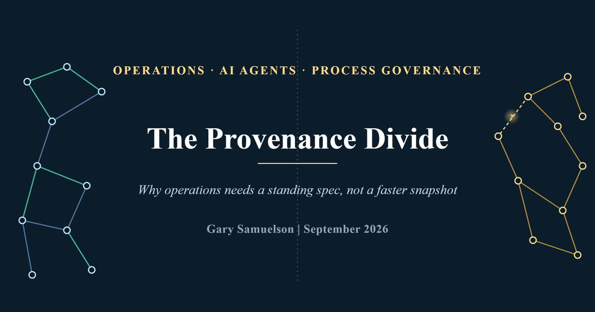
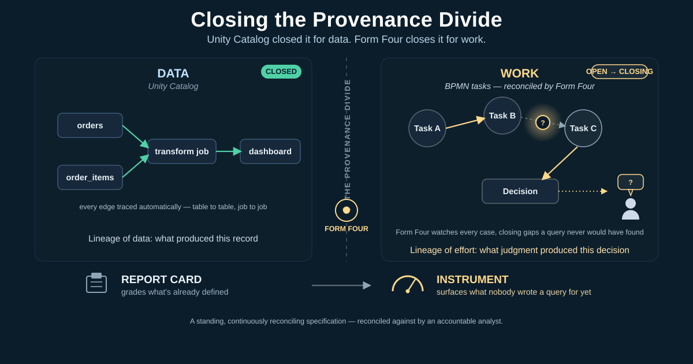
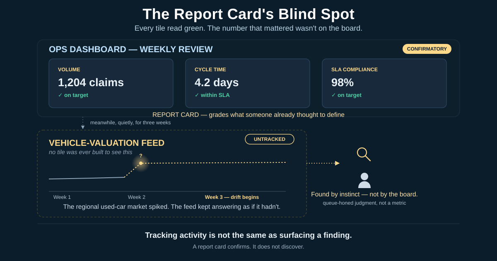
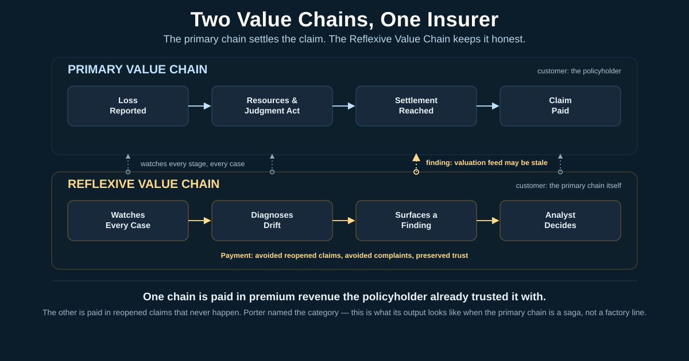
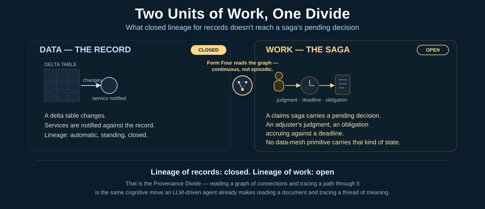
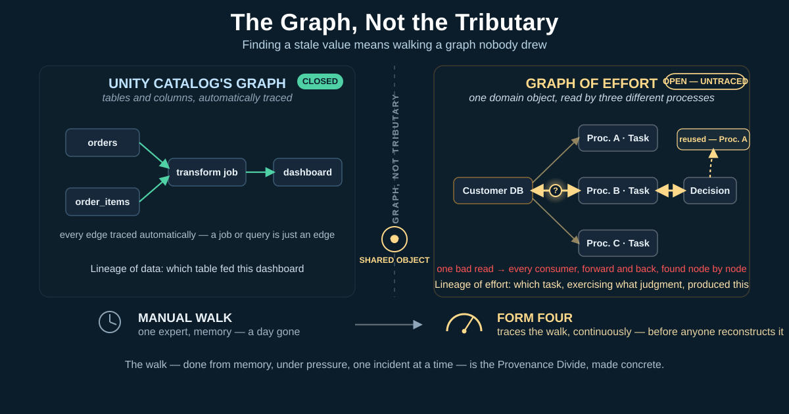
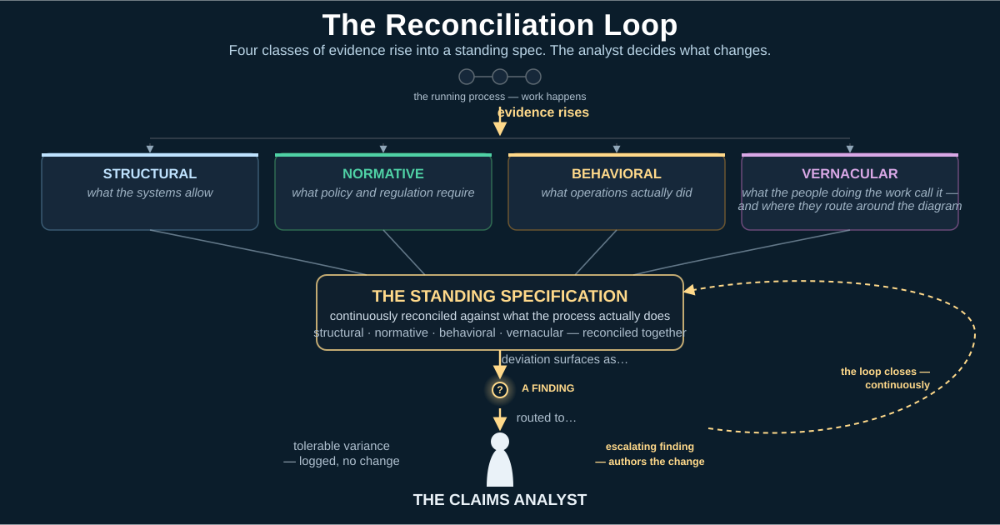
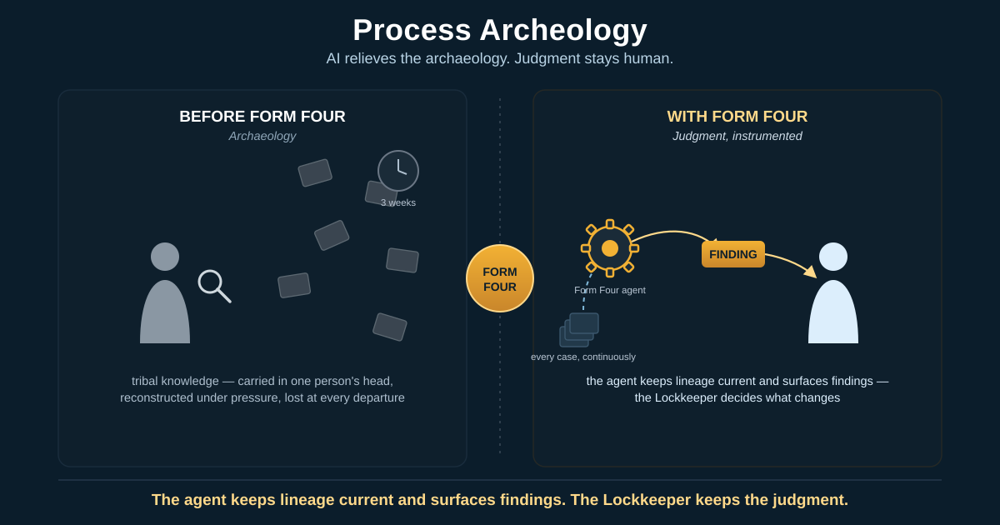
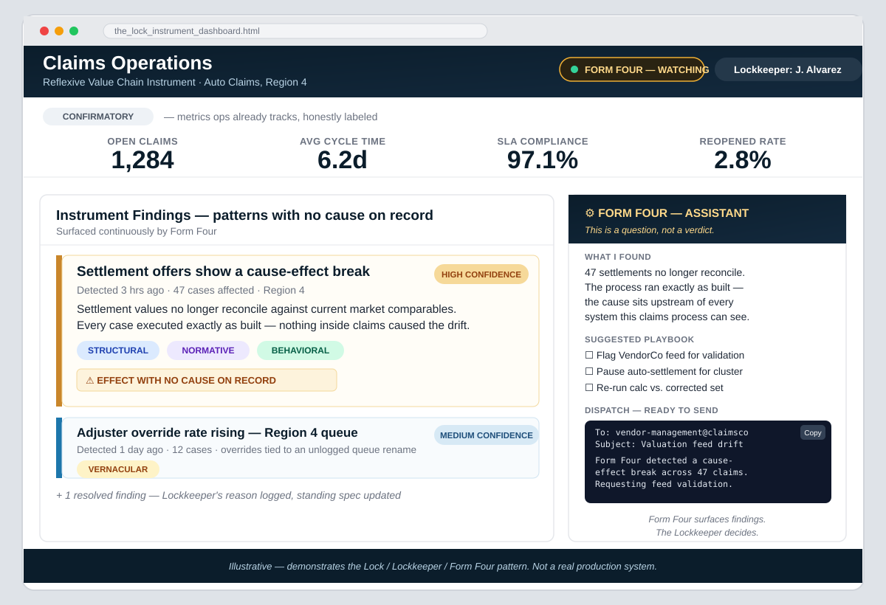

# The Provenance Divide
## Why Operations Needs a Standing Spec, Not a Faster Snapshot

**Author:** Gary Samuelson  
**Date:** September 2026  
**DOI:** [10.13140/RG.2.2.19290.91843](https://doi.org/10.13140/RG.2.2.19290.91843)

---

Data platforms have standing lineage of records — Databricks' Unity Catalog closed that gap years ago. Nobody has standing lineage of work: who committed the business to what, on what evidence, under which policy version, as a governed, continuous artifact. This paper names that gap the Provenance Divide, grounds it in a realistic, composite insurance-claims scenario, and argues what closing it actually requires — not a faster discovery sprint, but a standing, continuously reconciled specification, reconciled against by an accountable analyst.

---

### A Quick Map of the Terms

This paper coins five terms in quick succession, starting in the very next section. Each gets its full treatment built up from the scenario that follows — this is just enough to hold onto until then.

- **The Reflexive Value Chain** — the value chain operations runs in support of the primary one: not producing a settlement, but keeping the chain that produces settlements diagnosable and correct.
- **Form Four** — the AI agent that watches every running case continuously, reconciles it against a standing spec, and hands the accountable analyst a question, not a verdict.
- **The Provenance Divide** — the gap this paper names: data platforms have standing lineage of records (Unity Catalog closed this). Nobody has standing lineage of work — who committed the business to what, on what evidence — as a governed, continuous artifact. What that looks like inside an actual process gets its own walkthrough below.
- **The reconciliation loop** — the mechanism itself: evidence rising from the running process into the standing spec, deviation surfacing as a finding, the analyst deciding what changes.
- **The four evidence classes** — structural, normative, behavioral, and vernacular: the categories evidence rises in as it reconciles against the spec.

### The Answer, Up Front

Give operations a standing, continuously reconciling specification — reconciled against by an accountable analyst, and fed by an AI agent (Form Four) that watches every case for effects with no traceable cause. That closes the Provenance Divide for work the same way Unity Catalog closed it for data: a governed, queryable record of what produced what, so nobody reconstructs three weeks of drift by hand again.

That continuous reconciliation turns the operations dashboard from a report card into an instrument. The report card grades what someone already thought to define. The instrument surfaces what nobody wrote a query for yet — a pattern with no cause on record. The agent hands that pattern to a human as a question, not a verdict.

The rest of this paper builds toward that answer through one grounded scenario, then generalizes the pattern: how to find the same unscalable, informal Reflexive Value Chain quietly running in your own organization, and what closing its Provenance Divide requires.

**Figure 0 — Closing the Provenance Divide.** *Left: the lineage Unity Catalog already closed for data — every table, job, and dashboard traced automatically, a closed graph. Right: the lineage nobody has closed for work — BPMN tasks connected by judgment, not queries, with real gaps a report card was never built to notice. Form Four sits at the divide, watching every case, surfacing gaps as it finds them, and handing what it can't explain to the analyst as a question, not a verdict.*

### Naming the Failure Mode

*A composite scenario*

Three weeks after a mid-size auto insurer migrates its claims process onto a modern orchestration platform, the reopened-claims report starts carrying a pattern — present in the numbers, invisible to anything watching them. Not yet a discovery — just lurking. A vehicle-valuation feed used during settlement started returning stale prices when a regional used-car market spiked. The process ran exactly as designed — confidently, mechanically, running delusional — faithful to its build spec while blind to the world outside it. It hummed along on its own for weeks, sacrificing accuracy for the illusion of correctness. 

A senior claims-operations analyst finds it first, recognizing the shape of a familiar problem before the data proves it. The team's dashboard misses it entirely. That dashboard tracks volume and cycle time — the metrics a weekly ops review expects to see — but it never asks whether the numbers feeding a settlement decision are trustworthy. Tracking activity is not the same as surfacing a finding, and a dashboard built only for the former was never going to catch this. It was built to look backward, not to notice.

A report card grades performance against categories decided in advance — it can only measure what someone already thought to define. What the analyst supplied instead, by hand, was discovery: the intellect and queue-honed judgment to notice a pattern nobody had written a metric for yet. A report card confirms. It does not discover. Closing that gap — turning the dashboard from a report card into an instrument capable of surfacing the unanticipated — is the deeper problem the rest of this paper is built to close. 

That gap names a job for a tool, not a better dashboard. Notice what the analyst actually did: not reasoning about the feed's meaning first, but catching a pattern before the data proved anything. That is the cognitive move an AI system does well — not thinking, but finding pattern and anomaly across more cases and more history than one analyst can hold in their head, and putting what it finds in front of a person. The output is not a decision. It is actionable information: a candidate finding, handed to a person whose judgment still decides what it means. A tool built for this does not replace the analyst's discovery — it gives that discovery reach no single queue-honed instinct could sustain across every case, every week. That tool is Form Four, and what it has to be built to notice is exactly this scenario's failure mode: an effect with no cause on record. 

**Figure 1 — The Report Card's Blind Spot.** *Every tile on the ops dashboard reads green — volume on target, cycle time within SLA, compliance at 98%. None of them asks the question that mattered: is the vehicle-valuation feed still trustworthy? The feed drifted for three weeks, untracked, because no tile was ever built to see it. The analyst caught it by instinct — queue-honed judgment, not a metric — not because the board surfaced it.*

The analyst spends the better part of a day reconstructing which claims called which feed, when the prices started drifting, and which settlement offers need a second look. The migration worked. What failed is everything that was supposed to happen *after* it — and that is the failure this paper is about.

### The permanence bottleneck, named

That claims scenario is not a one-off. It is the shape of a bottleneck every AI-driven modernization runs into once the ladder ends. The AI agent demos beautifully. The modernized process ships on schedule. And then operations inherits a system that has to keep living inside a business ecosystem that never stood still during the build. A regulation gets reinterpreted. A vendor feed drifts. A work-queue nickname stops matching the diagram's vocabulary. Without a supportable way to catch that drift as it happens — not three weeks later, not at the next audit — there is no solution, only a working system quietly becoming an unsupportable one.

The industry's current playbook for modernization is a ladder: Discover, Build, Deploy. Camunda's own September 2026 account of a live European bank migration is a strong example of that ladder, executed well and fast — discovery 40% faster, first iteration 97% faster than a traditional build. That's a genuine, well-earned achievement. The ladder simply isn't built to answer a different question — what happens after the top rung — and that's the question this paper picks up.

### Two value chains, not one

Operations was already the answer — it just didn't have a name yet, or a value chain of its own to belong to. Every insurer runs a primary value chain. A loss is reported, resources and judgment act on it, and a settled, paid claim exits the far end — the value the policyholder paid premiums in advance to receive. That chain is well understood, well modeled, and squarely what the migration ladder optimizes. 

Operations runs a second value chain, quietly, in support of the first: applying its own capability, tooling, and judgment not to produce a customer-facing settlement, but to keep the chain that produces settlements diagnosable and correct. Call this the **Reflexive Value Chain** — a value chain whose deliverable is not a product a customer buys, but the continued fitness of another value chain. Its customer is the primary chain itself, and the executives who fund it. Its payment is not premium revenue; it is avoided reopened claims, avoided compliance complaints, and preserved trust in the settlement number.

Porter named the category — support activities alongside primary activities — decades ago. He did not resolve what the support chain's own output looks like when the primary chain is a long-running saga instead of a factory line. The stale-valuation-feed scenario is that output, made concrete: the Reflexive Value Chain's product, that week, was the finding that settlement offers had quietly gone wrong, and the decision about what to do next.

**Figure 2 — Two Value Chains, One Insurer.** *The primary chain (top) settles the claim — loss reported, resources and judgment act, settlement reached, claim paid — paid for in premium revenue the policyholder already trusted the insurer with. The Reflexive Value Chain (bottom) runs in parallel, watching every stage of every case, diagnosing drift, and surfacing findings — paid for in avoided reopened claims, avoided complaints, and preserved trust. The gold connector is the stale-valuation-feed scenario itself: a finding, surfacing from the reflexive chain, feeding directly back into the primary chain's settlement decision.*

### What the analyst was actually doing

Strip the drama out of the scene and the analyst was doing process lineage by hand — tracing which integration point fed which decision, on which case, and why. That is close to what Databricks' Unity Catalog does for data: a standing, queryable record of what produced what, so a stale number never has to be reconstructed from memory. Camunda's own copy reaches for the same instinct — "Continuously Improve," "a capability the business can call on again." The verbs are the honest tell: monitors, proposes, can call on. Episodic. Advisory. A faster snapshot, not a live feed.

That specific work is worth naming, because it points straight at what fits it. Tracing which integration point fed which decision, across every case, continuously, is close to intrinsic work for an LLM-driven agent — reading a graph of connections and tracing a path through it is the same cognitive move it already makes reading a document and tracing a thread of meaning through it. Form Four is that capability, aimed at judgment instead of tables — continuous instead of episodic, standing instead of on request.

The difference between what Databricks solved and what this claims process needed is the unit of work. A delta table changes and notifies services against records. A claims saga carries a human's pending decision, an adjuster's judgment, an obligation accruing against a deadline. No data-mesh primitive carries that kind of state. This is the **Provenance Divide**: data platforms have shipped standing lineage of records. Nobody has shipped standing lineage of work — who committed the business to what, on what evidence, under which policy version — as a governed, continuous artifact. The analyst reconstructing three weeks of claims by hand is the Provenance Divide, uncrossed, on a Tuesday.

**Figure 3 — Two Units of Work, One Divide.** *Left: the unit Databricks already solved — a delta table changes, services are notified against the record, lineage is automatic and standing. Right: the unit a claims saga carries — a pending decision, an adjuster's judgment, an obligation accruing against a deadline — that no data-mesh primitive was built to hold. Form Four sits in the gap between them: the same graph-tracing move an LLM already makes reading a document, aimed at judgment instead of tables.*

A naming note, since the vocabulary is adjacent: "Provenance Divide" isn't this paper borrowing the familiar data-governance distinction between lineage (what produced what) and provenance (the fuller chain of custody and context behind it). Both of those terms already describe records — the world Unity Catalog closed. The divide named here sits one level up: once the unit of work stops being a record and starts being a saga, the line is between platforms that have standing lineage at all and platforms that don't.

### The Provenance Divide, step by step

The definition above is accurate and moves too fast. Here is what it looks like inside an actual BPMN model, one step at a time.

A service task in a claims process doesn't just "call an integration." It calls into a domain object that another system owns and governs on its own terms — a customer database, an employee registry, an ERP module like PeopleSoft or Salesforce's customer and communications management. That call returns a value, and the value doesn't stop there. It gets used: a rule evaluates it, a calculation derives a new number from it, a person or a downstream service decides something on the strength of it. The result of that decision often gets written back somewhere, or shared into a collaborating process — a different orchestrated instance, run by a different team, waiting on exactly this value to proceed.

This is why "tributary" is the wrong picture, even though it's the natural one to reach for. A tributary flows one direction into a river and stays there. What actually happens is a graph. The same domain object gets read by more than one process. A derived value from one decision becomes an input to a different integration point three steps later, in a different process instance. Nothing marks these connections on the BPMN diagram — the diagram shows a service task calling an endpoint, not the lineage of every value that endpoint has ever fed or consumed.

Now put a problem somewhere in that graph — a stale value, a bad derivation, a decision made on data that has since been corrected upstream. Finding it is only the first problem. The second, harder problem is everything downstream of it: every decision, every record, every collaborating process instance that already consumed the tainted value has to be found, evaluated, and either corrected, compensated, or knowingly left alone because too much has already happened to unwind it cleanly. That is not a lookup. It is a walk, node by node, through a graph nobody drew.

This is also where Databricks' own answer runs out, on its own terms. Unity Catalog's lineage graph is real and fully automatic, but its nodes are tables and columns — a job or a query shows up only as an edge, an attribution of which run touched which asset. There is no judgment in that graph to trace, because a query doesn't exercise any. A BPMN task does. The node this paper needs isn't the domain object a task called into — it's the task itself: the judgment applied, the evidence weighed, the decision reached. That is the harder graph, and it is the one nobody has shipped.

*Composite, illustrative example — not describing a specific team, incident, or organization.* Picture the ops expert pulled into exactly this: tracing one bad value back through every system it touched, and forward through every decision it fed, for the better part of a day — while the rest of the queue keeps arriving, unattended, the whole time. The manager watching this happen has one honest question and no good answer for it: *how do I manage this?* One expert, one incident, one day gone, and nothing written down anywhere that makes the next one faster.

That walk — done from memory, under pressure, one incident at a time — is the Provenance Divide, made concrete. A standing, continuously reconciled specification doesn't remove the graph. It means the graph is already traced, node by node, before anyone needs to reconstruct it by hand. This is the graph Form Four exists to trace — not the data-asset graph Databricks already shipped, but the graph of effort: which task, exercising what judgment, on what evidence, produced this.

**Figure 4 — The Graph, Not the Tributary.** *Left: Unity Catalog's graph — tables and columns, every edge traced automatically, closed. Right: the graph nobody drew — one domain object read by three different processes, a bad read at the point marked "?" that has to be walked forward and back through every consumer it touched, including a value reused three steps later in a different process instance entirely. Bottom: what that walk costs today — one expert, tracing by memory, a day gone — against what Form Four exists to make routine: the same walk, already traced, continuously, before anyone has to reconstruct it.*

### The reconciliation loop, and who runs it

Crossing that divide needs two things: a mechanism, and someone accountable for running it. It needs a mechanism — a standing specification that stays current, continuously reconciled against what the running process actually does. Work happens; evidence of that work rises back into the spec, and it comes in four classes. **Structural** evidence is what the systems allow — the vehicle-valuation feed's own API contract, unchanged even as the answers it returned went stale. **Normative** evidence is what policy and regulation require — the settlement rules that assume that feed is trustworthy. **Behavioral** evidence is what operations actually did — the reopened-claims spike itself, sitting in the data three weeks before anyone looked. **Vernacular** evidence is what the people doing the work call it, and where they route around what the diagram doesn't show — the queue-honed judgment that caught a pattern no metric was built to see. 

A reconciliation loop without someone accountable for it is just telemetry. The claims analyst is that person: the one who reads what the loop surfaces, decides whether a deviation is tolerable variance or an escalating finding, and authors the change to the standing spec. The claims scenario had that accountability the whole time. What it didn't have was the loop — no standing spec to reconcile against, no continuous surfacing of drift, only a hunch and a day of manual reconstruction standing between the business and a quarter of bad settlement offers. 

**Figure 5 — The Reconciliation Loop.** *Work happens; evidence of that work rises into a standing specification in four classes — structural (what the systems allow), normative (what policy and regulation require), behavioral (what operations actually did), and vernacular (what the people doing the work actually call it, and where they route around the diagram). Deviation between the spec and what the process actually does surfaces as a finding, routed to the claims analyst — the one accountable for deciding whether it's tolerable variance or an escalating finding, and for authoring the change back into the spec when it is. That authored change is what closes the loop, continuously, not once at go-live.*

### Why this was out of reach until now — and why it isn't anymore

Running that reconciliation by hand, continuously, across every claim, every feed, every case, is more cognitive load than any analyst team can sustain. That is the honest reason the **Reflexive Value Chain** has stayed informal in most organizations: real, valuable, and unscalable, carried in one or two people's heads until they move on and take most of it with them.

Form Four changes that math — not by replacing the analyst's judgment, but by giving her a standing spec to reconcile against. This is not Unity Catalog reskinned for BPMN: Databricks already solved lineage for data at rest and in motion, natively and automatically. What Form Four has to solve is *lineage of effort* — not which table a task touched, but what judgment the task applied, on what evidence, and why. That is the genuine, defensible value this system has to deliver; anything less is a data-lineage product wearing a BPMN diagram. This is what "Continuously Improve" — already one of ProcessOS's own four pillars — needs to reach in practice: no model-level view can notice a stale valuation feed drifting on case 8825, because noticing that requires Form Four's reach to extend down into the running instances themselves, not stop at the models governing them. 
Systematic AI-agent application, applied continuously against the running process, can read lineage across every case, reconcile it against a standing spec, and surface findings at a volume no analyst team could sustain manually. The agent does not need to own the claims process to do this — Form Three's ceiling (the agent works inside the process, governed; it does not decide what the process becomes) stays exactly where it was, and it should. It needs to keep the lineage current and keep the findings surfacing. The analyst keeps the authority to decide what a finding means and what changes.

What makes this an instrument and not a report card is what the agent is built to notice. A report card only flags what someone already defined as out of range. The agent watches for something narrower and harder: cases where an observed effect — a settlement, a reopened claim, a compliance complaint — has no cause inside what the system can see. That break between effect and cause is the finding. It does not mean the agent has an answer; it means the process behaved consistently with its own logic while the world moved anyway, and the system's model of the world did not move with it. The stale valuation feed is exactly this shape: nothing in the claims system caused the drift, because the cause lived upstream of every system the claims process could see. An LLM-driven agent, reading lineage and statistics continuously, is built to notice precisely that shape of anomaly — a pattern with no cause on record — and hand it to the analyst as a question, not a verdict: *this doesn't reduce to any cause I have access to; worth a look.* That question, not a decision, is what reaches her.

This is the grounded version of "AI transforms operations": not an agent replacing judgment, but systematic agent application making a role that already existed — and was already producing value, informally — finally reachable at the scale the business actually runs at.

**Figure 6 — Judgment, Instrumented.** *Before Form Four, the analyst's role runs on archaeology: scattered case files, a magnifying glass, a clock counting the weeks lost reconstructing what already happened — tribal knowledge carried in one person's head, and lost at every departure. With Form Four, the agent reads lineage across every case continuously and surfaces findings — the neat stack of files feeding the gear, the gear handing off a finding — but the arrow still ends at the analyst. The agent does not decide. It relieves the archaeology so judgment can do what only judgment can do.*

The confirmatory metrics stay once this is built — ops still needs volume and cycle time — but they're honestly labeled as confirmatory now, not mistaken for coverage. Underneath them, the instrument runs: Form Four surfacing the stale-valuation-feed finding the moment it has enough evidence, the four evidence classes reconciled in place, and a ready dispatch waiting on the analyst's decision, not making it for her.

**Figure 7 — The Instrument, in Practice.** *A logical mockup, not a screenshot: the report card (confirmatory KPIs, honestly labeled) sits above the instrument (Form Four's findings, evidence classes reconciled, a pattern flagged with no cause on record). The advisor panel drafts a dispatch; the analyst still decides.*

### Where this connects to the open research problem

That dispatch-not-verdict distinction is not incidental — it is the exact shape of capability the wider research conversation is still missing. The Agentic BPM Manifesto (arXiv:2603.18916) names four capabilities agents need to be first-class process actors, and singles out **self-modification within governed limits** as one of them. Governed limits require something to be governed *against*. A standing, evidence-linked spec — kept current by the reconciliation loop, reconciled against by an accountable process owner — is exactly that surface. This is the paper's connecting claim: the integration layer the Manifesto asks for and cannot yet build is not a new protocol. It is the standing spec plus the reconciliation loop, with a human process owner as its first decision-maker and a governed agent as its eventual second.

### Why insurance keeps this grounded

The claims example is deliberately unglamorous: a stale price feed, a spike in reopened claims, a day of manual reconstruction. It needs no imagined future agent architecture — it is empirical proof that the Reflexive Value Chain is already running, informally, in ops teams today. The gap this paper names is not a hypothetical integration-layer problem invented for a research manifesto. It is a Tuesday.

---

## Appendix A — Prior Art & Positioning

*The section a skeptical reviewer reads first. The claim — "the deployed thing reporting back into the spec continuously, the spec governing what the deployed thing may become" — has real intellectual lineage. The pieces exist in print; the assembled claim does not. That is what makes it paper-worthy rather than a restatement.*

### What is already written (and who owns it)

**1. "The deployed thing reporting back continuously" — this half exists and is citable.**

- **Van der Aalst's process-mining canon** defines *conformance checking*: replaying event logs against a normative model to detect deviation. That is the deployed thing reporting into the spec, academically formalized — but framed as *analysis*, run episodically by analysts, not as a standing governance surface. And it is behavioral evidence only — one tributary of the four.
- **Camunda's own ProcessOS copy**: "Continuously Improve — monitors KPIs using a fitness function; proposes refinements," and the Aug 18 post's "discovery as a capability the business can call on again." The vendor is *gesturing* at the loop. Note the verbs: monitors, proposes, can call on. Episodic, advisory — bucket logic with a faster refill cycle.
- **Control theory / systems thinking** (Morecroft, *Strategic Modelling and Business Dynamics*; the Deming PDCA lineage): closed feedback loops as management doctrine. Old, respectable, and not operationalized for process *specifications*.
- **"Report card vs. instrument" has a name, borrowed from statistics.** John Tukey's distinction between *confirmatory* and *exploratory* data analysis (*Exploratory Data Analysis*, 1977) is the closest formal ancestor of the report-card/instrument split this paper uses. Confirmatory analysis grades data against categories and hypotheses decided in advance — a report card. Exploratory analysis is built to surface patterns nobody thought to define a metric for. Operations dashboards, almost without exception, are built confirmatory: KPIs fixed at design time, graded against forever after. Nobody has carried Tukey's distinction into what a *continuously reconciling* process specification would need to be — exploratory-capable, surfacing the finding nobody wrote a query for.

**2. "The spec governing what the deployed thing may become" — this half is the open frontier.**

- This is exactly the Manifesto's **self-modification within governed limits** — and the Manifesto explicitly says it *cannot yet be realized*, naming the integration layer as the open problem. Nobody has published the mechanism.
- The closest shipped analog is **fitness functions** (Ford/Parsons, *Building Evolutionary Architectures* — an O'Reilly staple): automated checks that govern what a deployed system may become as it evolves. But that is software architecture, not business-process governance, and nobody has ported it to lineage-of-work.

### What is not written anywhere

Nobody has assembled: **continuous reconciliation as the mechanism + the standing evidence-linked spec as the surface + self-modification as the customer.**

| Community | What they own | What they lack |
|---|---|---|
| Process mining (van der Aalst lineage) | The mechanism: conformance checking, deviation detection | The governance surface — analysis, not standing authority |
| The APM Manifesto (Calvanese et al.) | The requirement: self-modification within governed limits | The mechanism — named as the open problem |
| The vendor (Camunda / ProcessOS) | The tooling: discovery speed, fitness functions, MCP wiring | The discipline — episodic gestures, not the loop |
| Evolutionary architecture (Ford/Parsons) | The governing-may-become pattern: fitness functions | Business-process provenance — software, not sagas |
| Confirmatory/exploratory statistics (Tukey) | The distinction itself: grading the anticipated vs. discovering the unanticipated | Never mapped onto operational dashboards or standing process specs — a statistical framing, not an operations one |

The sentence that lands it:

> *Conformance checking asked whether the deployed thing matched the spec at a point in time. The continuous Reverse Spec asks the harder question the Manifesto made unavoidable: what the deployed thing may become next — and who decides.*

### Appendix A.1 — Effort-Lineage vs. Object-Lineage: the closer, but still short, prior art

*This is the prior art specific to the Provenance Divide itself (Figure 0) — the "lineage of effort vs. lineage of data" distinction — as opposed to the continuous-reconciliation claim above. Two threads get closer than anything already cited, and one correction matters for citing them accurately.*

**Process mining's event log is an occurrence record, not a judgment record.**

- Van der Aalst's event log (*Process Mining*, Ch. 4) records case ID, activity, timestamp, resource, cost, data — process mining's existing best answer to "an effort happened, attributed to someone." That is an occurrence record, not a judgment record.
- **Organizational perspective** (Ch. 8): handover-of-work, working-together, and subcontracting metrics derive a "social network of work relationships" from the log. This is process mining's own closest attempt at effort-lineage — and it is telling that it is statistical and after-the-fact, not a standing artifact.
- **Decision perspective** (Ch. 8): decision-tree mining infers the rule applied at an XOR split from the data present at that moment. It works for clean, structured decisions, but it cannot recover the reasoning behind a genuinely qualitative call — exactly this paper's **vernacular evidence** category.

**The "graph, not tributary" instinct is real, decade-old, and still unshipped — correctly cited across two sections of one document, not one.**

- The 2012 *Process Mining Manifesto* names the object-centric/process-centric problem generally in **Challenge C1** ("Finding, Merging, and Cleaning Event Data"): "Event data are often 'object centric' rather than 'process centric.' For example, individual products, pallets, and containers may have RFID tags and recorded events refer to these tags. However, to monitor a particular customer order such object-centric events need to be merged and preprocessed."
- The near-exact orders/order-lines/deliveries example — "One customer order may result in multiple deliveries. One delivery may refer to order lines of multiple orders. Hence, there is a many-to-many relationship between orders and deliveries and a one-to-many relationship between orders and order lines." — lives in **Section 3.2, Guiding Principle GP2** ("Log Extraction Should Be Driven by Questions"), not C1. Cite them separately: C1 names the object-centric/process-centric problem generally; GP2 supplies the near-identical orders/order-lines/deliveries example, in service of a related but distinct point about case-type selection being a non-trivial, question-driven choice.
- Either way, the correction doesn't weaken the claim — it sharpens it: the field admitted, over a decade ago and across two sections of the same manifesto, that a single linear case trace breaks down once multiple correlated objects are involved, and never shipped a governed, continuous answer.

**W3C PROV-O already owns the formal graph grammar — but not the domain semantics.**

- Entity, Activity, and Agent are PROV-O's three core classes; *used*, *wasGeneratedBy*, *wasDerivedFrom*, and *wasAssociatedWith* are real, correctly-named PROV-O properties. An activity *uses* and *generates* entities, entities chain together via derivation, and agents carry responsibility via association — a genuine, formal, graph-structured provenance ontology, a W3C Recommendation since 2013, over a decade before this paper's argument.
- The gap is real and citable: PROV was built for general data/document provenance, not saga-scale business-process work. It has no native concept of a pending obligation, an approver's deadline, or a policy version governing a decision. PROV gives the graph grammar; it doesn't give the domain semantics — Work Record commitment, evidence classes, governed self-modification — this paper argues nobody has assembled yet.

| Community | What they own | What they lack |
|---|---|---|
| Process mining (organizational + decision perspectives) | Statistical effort attribution (handover-of-work networks) and structured-decision-rule mining at XOR splits | After-the-fact and statistical, not a standing artifact; cannot recover the reasoning behind a qualitative call |
| Process Mining Manifesto (Challenge C1 + Guiding Principle GP2) | Naming of the object-centric/multi-object correlation problem, with a concrete orders/order-lines/deliveries example | No mechanism — flagged as an open framing problem in 2012, still unsolved |
| W3C PROV-O | A formal graph grammar: Entity/Activity/Agent nodes, *used*/*wasGeneratedBy*/*wasDerivedFrom*/*wasAssociatedWith* edges | No domain semantics — no obligations, deadlines, policy versions, or captured judgment |

**Where this paper pushes past all three:** even a fully-built object-centric graph — process mining's organizational network, GP2's multi-object correlation, or a complete PROV-O instance — only proves what an activity *touched*. None of it captures *why* — the judgment inside the task. That is the harder, unshipped layer, and it is exactly what Form Four has to surface to close the Provenance Divide as effort-lineage rather than object-lineage.

### Drafting risk

The risk is the opposite of "someone already said this." Five communities each own a piece, and each will read the paper as incomplete in their direction. The citations are the defense: every seam must be credited before the join is claimed. The originality is in the assembly, not the parts.

---

## Appendix B — What Databricks Solved, and What It Proves Is Missing Here

*The comparison that names the gap precisely. Note: this section predates the paper's shift away from canal/river imagery elsewhere in the body (see "A faster snapshot, not a live feed") and still runs on the original bucket/river metaphor — preserved here as working-notes material rather than retrofitted.*

The operations-continuity problem under discussion is not new. The data platform world spent a decade on the same failure pattern — pipelines built by hand, schemas drifting, nobody able to say where a number in a dashboard actually came from — and Databricks answered it with a specific architectural move: **Unity Catalog** stitching lineage, pipeline management, and provenance into one governance fabric. The lineage is not a document produced at build time. It is a standing, queryable, continuously-updated record of what produced what. That is what "solved" looks like: reconciliation is native to the platform, not a phase someone schedules.

But the Databricks answer solves the problem for a different unit of work, and the difference is the whole point:

| | Databricks / lakehouse | BPMN / Camunda |
|---|---|---|
| Unit of work | Record, record set, table version | Long-running saga — one case, alive for days or months |
| What services engage | Delta tables: data at set, collection, and record level | The work: obligations, handoffs, decisions, deadlines |
| Trigger model | Data-event: a change in the delta table notifies and triggers downstream services | Token-event: the process token advances through modeled states, engaging people and services as the work demands |
| Architecture pattern | Data mesh — domains own data products, the catalog stitches them | Process orchestration — the Work Record carries commitment state across the business systems layer |
| Reconciliation surface | Lineage of data: what produced this record | Lineage of work: what produced this decision, this state, this obligation |

The delta table is the right mental model for what the Reverse Spec must become: a living surface that services engage *continuously*, at multiple granularities, with change propagation built in. Databricks did not solve lineage by running discovery once at pipeline build time. The catalog watches the pipelines run.

**Verified detail worth being precise about.** Unity Catalog's lineage graph is built from data assets as nodes — tables, columns, ML models, dashboards — captured automatically by observing query and pipeline execution. A job or notebook appears only as an edge: an attribution of which run produced or consumed a given asset, not a modeled unit of effort carrying its own evidence and judgment. Per Databricks' own documentation: *"Unity Catalog captures lineage automatically for queries run on Databricks, down to the column level."* That is the precise shape of the gap the Reverse Spec targets differently: the node isn't the data a task happened to touch, it's the task's own act of judgment.

But the analogy also exposes why the BPM problem is harder, not just different. A delta-table change triggers services against records. A business process is a saga aligned to **people and services engaging work** — the state that matters includes a human's obligation, an approver's pending decision, a deadline accruing penalties while it waits. Provenance in this world is not "which job wrote which table." It is "who committed the business to what, on what evidence, under which version of which policy." No data-mesh primitive carries that.

**What this proves about the vendor story.** Camunda's September 3 migration post is discovery and build speed — the bucket, filled faster. The tell is in what the story stops at: the process is *built*, deployed, running on the new platform — and then the article pivots to "migration is the first step, not the end state" and future re-engineering conversations. The bridge from the built thing into the deployed thing — from the reconstructed model into a living interaction with the business ecosystem and its systems layer — is where the story goes quiet. If the vendor's discovery actually drew from the dynamic business ecosystem rather than dipping a sample from it, the natural structure of the story would be the loop, not the ladder: the deployed thing reporting back into the spec continuously, the spec governing what the deployed thing may become. A ladder ends at deployment. A river keeps moving after you dip the bucket.

**The synthesis the paper can own.** The industry now has two halves of one architecture:

1. Databricks-style continuous lineage — proven that standing, queryable, native reconciliation is buildable and sellable — but only for data-event pipelines over record sets.
2. Camunda-style governed execution — the Work Record, the token, the auditable saga — but with reconciliation still treated as an episodic phase (discover → build → someday redesign).

The Reverse Spec, run continuously, is the missing third thing: **lineage of work** — the Unity Catalog move applied to sagas instead of record sets. The standing evidence-linked spec is its catalog. The reconciliation loop is its watcher. The process owner is its steward. And the Manifesto's self-modification capability is its first real customer: the agent that adapts within governed limits is exactly the agent whose every adaptation must reconcile against the standing spec. That is the sentence the paper builds toward.

---

## References

- Van der Aalst, W.M.P. *Process Mining: Discovery, Conformance and Enhancement of Business Processes*. Springer, 2011, Ch. 4 (event logs), Ch. 8 (organizational and decision-mining perspectives). — Source of conformance checking, the organizational handover-of-work network, and decision-tree mining at XOR splits.
- IEEE Task Force on Process Mining. "Process Mining Manifesto." 2012, Challenge C1 ("Finding, Merging, and Cleaning Event Data") and Guiding Principle GP2 ("Log Extraction Should Be Driven by Questions"). — Names the object-centric-vs-process-centric correlation problem and supplies the orders/order-lines/deliveries example this paper's Provenance Divide figures build on.
- Tukey, J.W. *Exploratory Data Analysis*. Addison-Wesley, 1977. — Source of the confirmatory-vs-exploratory distinction behind this paper's "report card vs. instrument" argument.
- Ford, N., Parsons, R., & Kua, P. *Building Evolutionary Architectures*. O'Reilly, 2017. — Source of the fitness-function pattern cited as the closest shipped analog to governed self-modification.
- W3C. "PROV-O: The PROV Ontology." W3C Recommendation, 2013. — Formal graph grammar (Entity, Activity, Agent; *used*, *wasGeneratedBy*, *wasDerivedFrom*, *wasAssociatedWith*) cited as prior art for effort-lineage's graph structure, lacking business-process domain semantics.
- Porter, M.E. *Competitive Advantage: Creating and Sustaining Superior Performance*. Free Press, 1985. — Source of the primary-activities/support-activities value-chain distinction this paper extends into the Reflexive Value Chain.
- Databricks. "Data Lineage with Unity Catalog." Databricks documentation, accessed 2026. — Source of the verified detail that Unity Catalog's lineage graph is built from data assets as nodes, captured automatically down to the column level.
- Dumas, M., La Rosa, M., Mendling, J., & Reijers, H.A. *Fundamentals of Business Process Management*, 3rd Ed. Springer, 2023. — BPM lifecycle and process redesign methodology referenced throughout.
- Calvanese, D., et al. "Agentic Business Process Management: A Research Manifesto." arXiv:2603.18916, March 2026. — Names framed autonomy, explainability, conversational actionability, and self-modification within governed limits as the four capabilities agents need to be first-class process actors; names the integration layer as the open engineering problem this paper's Reverse Spec argues answers.
- Koerber, B. "Three Ways Camunda Speaks MCP (And Why the Direction Matters)." Camunda blog, Aug 18, 2026. — Source of the three MCP integration patterns (client, server, process-as-tool) cited as closing invocation and observability but not governed self-modification.
- Stawowski, L-S. "From Legacy BPM Migration to a Foundation for Continuous Re-engineering." Camunda blog, Sept 3, 2026. — Source of the live European bank migration figures (discovery 40% faster, first iteration 97% faster) cited as the vendor's ladder story this paper argues stops short of a loop.
- Samuelson, G. "Process-First AI: The Work Record, Four Forms, Three Dimensions." garysamuelson.github.io, 2026. — Defines Form Four as the model-governance layer above running process instances, and the Form Three ceiling this paper holds fixed.
- Samuelson, G. "Domain Objects Before Process Models." garysamuelson.github.io, 2026. — Defines the four evidence classes (structural, normative, behavioral, vernacular) and the state-landing test used throughout this paper.
- Samuelson, G. "From Request to Record." garysamuelson.github.io, 2026. — Explains the Process Application and Work Record architecture that the continuous Reverse Spec promotes.

---
*© 2026 Gary Samuelson | CC BY-NC-ND 4.0 — Share freely with attribution. No commercial use. No derivatives without permission.*
