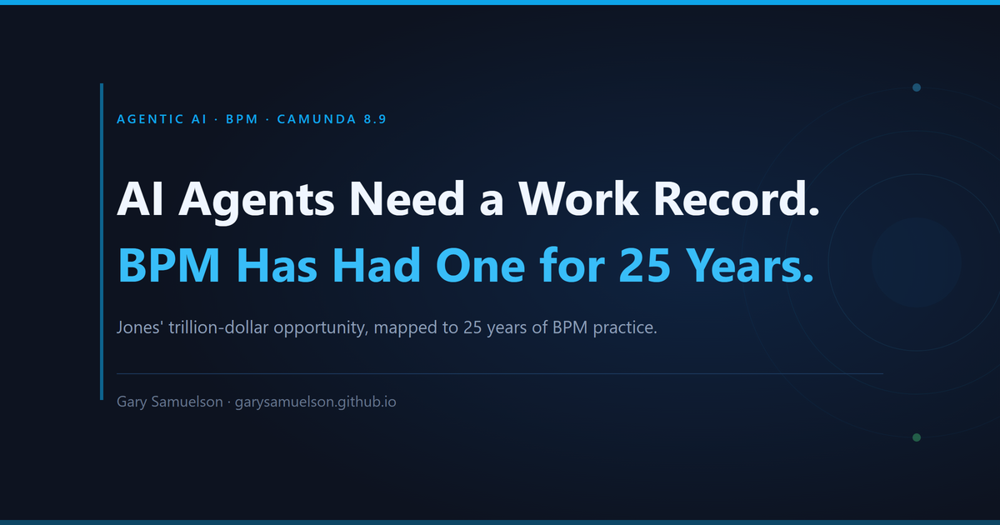
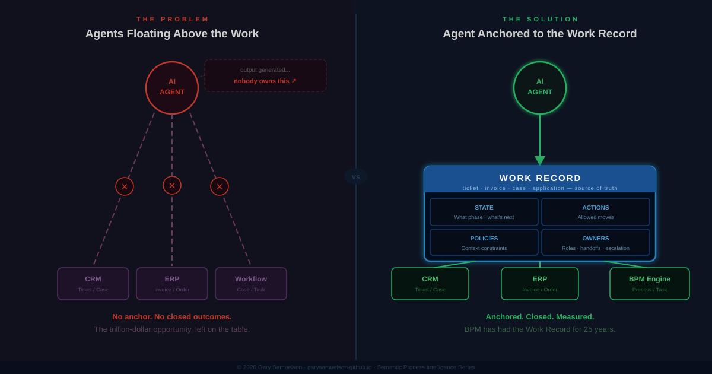
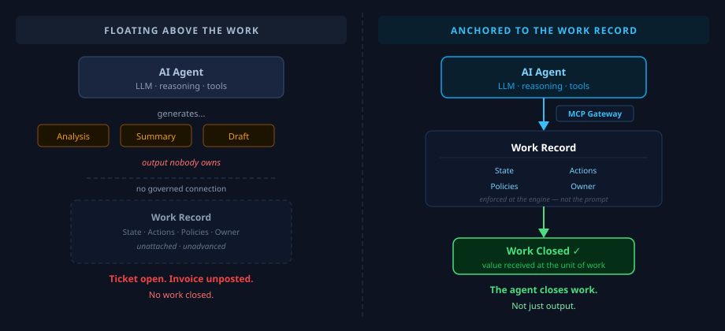
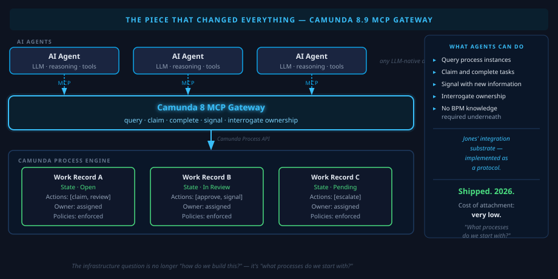
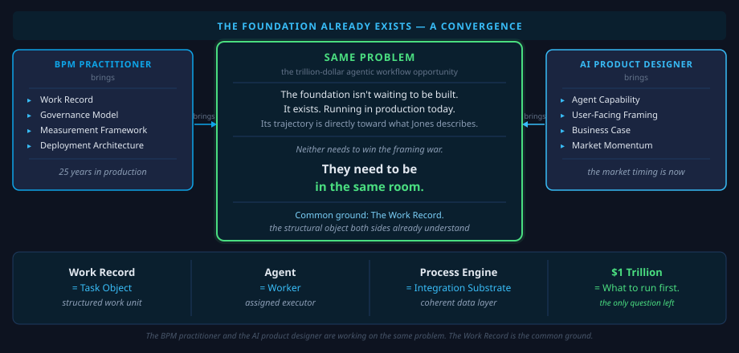

# AI Agents Need a Work Record. BPM Has Had One for 25 Years.

**Author:** Gary Samuelson  
**Date:** May 16, 2026  
**Status:** Published — May 16, 2026

---

Business Process Management (BPM) and the emerging discipline of agentic AI workflow design are converging on the same architectural truth from different directions. Nate B. Jones' 2026 "Trillion-Dollar Agentic Workflow" framework identifies four infrastructure requirements for realizing value from AI agents in enterprise settings — Work Record, Actions, Policies, and Owners. BPM's twenty-five-year body of practice has already formalized each of these primitives, and the field is actively evolving — through agentic BPM, object-centric process mining (OCEL 2.0), and protocol-native process orchestration (MCP Gateway, Camunda 8.x) — to place exactly the infrastructure Jones describes beneath the agentic capability layer. The argument is not that BPM anticipated the AI moment and deserves credit; it is that practitioners who wish to capture the agentic workflow opportunity do not need to build from scratch. The foundation exists. What the field now offers is a clear map from that foundation to the trillion-dollar outcome: the Work Record is the BPM task object [7, 8], Actions are task-palette and service-task semantics, Policies are semantic rule and compliance layers, and Owners are the role-assignment and escalation governance already embedded in every mature process engine. The accelerating path from Jones' framing to measurable agentic value runs directly through modern BPM practice — and that path is already open.

---

Nate B. Jones recently published "The Trillion Dollar Agentic Workflow Opportunity,"
and he named something plainly that most AI deployment writing glosses over:
**the reason AI agents fail to deliver business value isn't the model. It's that
agents are floating above the work instead of being anchored to it.**

The Work Record — the canonical object every enterprise workflow already has:
the ticket, the invoice, the case, the application. That object
carries the state of the work, the rules
about what can happen next, the constraints that apply in the current context,
and the people relationships that govern who handles it and who it goes to when
something can't be resolved. When an agent is bound to that object, it can close
real work. When it's not, it produces output nobody owns.

He calls this the trillion-dollar opportunity: the value sitting in enterprise
workflows that agents could capture — *if* they were properly anchored.

Properly anchored means the agent knows *what unit of work it is acting on*.

Not just a prompt. A discrete, trackable piece of work that moves through your
organization and eventually delivers something of value — or fails to. Think about
a lemonade stand. Lemons are bought, squeezed, mixed, poured — a lot of activity.
But the value lands in a specific moment: the customer takes the cup on a hot
afternoon and hands over 50 cents. That exchange is the unit of work closing. The
customer got what they paid for. The stand owner earned the revenue. Everything
before it was process. That moment *is* the value.

Enterprise work is the same. A support ticket closes when the customer's problem
is solved and the SLA is met. An invoice posts when cash moves. A loan application
ends when a borrower walks out funded — or doesn't. An employee is onboarded and
becomes productive. These are the moments your organization experiences value:
revenue recognized, a customer retained, a risk mitigated, a regulation satisfied.
Value is received at the unit of work — nowhere else in the chain.

The **Work Record** is the structured container for one of those moments. It
carries the identity of this specific unit of work — this ticket, this invoice,
this application. It tracks current state and the full history of transitions. It
specifies what actions are valid right now. It enforces the policies that apply at
this stage. And it names the owner — the person, role, or agent accountable for
advancing it to completion [7, 8].

## Why This Matters: Sit Closer to the Business Object

Jones' thesis reduces to a single practitioner-level instruction: **sit closer
to the business object.** Generic AI capability — the LLM, the reasoning loop,
the agent framework — becomes valuable only at the moment it attaches to a
specific business object and the actions defined on it. Reasoning power in the
abstract does not close work. Proximity to the Work Record does. The failure
mode is the inverse: agents that float above the work object, producing
analysis, drafts, summaries, and recommendations without ever being bound to a
record that has a state, a set of allowed moves, and a named owner. They feel
powerful. They produce nothing closed. A support ticket gets a beautifully
written response and stays open. An invoice gets analyzed and never posts.

The infrastructure that lets an AI-enabled agent sit *on* the work object — not
above it — already exists, in production, today. BPM gives us the practice and
methodology. BPMN gives us the modeling language. A BPM runtime (Camunda 8)
gives us the live process instance — the Work Record — with its state machine,
its task palette, its policy enforcement, and its owner assignments [7, 8].
The piece that completes the loop is the adapter that lets an AI-enabled agent
see and act on that record through the same governed interface a human would:
the Model Context Protocol (MCP). Camunda 8.9's MCP Gateway is exactly that
adapter, and it shipped. The path from Jones' thesis to a deployed agent that
closes work — not just generates output — is no longer a research project. It
is configuration work on a runtime that thousands of organizations are already
operating. For the full pattern — agent as worker, task schema, measured output
— see the companion piece
[*The Working AI: Put to Task with Measured Output*](https://garysamuelson.github.io/agentic/working-ai-put-to-task/).

Anchored to that record, the agent also knows *what it is allowed to do next* —
not everything it is capable of, but the specific moves that are valid given where
this work object stands right now. It operates within *constraints that reflect the
real world* — approval thresholds, regulatory requirements, escalation rules — not
rules embedded in a prompt that nobody can audit or version. And there is a clear
*owner* at every moment — a role, a person, or another agent who holds
accountability and knows what to do when something can't be resolved.

Without all of that, an agent can generate output indefinitely. The trouble is
that output isn't the same as work. A support ticket answered but not closed, an
invoice processed but not posted, a loan application reviewed but not advanced —
these are outputs. They are not closed work. The difference between the two is
exactly what Jones is pointing at, and it is exactly what a properly structured
Work Record enforces.

---

## Testing Jones' Thesis: What Leading AI Platforms Actually Do

Jones' claim is precise: AI agents fail to deliver enterprise value not because the
models are weak, but because agents are floating above the work — unbound from the
structured, stateful, policy-governed work objects that enterprise workflows require.

That is a falsifiable claim. We can check it against the platforms teams are
actually deploying today.

A survey of the leading AI agent frameworks reveals a consistent structural finding:
every one of them solves the agent *coordination* problem. None of them solves the
*work object* problem.

**LangGraph** coordinates agents as nodes in a directed graph, passing a
developer-defined `State` dictionary between nodes. Checkpointing persists state
across interruptions. The state dict contains whatever the developer puts in it —
no inherent business-domain object, no typed lifecycle, no policy enforcement. What
carries between agents is data. What does not carry is domain governance.

**AutoGen** (Microsoft) organizes agents into teams coordinated through shared
conversation history. The most sophisticated pattern — `SelectorGroupChat` — uses
an LLM to select the next speaker based on the accumulated chat transcript. Work is
considered complete when an agent produces the text "TERMINATE" — or the message
count hits a configured limit. No process instance. No state machine. No owned record.

**OpenAI Agents SDK** routes work through handoffs — a triage agent delegates to
specialist agents that execute tools. State is the context window. Tracing is added
as observability tooling after the fact. No persistent work object carries between
interactions.

**Amazon Bedrock Agents** uses an orchestrator that breaks tasks into subtasks and
calls action groups in sequence. Multi-agent patterns follow a supervisor model —
one agent delegates to another as a sub-agent. State is per-session; the trace log
is the audit record. No formal state machine at the business domain level.

**Temporal** is the most architecturally rigorous of the group. Its `Workflow
Execution` is a durable, long-running unit of work, replayed from an `Event
History` log for fault tolerance. Explicit state machines are coded directly in
workflow code. Temporal can run for months and provides a full event record. It
solves the durable execution problem exactly — and solves it well. But it has no
business-domain modeling layer. No BPMN. Policy enforcement lives in workflow code.
Owner tracking is not a first-class concept.

**Microsoft Semantic Kernel Process Framework** is the most revealing case.
Microsoft's team independently introduced `Process`, `Step`, and event-driven
transitions — and drew their examples from BPM-canonical scenarios: account
opening, food delivery, support ticket resolution. The vocabulary is BPM
vocabulary. The structure is BPM structure. The framework is marked *experimental*
as of 2024. What is notable is not just what it gets right — it is that Microsoft's
own AI team, working independently, arrived at a BPM-shaped solution to the same
problem Jones describes. They did not cite BPM literature. They reinvented it.

### What None of Them Have

Across all six frameworks, the same four capabilities are absent:

1. **A business-domain work object** — a typed record representing the actual unit
   of enterprise work (loan application #48291, invoice #PO-9912), not a
   developer-defined state dictionary
2. **A lifecycle state machine in business terms** — not code states, but
   *Application Under Review → Conditions Issued → Approved*, with transitions
   that carry business meaning and regulatory significance
3. **Policy enforcement at the architecture level** — approval thresholds,
   compliance constraints, and escalation rules enforced by the state machine,
   not embedded in prompts and not auditable
4. **Formal owner tracking** — who holds accountability now, who it transfers to,
   with timestamped handoff records that satisfy examination requirements

These frameworks coordinate agents effectively — for information tasks, for
question-answering, for document processing and retrieval. For *enterprise work* —
the kind of work Jones is describing, the kind that produces the trillion dollars —
you need all four.

Jones is right. The gap he describes is real, structurally consistent across every
major AI platform, and it is not a roadmap item. It is a design choice these
frameworks have not made, because they are solving a different problem: agent
coordination, not governed work closure.

**BPM + Camunda 8 + MCP Gateway is what fills that gap — today, in production.**

---

## The Piece That Just Changed Everything

There's one development in 2026 that makes all of this more immediately actionable
than it's ever been: **the MCP Gateway in Camunda 8.9**.

The Model Context Protocol is the emerging standard for how AI agents interact with
tools. It's the layer that lets an agent say "I need to check the state of a work
object, claim a task, and return a result" — in a protocol that the agent already
knows how to use.

Camunda's MCP Gateway exposes the full process engine API surface to AI agents as
a structured tool set. An agent with access to the MCP Gateway can query process
instances, claim and complete tasks, signal the process with new information, and
interrogate the ownership model — all without knowing anything about the BPM
architecture underneath.

This is Jones' integration substrate — *the coherent data layer that agents can
walk across the top of* — implemented as a protocol. And it shipped this year.

The cost of attaching an AI agent to a BPM-managed work record is now very low.
The infrastructure question isn't "how do we build this?" It's "what processes do
we start with?"

---

## Where BPM Is Going From Here

BPM hasn't been sitting on the shelf waiting for AI to show up. It's here, it's
active, and it's already engaging AI technology — in exactly the direction Jones'
framework points.

**Agentic BPM** is the active research frontier. The 2023 Agentic BPM Manifesto
(Dumas et al.) laid out the research agenda for AI-augmented process management
systems — governance, transparency, auditability, and the formal treatment of
autonomous agents as first-class workers in a process. That research agenda is now
producing tooling.

**Object-Centric Process Mining (OCEL 2.0)** is the measurement foundation Jones'
framework needs but doesn't yet have. When van der Aalst's team formalized the
OCEL 2.0 standard, they defined a data structure that is, essentially, Jones' Work
Record — object ID, type, attributes, event sequence, and object relationships —
expressed as a format that process mining tools can analyze at scale. Organizations
adopting OCEL 2.0 can answer, empirically, whether their agents are closing work —
not by anecdote, but by conformance analysis against the actual event log.

**Semantic process annotation** (the work of Rebmann, van der Aa, and others) is
the research program that connects process events to formal domain ontologies —
making it possible for agents to reason about the *meaning* of what's in the work
record, not just the data. This is what transforms BPM from a coordination
infrastructure into a reasoning substrate.

Each of these is an active, funded, publishing research area. The field is in motion.

---

## The Foundation Already Exists

Jones named the opportunity clearly, and the market response has been strong because
he's right: the trillion dollars in agentic workflow value depends on infrastructure
that most AI deployments skip.

What I'd add — as someone who has spent years at the intersection of BPM, semantic
AI, and process intelligence — is that the infrastructure isn't waiting to be built.
It exists, it's running in production organizations today, and its trajectory is
directly toward the capability Jones is describing.

The BPM practitioner and the AI product designer are now working on the same
problem. The BPM practitioner is bringing the work record, the governance model,
the measurement framework, and the deployment architecture. The AI product designer
is bringing the agent capability, the user-facing framing, and the business case.

Neither of them needs to win the framing war. They need to be in the same room.

The work record is the task object. The agent is the worker. The process engine is
the integration substrate. The trillion dollars is in figuring out what to run first.

---

## Appendix: What Is a Work Record? The BPM Definition

The term "Work Record" comes from Nate B. Jones' 2026 framing, but the concept has
formal antecedents in BPM theory that are worth naming precisely — because the
precision matters when you're building production systems.

### The Academic Definition

In BPM literature, the Work Record corresponds to what practitioners call a
**process instance** — or, in case management theory, a **case**. Weske's standard
reference text defines a process instance as "the execution of a process for a
specific set of input data": a discrete, named occurrence of a process, carrying
its own data state, lifecycle, and audit trail, distinct from every other occurrence
of the same process [1].

Dumas et al., in the leading graduate-level BPM text, define the analogous concept
as a **case**: a specific occurrence of a business process characterized by its case
ID, its current state, the data it carries, and the events that have affected it.
The case is the unit of work management. Everything else — tasks, gateways,
policies, assignments — operates in service of advancing the case to a defined
completion state [2].

The BPMN 2.0 specification (OMG, 2013) formalizes this as a process instance with
a defined lifecycle: instantiation, active execution, suspension, and termination
(complete or error). Each instance carries typed process variables — the data
bundle representing the real-world work object — and a full execution history
maintained by the BPM engine at runtime [3].

Ruecker, in the practitioner-facing counterpart to these academic texts,
describes the workflow engine's foundational capability as maintaining "all
running process instances, including their current state and historical audit
data" [7]. The vocabulary is different from Jones; the structure is identical.
Every process instance in a running BPM engine is a Work Record — uniquely
identified, stateful, action-constrained, policy-bearing, and owned. Ruecker's
more recent treatment with Strauch (2025) extends this into the AI-augmented
orchestration layer, where agents operate as task executors within the same
process instance structure [8].

### The Data Structure Underneath

In object-centric process mining, van der Aalst's team formalized the **Work Record**
concept as the OCEL 2.0 standard (2023). An OCEL object carries: an object ID
(the unique identifier of the real-world entity), an object type (the category of
work object), typed object attributes (the data bundle), an ordered event sequence
(the full timestamped history), and object relationships (connections to other
entities involved in the same process) [4].

This is precisely what Jones means by Work Record. The concept is not new. The
formal specification of it at a precision level that process mining engines can
analyze at scale is what OCEL 2.0 delivered.

### Key Citations

[1] Weske, M. (2019). *Business Process Management: Concepts, Languages,
Architectures* (3rd ed.). Springer. §4.2 — Process instance lifecycle and data
model.

[2] Dumas, M., La Rosa, M., Mendling, J., & Reijers, H. A. (2023). *Fundamentals
of Business Process Management* (3rd ed.). Springer. §1.2 — Case and process
instance definitions; §6.3 — Case management and adaptive processes.

[3] Object Management Group. (2013). *Business Process Model and Notation (BPMN)
Version 2.0.2*. OMG Standard. https://www.omg.org/spec/BPMN/2.0.2/ — §10.1:
Process instance lifecycle; §8.2: Process variables and data objects.

[4] Berti, A., Park, G., Rafiei, M., & van der Aalst, W. M. P. (2023). *OCEL 2.0
Specification*. RWTH Aachen / Process and Data Science Group.
https://www.ocel-standard.org/ — Object-centric event log format, object
attributes, and inter-object relationships.

[5] Dumas, M., Fournier, F., Limonad, L., Marrella, A., Montali, M., Pfeiffer, P.,
& Di Francescomarino, C. (2023). *Agentic BPM Manifesto: AI-Augmented Process
Management Systems*. Position paper, BPM 2023. — Research agenda for autonomous
agent integration in process management systems.

[6] Jones, N. B. (2026, May). *The Trillion Dollar Agentic Workflow Opportunity*.
LinkedIn. — Defines Work Record, Actions, Policies, and Owners as the four
infrastructure primitives for enterprise agentic AI value realization.

[7] Ruecker, B. (2021). *Practical Process Automation: Orchestrate Microservices,
Serverless Functions, and More*. O'Reilly Media. Chapter 2, "Workflow Engines and
Process Solutions" — Core Capabilities: Durable State (Persistence).
https://www.oreilly.com/library/view/practical-process-automation/9781492061441/ch02.html

[8] Ruecker, B., & Strauch, L. (2025). *Enterprise Process Orchestration*. Wiley.
Introduction — Process Orchestration in the Context of Automation.
https://learning.oreilly.com/library/view/enterprise-process-orchestration/9781394309672/

---

*This article is a companion to [The Working AI: Put to Task with Measured Output](https://garysamuelson.github.io/agentic/working-ai-put-to-task/),
which develops the agent-as-worker and AI-Inside patterns in full detail.*

*References for the academic version of this piece — including arXiv preprints for
OCEL 2.0, semantic process annotation, and the Agentic BPM Manifesto — will be
available in the ResearchGate preprint.*

---
*© 2026 Gary Samuelson | CC BY-NC-ND 4.0 — Share freely with attribution. No commercial use. No derivatives without permission.*
