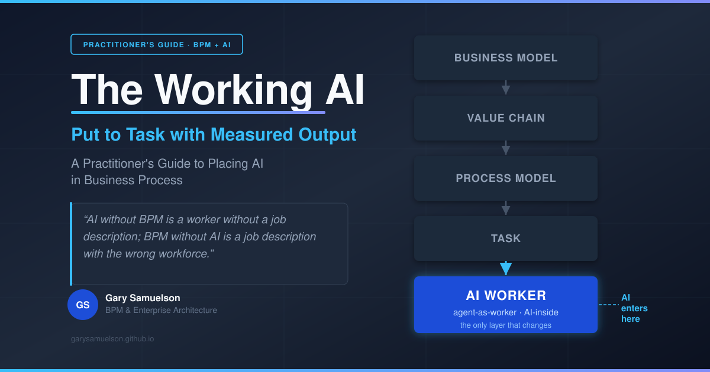
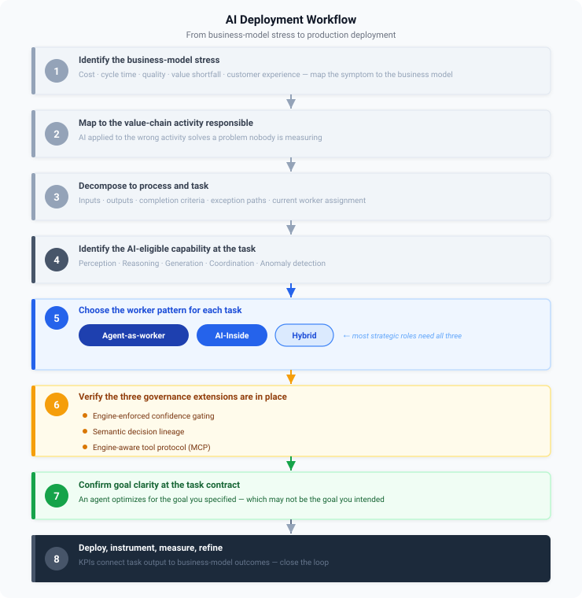
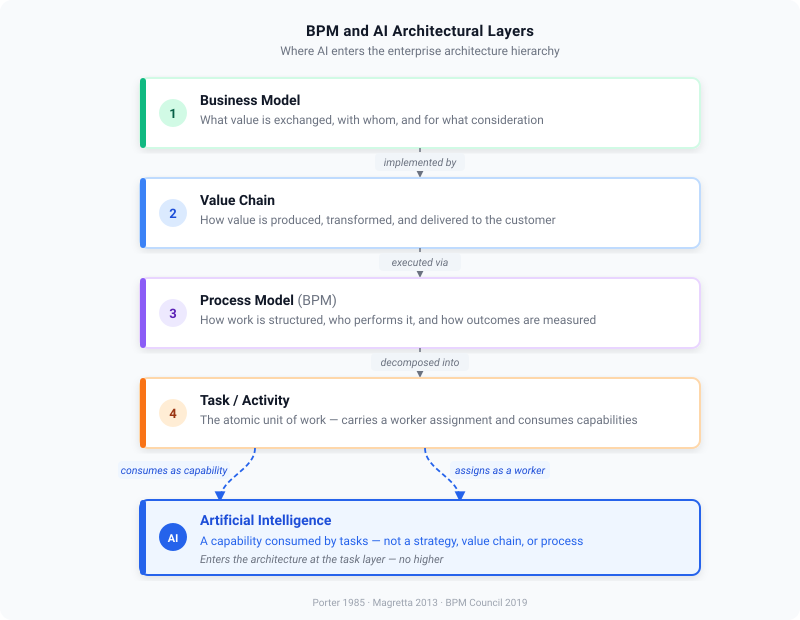
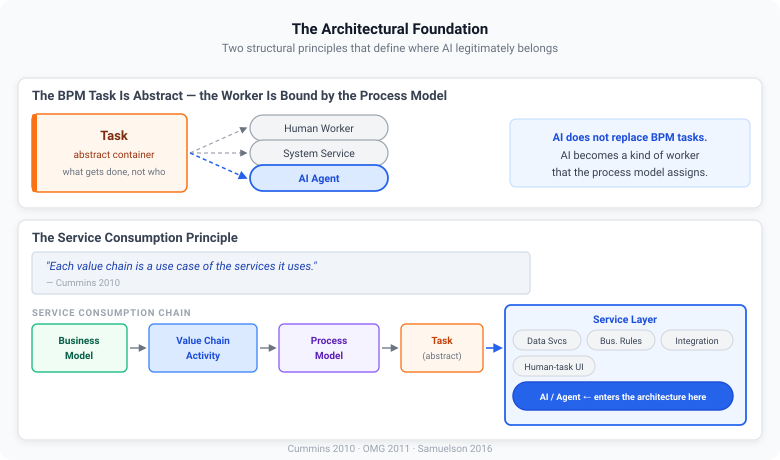
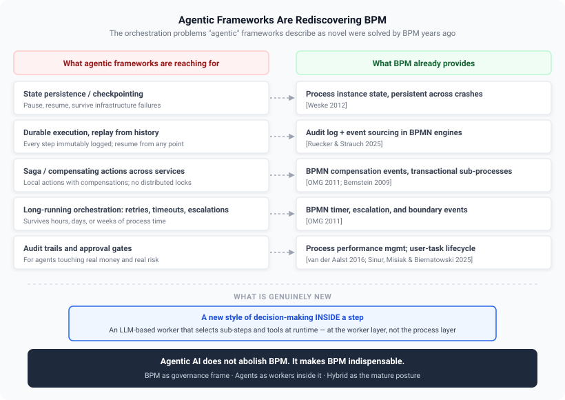
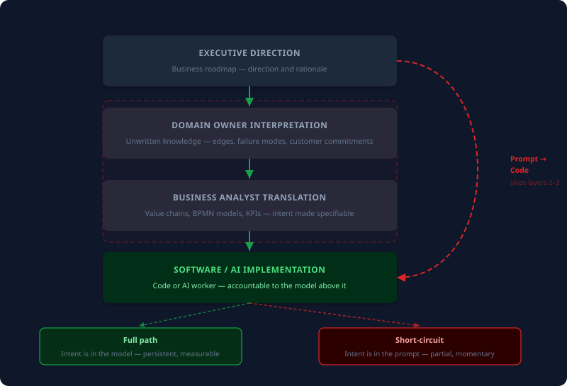

# The Working AI: Put to Task with Measured Output
### A Practitioner's Guide to Placing AI in Business Process

**Author:** Gary Samuelson
**Date:** May 9, 2026
**Status:** Published — May 9, 2026

---

## Executive Brief

Most enterprises talk about AI as if it were a strategy, a transformation, or a feature to bolt onto existing systems. It is none of those things. **AI is a class of worker** — and like any worker, it needs a job description, a place in the workflow, and a clear measure of what good output looks like.

That job description already exists. Business Process Management (BPM) has spent twenty-five years answering exactly the questions AI deployments now stumble over: *What work needs doing? Who (or what) is fit to do it? How do we know it added value?* The architecture BPM gave us in 2015 — process model orchestrating services that perform tasks — already had the slot AI plugs into. Adding "autonomous agent" as a worker type alongside human and system service does not break that architecture. It validates it.

The thesis, in one sentence:

> **AI without BPM is a worker without a job description; BPM without AI is a job description with the wrong workforce.**

---

## 1. Six Recommendations

### 1.1 Treat AI as a worker, not a strategy

AI is a capability consumed by tasks. It is not the business model, not the value chain, and not the process model. Place AI at the bottom of the architecture — in the worker slot of a task — and the rest of the design falls into place. Place AI anywhere else and the design collapses into vendor demos and proofs-of-concept that never reach production.

### 1.2 Four-step Inquiry

1. **What part of the business model is under stress?** (Cost too high, value too low, cycle time too long, quality too variable, customer experience eroding.) If you cannot answer this, AI is not the next step.
2. **Which value chain activity is responsible?** Map the stress to a primary or support activity. AI applied to the wrong activity solves a problem nobody is measuring.
3. **Which process — and which task within that process — embodies that activity?** Decompose using BPM methods. Identify the task's inputs, outputs, completion criteria, exception paths, and current worker assignment.
4. **At the task level, what does an AI worker offer that the current worker does not?** This is the only legitimate place to introduce AI. The candidate categories are perception, reasoning, generation, coordination, and anomaly detection.

If any link in the chain is missing, the deployment is unmotivated and will fail to demonstrate value.

### 1.3 Decide which of two AI patterns each task needs — and design accordingly

AI enters the worker layer in two distinct patterns. The choice between them is not a maturity question. It is a value-chain placement question: *what is the human's actual unique contribution in this task?*

| Pattern | Worker | UI status | Human role |
|---|---|---|---|
| **Agent-as-worker** | Agent | Form disappears | Supervises volume via dashboard |
| **AI-Inside** | Human + embedded AI | Form persists | Authors judgment; AI absorbs correlation |

- **Agent-as-worker** when the task is well-bounded, high-volume, and the human's value is supervising throughput. The form disappears; design effort moves to dashboards, control towers, and handoff surfaces.
- **AI-Inside** when judgment is the actual product — when the human is irreplaceable as the author of the decision. The form persists; an AI co-worker reads the same fields the human is reading and absorbs the correlation work that surrounds the judgment. The parallel is GitHub Copilot: not a replacement for the engineer, but an inline collaborator. The business-AI version carries something Copilot does not — knowledge of the task's place in the process model, the value chain, and the business model.

*Figure 1. The two patterns differ in who performs the task and what the human's role becomes. Agent-as-worker removes the human from the execution path. AI-Inside keeps the human in it.*

### 1.4 Treat hybrid as the default — not a transitional state

Most strategic roles need both patterns simultaneously, on the same role, over the same governance substrate. Agent-as-worker handles the high-volume well-bounded slice; AI-Inside handles the judgment-bound slice; the BPM process model routes the right cases to the right pattern. **The hybrid posture is the mature posture.** Building for one pattern only is leaving capability — and most of the long-run competitive value — on the table.

### 1.5 Add three governance extensions to your existing BPM stack

For deterministic workers — humans and system services — the 2015 BPM architecture is sufficient. For non-deterministic workers — agents — three extensions are required:

1. **Engine-enforced confidence gating.** The process engine must evaluate agent-output confidence and route accordingly. BPMN Conditional Events shipping in Camunda 8.9 fill this gap [Samuelson 2026a].
2. **Semantic decision lineage.** The audit trail must record not just *what ran* but *what domain concepts the agent reasoned over.* Execution audit log + ontology lineage = the complete trail [Samuelson 2026a].
3. **Engine-aware tool protocol.** Agents need a standard way to call into the process engine. MCP (Model Context Protocol) is the answer; Camunda 8.9's MCP Gateway is the first production implementation [Samuelson 2026a].

These are *extensions* of the 2015 architecture, not replacements for it.

### 1.6 Make goal clarity the gating condition for every AI deployment

Twenty-two BPM practitioners surveyed in 2025 named *"define clear business goals"* the #1 prerequisite for responsible AI agent adoption [Vu et al. 2025]. AI does not relax this requirement — it amplifies it. An autonomous agent will optimize for whatever goal you actually specified, which may not be the goal you intended. Goal clarity is not an artifact of the project initiation phase; it is the gating condition for every subsequent design decision.

---

## 2. Five Anti-Patterns to Avoid

These are the framings the architecture rules out. They look reasonable in isolation; each one quietly disconnects AI from the business intent that gives it value.

| Anti-pattern | Why it fails |
|---|---|
| **AI as strategy** | A capability is not a strategy. Strategy decides whether to use a capability and for what. |
| **AI as a value chain activity** | A means within an activity is not the activity itself. |
| **AI as a task** | A worker that performs tasks is not a task. |
| **AI as a replacement for the process model** | Agents without process frames produce uncontrolled autonomy — which is not architecture, it is hope [Calvanese et al. 2026]. |
| **AI as a governance solution** | AI is a governance *problem* that BPM solves. Treating it as a solution inverts the dependency. |

The compound anti-pattern is what 2025 practitioner discourse called *vibe coding*: prompt → code, skipping the domain owner, the analyst, and the process model. The technical output passes tests; the business outcome misses [Brooks 1987].

---

## 3. The Decision Workflow at a Glance

The six recommendations and the anti-pattern list above sit on a single underlying workflow. Every AI deployment that produces measurable business value passes through the same eight checkpoints — in order — and every deployment that fails to produce value can be traced back to a checkpoint that was skipped.

The first three checkpoints are BPM work: locate the stress, map it to a value-chain activity, decompose to the task. They produce no AI; they produce the *grounding* without which AI cannot demonstrate value. The next two checkpoints are the AI-specific decisions: which task-level capability is in play, and which of the two worker patterns (or the hybrid of both) fits the task. The final three checkpoints are the closing discipline: governance extensions, goal clarity at the contract, and the deploy/measure/refine loop.

No step is optional. Skipping a step does not accelerate the deployment — it defers the cost of skipping it to a later, more expensive moment.

*Figure 2. The eight-step AI deployment workflow. The first four steps are BPM grounding. Step 5 is the worker-pattern decision. Steps 6–7 are the governance and goal-clarity gates. Step 8 closes the loop on production outcome.*

---

## 4. The Architectural Placement

The workflow of §3 only works if AI has a defined place in the architecture. The recurring confusion in enterprise AI conversations — *is AI a strategy, a platform, a capability, a worker?* — is what makes most AI investment decisions inconsistent across the same organization. One team treats AI as a transformation initiative; another treats it as a feature; a third treats it as an infrastructure layer. None of those framings produces a stable basis for prioritizing investment, designing systems, or measuring outcome.

The BPM literature already settled the question. AI is a *worker type* — one of several — that a process model binds to a task. That single placement choice is what makes the rest of the design tractable: it tells the architect what changes (the worker pool gains a new participant class, with new governance requirements) and what does not change (the layers above the task continue to govern *what* the work is and *why* it is being done).

### 4.1 The Hierarchy

Five layers, top to bottom — each one consumed by the layer above and consuming the layer below. AI enters at the bottom.

*Figure 3. The architectural hierarchy. Each layer consumes the layer below as services and is itself consumed as a service by the layer above. AI enters at the worker slot of a task.*

**AI lives in the bottom layer.** It does not replace any layer above it. It is one of several worker types that a process model can bind to a task.

This placement is what every other claim in the paper rests on. *The business model* is unaffected by the introduction of AI — the customer-value contract is the same whether work is done by a human, a system service, or an agent. *The value chain* is unaffected — Porter's primary and support activities still describe how value is produced. *The process model* is unaffected as a structural artifact — BPMN tasks, sequence flows, gateways, roles, and KPIs continue to define how work happens, by whom, and how it is measured. *The task* is unaffected as an abstract container — inputs, outputs, decision criteria, and completion semantics are the same whether the worker is human or autonomous. Only the *worker layer* gains a new participant class, and only the *governance surface around that worker* needs to extend.

That invariance is the architectural payoff. The four upper layers — the four layers carrying business intent — do not need to be redesigned to accommodate AI. They need to be *consulted*. AI deployments fail when those layers are skipped, not when they are followed.

### 4.2 Three Foundational Ideas That Make the Placement Work

The placement claim rests on three foundational ideas about BPM that pre-date the agentic-AI era. Each is established literature; each is exactly the right scaffolding for placing AI in 2026.

**Value chain and BPM are complementary, not competitive.** Porter's value chain answers *what value-add activities exist in this business* [Porter 1985]. BPM answers *how those activities are actually performed by people and systems collaborating* [Dumas et al. 2013]. The value chain is the macro view of value creation; BPM is the micro view of how work happens. They do not compete; they decompose [Samuelson 2016].

**The BPM task is abstract; the worker is bound by the process model.** A BPMN task is a container whose definition is abstract — it specifies *what* gets done, not *who* does it. The worker (human, system service, or agent) is bound to the task by the process model and role assignment [OMG 2011; Samuelson 2016]. This is the architectural insight that makes AI placement tractable. AI does not replace BPM tasks. AI becomes a kind of worker that the process model can assign to a task. The discipline of task definition stays exactly the same.

**The service consumption principle.** [Cummins 2010] supplies the missing link between architecture and AI: *"Each value chain is a use case of the services it uses."* If a value chain is a use case of services, then AI capabilities are services consumed by tasks; tasks are choreographed in processes; processes implement value chain activities; value chain activities deliver the business model. AI does not enter at the strategy layer. It enters at the service layer — the same layer that has always held data services, business rules, integration adapters, and human-task UIs. What changes in 2026 is that the service layer can now contain *autonomous services* — agents that perceive, reason, and act. That changes the governance requirements, but not the architectural placement.

### 4.3 Two Ways AI Enters the Worker Layer

The worker layer is not a single entry point. AI enters it in two distinct patterns, recapped here for the foundational record (Recommendation 1.3 above is the operational form):

**Pattern 1: Agent as worker.** The agent takes the task entirely. No human performs the task step; the human supervises the volume through a dashboard. The task UI disappears — agents do not need forms. Governance, audit, and exception routing remain in the process model above. This is the pattern the Agentic BPM Manifesto [Calvanese et al. 2026] describes.

**Pattern 2: AI-Inside.** The human stays in the seat. The task UI stays. An AI co-worker is embedded *inside* the form alongside the human worker — not in a separate chat window, but reading the same fields the human is reading, in real time. The human authors every decision; AI absorbs the correlation work that currently surrounds and dilutes that authorship.

*Figure 5. The worker layer is not a single entry point. The BPM process model governs both patterns identically above the worker slot.*

A human completing a task form does two kinds of work simultaneously: **correlation** (retrieving values from other systems, cross-checking policy, verifying prior case history) and **judgment** (deciding what those values mean for this case, weighing soft factors, recognizing edge cases, knowing when to escalate). These are entangled in practice — the human spends most of their time on correlation because the judgment cannot proceed without it. AI-Inside unbundles them. An LLM-class agent is the only artifact in the system that can hold a runtime-wide context window open — instance history, peer-task state, semantic lineage, policy version, situational context from external systems — while the human types into a single field. The agent absorbs the correlation; the human's time collapses to the judgment work that is genuinely theirs.

The asymmetry is not that AI is smarter. The human is still the author of the decision; the design assumes and requires it. The asymmetry is purely in context-holding capacity: AI can maintain eight cross-system concerns between keystrokes; a human cannot. When the correlation is handled, the human's intellect — the part that is irreplaceable — becomes the binding constraint of the system rather than its bottleneck.

Through the AOP-mediated aspect substrate described in [Samuelson 2026b], each of those cross-system concerns arrives as an injected aspect — goal context, preference weights, business-policy version, prior-case outcomes — without coupling the task implementation to the systems that hold them. The human worker never leaves the form; the AI brings the world to the form.

Both patterns sit inside the same BPM process frame. The process model determines which tasks go to which pattern, enforces governance in both, and routes exceptions from both. Neither pattern requires changing the layer above the worker.

---

## 5. Agentic Frameworks Are Rediscovering BPM

A pattern is visible across the agentic-AI literature of the last eighteen months: the problems agent frameworks now describe as novel are problems BPM, workflow engines, and saga-based orchestration solved years ago. The framing is new; the underlying engineering is not. Each capability long-running agentic systems are reaching for maps directly onto a capability BPM has shipped for two decades:

| What agentic frameworks are reaching for | What BPM already provides |
|---|---|
| Agent state persistence and checkpointing | Process instance state, persistent across crashes [Weske 2012] |
| Durable execution, replay from history | Audit log + event sourcing in BPMN engines [Ruecker & Strauch 2025] |
| Saga / compensating actions across services | BPMN compensation events, transactional sub-processes [OMG 2011; Bernstein 2009] |
| Long-running orchestration with retries, timeouts, escalations | BPMN timer events, escalation events, boundary events [OMG 2011] |
| Audit trails and approval gates for governance | Process performance management; user-task lifecycle [van der Aalst 2016; Sinur, Misiak & Biernatowski 2025] |

What agentic frameworks legitimately add is not new orchestration plumbing. It is a new *style of decision-making inside a step*: an LLM-based worker that selects sub-steps and tools at runtime rather than following a fixed BPMN path. That is genuinely new at the worker layer. It is not new at the process layer.

The mature posture is hybrid: BPMN defines the overall process and provides the governance frame; inside designated ad-hoc sub-processes, an agent is permitted to choose actions, tools, and order dynamically [Calvanese et al. 2026]. **Agentic AI does not abolish BPM; it makes BPM indispensable.** Once agents touch real processes with real money and real risk, the disciplines of process modeling, orchestration, durable state, and measurement are non-negotiable — and they already exist.

The 2026 research literature names this convergence directly. Agentic Business Process Management (APM) governs autonomous agents executing processes within explicit frames — *"a paradigm shift… where software and human agents act as primary functional entities that perceive, reason, and act within explicit process frames"* [Calvanese et al. 2026]. Four agent capabilities are required: **framed autonomy** (BPMN process is the frame), **explainability** (audit log + decision lineage), **conversational actionability** (process-aware UX), and **self-modification** (feedback into process improvement). Agentic BPMS shifts focus from automation to autonomy and from design-driven to data-driven management of processes — *"leveraging process mining techniques"* [Dumas, Milani & Chapela-Campa 2026].

The key word everywhere is *framed*. Autonomy is constrained, aligned, and made operational *through process awareness*. That is the BPM contribution to the agentic stack.

---

## 6. Why AI Projects Miss — The Short-Circuit

Most AI projects that fail to demonstrate value fail for the same reason: they short-circuit the layers that carry business intent.

### 6.1 The Path AI Bypasses

Software was never supposed to be written from a prompt. The path from business need to working system has historically passed through layers, each of which adds context the next layer depends on:

1. **Executive direction** — the business roadmap; where the enterprise is going and why.
2. **Domain owner interpretation** — the people who understand the actual function of the business interpret executive direction in terms of what their domain does and how it produces value. The domain owner is the carrier of unwritten knowledge: regulatory edges, failure modes that matter, customer commitments that cannot be missed.
3. **Business analyst translation** — value chains, process models (BPMN), and enterprise-architecture artifacts that turn domain understanding into specifiable structure with measured outcomes.
4. **Software engineer implementation** — code that realizes the structure, conformant to the domain model and accountable to the KPIs the process declares.

This is the path Domain-Driven Design [Evans 2003; Vernon 2013] formalized. It is also the path that twenty-five years of BPM literature [Dumas et al. 2013; Weske 2012] presupposes. The path's job is to carry *business intent* down through the layers without losing it.

*Figure 7. Two paths to the same implementation. The full path preserves business intent at every layer. The short-circuit produces fast code against a partial prompt.*

### 6.2 What "Prompt → Code" Skips

When an AI tool is invoked at the bottom of the stack with a natural-language prompt, layers 2 and 3 are skipped. The prompt captures whatever fragment of intent the prompter happens to articulate at the moment they articulate it. Everything the domain owner would have known — the unstated rules, the regulatory edges, the failure modes that matter, the value-chain context that defines what success looks like — is absent unless the prompter happens to be the domain owner *and* happens to remember it.

[Brooks 1987] anticipated this forty years ago when he distinguished the *essential* difficulty of software (understanding what to build) from the *accidental* difficulty (how to build it). AI compresses the accidental difficulty toward zero. **It does nothing for the essential difficulty.** Code shipped without the layers above it is, at best, a fast implementation of a misunderstood requirement.

### 6.3 Both Patterns Inherit the Risk

Both AI patterns from Recommendation 1.3 inherit the short-circuit risk:

- **Agent-as-worker.** Without a process frame, the agent optimizes for whatever the prompt encoded — not for the domain owner's understanding of what the task is supposed to accomplish. The Manifesto's framed-autonomy requirement [Calvanese et al. 2026] is precisely the corrective.
- **AI-Inside.** The human stays in the seat, but AI produces fast, plausible-looking implementations of whatever the human asks for. The human's job becomes ensuring that what they ask for corresponds to actual business intent. Without the discipline of the value chain → process → task chain, even AI-Inside drifts toward hollow, technology-centric implementation.

Both patterns require the same corrective. The corrective is not better prompts. **It is the reinstatement of the layers AI bypassed.**

### 6.4 What BPM Reinstates

BPM does not slow AI down. It supplies what the prompt cannot: an explicit, modeled record of business intent at every layer above the implementation. The **value chain** records why a function exists in the business and how it contributes to revenue. The **process model** records how that function is performed, by whom, and with what measured output. The **task** records the unit of work, its inputs, its outputs, its completion semantics, and its acceptance criteria.

When an AI worker is bound to a task in a process in a value chain, the AI no longer has to infer business intent from a prompt. The intent is in the model. The AI's job collapses to what AI is good at: executing within a frame, producing a measured output, and emitting lineage that confirms it operated against the right specification.

This is what it means to refocus on business intent. *Not less AI.* AI placed where intent is already written down — exactly the placement Part II specifies.

---

## 7. AI Practice and BPM — A Symmetric Inventory

### 7.1 AI Engineering Methods Mapped to BPM Concerns

| AI Method / Practice | What it does | Where it belongs in BPM |
|---|---|---|
| Prompt engineering | Crafts inputs to LLMs for desired outputs | Task input specification |
| Retrieval-Augmented Generation (RAG) | Retrieves relevant context, then generates | Task data context preparation |
| Knowledge graph integration | Grounds reasoning in structured domain semantics | Domain ontology / shared task context |
| Agent framework assembly | Wires LLMs to tools and memory | Worker implementation for autonomous tasks |
| Tool calling / MCP | Lets agents invoke external services | Service interface for agent workers |
| Evaluation and benchmarking | Measures agent quality on test sets | Pre-deployment validation, conformance testing |
| Fine-tuning / RLHF | Adapts a model to domain-specific behavior | Worker specialization for task families |
| Guardrails / output filtering | Constrains agent outputs to policy | Task contract enforcement |
| Observability / tracing | Records agent decisions and intermediate steps | Audit log integration |
| Process mining | Discovers actual processes from event logs | Discovery method for BPM and Agentic BPM |

Every method on the left has a natural home in a BPM concern on the right. None of them is a new architectural layer.

### 7.2 What AI Engineering Lacks That BPM Already Provides

AI engineering has no mature equivalent of:

- **Process versioning and migration** — BPM has had this for 25 years [Ruecker & Strauch 2025].
- **Exception modeling** — BPM has compensation, escalation, and boundary events [OMG 2011].
- **Role-based human task assignment** — BPM has user task lifecycle [Sinur, Misiak & Biernatowski 2025].
- **Conformance checking** — BPM has process mining alignment [van der Aalst 2016; Dumas, Milani & Chapela-Campa 2026].
- **End-to-end KPI connection** — BPM has process performance management [van der Aalst 2016].

These are precisely the capabilities the Agentic BPM Manifesto calls out as required [Calvanese et al. 2026]. The gaps in AI engineering are exactly what BPM brings to the table.

### 7.3 The Symmetric Contribution

| AI brings to BPM | BPM brings to AI |
|---|---|
| Cognitive task workers — unstructured inputs, graded judgments, NL interaction | Goal clarity — knowing what work is for before specifying how |
| Adaptive behavior — workers that improve from feedback | Frames — boundaries that constrain autonomy without forbidding it |
| Conversational interfaces — process invocation without custom UIs | Decomposition — turning vague goals into specifiable tasks |
| Pattern detection at scale — anomalies, drift, improvement opportunities | Governance — versioning, exceptions, audit, role binding |
| | Measurement — KPIs that connect task output to business outcomes |

Neither discipline is sufficient alone. Together they form what the Manifesto calls Agentic BPM [Calvanese et al. 2026] and what Dumas et al. call A-BPMS [Dumas, Milani & Chapela-Campa 2026].

---

## 8. Pattern Continuity — The 2015 Architecture Already Had the Slot

A common objection: the agentic era requires a new architecture. The historical record disagrees.

### 8.1 The 2015 Pattern

The February 2015 post *Process Management Architecture: Overview of Methods, Features, and Capabilities* [Samuelson 2015] traced the architectural inversion that BPM made possible: the *process model becomes the orchestrator; everything below it is a service consumed by tasks.* The same business services — information services, business-transaction services, rules engines, security/RBAC, compliance — that previously sat behind a static application facade now sit behind a process model that orchestrates them. Application code no longer carries the workflow; the BPMN does. That pattern, published eleven years before the manifesto, is the same pattern the manifesto demands. The slots were already there.

### 8.2 The Mapping, Element by Element

| 2015 BPM architecture element [Samuelson 2015] | What agentic AI adds in 2026 |
|---|---|
| **Task** as a container for one or more services dedicated to value-add output [OMG 2011] | Container now admits a third worker class: autonomous agents [Calvanese et al. 2026] |
| **Task as AOP "concern"** — crosscutting business domains | Agents become crosscutting reasoning concerns injected into tasks via the process model |
| **Business Context** — exactly when, why, and how resources are consumed | The "framed autonomy" the Manifesto demands [Calvanese et al. 2026] |
| **Security / RBAC** — who needs to do what with information | Agents require explicit authorization scope; in 2026, MCP authorization claims captured in audit records [Samuelson 2026a] |
| **Business Event** — message container; "glue between situations in the real world and processes that react" [Weske 2012] | Events trigger agents and agents emit events — same channeling mechanism, no new construct |
| **Complex Event Processing** — pattern, causality, correlation | The AI/ML/process mining layer of agentic BPMS [Dumas, Milani & Chapela-Campa 2026] |
| **Business Transactions** — long-running, atomic boundaries [Bernstein 2009] | The agentic zone (BPMN ad-hoc sub-process) is the modern realization [Samuelson 2026a] |
| **Business Domain Model** = "enterprise ontology" | The ontology layer driving agent decisions in the bidirectional thesis [Samuelson 2026a] |
| **Actionable Knowledge** — process data mining, dashboards, immediate pathways to action | The agentic dashboard / advisor playbook pattern; aligns with the data-driven A-BPMS vision [Dumas, Milani & Chapela-Campa 2026] |

The right-hand column reads like the 2026 Agentic BPM research agenda. The left-hand column was published in 2015. The architecture had the slots; the new participant class plugs into them.

### 8.3 Why the Pattern Holds

The principle from §4.2 — *the BPM task is abstract; the worker is bound by the process model* — is the reason the 2015 architecture survives the agentic shift. When the only worker types were humans and system services, the architecture was already worker-agnostic. Adding "autonomous agent" as a third worker type does not break the architecture. It validates it.

### 8.4 Three Governance Extensions Required by 2026

Three extensions are demanded by 2026 conditions but were not architecturally required when workers were deterministic. These are the substance behind Recommendation 1.5:

1. **Engine-enforced confidence gating.** Because agent outputs are non-deterministic, the process engine must evaluate confidence and route accordingly. BPMN Conditional Events shipping in Camunda 8.9 fill this gap [Samuelson 2026a].
2. **Semantic decision lineage.** The audit trail must record not just *what ran* but *what domain concepts the agent reasoned over.* The execution audit log plus the ontology lineage together form the complete trail [Samuelson 2026a].
3. **Engine-aware tool protocol.** Agents need a standard way to call into the process engine. MCP (Model Context Protocol) fills this; Camunda 8.9's MCP Gateway is the first production implementation [Samuelson 2026a].

These are *extensions* of the 2015 architecture, not replacements for it. The architecture was right then. The implementation surface has grown to handle non-determinism.

### 8.5 The Pattern Restated

*Figure 8. The architecture is the same. The worker-class list grows. The governance burden grows with it.*

The architecture is the same. The worker-class list grows. The governance burden grows with it — which is precisely what BPM has always been disciplined to handle.

---

## 9. Thesis and Implications

### 9.1 Thesis

> **AI is a class of worker; BPM is the discipline that decides what work needs doing, who is fit to do it, and how its contribution to value is measured.**
>
> **AI without BPM is a worker without a job description; BPM without AI is a job description with the wrong workforce.**

The architectural placement is the bottom layer of a four-layer hierarchy: business model → value chain → process model → task → worker. AI plugs into the worker slot. Above that slot, nothing changes. Below that slot — the supporting infrastructure of events, ontology, audit, security, transactions — gains three governance extensions to accommodate non-deterministic workers.

The fit is not new. It is the slot the 2015 BPM architecture already specified, occupied in 2026 by a participant class that did not exist when the slot was drawn.

### 9.2 Follow-On Work

The next entries on the research agenda:

1. **The UI/UX consequences of changing the worker** — when the worker shifts from human to agent, most task-level UIs disappear and design effort migrates to dashboards, handoff surfaces, and embedded co-worker assistance.
2. **The value chain → process → task → worker chain as a deployment methodology** — turning the four-step inquiry of Recommendation 1.2 into a working enterprise method.
3. **Why agentic AI fails in production: a BPM diagnosis** — applying BPM exception modeling, versioning, and conformance checking to documented LLM-agent failure modes.
4. **Process mining as the foundation of agentic enterprise AI** — extending [Dumas, Milani & Chapela-Campa 2026] with a concrete process-mining-to-agent-deployment workflow.
5. **The four agent capabilities operationalized** — turning framed autonomy / explainability / conversational actionability / self-modification into concrete architectural patterns mappable to a production engine [Samuelson 2026a].
6. **Goal clarity as the precondition for AI investment** — practitioner-facing piece on why the #1 recommendation from twenty-two BPM practitioners is *"define clear business goals."*

---

## 10. References

*Citation style: author–year in-text markers; full entries below, grouped by category.*

### BPM Foundations

**[Bernstein 2009]** Philip A. Bernstein & Eric Newcomer, *Principles of Transaction Processing*, 2nd ed. (Morgan Kaufmann, 2009). ISBN 978-1-55860-623-4.

**[Cummins 2010]** Fred A. Cummins, *Building the Agile Enterprise: With SOA, BPM and MBM* (Morgan Kaufmann, 2010). ISBN 978-0-12-374469-3.

**[Dumas et al. 2013]** Marlon Dumas, Marcello La Rosa, Jan Mendling, Hajo A. Reijers, *Fundamentals of Business Process Management* (Springer, 2013). ISBN 978-3-642-33142-8.

**[OMG 2011]** Object Management Group, *Business Process Model and Notation (BPMN) Version 2.0*, ISO/IEC 19510:2013 (OMG, January 2011). https://www.omg.org/spec/BPMN/2.0

**[Ruecker & Strauch 2025]** Bernd Ruecker & Leon Strauch, *Enterprise Process Orchestration* (Wiley, April 2025). ISBN 978-1-394-30967-2.

**[Samuelson 2015]** Gary Samuelson, "Process Management Architecture: Overview of Methods, Features, and Capabilities," garysamuelson.com (February 11, 2015). https://garysamuelson.com/blog/?p=1353

**[Samuelson 2016]** Gary Samuelson, "The BPM Task: Definition & Analysis," garysamuelson.com (January 30, 2016). https://garysamuelson.com/blog/?p=1413

**[Sinur, Misiak & Biernatowski 2025]** Jim Sinur, Zbigniew Misiak, BJ Biernatowski, *Practical Business Process Modeling and Analysis* (Packt, August 2025). ISBN 978-1-80510-674-4.

**[van der Aalst 2016]** Wil M. P. van der Aalst, *Process Mining: Data Science in Action*, 2nd ed. (Springer, 2016). ISBN 978-3-662-49850-7.

**[Weske 2012]** Mathias Weske, *Business Process Management: Concepts, Languages, Architectures*, 2nd ed. (Springer, 2012). ISBN 978-3-642-28615-5.

### Software Engineering and Domain Modeling Foundations

**[Brooks 1987]** Frederick P. Brooks Jr., "No Silver Bullet — Essence and Accidents of Software Engineering," *IEEE Computer* 20, no. 4 (April 1987): 10–19.

**[Evans 2003]** Eric Evans, *Domain-Driven Design: Tackling Complexity in the Heart of Software* (Addison-Wesley, 2003). ISBN 978-0-321-12521-7.

**[Vernon 2013]** Vaughn Vernon, *Implementing Domain-Driven Design* (Addison-Wesley, 2013). ISBN 978-0-321-83457-7.

### Value Chain and Business Model Theory

**[Porter 1985]** Michael E. Porter, *Competitive Advantage: Creating and Sustaining Superior Performance* (Free Press, 1985). ISBN 978-0-684-84146-5.

### Agentic BPM — arXiv Research (2025–2026)

**[Calvanese et al. 2026]** Diego Calvanese, Angelo Casciani, Giuseppe De Giacomo, Marlon Dumas, Fabiana Fournier, Timotheus Kampik, Emanuele La Malfa, Lior Limonad, Andrea Marrella, Andreas Metzger, Marco Montali, Daniel Amyot, Peter Fettke, Artem Polyvyanyy, Stefanie Rinderle-Ma, Sebastian Sardiña, Niek Tax, Barbara Weber, "Agentic Business Process Management: A Research Manifesto," arXiv:2603.18916 [cs.AI] (March 19, 2026; v3 April 12, 2026). https://arxiv.org/abs/2603.18916

**[Dumas, Milani & Chapela-Campa 2026]** Marlon Dumas, Fredrik Milani, David Chapela-Campa, "Agentic Business Process Management Systems," arXiv:2601.18833 [cs.AI] (January 25, 2026). Presented at BPM 2025 Workshop on Artificial Intelligence for Business Process Management (AI4BPM). https://arxiv.org/abs/2601.18833

**[Vu et al. 2025]** Hoang Vu, Nataliia Klievtsova, Henrik Leopold, Stefanie Rinderle-Ma, Timotheus Kampik, "Agentic Business Process Management: Practitioner Perspectives on Agent Governance in Business Processes," arXiv:2504.03693 [cs.SE] (March 2025; v2 July 2025). https://arxiv.org/abs/2504.03693

### Cross-References (Author's Prior Work)

**[Samuelson 2026a]** Gary Samuelson, "Domain Semantics as the Driver of Agent Orchestration: An Architectural Proof with Camunda 8.9," (April 11, 2026).

**[Samuelson 2026b]** Gary Samuelson, "Aspect-Oriented Process Management: An AOP-Mediated Substrate for Agent and Human Workers," prior paper in the series (referenced for the runtime aspect substrate that AI-Inside depends on).

---

*© 2026 Gary Samuelson | CC BY-NC-ND 4.0 — Share freely with attribution. No commercial use. No derivatives without permission.*
