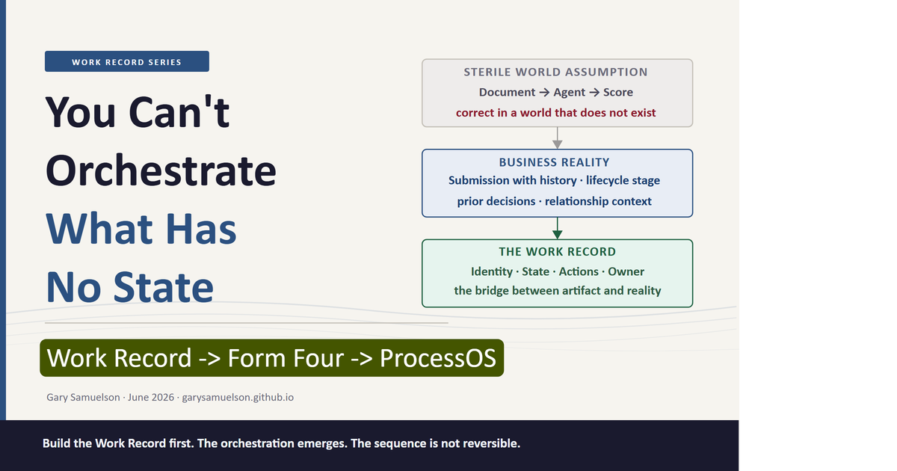
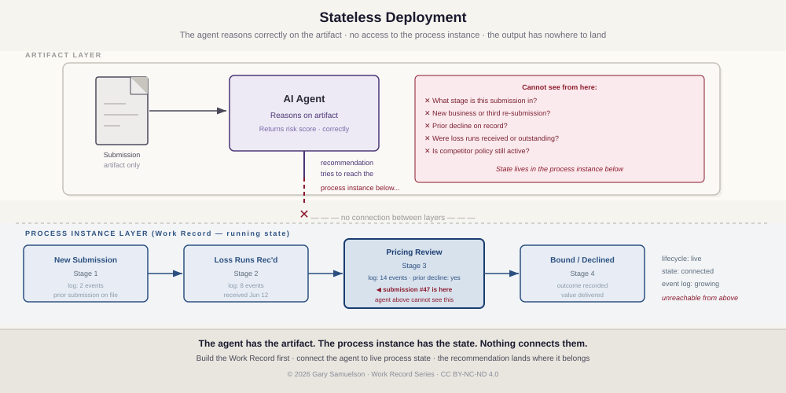
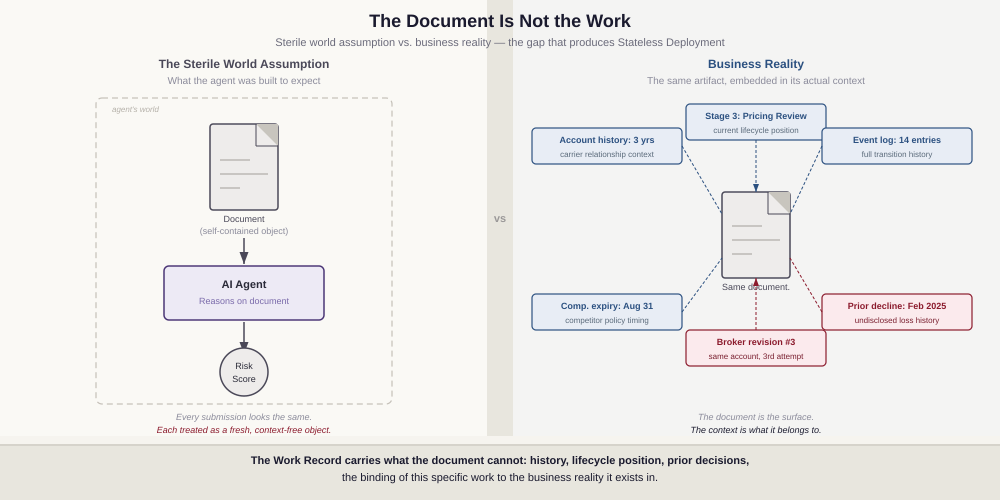
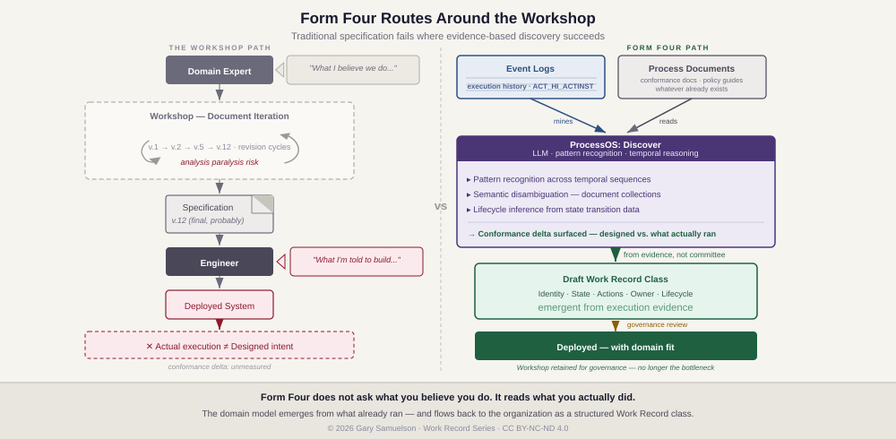
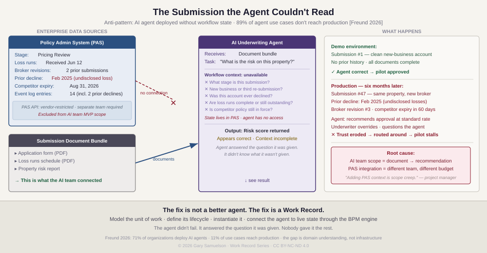
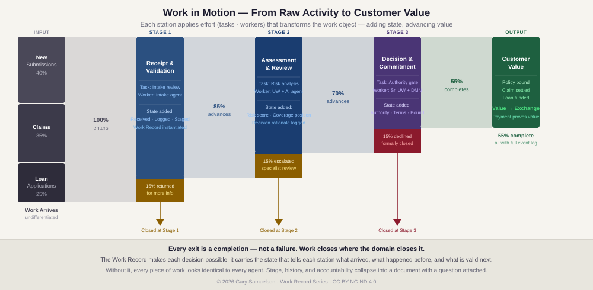
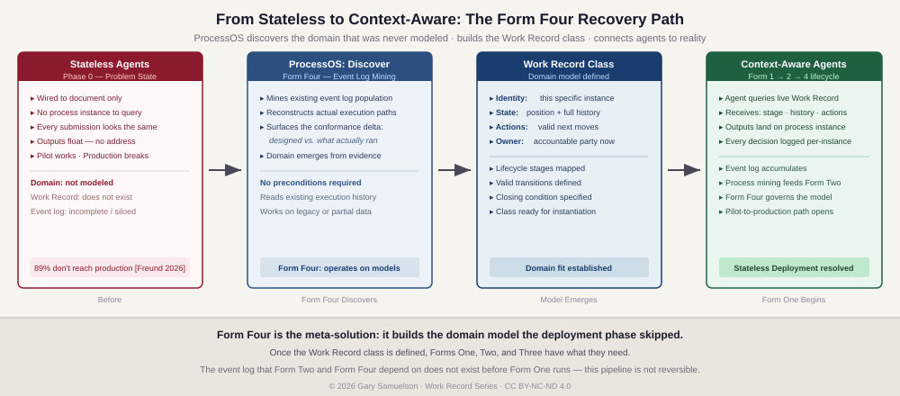
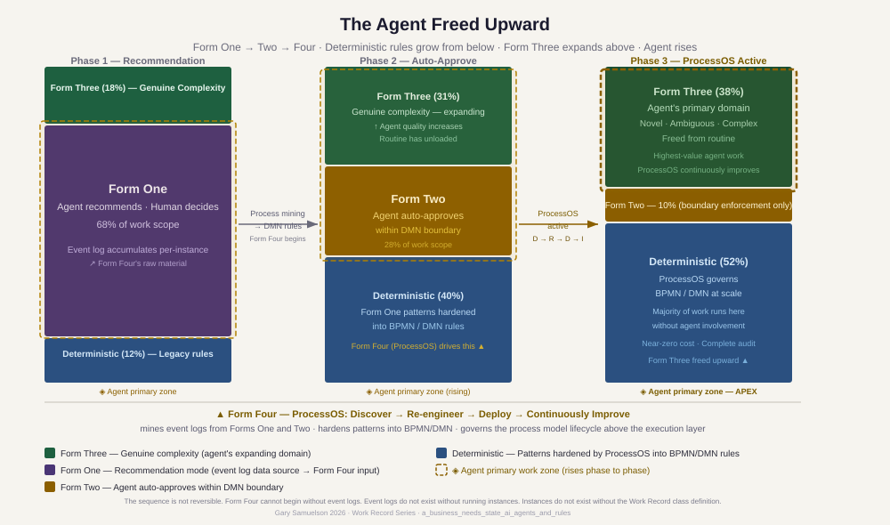

# You Can't Orchestrate What Has No State

**Author:** Gary Samuelson  
**Date:** June 2026  
**Companion to:** [*Process-First AI: The Work Record, Four Forms, Three Dimensions*](process-first-ai-dimensions.md) [Samuelson 2026b]

---

The agents reason. That was never the problem.

**Stateless deployment** is a failure of context. An agent is set in motion and asked to reason about a domain that has been in motion long before it arrived. You can never step into the same river twice — what was there is already downstream, on its way to somewhere else. Business reality is that river. The document the agent receives is water in a bucket: a sample taken at one moment from something that has been flowing for weeks, months, or years. The agent analyzes the bucket. It never sees the current.

So it reasons without knowing where the artifact sits in the process, what happened before it arrived, or what the output must satisfy before work can advance. It has no process instance to query. Its recommendation has nowhere to land.

Eighty-nine percent of enterprises hit this wall [Freund 2026]. The pilot performs. Production breaks on the first submission that carries context the agent couldn't see.

Form Four is the fix. ProcessOS connects the agent to the current: the running process model with its history, its lifecycle position, its valid next actions. The agent stops analyzing the bucket. It flows with the work.

The full architecture is in the sections that follow. The story below shows what breaks without it.



---

## Stateless Deployment — The Anti-Pattern in Two Carriers

**Stateless Deployment** is the pattern of connecting an AI agent to an artifact — a document, a record, a data payload — without connecting it to the running work object that artifact belongs to. The agent sees the artifact. It does not see the process instance: the lifecycle stage, the prior transitions, the owner, the valid next actions. It answers the question it was given. It cannot ask about what it wasn't given.

> **A note on terminology.** In software operations, *deployment* means shipping a versioned artifact to production infrastructure — a technical act of making software available in a running system. That is not the sense here. *Stateless Deployment*, as used in this series, refers to a business integration failure: the agent is wired into a production environment but operates without the business-context state that gives its inputs meaning.

**The software shipped correctly. The understanding of the domain did not.**

This is the most common failure mode in enterprise AI — and the most expensive one to discover late. The API endpoint works. The model infers. The risk score returns in milliseconds. Every technical specification has been met. The system is in production.

And it is useless, because the domain was never modeled.

The AI team's model of the domain was: *document arrives → agent reasons → score returns.* That model is technically coherent. It is also wrong. The actual domain is: *submission with a history arrives at a specific lifecycle stage, carrying prior decisions and relationship context, requiring a response that will itself become part of the history of this account.* These are not the same model. One of them describes a sterile transaction. The other describes how commercial underwriting actually works.

The technical solution has no domain fit. Not because the engineers were incompetent — but because domain fit requires domain understanding, and domain understanding requires modeling the work before writing a line of code. The Work Record is that model. Without it, a technically correct system delivers outputs that are correct in a world that does not exist.

The deeper problem is what an AI engineering specialist would call a *closed-world assumption* — and what I call the *sterile world fallacy*. The agent was designed and connected as if the artifact it receives is a self-contained, context-free object. A document arrives. The agent reasons about the document. An output returns.

That model works in a clean world — business does not.

Every artifact is embedded in a reality that extends far beyond its contents. The submission is not just a collection of PDFs — it is the third attempt by this broker on an account that was declined twice for undisclosed losses. The loan application is not just financial data — it belongs to a customer relationship with a specific history and a specific stage in the lending lifecycle. The claim is not just a damage report — it is the third claim on this policy in eighteen months, filed by the same adjuster who filed the previous two. None of that context lives in the document. All of it is material. An agent that cannot see it is not missing a few fields — it is reasoning about a different reality than the one the business is actually in.

The Work Record is the bridge between the artifact world and the real world. It carries what the document cannot: the history, the lifecycle position, the prior decisions, the binding of this specific piece of work to the business reality it exists in. An agent connected to a Work Record is connected to that reality. An agent connected only to a document is reasoning about a surface.



**The harder problem.** Recognizing the gap is straightforward. Closing it is not.

The traditional approach is a workshop: domain experts and engineers in the same room, documenting lifecycle stages, mapping valid transitions, reviewing with compliance, iterating the specification. This works when business and IT share vocabulary, accountability, and a working relationship built over years of domain-driven delivery. That is not where most enterprises currently stand.

The previous two decades moved IT in a direction that made sense at the time: cost efficiency, outsourcing, separation of technical and business concerns. Over time, the engineers who once understood underwriting lifecycles, claims adjudication, and policy management became harder to find inside the organization. Business experts learned to live with the gap. Now AI arrives into that inherited dynamic and demands the one thing neither side kept sharp: domain understanding precise enough to guide an agent's behavior.

The workshop model produces what domain experts *believe* they do — not what they *actually* do. Engineers build what is *specified* — not what is *meant*. The distance between designed process and actual process is the conformance delta, and it is always wider than anyone in the room acknowledged. Articulation fails. Iteration stalls. The gap remains.

This is analysis paralysis wearing the costume of methodology.

**Form Four routes around the workshop.** ProcessOS does not ask anyone to articulate what they know. It reads what already happened. Large language models operating against existing event logs and process documentation do something workshops cannot: they find patterns in execution evidence without requiring someone to explain those patterns first. The technical capability at work is pattern recognition across temporal sequences, semantic disambiguation across document collections, and lifecycle inference from state transition data. The Discover phase mines the event log, extracts the actual execution graph, surfaces the conformance delta, and generates a draft Work Record class from evidence rather than from committee. The domain model emerges from what already ran.

Form Four hands that emergent model back to the organization as a structured Work Record class — reviewed, corrected, and deployed. The workshop is still useful for governance. It is no longer the bottleneck.



**ProcessOS as domain fit mitigation.** Forms One, Two, and Three operate *within* running process instances — they require the Work Record to exist before they can work meaningfully. **Form Four** occupies a structurally different position: it operates *on* the process models those instances execute. It governs the model, not a slot within it.

**The Form Four Discover agent** does not wait to be handed a domain model. It mines the event log population of an organization's existing processes, reconstructs the actual domain from execution evidence, and surfaces the conformance delta — the gap between what was designed and what actually ran. This is domain modeling done retroactively, from evidence, at the scale of the full process portfolio.

The implication for Stateless Deployment: the domain that was never modeled before agents were wired up can be modeled now. ProcessOS reads what actually happened and builds the domain model from execution reality — discovers what the work actually is, re-engineers the process to represent it correctly, deploys the Work Record class, and continuously improves it as the domain evolves.

**Form Four** is the meta-solution to Stateless Deployment. Two stories show the failure it was built to fix. **Carrier A** built the capability and lost the production case. **Carrier B** built the domain model in three weeks and kept it.

**Carrier A** spent eight months building an AI underwriting assistant. The agent was genuinely capable — it could read broker submissions, assess property risk, suggest pricing, and flag policy exceptions. In the pilot, underwriters loved it. Response time on new submissions dropped from three days to four hours.

Then they tried to move it to production. It stalled immediately.

The problem: no one could tell the agent what *stage* a submission was in. Was this a first-touch review or a referral back from a broker who had already revised the application twice? Had the loss runs been received or were they still outstanding? Was the account currently in force with a competitor, and if so, when did that policy expire? The agent had no way to know. Every submission looked the same to it — a pile of documents with a risk question attached. It could not tell the difference between a brand-new prospect and a renewal that had been declined twice in the previous twenty-four months.

Underwriters started routing around it. The pilot numbers were real. The production case was not.

---

### The Build Never Reveals the Gap

The agent did not fail. It answered the question it was given.

Nobody gave it the rest.

The AI team's mandate was "make the underwriting recommendation smarter." Their MVP was: receive a document bundle, return a risk score. That is the scope they were measured on. They built an API endpoint. It takes a PDF submission. It returns JSON.

The workflow state — what stage this submission is in, whether loss runs were requested, whether the broker already revised it twice, what the prior declination history shows — lives in the Policy Administration System (PAS). Guidewire. Duck Creek. Applied Epic. Whatever legacy PAS the carrier had been running for fifteen years. That system held the state. Nobody connected it to the agent's input context, because connecting to the PAS required a different team, a different budget conversation, and a PAS API that was either undocumented, rate-limited, or behind a six-month vendor engagement.

So the agent was called from a button labeled "Review Submission." The button fired a document payload at the AI service. No workflow context attached. The agent answered the question it was given. The PAS had the rest. Nothing connected them.

That is the structural definition of Stateless Deployment: artifact-layer integration, no instance-layer access. The agent was wired to the documents. Nobody wired it to the work.

The project manager's position was clear: "Adding PAS context is scope creep." And from a project management perspective, that position was defensible. The pilot had been scoped around the AI capability, not the integration. The integration was a separate workstream, a separate timeline, a separate sponsor conversation.

Camunda CEO Jakob Freund surveyed 1,150 senior IT and business decision-makers. Seventy-one percent of organizations use AI agents. Eleven percent of use cases reached production [Freund 2026]. This is the structural reason behind that gap. Not agent capability. Scoping decisions that leave workflow state disconnected.



---

**Carrier B** approached the same problem differently. Before they touched an agent framework, they spent three weeks on a modeling exercise: What is the discrete unit of work in our underwriting operation? — *this submission, for this account, at this point in its commercial lifecycle.* What stages does it move through? — *new submission, broker referral, loss runs received, underwriting review, pricing approved, bound, declined, renewal eligible.* When is it done, and what does done prove? — *when the policy binds and the premium is booked, or when the account is formally declined with a documented reason.*

Those three answers produced a BPMN process model. The model produced running process instances — one per submission, one per account. Each instance carried live state: what stage the submission occupied right now, what had happened before it arrived at this stage, what the underwriter needed to resolve before it could advance.

The agent connected to that state through a governed interface. It no longer read a pile of documents. It read *this submission, at stage: Pricing Review, with loss runs received on June 12, broker revised on June 18, prior carrier: Chubb, expiry: August 31.* It recommended a price. The underwriter accepted or adjusted. Either way, the decision was logged against that specific instance.

Ninety days later, process mining read the log. In 91% of commercial property submissions under $2M where the loss ratio over five years was below 45%, the underwriter had accepted the agent's recommendation unchanged. The pricing decision was hardened into a rule. The agent stopped making routine pricing calls for that segment entirely. It moved to the genuinely ambiguous accounts — the ones with complex exposures, prior losses, or mid-term endorsement histories that required real judgment.

The pilot reached production. Not because the agent got smarter. Because the work was defined first.

That three-week modeling exercise cost nothing. The eight months Carrier A spent — and the rework costs when they eventually rebuilt the process correctly — cost considerably more.

---

### What the Working Version Looks Like

The diagram below shows what Carrier B built — not as a system diagram, but as a flow of work in motion.



Every claim, application, and submission enters the left side as undifferentiated activity — raw work with potential but no realized value. At each station, effort closes the gap. The intake agent validates the inputs. The underwriter assesses the risk with the AI agent reading the live Work Record. The authority gate commits the organization. With each transition, the work object accumulates state: what happened here, who acted, what was decided, what comes next.

The flow narrows. Not because work was wasted — because different work closes at different stages. The submission returned for more information at Stage 1 was correctly returned. The escalation at Stage 2 reached the right specialist. The decline at Stage 3 was formally issued against a complete record. Every exit is a completion.

The 55% that reaches the right side has been transformed by every station it passed through. The customer receives the outcome. The organization receives the payment. The exchange proves the value was real.

This is what Carrier A's agent could not see. The document arrived at Stage 3 with no history. The agent had no process instance to query — no event log, no prior decisions, no stage. Every submission it reviewed was a fresh slate. The river kept moving. The agent was never shown where it flows.

Form Four operationalizes what Carrier B did manually — mines the event log, reconstructs the Work Record class, and runs the discovery-to-deployment loop continuously.



---

## What State Actually Is

The Carrier B story makes a precise claim: state is not a technical property. It is proof that someone understood the domain.

A Work Record is a discrete, trackable unit of business activity: this invoice, this loan application, this claim, this policy. It carries four structural properties that make it actionable [Jones 2026]:

- **Identity** — not a type, but this specific instance. This policy. This claim. This application.
- **State** — current lifecycle position and the full history of every prior transition, encoded in an event log.
- **Actions** — the set of valid next moves at this stage: what can be done here, what the output must satisfy before the work advances.
- **Owner** — the person, role, or agent accountable for advancing this piece of work right now. Accountability transfers on completion.

These are not metadata fields on a record. They are structural properties of a running object — an entity that a BPM engine has instantiated from a process model and is actively maintaining in memory. The class defines what any work record of this type requires. The instance is the class brought to life: present in memory, exerting gravitational pull on every participant the process model assigns to it, persisting across days or months or years until the work closes.

Connect an agent to that record and it connects to the value chain. The agent knows what work it is acting on, what has happened before it arrived, what its output must satisfy before the work can advance. An agent operating above a Work Record can generate indefinitely. An agent anchored to one closes work.

The commercial insurance operation in [*Process-First AI*](process-first-ai-dimensions.md) shows this end-to-end. `CPP-TX-2026-004821` — a six-building commercial property portfolio in Austin — runs from broker submission through underwriting, binding, an eighteen-month claims arc, and renewal, all inside a single running process instance. Every agent decision, every human handoff, every service call is recorded as a permanent event against that instance. The policy is not a document. It is a running object with three runtime properties: computational presence, organizational gravity, and temporal persistence. See [Samuelson 2026b] for the full architectural treatment, including the Forms × Dimensions structural matrix and the Form Four recommendation dashboard.

---

## The Progression Freund Describes — Named Structurally

Jakob Freund states what he calls the highest form of AI ROI in three moves [Freund 2026]:

First: *"An agent can start by making recommendations, then earn more authority as it proves itself."* Authority is earned — not granted on a schedule, not assumed from capability. Proven through demonstrated reliability on real work.

Second: *"Once its decisions become clear and predictable, you harden them into deterministic rules."* The agent's decisions — the patterns it has been making consistently — become the system's rules. What was judgment becomes logic.

Third: *"That isn't the agent failing. It's the highest form of success — and a very different way to measure AI ROI."* The agent's job was never to keep making decisions forever. The agent's job was to teach the organization what good decisions look like. Once it has done that completely, the teaching is over. The learning is encoded. The agent is freed.

That arc is real. It is not a management practice. It is an architectural lifecycle. Each of Freund's three moves has a structural name, a defined mechanism, and a hard dependency on what came before it. None of it operates without the Work Record. Carrier A proved that.

---

### Form One — The Data Collection Phase

Freund's "agent makes recommendations" phase is Form One in the Work Record architecture: the User Task.

The process engine assigns a task to a human's worklist. When the task activates, an AI service call fires against the Work Record's live variable store — the accumulated state of this specific process instance: what has happened, what inputs are present, what the completion criteria require. The agent returns a structured recommendation: a coverage position, a discount approval, a routing decision. The human reviews it and closes the task.

The human closes the task. Not the agent. The engine advances the token only on human action. The agent's recommendation enters the record as structured data — available to every subsequent step, every future participant, every audit inquiry. The engine logs the task completion as a permanent event in the process instance's event log.

One human decision. One event log entry. One data point toward a pattern the process mining system does not yet have enough instances to read.

**Form One is not the primitive version of the architecture.** It is the data collection phase. The event log that Form Two and Form Four depend on does not exist before Form One runs. Every instance of Form One — every recommendation made, every human decision recorded — is raw material being laid down for the phases that follow. The agent generating recommendations is also, simultaneously, generating the evidence that will eventually make those recommendations unnecessary.

This is the first reason Form One cannot be skipped or abbreviated. The architecture does not mature without the data Form One produces. Skipping directly to "auto-approve" without a Form One event log base is not an accelerated path — it is a deployment without evidence, which is the failure mode the entire architecture was designed to prevent.

---

### Form Two — The Promotion Is a Signal, Not a Decision

Freund's "earn more authority" move is not a management decision. The promotion from Form One to Form Two is triggered by a process mining signal.

The signal: across the population of completed Form One instances — hundreds of pricing decisions, claim approvals, discount authorizations — a pattern has emerged. In 94% of cases where the discount fell below 10% and the customer tier was Tier 1, the human accepted the agent's recommendation unchanged. The human added no information. The human changed nothing. The human's role in those 940 cases out of 1,000 was to click Approve on something the agent had already gotten right.

That pattern is not visible to anyone managing the process day to day. It lives in the aggregate event log, across hundreds of completed instances, accumulated over months. Process mining reads it. A BPMN gateway encodes the boundary. A DMN decision table encodes the rule: if discount < 10% AND customer tier = Tier 1, auto-approve. The engine enforces.

The agent now occupies a Service Task node for those cases. No human interaction. The engine passes the Work Record's structured input, receives the agent's structured output, checks it against the task completion criteria, and advances the token. The 940 routine cases run deterministically inside the boundary. The 60 edge cases — the ones outside the boundary — still route to human review.

**The agent did not earn authority because management decided to trust it more.** The agent earned authority because the event log proved it had already been right, consistently, for long enough to constitute evidence. The promotion is a data-driven architectural change, not a cultural one. And it is only possible because Form One was logging per-instance decisions against a Work Record. Without that log, the promotion has no basis. The organization would be guessing rather than governing.

---

### Form Four — The Patterns Become the Model

Freund's third move — "harden into deterministic rules" — is where the architecture's most powerful element activates. This is not Form Two running longer. This is Form Four: ProcessOS, operating above the execution layer, treating the process model itself as the governed artifact.

Form Four does not operate inside running process instances. It operates on the models those instances execute. Its raw material is the full event log population — not just the approved cases but the exception routing, the escalations, the edge-case resolutions, the deviation paths. Process mining extracts the actual execution graph: how the process actually ran, not how it was designed to run.

What Form Four's Discover phase finds is characteristic. Some approved cases consistently generate downstream exceptions — the boundary is drawn in the wrong place. Some escalations cluster around a specific coverage type, not because those cases are genuinely ambiguous but because the model routes them to human review before context that would resolve the ambiguity has been collected. Some patterns that started as edge cases have become predictable enough to warrant their own DMN rule. The Re-engineer phase redesigns the model. The Deploy phase pushes updated BPMN and DMN to production through a human governance gate.

**The transition from Form Two to Form Four is not "hardening patterns into rules."** It is the process model itself becoming the governed artifact — redesigned, versioned, backtested, and deployed by an AI system that operates above the execution layer. The patterns the agent once navigated are now encoded in the model the agent runs inside. The agent is freed to handle only the genuinely novel cases. Everything the agent has successfully taught the system now runs at near-zero cost, with full auditability, without agent involvement.

This is Freund's "highest form of success" stated structurally. The agent's ROI is not measured in decisions made. It is measured in decisions permanently removed from the agent's scope — encoded into the process model, running forever, at zero marginal cost, because the agent demonstrated they were worth encoding.

---

### Reading the Diagram



The diagram shows three phases as side-by-side columns. Read them left to right: Phase 1 to Phase 2 to Phase 3. Each column represents the same total volume of work — same process, same organization — but the distribution of how that work is handled changes with each phase.

**Each column is divided into three stacked zones:**

The **blue zone at the bottom** is deterministic rules — work the process engine handles without agent involvement. Instant, near-zero cost, full audit trail. In Phase 1, the blue zone is thin (12%) — a few pre-existing rules. By Phase 3, it is the largest zone (52%), because ProcessOS has been converting mature patterns into BPMN/DMN throughout the progression.

The **middle zone** (purple in Phase 1, amber in Phase 2) is where the agent works with human involvement or within a decision boundary. In Phase 1 it is Form One — the entire large purple block represents agent recommendations waiting for human decisions. This is the heaviest zone in Phase 1, at 68% of all work. In Phase 2 it has transformed: Form Two has replaced Form One — the human-decides portion has been absorbed into the blue zone, and what remains is the agent auto-approving within a DMN boundary (28%). By Phase 3 this zone is a thin amber strip at 10%.

The **green zone at the top** is Form Three — genuine complexity that requires real reasoning. Multi-party claims, novel coverage disputes, underwriting exceptions with ambiguous inputs. This zone grows with each phase: 18% in Phase 1, 31% in Phase 2, 38% in Phase 3. Not because more complex work appears, but because the routine has been encoded away and Form Three is proportionally larger.

**The gold dashed box** is the critical element. It marks where the agent's primary work happens at each phase — and it rises.

In Phase 1, the gold box wraps the large purple Form One zone. The agent spends most of its time making routine recommendations. The green Form Three zone is above the gold box — the agent gets there, but most of its energy is in the purple.

In Phase 2, the gold box has climbed. It now covers the amber Form Two zone and the green Form Three zone together. The agent is doing less routine recommendation and more of two things: enforcing the DMN boundary and handling genuine complexity. The gold box is smaller in absolute area — less total work — but positioned higher.

In Phase 3, the gold box sits at the top of the column, tight around the green Form Three zone only. Labelled *APEX*. The agent's work is entirely in the domain of genuine complexity. Everything below it runs without the agent.

**The agent has not done less work. It has done better work.** The gold box moved from the large routine zone in Phase 1 to the small high-value zone in Phase 3. The agent's scope narrowed in volume and deepened in difficulty. This is Freund's "highest form of success" — not as a management observation, but as a visible structural transition across three columns.

The footer caption names what drives the blue zone upward: Form Four (ProcessOS) mining the event logs from Forms One and Two, re-engineering the model, and deploying updated rules. Without ProcessOS, there is no systematic transition between phases. The phases do not happen naturally over time. They happen because the architecture is built to learn.

---

### Why Form Three Does Not Get Hardened

The progression is One → Two → Four. Form Three — the Ad-Hoc Subprocess — is not a step in this sequence. It is its permanent home.

Form Three handles the multi-party commercial claim running for months, the coverage dispute requiring contextual judgment across novel inputs, the underwriting exception that requires integrating information that does not appear in the structured variable store. It is where the agent operates as a bounded orchestrator, selecting its own tool sequence within guardrails the process model defines. Form Three does not get hardened to deterministic — because it was always handling the cases that cannot be standardized. That is its definition.

As Forms One and Two are absorbed into deterministic rules, Form Three expands. The agent is progressively freed upward: toward the novel, the ambiguous, the genuinely complex. More capable, not less, precisely because the routine has been removed from its scope. The gold box in the diagram rises not because the agent gets fewer tasks but because the tasks it retains are the ones worth keeping.

---

### The Dependency That Makes All of This Possible

None of this is possible without the Work Record.

Form One depends on it for live state — the agent cannot read current lifecycle position, prior transitions, or the structured variable store without a running process instance to query. Form Two's process mining depends on Form One's per-instance event log — the DMN promotion triggers on aggregate evidence that only exists because every Form One decision was logged against a specific process instance. Form Four's re-engineering depends on the population of logs those instances accumulated over months and years — without a BPM runtime maintaining per-instance event history, the Discover phase has no raw material.

**Each phase produces the evidence the next phase requires. The sequence is not reversible. The Work Record is the substrate that makes the sequence run.**

This is also why Carrier A failed and Carrier B succeeded. Carrier A's agent had no process instance to query. No live state. No event log accumulating per-instance decisions. The agent generated output. The output had nowhere to go. Nothing downstream could learn from it. The progression could never begin.

---

## The Sequence Cannot Run Backwards

Freund says: build an orchestration layer. That instruction points at the middle of this diagram.

```
Domain Understanding
        ↓
Work Record Class Definition (BPMN model)
        ↓
Process Instance — Running Object
   Presence · Gravity · Persistence
        ↓
Form One: Agent recommends, human decides
   Event log accumulates per-instance
        ↓
Form Two: Process mining → DMN rule → engine enforces
   Center runs deterministically · Boundary routes to human
        ↓
Form Four (ProcessOS): Discover → Re-engineer → Deploy → Improve
   Process model governed as artifact · Form Three expands
```

ProcessOS — the most powerful thing in this architecture — cannot begin without event logs. Event logs do not exist without running process instances. Running instances do not exist without the Work Record class definition. That class definition requires domain understanding: someone had to model what the unit of work IS for this domain before the first instance could instantiate.

The orchestration layer Freund describes is not a separate construction. It is what the BPM engine already provides — state management, obligation generation, event history, audit trail — the moment a process model is instantiated. It does not need to be built independently. It needs to be surfaced. The surface is the Work Record. The interface is MCP. Camunda 8.9's MCP Gateway is exactly that: the adapter that exposes live process instance state and valid actions to an AI agent through a governed interface [Samuelson 2026b, Camunda 2026].

Build the Work Record first. Define the class — the lifecycle states, the valid transitions, the moment the work closes. Instantiate it. Let Form One accumulate the event log. The orchestration Freund is asking for emerges from that act. It cannot be built another way.

Before Camunda. Before MCP. Before any agent framework.

The first step is a modeling exercise: What is the discrete unit of work this process produces? What lifecycle does it move through? What are the valid transitions, and what are the conditions on each? When does the work close, and what does "closed" prove — what value has been delivered to whom?

An enterprise that can answer those questions has done the domain work. It has modeled the Work Record. Everything Freund describes — the authority progression, the governance, the auditability, the path from pilot to production — follows from those answers. Not as aspirational practices. As structural consequences of having an instantiated work object with state.

An enterprise that cannot answer those questions has not done the domain work. It can still deploy agents. They will generate output. The output will not close work. The pilot will not reach production. Not because the agents failed — because the work was never defined.

The state definition always comes first. The sequence is not reversible.

---

**Reference the full architecture:** [*Process-First AI: The Work Record, Four Forms, Three Dimensions*](process-first-ai-dimensions.md) establishes what a Work Record is, what it means for the record to run, what the organization becomes around it, and what Form Four (ProcessOS) looks like in a commercial insurance operation running end-to-end. This piece makes the argument. That piece is the evidence.

---

## Bibliography

**[Camunda 2026]** Camunda. (2026). *MCP Gateway — Camunda 8.9 release notes.* docs.camunda.io.

**[Freund 2026]** Freund, J. (2026, June 18). *Your AI Agents Need Rules to Be Truly Autonomous.* Forbes Tech Council. https://www.forbes.com/councils/forbestechcouncil/2026/06/18/your-ai-agents-need-rules-to-be-truly-autonomous/ — Includes reference to Camunda survey of N=1,150 senior IT and business decision-makers: 71% of organizations use AI agents; 11% of use cases reached production in the prior year.

**[Jones 2026]** Jones, C. (2026). *The Work Record: Identity, State, Actions, Owner as structural properties of a running business object.* Internal research note, cited in Samuelson 2026b.

**[Samuelson 2026b]** Samuelson, G. (2026). *Process-First AI: The Work Record, Four Forms, Three Dimensions.* garysamuelson.github.io.

**[Samuelson 2026c]** Samuelson, G. (2026). *Dimensions of the Running Work Record: Presence, Gravity, Persistence.* Research workspace.

---

## Acronyms

| Acronym | Full Term | First used |
|---|---|---|
| **API** | Application Programming Interface | Anti-pattern section |
| **BPM** | Business Process Management | Throughout |
| **BPMN** | Business Process Model and Notation | Form One section |
| **DMN** | Decision Model and Notation | Form Two section |
| **MCP** | Model Context Protocol | Sequence section |
| **MVP** | Minimum Viable Product | Anti-pattern section |
| **PAS** | Policy Administration System | Anti-pattern section |

---

*© 2026 Gary Samuelson | CC BY-NC-ND 4.0 — Share freely with attribution. No commercial use. No derivatives without permission.*
