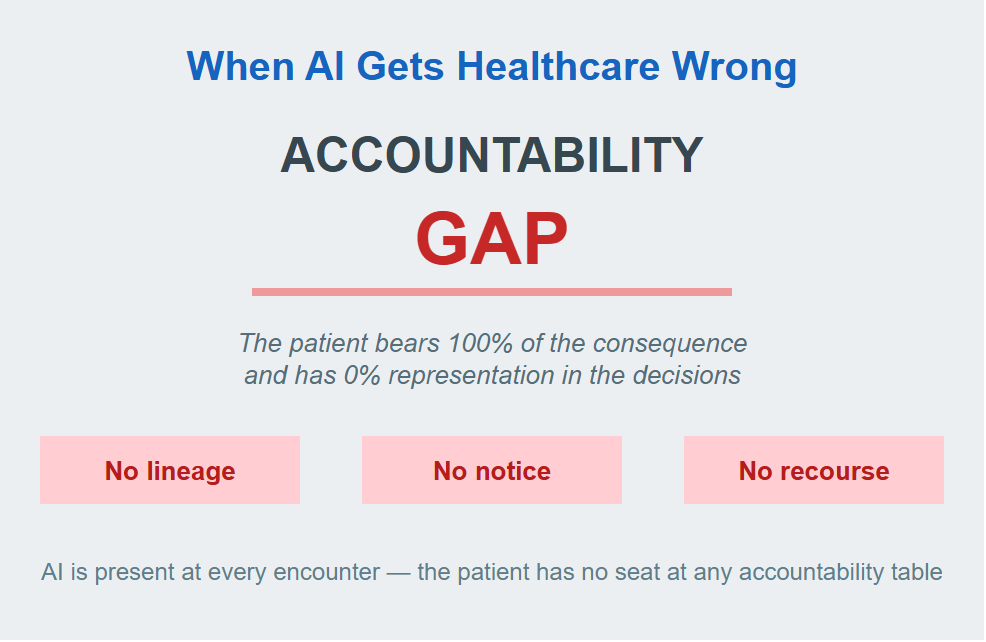
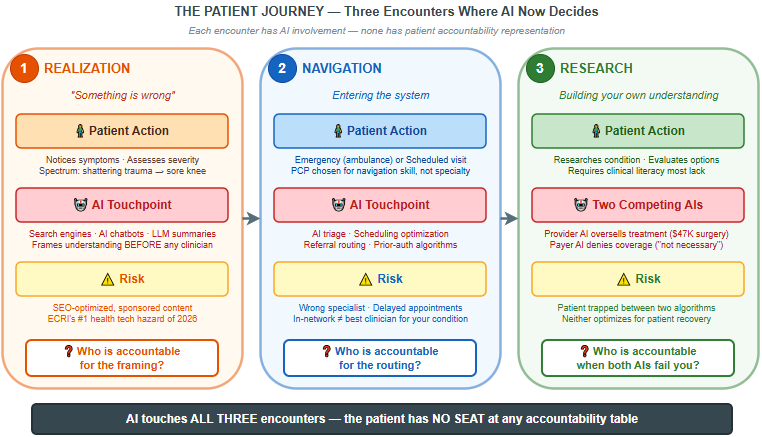
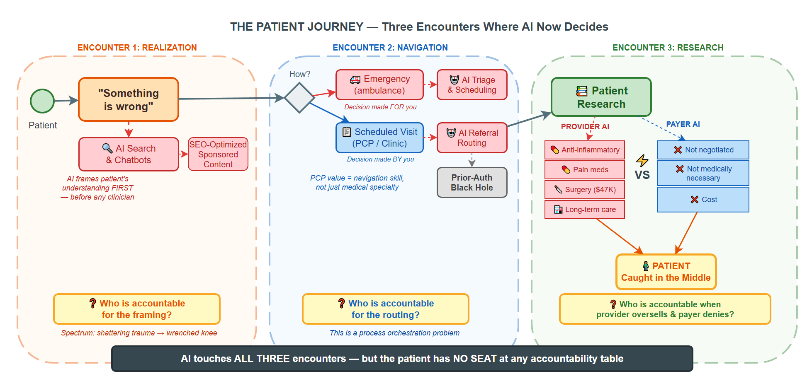
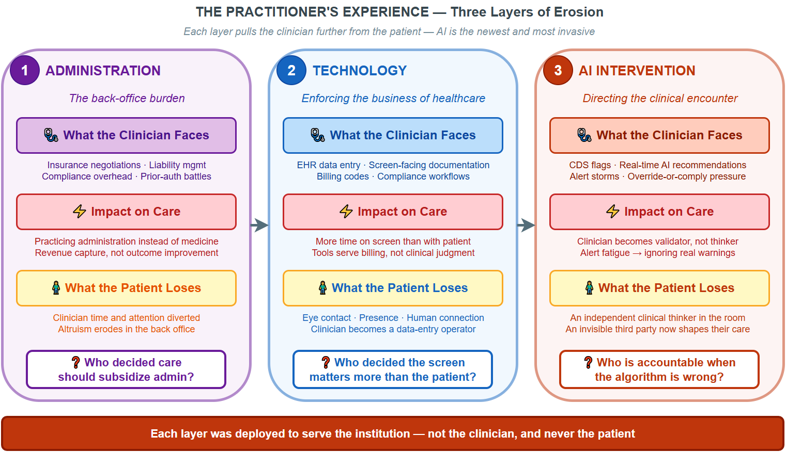

# When AI Gets Healthcare Wrong

{ width=75% }

**Author:** Gary Samuelson  
**Date:** March 24, 2026  
**Part 1 of 2** — This piece examines the accountability gap from the patient's perspective. The companion piece, [The Governance Gap: What Enterprises Need Above the Agent Runtime](../agentic/governance-gap.md), opens the hood and shows how the technology actually plays out — where today's agent runtimes fit, and where they fall short.  
**Inspired by:** [Sarah Matt, MD — LinkedIn Post on AI Accountability in Healthcare](https://www.linkedin.com/posts/sarahmattmd_healthcareai-patientsafety-healthsystemgovernance-activity-7442201522131763201-nT2f)  
**See also:** [What Hospital Boards Get Wrong About Healthcare AI — drsarahmatt.com](https://drsarahmatt.com/blog/what-hospital-boards-get-wrong-about-healthcare-ai)

---

## The Question That Should Disturb You

Dr. Sarah Matt, MD framed the question most health system boards aren't asking:

> *When an AI-assisted clinical decision contributes to a bad patient outcome, the question of who is accountable does not have a clear answer in most health systems right now.*
>
> <small>— Dr. Sarah Matt, MD ([LinkedIn, March 2026](https://www.linkedin.com/posts/sarahmattmd_healthcareai-patientsafety-healthsystemgovernance-activity-7442201522131763201-nT2f) · [drsarahmatt.com](https://drsarahmatt.com/blog/what-hospital-boards-get-wrong-about-healthcare-ai))</small>

The vendor contract limits liability. The physician carries clinical responsibility. The administrator made an operational decision. And the governance structure that approved the technology may not have included the clinical expertise to evaluate it.

That's the institutional view — and it's important. But there's a perspective missing from nearly every one of these conversations: **the patient's**.

Not the patient as a data point in a clinical decision support system. Not the patient as a liability exposure. The person — mortal, vulnerable, and trusting — who walked into a system they don't fully understand, believing that someone, somewhere, is looking out for them.

That person is who this is about. I know what happens to them — I've seen it close up.

---

## Both Sides Broken

Two observations surface from that framing — one about the system, one about the people working inside it. Together, they shape everything that follows.

**The system disengages from the person — and the person disengages from their own health.** Somewhere on the journey from "I need help" to the exam room, you stop being a person and become a case. The services you encounter — scheduling, triage, referral, prior authorization — aren't designed around *you*. They're designed around your condition, your coverage, your risk profile. And the more the system objectifies the patient, the less the patient feels capable of engaging. Most people have surrendered agency over the one thing that is irreplaceably theirs: their body. Their time here. When navigating your own healthcare requires the equivalent of a law degree and a medical residency, most people default to trust. And trust, in a system optimized for revenue capture, is a vulnerability.

**The practitioners are losing the fight too.** Care providers increasingly spend their professional energy on insurance negotiations, liability management, and compliance overhead that has nothing to do with the patient in front of them. Technology in healthcare has primarily been deployed as a means of enforcing the *business* of healthcare — not the practice of it. *Billing. Compliance. Denial management.* The tools serve the institution's financial objectives, not the clinician's clinical ones. The altruism of care-providing doesn't erode in the exam room. It erodes in the back office.

These two realities collide in the patient's actual experience — and AI is now present at every point of collision. To see how, you have to walk through it as the person whose body is on the line.

---

## Three Encounters: The Patient's Experience

Three distinct encounters — three moments where the system either serves or fails — and AI touches them all.

*Figure 1: The patient journey at a glance. Each encounter has the same structure: the patient acts, AI intervenes, risk accumulates — and accountability is absent. Notice the pattern: in every column, there is a question at the bottom that no one in the current governance framework is positioned to answer.*

What makes this framework useful is that it exposes a repeating structural failure — not a one-time oversight. At each encounter, the patient faces a different AI system optimized for a different stakeholder's objective. The framing AI in Encounter 1 optimizes for engagement. The routing AI in Encounter 2 optimizes for operational throughput. The competing AIs in Encounter 3 optimize for revenue on one side and cost containment on the other. None of them optimize for the patient's recovery. And at no point does the patient have visibility into — let alone influence over — the algorithms shaping their path.

The detailed diagram below expands each encounter into its full process flow, showing the specific decision points, routing logic, and accountability gaps as they actually unfold:

*Figure 2: The full patient journey — process flows, decision points, and the accountability questions that arise at each encounter. The bottom bar states what the summary above implies: AI touches all three encounters, but the patient has no seat at any accountability table.*

### Encounter 1: The Realization

It starts with an owie.

And I say that without any intention to trivialize, because this first encounter spans the entire spectrum of human experience — from the shattering trauma of a sudden cardiac event, a cancer diagnosis, a car accident, to the relatively benign (but still real) wrenched knee that makes you think: *"Ouch — maybe I should see my orthopedist."*

The accountability question begins here, even though nobody talks about it here. Because this is the moment where the patient's own health literacy — their ability to assess severity, to know when to act, to distinguish "wait and see" from "go to the ER now" — determines the trajectory of everything that follows.

And increasingly, this is where AI shows up first. Not in the hospital. Not in the clinic. On the patient's phone. In a search engine. In a chatbot. The patient Googles their symptoms, and an AI-generated summary tells them what it *might* be. Before any clinician is involved, an algorithm has already framed the patient's understanding of their own condition.

**Who is accountable for that framing?**

### Encounter 2: The Navigation

We've decided to see someone. This decision is either made *for* us — the ambulance route to the hospital, with its own host of options that can be concerning in their own right — or we're scheduling a visit to our clinic, our primary care provider.

Here's something I've learned that most people don't say out loud: **I choose my PCP not by their medical specialty, but by their ability to navigate the system on my behalf.** They're good at medicine — that's table stakes. But what makes them invaluable is that they are very, very good at connecting me with the necessary resources and services. They know how to route. They know who to call. They know which referral paths actually lead somewhere and which ones dead-end in a prior-authorization black hole.

This is a *process orchestration problem*. And I recognize it because I've spent twenty years solving exactly this kind of problem in enterprise systems — routing, escalation, resource allocation, exception handling. The healthcare system is, at its core, a horrifically complex workflow. And most patients are navigating it without a map.

Now drop AI into this encounter. AI-assisted triage. AI-powered scheduling optimization. AI-driven referral recommendations. Each one is a decision point where the patient's path through the system is being shaped by an algorithm.

**Who is accountable when the AI routes you to the wrong specialist? When the scheduling optimizer delays your appointment by three weeks because the model ranked urgency incorrectly? When the referral recommendation steers you toward an in-network provider that's in-network precisely because they agreed to lower reimbursement rates — not because they're the best clinician for your condition?**

### Encounter 3: The Research

At this stage, I begin my own research. And here I have an unfair advantage: I grew up in a medical family. I have the semantics and the ontology — the necessary language and knowledge paths to navigate healthcare. I can read a textbook. I can interpret a study. I can distinguish a peer-reviewed finding from a sponsored content piece dressed up as medical guidance.

Most people do not have this advantage. And the information landscape — including AI systems and LLMs — is increasingly shaped by commercial incentives that don't always align with the patient's clinical needs.

Here's what that looks like from the patient's perspective. You have a wrenched knee. You search for guidance. The AI-curated, search-optimized results present a treatment landscape that escalates quickly:

- Anti-inflammatory medication (reasonable — but now framed as an ongoing prescription)
- Pain management medication (a category that carries its own regulatory and clinical weight)
- Orthopedic surgery (the \$47,000 option)
- Long-term rehabilitation and care

Each recommendation may be clinically defensible in isolation. The problem is that no single system is evaluating whether *this particular patient* needs *this particular escalation* — or whether the ranking reflects clinical evidence or commercial positioning.

Now consider the other side: **insurance**. The payer's response is equally algorithmic, equally AI-assisted, and often equally disconnected from the individual patient's needs:

- *"We can't connect you with these services because we haven't negotiated rates with that provider."*
- *"We're denying this claim because our model indicates the procedure isn't medically necessary."*

Behind these responses is an objective function: cost containment. That's not inherently wrong — every system has resource constraints. But when AI is deployed to optimize claim adjudication, it optimizes for *that* function. The patient's recovery timeline, pain level, and functional outcome are not in the loss function.

**Who is accountable when the AI on the provider side recommends aggressively, the AI on the payer side denies conservatively, and the patient is caught in the middle with a blown-out knee and a denied surgery?**

---

## The Accountability Gap — Through a Systems Lens

Sarah Matt put it directly: *"When an AI-assisted clinical decision contributes to a bad patient outcome, the question of who is accountable does not have a clear answer in most health systems right now."*† She identified four actors across whom accountability is currently distributed — and none of them hold it cleanly:

<small>† Dr. Sarah Matt, LinkedIn, 2025. Podcast: drsarahmatt.com/podcast</small>

These are exactly the right operational questions. But notice who is absent from all four:

| Actor | Their Accountability | The Problem |
|-------|---------------------|-------------|
| **AI Vendor** | Limited by contract | Liability is capped. Performance is measured by model accuracy, not patient outcomes. |
| **Physician** | Clinical responsibility | They acted on a recommendation they may not have had the tools to evaluate independently. |
| **Administrator** | Operational decision | They approved the deployment based on ROI projections, not clinical evidence. |
| **Governance Board** | Technology approval | May not have included clinical expertise to evaluate what they were approving. |

What's missing from this table is a fifth row — the one nobody puts in the contract:

| **Patient** | Bears the consequence | Has the least information, the least power, and zero representation in any of the four decisions above. |

This is the structural failure. Not that accountability is distributed — distribution of accountability is normal in complex systems. The failure is that **the person who bears the full weight of the consequence has no seat at the table where the decisions are made.**

Sarah Matt tells a story that makes this concrete: rounding with a CMO at a 600-bed system. Strong digital front door metrics — appointment starts up 22%, digital registration climbing. Then she walks to a patient floor and sees a whiteboard in a 71-year-old patient's room. Diabetes, COPD, heart condition, five-day stay. On the whiteboard: four phone numbers the patient had written herself. Cardiology scheduling. Pulmonary clinic. Endocrinology. The main hospital line. Nobody had given her a care navigation plan. Nobody had told her the portal she used to check in could also schedule her follow-up appointments.

That is the gap — rendered in a whiteboard. The technology is performing. The patient doesn't know it exists. A $40 million digital front door investment, and the patient is still writing phone numbers on a whiteboard. AI doesn't fix this. Care design fixes this.

---

## Why the Practitioner Can't Save You Either

If the patient has no seat at the accountability table, you might expect the physician — the person in the room — to be their advocate. But the practitioner's capacity to fulfill that role is eroding under the same forces that created the accountability gap in the first place.

*Figure: Three layers of erosion — each one deployed to serve the institution, each one pulling the clinician further from the patient. Administration consumed time. Technology consumed attention. AI is now consuming judgment itself.*

Robert Wachter documented this trajectory in *The Digital Doctor*: the EHR already turned clinicians into data-entry operators who spend more time facing a screen than facing their patient. AI-driven clinical decision support adds another layer — the system doesn't just record the encounter anymore, it *directs* it. When an algorithm tells a care provider what they should do, the clinician's professional judgment — the thing patients are actually trusting when they show up — gets mediated by a system the clinician may not fully understand and the patient doesn't know exists.

Holley and Becker, in *AI-First Healthcare*, observe that the tension between algorithmic guidance and clinical autonomy represents one of the defining challenges of healthcare AI adoption. Alert fatigue is already a documented phenomenon — clinicians receive so many system-generated recommendations that they begin ignoring them, which defeats the purpose and introduces new risk. But the deeper problem isn't fatigue. It's alienation. When a practitioner's role shifts from *exercising judgment* to *confirming or overriding algorithmic output*, the provider becomes a validator of machine recommendations rather than an independent clinical thinker. And the patient — who came to see a *person* — is now being treated by someone whose attention is split between them and a system that is, functionally, a third party in the room.

That distinction matters enormously for accountability. Because the AI being deployed in healthcare today isn't neutral. It inherits the objectives of whoever funded it. The practitioner is no longer an independent advocate — they're operating inside a system that shapes what they see, what they recommend, and how much time they have to think about either. The patient's last line of defense is compromised by the same technology the patient is being told to trust.

---

## What I Bring to This — And Why I'm Writing It

I'm not a physician. I come from a medical-professional family and seriously considered pursuing medicine, but I chose software and systems engineering instead. I've spent two decades building the kind of systems that healthcare is now adopting — process orchestration, decision automation, knowledge graphs, semantic lineage — and I've seen what happens when these systems outrun governance.

What that experience taught me and what matters:

1. **Every AI recommendation is a process routing decision.** It selects a path. It deprioritizes alternatives. It shapes what the clinician sees and what they don't see. In system design, we call this *decision architecture* — and it carries more weight than the term "decision support" implies. IBM's Watson for Oncology demonstrated the cost of ignoring this distinction — $62 million at MD Anderson Cancer Center before the project was cancelled, with no evidence of improved patient outcomes ever produced.[2]

2. **Accountability requires lineage.** You cannot hold anyone accountable unless you can trace the chain: what data went in, what model processed it, what recommendation came out, who saw it, who acted on it, and what the outcome was. Most healthcare AI deployments today cannot produce this trace. (This is the class of problem that semantic lineage frameworks are designed to solve — not for healthcare specifically, but for any domain where algorithmic decisions carry consequential weight.)

3. **Governance needs clinical expertise at the table.** Commercial AI platforms have already placed health assistants in front of hundreds of millions of consumers. Patients in your waiting room are using these tools to decide whether to call you, what to ask, and whether the diagnosis you gave them sounds right. When the approval committee doesn't understand the technology, the approval process becomes procedural rather than substantive. And when the board declines to engage at all, it cedes the patient's first clinical encounter to a commercial platform with a commerce-optimized objective function.[1]

4. **The patient must become a participant, not just a recipient.** This means transparency — real transparency, not a 47-page consent form. It means the patient knows when AI is involved in their care. It means they can ask: *What did the AI recommend? Did my doctor agree? Did my doctor override it? Why?*

---

## What Next?

Clinical care and systems engineering should be working together.

What I want to explore in subsequent sections:

- **The semantic gap between clinical knowledge and patient understanding** — how we build bridges, not walls, between medical expertise and patient agency
- **Process orchestration patterns that enforce accountability** — deterministic guardrails around AI-assisted clinical decisions (the same sandwich pattern I've applied in EMS STEMI detection, applied to the broader care continuum)
- **Knowledge graph architectures for healthcare lineage** — how you build a traceable chain from AI recommendation to patient outcome
- **The insurance AI problem** — why payer-side AI optimization is the accountability question nobody wants to answer
- **What "informed consent" means when the decision-maker is an algorithm** — and why current consent frameworks are inadequate

The conversation health system boards need to have before the next contract is signed is necessary. But it's not sufficient. The conversation needs to include the person on the other end of the decision.

Underneath both of these questions — accountability and governance — is a harder one: **whose interests is the AI actually serving?** That question is the subject of **For Whom Does the AI Work?**, which examines how AI systems in healthcare, adtech, and financial services are each optimizing for institutional objectives while presenting themselves as serving the user.

### Part 2: How the Technology Actually Plays Out

The questions above — *who is accountable, what is traceable, whose objective function is the AI optimizing* — aren't hypothetical. They play out in a specific, concrete process that touches every insured American: the specialist referral.

In the companion piece, **[The Governance Gap: What Enterprises Need Above the Open-Source Agent Runtime](../agentic/governance-gap.md)**, I take one referral — a patient who needs a cardiologist — and trace it through the same three perspectives this paper introduced: the patient, the provider, and the insurance company. The same referral moment produces a \$45 copay or a \$4,700 surprise bill depending on which AI agent made which invisible decision.

The open-source agent runtimes available today are genuine foundations — capable and increasingly accessible. What they don't ship is the governance substrate above them: the layer that traces every agent decision through organizational context, enforces deterministic boundaries that no prompt engineering can override, and makes the reasoning behind a \$4,700 bill auditable in three seconds rather than three weeks. The runtime tells agents *how* to act. The governance layer defines *where their autonomy begins and ends* — and holds the record of every decision they made along the way.

The accountability gap at the board level is already an architecture problem at the agent level. Part 2 names what's missing — and what the governed architecture looks like when it's built right.

---

## Appendix: The Commercial Platform Problem

[1] The pattern described in point #3 is not hypothetical. In March 2026, Amazon launched two distinct healthcare AI products in a single week: **Amazon Connect Health**, a B2B administrative platform targeting scheduling, verification, and documentation at $99/user/month; and a **consumer-facing health AI assistant** now accessible to its approximately 200 million Prime accounts. The consumer product places Amazon at the patient's *intent layer* — the moment a person searches for a specialist, evaluates symptoms, or decides whether to seek care. The referral loop between "Health AI suggests you might need X" and "Amazon sells X" is the business architecture.

ECRI naming AI chatbot misuse the #1 health technology hazard of 2026 the same week these products launched is not coincidence — it is the entire tension in one news cycle.

As Dr. Matt observed: *"The board that votes to 'wait and see' on AI is not managing risk. It is outsourcing the patient's first clinical touchpoint to Amazon's product team."*

Amazon is illustrative, not unique. OpenAI launched ChatGPT Health in January 2026. Anthropic launched Claude for Healthcare the same month. The structural concern is the *class* of deployment: commercial platforms optimizing for engagement and commerce inserting themselves into clinical decision pathways without clinical governance, accountability lineage, or patient transparency. The vendor changes. The pattern does not.

For a detailed analysis of the two Amazon products and the governance questions they raise, see Dr. Matt's full article: [What Hospital Boards Get Wrong About Healthcare AI](https://drsarahmatt.com/blog/what-hospital-boards-get-wrong-about-healthcare-ai).

---

## Appendix: What "AI Recommending" Actually Is — And What It Isn't

Point #1 above states that every AI recommendation is a process routing decision. This deserves unpacking, because the gap between what people *think* AI recommendation means and what it *actually does* is where the accountability failure begins.

**What most people hear:** The AI evaluated my situation and suggested the best course of action — like a second opinion from a very smart colleague.

**What actually happens:** A statistical model, trained on historical patterns, assigned a probability score to each of several possible paths. The path with the highest score was presented. The others were suppressed. The model has no causal understanding of *why* that path is appropriate for this patient. It has a correlation. Correlation derived from training data that reflects whatever biases, gaps, and institutional incentives shaped that data.

This is not a second opinion. It is a *routing decision made by an optimization function* — and the function's objective may or may not align with the patient's clinical outcome.

**The term "decision support" obscures this.** When we call it decision support, it sounds advisory — optional, subordinate to the clinician's judgment. In practice, decision architecture is closer to the truth. The AI determines *what the clinician sees*, *in what order*, *with what emphasis*. Research on anchoring bias is clear: the first option presented disproportionately shapes the decision, even among experts. The AI isn't supporting the decision. It is *framing* it.

### Why This Matters for High-Stakes Domains

In low-stakes contexts — product recommendations, playlist curation — statistical routing is fine. A wrong recommendation wastes a few minutes or a few dollars. The feedback loop is fast, the consequence is reversible, and the user has full agency to ignore the suggestion.

Healthcare is none of those things. The consequence is irreversible. The feedback loop is slow (outcomes may take months or years to manifest). The patient often lacks the expertise to evaluate the recommendation independently. And the clinician, under time pressure and cognitive load, may defer to the AI's framing without realizing that *deferral* and *agreement* are not the same thing.

### The Neurosymbolic Alternative

The architectural response to this is not to remove AI from clinical decision-making — pattern recognition at scale is genuinely valuable. The response is to pair it with a reasoning layer that compensates for what statistical models cannot do.

**Neurosymbolic systems** combine two complementary capabilities:

- **The neural layer** does what it does well: pattern matching across large datasets, identifying correlations that a human might miss, processing unstructured data (imaging, clinical notes, lab trends) at speed.
- **The symbolic layer** provides what neural networks cannot: explicit clinical reasoning encoded in knowledge graphs, protocol ontologies, and causal models. Contraindication rules. Drug interaction logic. Clinical pathway constraints that are *not* probabilistic — they are deterministic and non-negotiable.

The result is a system that doesn't just say "recommend Treatment A" — it can trace *why*: which clinical protocols were satisfied, which contraindications were checked, which pathways were considered and ruled out, and what the reasoning chain was from data to recommendation. That trace is the lineage. And lineage is the prerequisite for accountability.

**What this changes in practice:**

| Pure Statistical AI | Neurosymbolic Architecture |
|---------------------|---------------------------|
| Recommends based on pattern correlation | Recommends based on pattern *and* causal reasoning |
| Cannot explain why alternatives were suppressed | Traces which protocols, rules, and evidence shaped the path |
| No guardrails — any output the model generates is possible | Deterministic constraints prevent clinically dangerous routes regardless of model output |
| Accountability gap: nobody can reconstruct the decision | Lineage: the full chain from data → reasoning → recommendation → outcome is auditable |
| Anchoring bias unchecked — clinician sees one framed option | Multiple reasoning paths preserved and visible to the clinician |

This is not speculative architecture. The deterministic-agentic-deterministic pattern described in my work on [EMS STEMI detection](https://garysamuelson.github.io/agentic/agentic-agency-and-workflows/) is exactly this: a life-safety clinical workflow where agentic AI operates *within* deterministic guardrails that no prompt engineering or model drift can override. The neural layer identifies the pattern. The symbolic layer enforces the protocol. The clinician retains agency with full visibility into both.

For high-stakes domains — healthcare, financial services, criminal justice — the question is not whether AI should participate in decisions. It is whether we will deploy AI as an opaque routing function or as an accountable reasoning partner. The architecture determines the answer.

---

## Appendix: The Watson Precedent

[2] Before the current wave of commercial health AI, IBM ran the experiment at scale — and it failed in exactly the ways this paper predicts.

In 2013, the **University of Texas MD Anderson Cancer Center** in Houston partnered with IBM Watson to build an *Oncology Expert Advisor* — a clinical decision support tool for leukemia treatment. The vision: Watson's natural-language processing, proven on *Jeopardy!*, would read patient records, mine the medical literature, and recommend personalized treatment plans. IBM CEO Virginia Rometty called it a "golden age" for AI in medicine.

By 2016, MD Anderson had spent **$62 million** on the project. A University of Texas audit found the tool had never progressed beyond a prototype. The project was cancelled.

The failure modes map directly to the decision architecture problem described above:

- **Watson couldn't read medical literature the way a doctor does.** As Mark Kris, a lung cancer specialist at Memorial Sloan Kettering who led a parallel Watson collaboration, put it: *"Watson's thinking is based on statistics, so all it can do is gather statistics about main outcomes. But doctors don't work that way."* When the FDA approved a new cancer drug based on dramatic results in just 55 patients, Watson couldn't update its model on that evidence. No symbolic reasoning layer meant no mechanism to incorporate clinical judgment at the protocol level.

- **Watson couldn't handle the messiness of real patient records.** Electronic health records are full of missing data, ambiguous notation, and non-chronological entries. Watson achieved 90-96% accuracy on clear concepts like diagnosis, but only 63-65% accuracy on time-dependent information like therapy timelines. An accountability-grade system cannot operate at 65% on treatment sequencing.

- **No lineage, no explainability.** When Watson's recommendations diverged from expert oncologists — which happened roughly 30-50% of the time depending on cancer type — there was no reasoning chain to audit. No trace from data to recommendation. The clinician couldn't evaluate *why* Watson suggested what it suggested, only that it did. This is the opaque routing problem in its purest form.

- **Marketing outpaced clinical validation.** Robert Wachter, chair of medicine at UCSF, summarized it precisely: *"They came in with marketing first, product second, and got everybody excited. Then the rubber hit the road."* Not a single peer-reviewed paper demonstrated improved patient outcomes from Watson in oncology. The system was deployed internationally — hospitals in India, South Korea, and Thailand marketed "AI-powered cancer care" to patients — without evidence that it helped them.

The Watson Health division ultimately cost IBM **$4 billion** to develop and was sold in 2022 to Francisco Partners for $1 billion. IBM lost 10% of its stock value. Martin Kohn, IBM's own former chief medical scientist, rendered the verdict: *"Merely proving that you have powerful technology is not sufficient. Prove to me that it will actually do something useful — that it will make my life better, and my patients' lives better."*

Every structural failure described in this paper — decision architecture disguised as decision support, governance without clinical expertise, deployed AI with no accountability lineage, marketing velocity exceeding clinical validation — played out in the Watson deployment a decade ago. The technology has changed. The failure pattern has not.

---

## References & Context

- **Sarah Matt, MD** — [LinkedIn Post: AI Accountability in Healthcare Governance](https://www.linkedin.com/posts/sarahmattmd_healthcareai-patientsafety-healthsystemgovernance-activity-7442201522131763201-nT2f) (March 2026)
- **Sarah Matt, MD** — [What Hospital Boards Get Wrong About Healthcare AI](https://drsarahmatt.com/blog/what-hospital-boards-get-wrong-about-healthcare-ai) — Full analysis of the binary adoption frame, commercial health AI platform launches, four governance questions, and the whiteboard story
- **Gary Samuelson** — [Agentic AI in Emergency Medicine: STEMI Detection with Deterministic Guardrails](https://garysamuelson.github.io/agentic/agentic-agency-and-workflows/) — A worked example of the deterministic-agentic-deterministic governance pattern applied to life-safety clinical workflows
- **Gary Samuelson** — [Seven-Layer Semantic Lineage Architecture](https://garysamuelson.github.io/) — Framework for traceable, auditable algorithmic decision chains
- **ECRI** — Named AI chatbot misuse the #1 health technology hazard of 2026
- **Robert Wachter** — [*The Digital Doctor: Hope, Hype, and Harm at the Dawn of Medicine's Computer Age*](https://learning.oreilly.com/library/view/-/9780071849470/) (McGraw-Hill, 2015) — Documents how technology in the exam room shifts clinician attention from patient to screen, and the consequences for care quality
- **Kerrie L. Holley & Siupo Becker** — [*AI-First Healthcare*](https://learning.oreilly.com/library/view/-/9781492063148/) (O'Reilly, 2021) — Examines the tension between algorithmic guidance and clinical autonomy in AI-driven healthcare
- **Calvin L. Chou & Laura Cooley** — [*Communication Rx: Transforming Healthcare Through Relationship-Centered Communication*](https://learning.oreilly.com/library/view/-/9781260019759/) (McGraw-Hill, 2017) — Framework for preserving the human connection in clinical encounters under increasing technological mediation
- **Ronald M. Razmi** — [*AI Doctor*](https://learning.oreilly.com/library/view/-/9781394240166/) (Wiley, 2024) — Examines how commercial AI platforms are reshaping clinical decision pathways and the governance implications for health systems
- **James Sayles** — [*Principles of AI Governance and Model Risk Management*](https://learning.oreilly.com/library/view/-/9798868809835/) (Apress, 2024) — Governance frameworks for AI accountability, model risk, and transparency in consequential decision domains
- **L. Y. Pratt & N. E. Malcolm** — [*The Decision Intelligence Handbook*](https://learning.oreilly.com/library/view/-/9781098139643/) (O'Reilly, 2023) — Frameworks for structuring decisions that combine data-driven models with causal reasoning and human judgment
- **Chip Huyen** — [*AI Engineering*](https://learning.oreilly.com/library/view/-/9781098166298/) (O'Reilly, 2024) — Engineering practices for production AI systems, including guardrails, evaluation, and the gap between model output and reliable decision architecture
- **Eliza Strickland** — [How IBM Watson Overpromised and Underdelivered on AI Health Care](https://spectrum.ieee.org/how-ibm-watson-overpromised-and-underdelivered-on-ai-health-care) (IEEE Spectrum, April 2019) — Comprehensive investigation of Watson's healthcare failures, including the MD Anderson and Memorial Sloan Kettering collaborations, with direct interviews from IBM researchers, oncologists, and former Watson team members

---

*Gary Samuelson is a software engineering leader with 20+ years in AI architecture, process orchestration, and enterprise data platforms. He grew up in a medical-professional family and still hasn't decided if he made the right career choice. His blog is at [garysamuelson.github.io](https://garysamuelson.github.io/).*

---

*© 2026 Gary Samuelson | CC BY-NC-ND 4.0 — Share freely with attribution. No commercial use. No derivatives without permission.*
