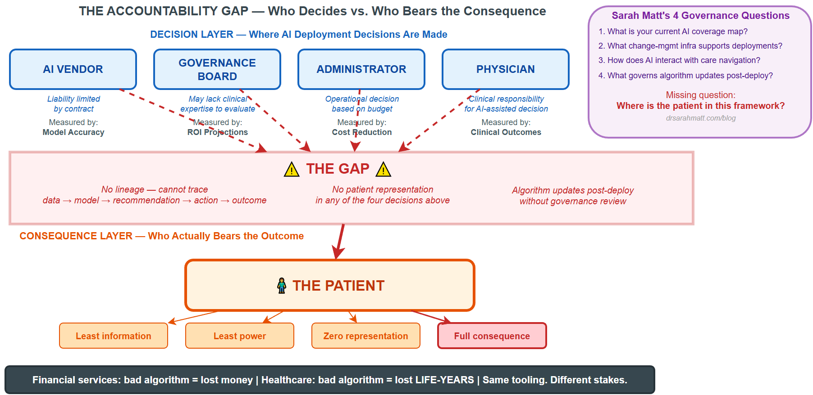
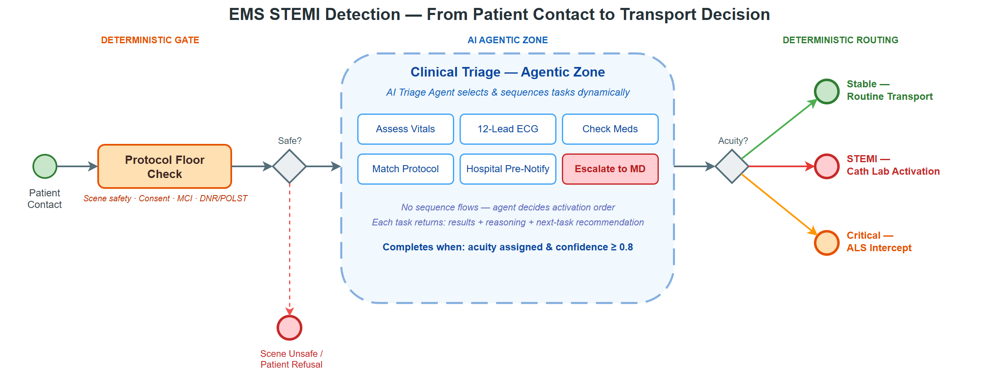

# Gary Samuelson — AI & Architecture Research

Welcome. I'm Gary Samuelson, a senior enterprise architect and AI researcher focused on
the intersection of **Semantic AI**, **Knowledge Graphs**, and **Agentic Systems**.

---

## Recent Publications

<strong><a href="healthcare/healthcare-accountability/">Who Is Accountable When AI Gets Healthcare Wrong?</a></strong> 
<small>March 25, 2026 · Healthcare AI · Governance</small>

When an AI-assisted clinical decision contributes to a bad patient outcome, the question of who is accountable does not have a clear answer. A patient-side view of the governance gap — and what the technology needs to fix it.

<a href="healthcare/healthcare-accountability/">Read →</a>

<strong><a href="agentic/agentic-agency-and-workflows/">Agentic AI in Emergency Medicine: STEMI Detection with Deterministic Guardrails</a></strong> 
<small>March 22, 2026 · Agentic AI · BPMN</small>

Two forms of "agentic" mapped onto a real EMS STEMI detection workflow — a three-layer architecture, an AI triage agent inside a constrained agentic zone, and a physician-in-the-loop when confidence drops below threshold.

<a href="agentic/agentic-agency-and-workflows/">Read →</a>

---

## Topics

| Area | Description |
|------|-------------|
| Semantic AI | LLMs + Knowledge Graphs + ontologies |
| Agentic Systems | Multi-agent orchestration, autonomous workflows |
| BPMN + AI | Intelligent process automation with Zeebe and Camunda |
| Healthcare AI | Governance, accountability, patient safety |
| Enterprise Architecture | Modernization, cloud-native patterns |

---

*Research notes and papers are sourced from ongoing work in enterprise AI transformation.*
