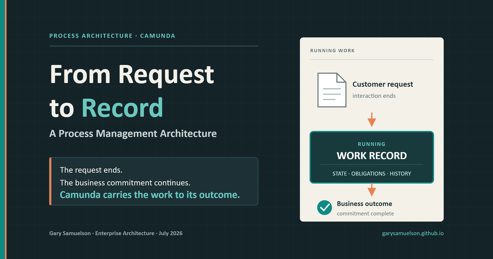
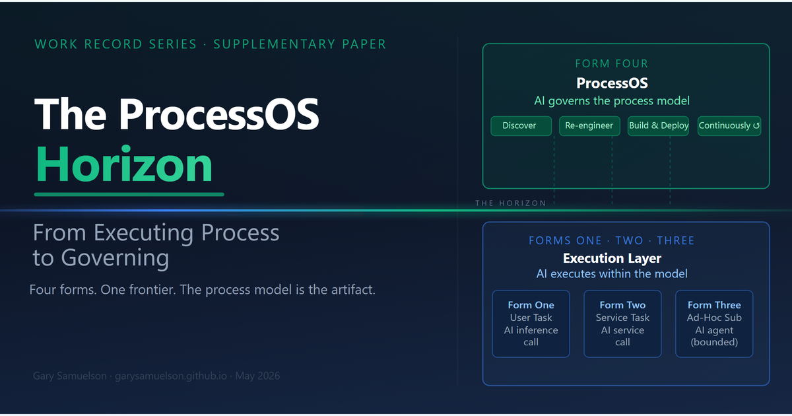
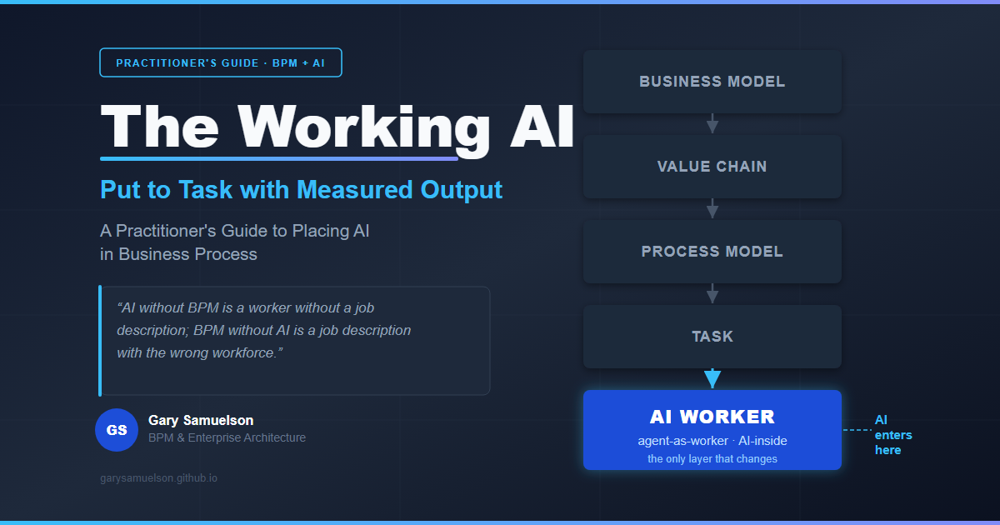
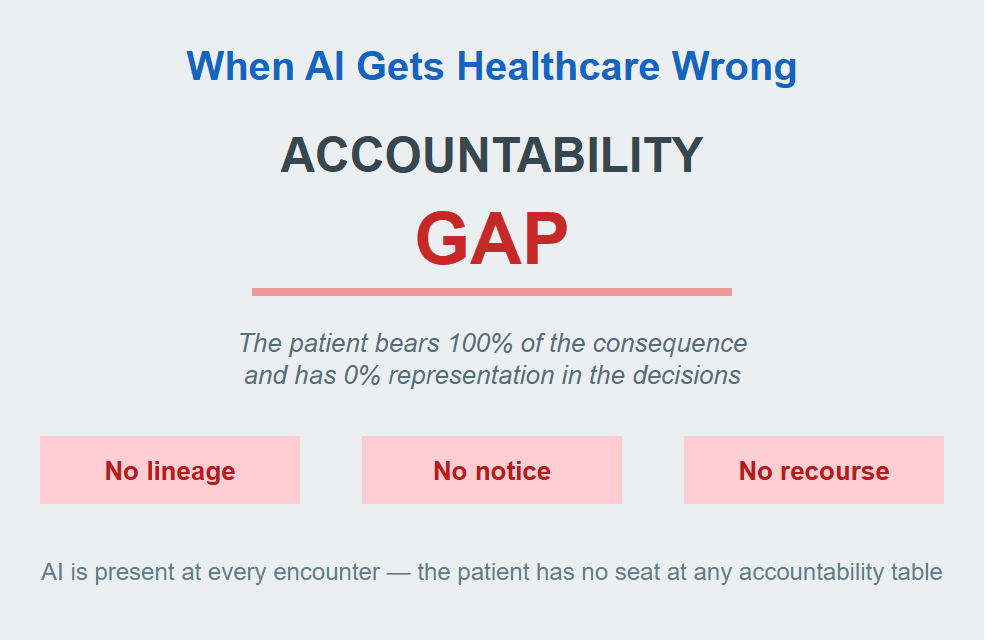
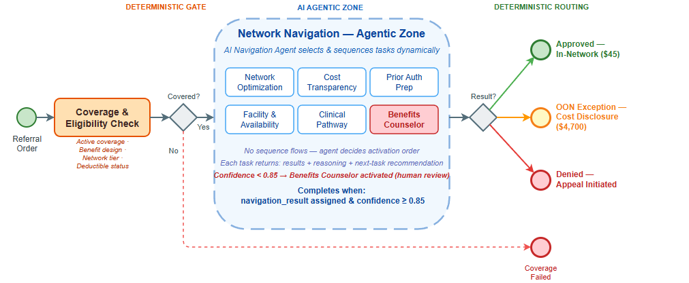
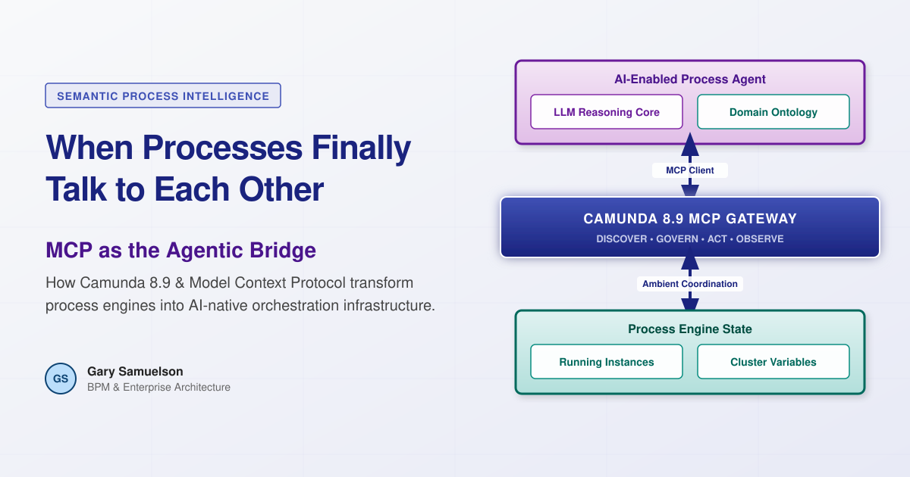
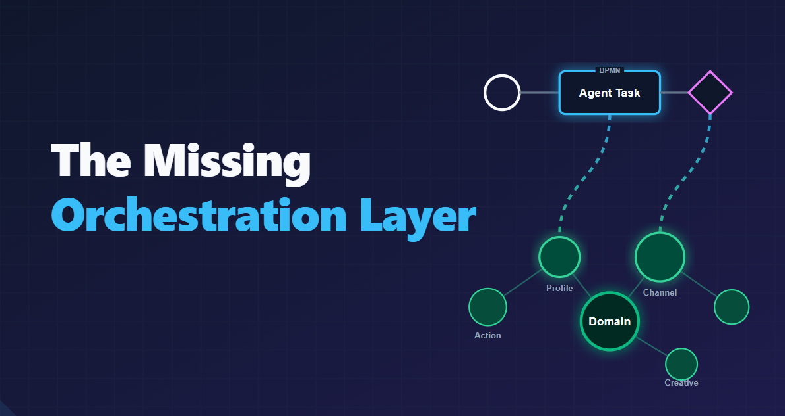
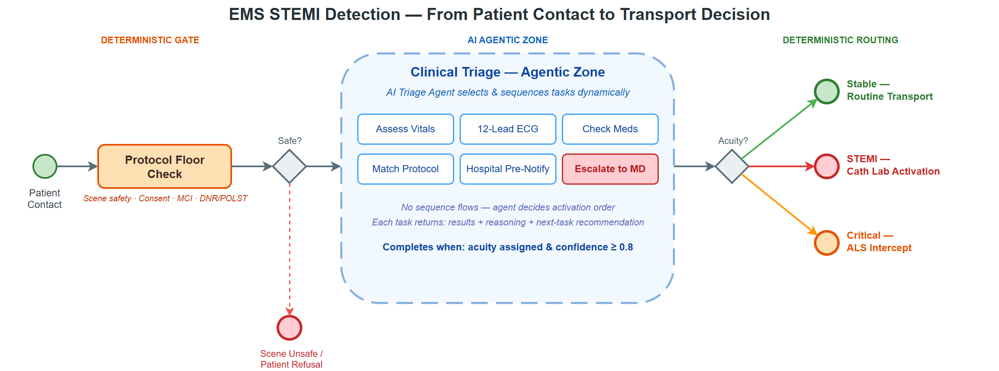
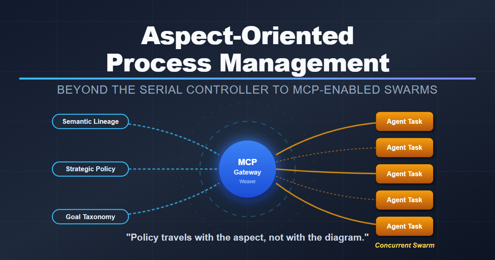

# Gary Samuelson — AI & Architecture Research

I'm an enterprise architect and AI researcher focused on the **full lifecycle** of intelligent systems — how they're designed, built, operated, and eventually replaced. Architecture and operations are two views of the same system.

My core conviction: **agent architecture IS process architecture.** The disciplines that make business processes reliable — value-stream thinking, conformance, auditable lineage — apply directly to agentic AI. The thesis I keep developing: **domain semantics should drive orchestration**, and orchestration, run well, refines those semantics in return. The runtime isn't where you put your intelligence; it's the deterministic spine that makes intelligence safe to deploy.

The test I keep applying to any design: does it produce decisions you can still defend when the regulation changes two years from now? That question is what separates ecosystem thinking from architecture thinking. The organizations that handle it well aren't the ones with the best initial designs — they're the ones that encoded domain knowledge in a form the next team can read, reason over, and hand off.

I've built production AI systems in emergency medicine, real-time ML platforms at ad-tech scale, and enterprise modernization programs in global banking. When I'm not drawing BPMN diagrams or arguing about ontologies, I'm reading philosophy — the systems-thinking kind, where questions about structure and accountability trace back further than anyone in tech wants to admit.

---

## Latest: From Request to Record — A Process Management Architecture

The application request ends. The business commitment does not. This paper traces the architecture that carries work beyond the original interaction: a running Camunda process instance with identity, state, obligations, constraints, and history.

<small><strong>New · July 26, 2026</strong> · BPM · Process Architecture · Camunda · Enterprise Architecture · Agentic AI</small> 
<strong><a href="agentic/from-request-to-record/">From Request to Record: A Process Management Architecture</a></strong>

Applications complete requests. Process architecture carries commitments. Follow the transition from immediate service orchestration to a running Work Record that coordinates people, systems, events, transactions, and AI until the business outcome is complete.

<a href="agentic/from-request-to-record/">Read →</a>

---

## Previously: Process‑First AI — Dimensions of the Running Work Record

Four forms. Three dimensions. AI enters the Work Record through a task — User Task, Service Task, Ad-Hoc Subprocess, or Process Model Governance. What it gains by entering is the same across all three instance-level forms: computational presence, organizational gravity, and temporal persistence.

<small><strong>New · June 7, 2026</strong> · BPM · Agentic AI · Process Orchestration · Enterprise Architecture · ProcessOS</small> 
<strong><a href="agentic/process-first-ai-dimensions/">Process‑First AI: Dimensions of the Running Work Record</a></strong>

The Work Record is not a document — it is a running object with weight, state, and structural authority. Four forms map how AI enters it. Three dimensions define what AI gains: live state, obligation generation, and temporal continuity past any context window. Work Record Series — Part 2.

<a href="agentic/process-first-ai-dimensions/">Read →</a>

---

## Previously: The ProcessOS Horizon — When AI Stops Running Processes and Starts Redesigning Them

On May 19, 2026, Camunda announced ProcessOS. The three-forms framework describes how AI executes within process instances. ProcessOS doesn't fit any of those forms — it operates on process models as the artifact it manages. Call it Form Four.

<small><strong>May 27, 2026</strong> · BPM · Agentic AI · ProcessOS · Camunda · Enterprise Architecture</small> 
<strong><a href="agentic/process-os-horizon/">The ProcessOS Horizon: When AI Stops Running Processes and Starts Redesigning Them</a></strong>

Four forms of AI participation in BPM — Form Four is the one where AI governs the process model rather than executing within it. The research trajectory from the Agentic BPM Manifesto to Ruecker & Johnston to ProcessOS, and what it means for governed enterprise AI.

<a href="agentic/process-os-horizon/">Read →</a>

---

## Previously: AI Agents Need a Work Record. BPM Has Had One for 25 Years.

Jones named the gap: agents float above the work, unbound from it, producing output that nobody owns. BPM named the anchor 25 years ago. Six AI platforms surveyed — every one solves coordination. None solve the work object problem. Camunda 8.9's MCP Gateway does — today, in production.

<small><strong>New · May 16, 2026</strong> · BPM · Agentic AI · Process Orchestration · Camunda</small> 
<strong><a href="agentic/work-record-is-bpm-task/">AI Agents Need a Work Record. BPM Has Had One for 25 Years.</a></strong>

Nate Jones named the trillion-dollar gap. BPM filled it two decades ago. Survey of six AI platforms confirms: all solve coordination, none solve the work object problem. Camunda 8.9 + MCP Gateway does — today, in production.

<a href="agentic/work-record-is-bpm-task/">Read →</a>

---

## Previously: The Working AI — Put to Task with Measured Output

Most enterprises talk about AI as if it were a strategy. It is not. AI is a class of worker — and like any worker, it needs a job description, a place in the workflow, and a clear measure of what good output looks like. BPM already wrote that job description. This paper maps exactly where AI plugs in.

<small><strong>New · May 9, 2026</strong> · BPM · AI Architecture · Agentic Systems · Practitioner Guide</small> 
<strong><a href="agentic/working-ai-put-to-task/">The Working AI: Put to Task with Measured Output — A Practitioner's Guide to Placing AI in Business Process</a></strong>

AI without BPM is a worker without a job description; BPM without AI is a job description with the wrong workforce. Six recommendations, five anti-patterns, eight figures, and a complete architectural placement — from business model down to the worker slot where AI actually lives.

<a href="agentic/working-ai-put-to-task/">Read →</a>

---

## Series: AI Governance in Healthcare

A two-part examination of autonomous AI in healthcare — from the patient experience to the architectural gap beneath it.

<small><strong>Part 1 of 2</strong> · March 24, 2026</small> 
<strong><a href="healthcare/healthcare-accountability/">When AI Gets Healthcare Wrong: A Patient-Side View</a></strong>

When an AI-assisted clinical decision contributes to a bad patient outcome, the question of who is accountable does not have a clear answer. A patient-side view of three encounters where AI has entered the room — and no one has entered the accountability framework.

<a href="healthcare/healthcare-accountability/">Read →</a>

<small><strong>Part 2 of 2</strong> · March 27, 2026</small> 
<strong><a href="agentic/governance-gap/">The Governance Gap: What Enterprises Need Above the Agent Runtime</a></strong>

One specialist referral. Five AI agents. A $45 copay or a $4,700 surprise bill depending on which invisible decision the agent made. The runtime executes the decision. The governance substrate — the layer most enterprises skip — is what makes it auditable.

<a href="agentic/governance-gap/">Read →</a>

---

## Also on This Site

<strong><a href="semantic-ai/inter-process-semantic-collaboration/">When Processes Finally Talk to Each Other: What Mass Casualty Response Teaches Us About Camunda 8.9's MCP Gateway</a></strong> 
<small>April 19, 2026 · Semantic AI · Camunda 8.9 · MCP · Agentic Systems</small>

MCP Gateway. Conditional Events. Cluster Variables. A2A Protocol. Four independent process instances — Field Triage, Hospital Surge, Transport, EOC — collaborating without a single point-to-point message flow.

<a href="semantic-ai/inter-process-semantic-collaboration/">Read →</a>

<strong><a href="semantic-ai/cpg-campaign-simplified-workflow/">The Ontology Process: Orchestration, Dashboards, and Agentic Tasks</a></strong> 
<small>April 12, 2026 · Semantic AI · BPMN · Agentic Systems</small>

Ten steps. Four teams. No design workshop. A P&G Bounty ad campaign traces how an executable BPMN workflow writes the domain ontology — then powers orchestration, an intelligent dashboard, and the agentic tasks that produce the Advisor Playbook.

<a href="semantic-ai/cpg-campaign-simplified-workflow/">Read →</a>

<strong><a href="agentic/agentic-agency-and-workflows/">Agentic AI in Emergency Medicine: STEMI Detection with Deterministic Guardrails</a></strong> 
<small>March 22, 2026 · Agentic AI · BPMN</small>

Two forms of "agentic" mapped onto a real EMS STEMI detection workflow — a three-layer architecture, an AI triage agent inside a constrained agentic zone, and a physician-in-the-loop when confidence drops below threshold.

<a href="agentic/agentic-agency-and-workflows/">Read →</a>

<strong><a href="semantic-ai/aspect-oriented-process-management/">Aspect-Oriented Process Management: Beyond the Serial Controller to MCP-Enabled Swarms</a></strong> 
<small>April 25, 2026 · Semantic AI · Camunda 8.9 · MCP · Agentic Systems</small>

The same move AOP made for object-oriented code, applied at the process layer. Instance history, goal context, peer-task state, preference weights, and policy versions as aspects — advised into running tasks through the MCP Gateway, without modeler-authored wiring.

<a href="semantic-ai/aspect-oriented-process-management/">Read →</a>

---

## Topics

| Area | Description |
|------|-------------|
| Semantic AI | LLMs + Knowledge Graphs + ontologies |
| Agentic Systems | Multi-agent orchestration, autonomous workflows |
| BPMN + AI | Intelligent process automation with Zeebe and Camunda |
| Healthcare AI | Governance, accountability, patient safety |
| Enterprise Architecture | Modernization, cloud-native patterns |

---

*Research notes and papers are sourced from ongoing work in enterprise AI transformation.*
