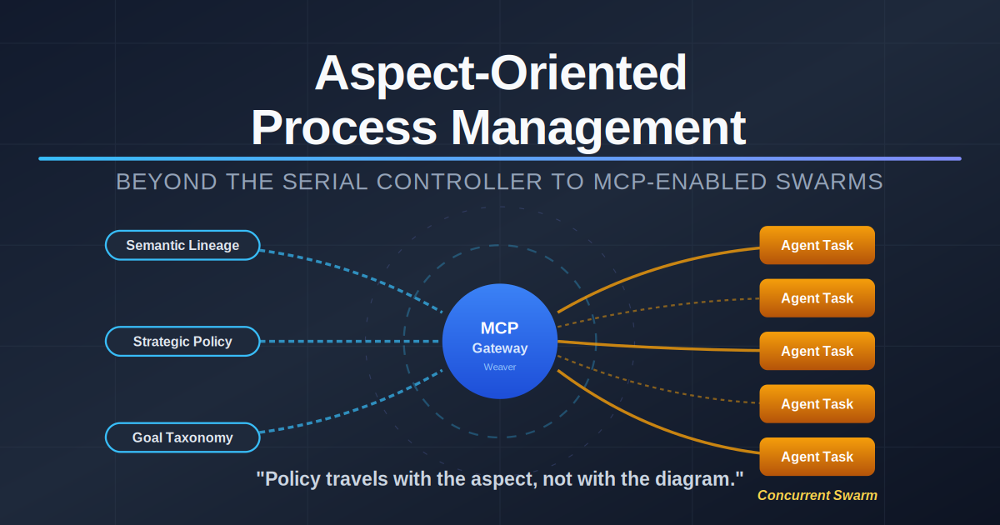
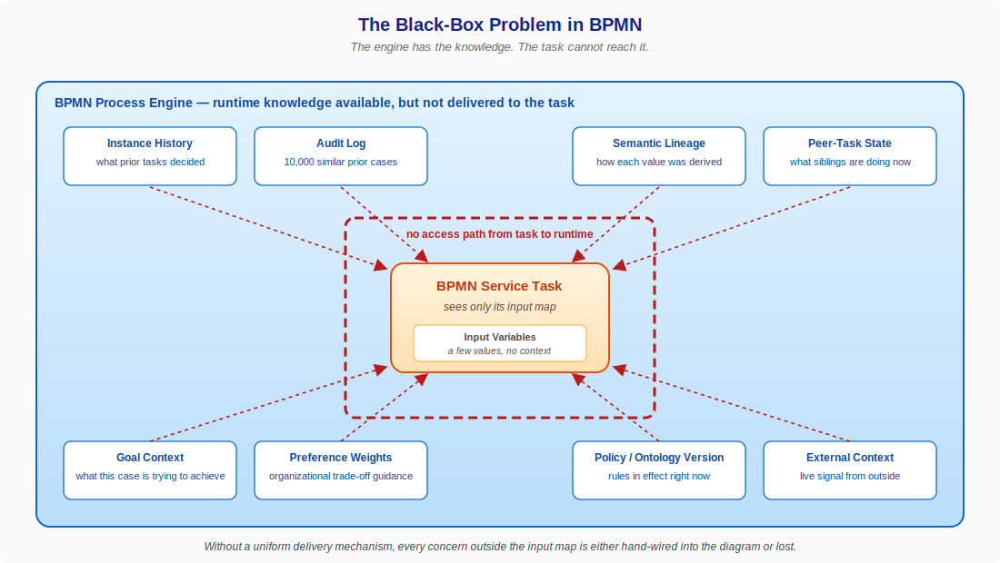
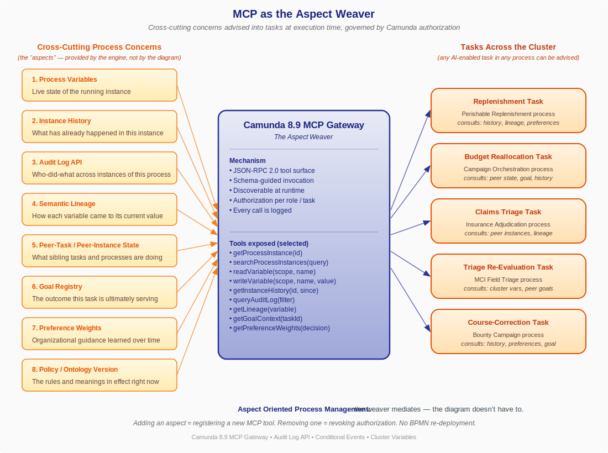
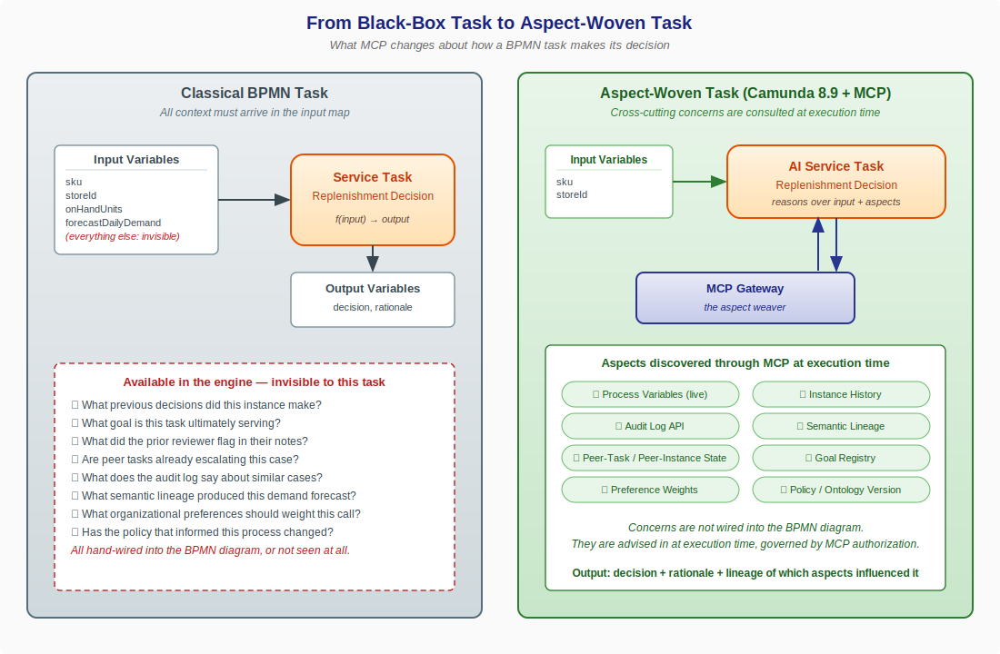
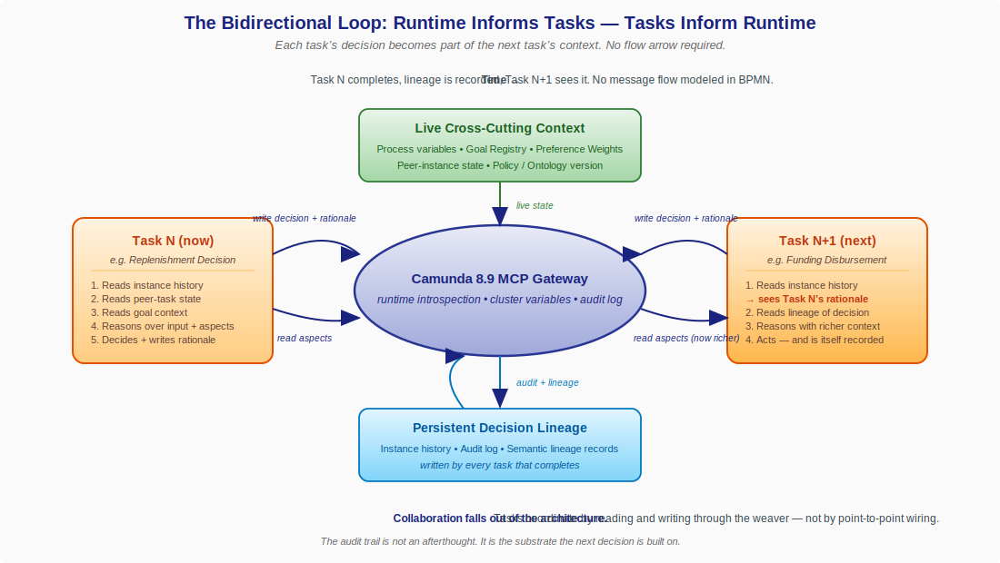
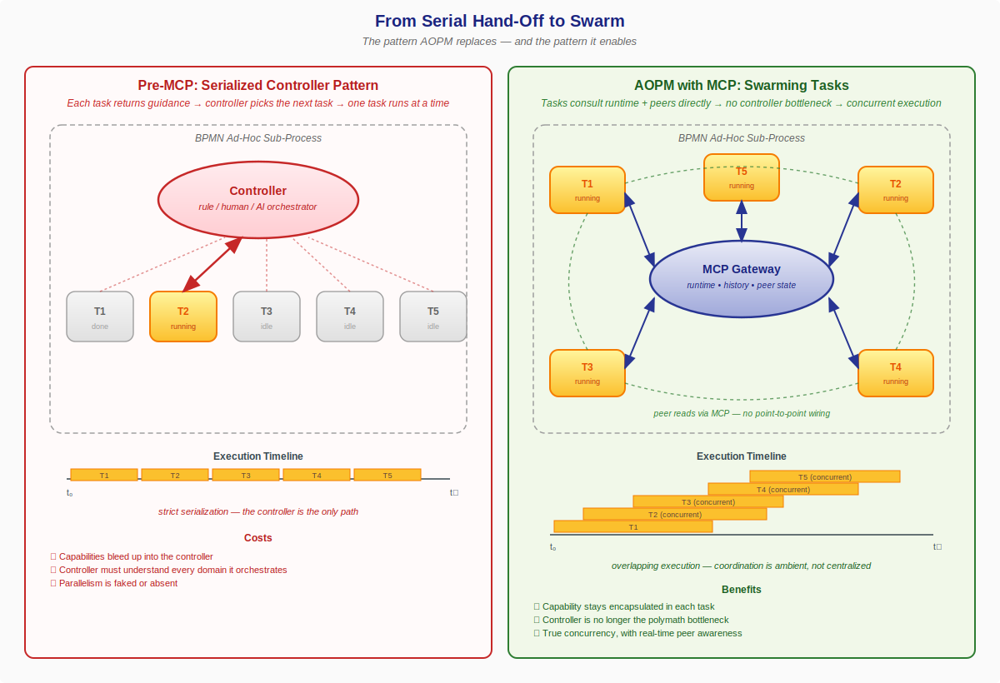
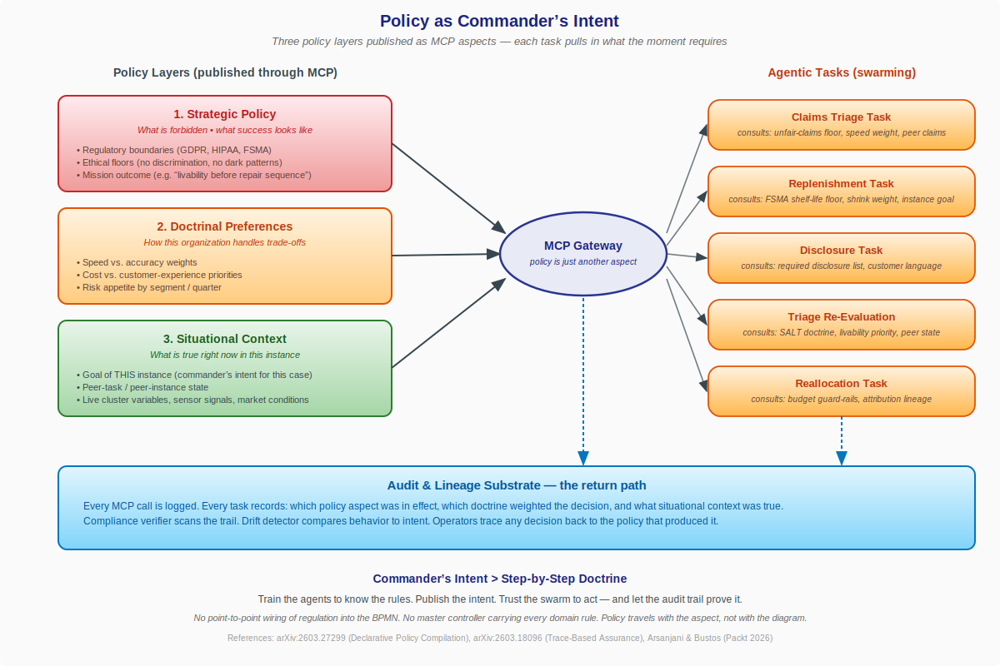

# Aspect-Oriented Process Management

*Beyond the Serial Controller to MCP-Enabled Swarms*



**Author:** Gary Samuelson
**Date:** April 25, 2026
**Series:** Semantic Process Intelligence — Paper 8
**Companion to:** [The Ontology Process](https://garysamuelson.github.io/semantic-ai/cpg-campaign-simplified-workflow/) · [When Processes Finally Talk to Each Other](https://garysamuelson.github.io/semantic-ai/inter-process-semantic-collaboration/) · *Domain Semantics as the Driver of Agent Orchestration* *(forthcoming)*

---

### Foreword

[When Processes Finally Talk to Each Other](https://garysamuelson.github.io/semantic-ai/inter-process-semantic-collaboration/) was about *processes* talking to each other. This paper is about *tasks* talking to each other — and to the runtime that hosts them — through the same Camunda 8.9 MCP Gateway.

The argument is that Model Context Protocol does something for BPMN that BPMN has been unable to do for itself for twenty years: it makes the engine's own knowledge available to the work the engine is running. Not at design time, in the diagram. At execution time, through a uniform tool surface that any task can consult and that any tool author can extend.

There is a name for this pattern in software engineering. It's called **aspect orientation** — the discipline of separating cross-cutting concerns from the primary control flow of a program. AOP gave us the ability to add logging, security, transactions, and tracing without re-writing every method that needed them. What I'm proposing here is the same move, applied to processes: treat instance history, audit lineage, goal context, peer-task state, organizational preferences, and policy/ontology versions as aspects of the running process — concerns that *any* task should be able to consult, advised in by the runtime rather than wired into the diagram.

The MCP Gateway is what makes it possible. Camunda 8.9 is the first commercial process engine where the mechanism exists. And the implication, once you see it, is that genuine task-level collaboration — tasks that consult the past, the goal, and the peer state before deciding what to do next — falls out of the architecture without anyone having to model the collaboration into the BPMN.

---

## 1. The Black-Box Problem in BPMN

Open any BPMN diagram and look at a service task. What does that task know?

It knows what is in its input map. It might know the static configuration the implementer wired in — a service URL, a retry count, a timeout. It does not know what previous tasks decided. It does not know what the process instance is ultimately trying to achieve. It does not know whether sibling tasks in parallel branches are escalating. It does not know what the audit log says about ten thousand similar cases. It does not know the lineage of any value it received.



Think of it as a respawn: the task wakes into the middle of an ongoing game with no memory of what led here, no awareness of what teammates are doing in parallel branches, and only the barest instructions about its objective. *Why am I here? Where am I? What do I do next?* That is the runtime experience of a classical BPMN service task — and it is the problem the rest of this paper exists to solve.

If you want a task to know any of those things, you have one option: **wire it into the diagram.** Add data inputs. Carry variables forward through every preceding gateway. Use a service task to fetch history before the task that needs it. Use a script task to compute a goal vector and pass it as a variable. By the time you've done this for the eight or ten concerns a real decision needs, the BPMN diagram has become a circuit board — most of the lines are not control flow at all, they're data plumbing for cross-cutting concerns that the engine already has on hand.

This is the black-box problem. The engine is sitting on top of a rich runtime — instance history, audit log, lineage, peer state, policy version — and it has no way to deliver any of it to the task that needs it without explicit, brittle, modeler-authored wiring.

It is exactly the same problem that object-oriented programming had in the late 1990s. Logging, security, transactions, and tracing were all crosscutting; they were needed in many methods; and the only way to add them was to write them into every method that needed them. The result was code where the cross-cutting concerns drowned out the business logic.

---

## 2. Aspects: The Idea Software Engineering Solved Twenty-Five Years Ago

Aspect-Oriented Programming, articulated by Gregor Kiczales and colleagues at Xerox PARC in 1997 and matured through AspectJ, named a specific kind of separation:

- A **concern** is something a system must address.
- A **cross-cutting concern** is one that shows up in many places — security checks, audit logging, performance instrumentation, transaction boundaries.
- An **aspect** is a modular unit that captures a cross-cutting concern in one place.
- A **join point** is a well-defined moment in the execution of the program where an aspect can apply.
- **Advice** is the code the aspect contributes at that join point.
- A **weaver** is the mechanism that combines aspects with the primary program at compile time or runtime.

The breakthrough wasn't the concept of cross-cutting concerns — every architect already knew about those. The breakthrough was the **weaver**: a uniform mechanism that let you express the concern once and have it applied wherever it was needed, without the primary code having to know.

Aspect orientation has been quietly successful. Every Spring annotation that adds transactional behavior, every `@Logged` method, every Hibernate `@Audited` entity is a descendant of the AOP weaver pattern. The reason it succeeded is that it took something inherently scattered and made it modular, governed, and observable.

What we have not had, until now, is an analog at the **process** layer. BPMN gives us a primary control flow — the sequence of tasks that move a case from start to end. It does not give us a way to advise cross-cutting concerns into those tasks. There has been no process weaver.

This paper argues that the Camunda 8.9 MCP Gateway is that process weaver.

---

## 3. What Should Be Cross-Cutting in a Process?

Before claiming the MCP Gateway is a weaver, we have to be specific about *what* should be cross-cutting. Here is the inventory I've arrived at after building or analyzing perhaps thirty agent-enabled BPMN deployments across healthcare, banking, adtech, and emergency response. These are the concerns that show up in nearly every AI-enabled task and that nearly always have to be hand-wired into the diagram.

| # | Process Aspect | What it is | What a task uses it for |
|---|---|---|---|
| 1 | **Process Variables** | The live state of the running instance | Trivially needed by every task; usually present |
| 2 | **Instance History** | What has already happened in this instance — which tasks ran, what they decided, what they wrote | Letting a downstream task see and reason over upstream decisions |
| 3 | **Audit Log API** | The cross-instance record of who-did-what-when across all instances of this process | Comparing this case to similar prior cases; detecting drift; explaining a decision |
| 4 | **Semantic Lineage** | How each variable came to its current value — derived from which input, by which transformation, under which policy | Knowing whether a demand forecast is fresh, whether a triage category was set by SALT or by a fallback rule, whether an address was confirmed or inferred |
| 5 | **Peer-Task / Peer-Instance State** | What sibling tasks (in parallel branches, or in other process instances) are doing right now | Avoiding double-escalation; coordinating without point-to-point messages |
| 6 | **Goal Registry** | The outcome this task is ultimately serving — the goal of the process instance, decomposed onto this task | Choosing among multiple acceptable next actions based on which best serves the goal |
| 7 | **Preference Weights** | Organizational guidance learned over time about how to prioritize trade-offs | Weighting cost vs. speed vs. accuracy in a way that reflects what this organization has decided matters |
| 8 | **Policy / Ontology Version** | The rules and meanings in effect right now — the version of the regulation, the version of the domain model | Knowing whether a decision was made under the policy in effect at the time, and being able to re-evaluate when policy changes |
| 9 | **External Situational Context** | Live signal from outside the process boundary — advisories, market conditions, weather, partner-system state, regulatory bulletins, sensor and telemetry feeds | Letting a task adapt to current world conditions rather than only to historical instance state — e.g., an FNOL task reading NHC hurricane advisories and reprioritizing against surging claim volume |

A few of these are already partially exposed in classical BPMN engines (process variables, some history). Most are not. None of them are uniformly accessible to every task without the modeler having to wire each one in by hand.

That is what the MCP Gateway changes.

Note that aspects 1–8 are *inward-facing* — they make the process self-aware. Aspect 9 is *outward-facing*, and it reframes the purpose of the whole stack. A process that can read its own history, peers, and policy is a closed loop. A process that can also read the world it is running inside becomes something else: a system that turns data into information, applies domain semantics to give that information meaning and urgency, and presents it to the next actor — human or agent — as a basis for action rather than as a report card. That shift, from observable process to *actionable* process, deserves its own treatment and is the subject of a forthcoming companion paper in this series.

---

## 4. MCP as the Weaver

Here is the move, in one sentence:

> *The Camunda 8.9 MCP Gateway exposes the engine's own runtime knowledge as a uniform tool surface that any AI-enabled task can discover, query, and write to — making the runtime a cross-cutting concern available to every task.*

That is the weaver. The aspects are the concerns above. The join points are the points in BPMN execution where an AI-enabled task runs. The advice is the runtime context the task pulls in when it asks. And the weaving is governed — by Camunda's existing authorization model, by the MCP discovery protocol, and by the audit log that records every tool call.



Concretely, here is what changes when an AI-enabled task is implemented as an MCP client. The task no longer needs to receive in its input map every piece of context it might need to reason. Instead, when the task activates, it discovers the available MCP tools, decides which aspects of the runtime are relevant to its decision, and pulls them in.

```
# Before — black-box task
def replenishment_task(input_map):
    on_hand = input_map["onHandUnits"]
    forecast = input_map["forecastDailyDemand"]
    return decide(on_hand, forecast)   # everything else: invisible

# After — aspect-woven task
def replenishment_task(job, mcp):
    history = mcp.call("getInstanceHistory", id=job.process_instance_key)
    lineage = mcp.call("getLineage", variable="forecastDailyDemand")
    goal    = mcp.call("getGoalContext", taskId=job.element_id)
    prefs   = mcp.call("getPreferenceWeights", decision="perishable_replenishment")
    peers   = mcp.call("searchProcessInstances",
                       query={"sku": job.variables["sku"]})

    return decide(job.variables, history, lineage, goal, prefs, peers)
```

The task code is longer — but the BPMN diagram is shorter, because the data plumbing for history, lineage, goal, preferences, and peer state is no longer wired through it. The diagram returns to being a description of *control flow*. The aspects are advised in by the engine through the MCP weaver.

*The tool calls above (`getInstanceHistory`, `getLineage`, `getGoalContext`, `getPreferenceWeights`, `searchProcessInstances`) illustrate the pattern. Camunda 8.9 ships the MCP **client** connector and the runtime substrate these tools resolve against; the aspect-publishing servers themselves are the architect's extension surface. See [Appendix A](#appendix-a-implementation-roadmap-extending-camundas-mcp-for-aopm) for the build pattern, reference code, and Claude-agent integration guidance.*

This is the same simplification that AOP made for object-oriented code in the early 2000s. The primary program shrinks. The cross-cutting concerns become visible, governed, and modular.

---

## 5. From Black-Box Task to Aspect-Woven Task

It helps to see the change side by side.



On the left: the classical BPMN task. The input map is the entire universe. Eight or nine concerns are *available in the engine* but invisible to the task — and getting any of them in requires the modeler to wire it through the diagram.

On the right: the aspect-woven task. The input map is small. The MCP Gateway is the second input — the channel through which the task pulls in whichever aspects its reasoning needs. The diagram doesn't carry that wiring. The engine does.

A few properties of this design worth naming explicitly:

- **Discoverable.** The task does not have to be told in advance which aspects exist. It discovers them through MCP at execution time. Adding a new aspect — say, a fraud-signal feed — is registering a new MCP tool, not re-deploying the BPMN.
- **Governed.** Camunda's authorization model decides which tasks may invoke which tools. A perishable-replenishment task can read instance history and peer-store state but not modify cluster variables for an unrelated process. An MCI triage agent can read peer-instance state in the Hospital Surge process but cannot start a new mutual-aid request — that authority belongs to the EOC agent.
- **Observable.** Every MCP call goes through the gateway. Every call is logged. The lineage of a decision — which aspects the task consulted, in what order, with what return values — becomes part of the audit trail.
- **Modular.** Aspects can be added, replaced, or removed without changing any task that uses them. Switch from a static preference table to a learned preference model? Replace one MCP tool implementation. Tasks keep working.

These four properties are exactly what made AOP succeed in object code. They are what make MCP a credible weaver at the process layer.

---

## 6. Three Vignettes

Pattern arguments are not convincing on their own. Here are three concrete cases. In each one, the same task is described twice — first as it would be implemented under classical BPMN, then as it would be implemented as an aspect-woven task with MCP.

### Vignette 1 — Goal-Aware Next-Task Selection (Perishable Replenishment & Cross-Store Rebalancing)

A regional grocery chain's perishable-replenishment process has reached a decision point. A refrigerated organic dairy SKU at Store 412 — seven-day shelf life, currently four days remaining on the on-shelf stock — is forecast to stock out by tomorrow afternoon. Four legitimate next actions: (a) dispatch an emergency truck from the regional DC, (b) initiate a stock-rebalance pull from a nearby store with surplus that has only three days of shelf life remaining, (c) accelerate the next scheduled DC route by twelve hours, or (d) authorize a near-equivalent SKU substitution and accept a partial stockout. Each is appropriate under different circumstances.

**Classical BPMN.** The diagram either uses a complex gateway with twenty conditions wired against process variables, or it sends every case to a uniform "next-step decision" service that has to be told everything in its input map. To make the decision well, the modeler has to ensure that every variable the decision logic needs — current on-hand units, forecast daily demand, the chain's current shrink-vs.-service-level weighting, the freshness of the in-route shipment already on the truck, the remaining shelf life at the candidate donor store, the goal of *this particular store* (e.g. premium-tier service guarantee for that catchment), and which neighboring stores are themselves running short — is carried forward through every preceding gateway. In practice, three or four of those variables are missing, the decision degenerates to a simple reorder-point check, and the four-way branch becomes a binary one.

**Aspect-woven.** The decision task pulls in:

- **Goal context** via `getGoalContext(taskId)` — discovers that Store 412 carries a `service_tier = premium` goal for this category, set by the regional merchandising plan in effect this quarter.
- **Preference weights** via `getPreferenceWeights("perishable_replenishment")` — discovers the chain currently weights *shrink reduction* at 0.55 and *service level* at 0.35 (because perishable waste is up year-over-year and the CFO has asked operations to lean on shrink this quarter).
- **Instance history** via `getInstanceHistory()` — sees that two days ago this same instance ordered a partial pallet that is already in route on tomorrow morning's truck, and the upstream task flagged a refrigeration-uptime alert at the donor store now under consideration.
- **Audit log** via `queryAuditLog(filter="similar_sku_store")` — sees that for the last 200 stockout-risk events in this SKU/store-tier segment, cross-store rebalance pulls had a 12% downstream waste rate at the donor store while accelerated DC routes ran 6% waste — but accelerated routes carry a $1,400 logistics premium per dispatch.

The decision: cross-store rebalance from the surplus peer, *and* a small SKU substitution at 412 to bridge the gap until the in-route truck arrives — accepting the donor store's higher waste exposure because the chain is favoring shrink only at the network level, not at any single store. The rationale, written back to the instance, names every aspect consulted. The next task — the dispatch-coordination task at the donor store — reads the rationale via MCP and arrives at its own decision already knowing what the upstream task saw.

The BPMN diagram for this is unchanged from the simplest possible version: detect-shortage → decide-next → branch. The intelligence is in the aspects.

### Vignette 2 — History-Aware Retry (Campaign Budget Reallocation)

This is from the Bounty campaign work in [The Ontology Process](https://garysamuelson.github.io/semantic-ai/cpg-campaign-simplified-workflow/). A budget reallocation task has fired in response to a Course Correction signal — Amazon Bulk Buyer attribution is running 23% above forecast, and the question is whether to reallocate $1.2M from CTV to Amazon DSP.

**Classical BPMN.** The reallocation task receives the signal data in its input map, applies a rule, and either reallocates or escalates. If the same signal fires again two days later, the task has no memory of having reallocated already. It will reallocate again — possibly over-correcting. To avoid this, the modeler wires a "have we already reallocated this campaign in the last N days?" check, which itself requires a side query to a tracking table the modeler now has to maintain.

**Aspect-woven.** The reallocation task pulls in:

- **Instance history** via `getInstanceHistory()` — sees that two days ago this same instance reallocated $800K from CTV to Amazon DSP in response to the same signal class.
- **Audit log** via `queryAuditLog(filter={campaign:"Bounty",action:"reallocation"})` — confirms the prior reallocation cleared the alert for 36 hours before re-firing.
- **Semantic lineage** via `getLineage("amazon_attribution_pct")` — sees that the current attribution number was computed from a model run that included data from a known anomalous Prime Day promotion, casting doubt on the signal itself.
- **Peer-task state** via `searchProcessInstances({process:"creative_review",campaign:"Bounty"})` — sees that the creative team is already working on a refresh that will land in three days.

The decision: hold. Don't reallocate now; let the creative refresh land first. Write the rationale.

In classical BPMN this restraint requires either a coordinator (a human reviewing every reallocation), or a thicket of side queries and tracking tables. As an aspect-woven task, the restraint is *intrinsic* — the task is constructed so that consulting history and peer state is normal, not exceptional.

### Vignette 3 — Peer Coordination Without Message Flows (Insurance Claims Triage)

A property insurance claims process has multiple parallel adjudication branches running simultaneously for a major weather event — a hurricane has produced 12,000 claims in 72 hours, and the same household may have submitted claims under property damage, additional living expense, and auto comprehensive coverage. Each runs in a separate process instance.

**Classical BPMN.** Each instance's triage task sees only its own input. To coordinate, the modeler must either funnel all related claims to a single instance (a complex sub-process orchestration), or build out an explicit cross-instance message correlation pattern with correlation keys, message events, and a correlation broker. Either approach requires the coordination to be *modeled in advance*. In an event of this scale, that modeling is what gets cut for speed.

**Aspect-woven.** Each instance's triage task pulls in:

- **Peer-instance state** via `searchProcessInstances({householdId: job.variables.householdId})` — discovers two sibling claims for the same household.
- **Lineage** via `getLineage` for the damage estimates — sees one claim used drone imagery (high confidence), another used policyholder photos (lower confidence).
- **Goal context** — sees the carrier's stated goal for this event is "prioritize livability restoration over property repair sequencing."

The triage decision adapts: route the additional living expense claim to fast-track because livability is the goal; route the property damage claim to a coordinated adjuster who will handle all three together. None of this coordination was modeled in BPMN. It emerged because each task could see its peers.

This is precisely the SALT-style ambient coordination that [When Processes Finally Talk to Each Other](https://garysamuelson.github.io/semantic-ai/inter-process-semantic-collaboration/) described for MCI response — but now operating *inside* a single insurance domain, between sibling instances of the same process, without any new message flows in the BPMN.

---

## 7. The Bidirectional Loop

There is a temptation to read aspect orientation as a one-way enrichment — the engine pours context into the task. The actual pattern is bidirectional. The task's decision becomes part of the runtime context that the *next* task will consult.



In sequence:

1. Task N activates. It pulls aspects from the MCP Gateway: instance history, peer state, goal context, preferences, lineage.
2. Task N reasons over its input plus those aspects. It decides.
3. Task N writes its decision back through MCP — and the rationale, naming which aspects it consulted and how each weighed in the decision.
4. The audit log and semantic lineage records persist that decision-with-rationale.
5. Task N+1 activates. It pulls aspects from the MCP Gateway. Among those aspects: the instance history now includes Task N's decision and rationale; the lineage now includes the new variables Task N wrote; the audit log has been updated.
6. Task N+1 reasons in a richer context than Task N had. It decides.
7. The cycle continues.

This is what *Domain Semantics as the Driver of Agent Orchestration* called the bidirectional thesis — *domain semantics drives orchestration; orchestration discovers and refines domain semantics.* Here the same loop appears at the task level: **aspects inform tasks; tasks become aspects.**

The crucial property is that no message flow was modeled. Task N+1 did not have to be told "wait for Task N's rationale." It pulled the rationale because it pulled history; history naturally contained the rationale because Task N wrote it through MCP. The BPMN diagram for this loop is just a sequence of tasks. The intelligence is woven.

---

## 8. From Serial Hand-Off to Swarm

The bidirectional loop, as just described, looks like a sequence: Task N, then Task N+1, then Task N+2. That description is correct for a single decision chain inside one instance. But it understates what changes once every task can read the runtime through MCP. The deeper shift is that the **controller pattern** that has dominated agentic BPM since the first ad-hoc subprocess implementations stops being necessary.

It is worth being precise about what the controller pattern is, because it is what AOPM replaces.



### 8.1 The pattern AOPM replaces — the serialized controller

Camunda 8.8 hardened a beautiful mechanism for AI-driven flexibility: the **dynamic ad-hoc sub-process activated by job workers**. The mechanism is — by design — serial:

1. The engine reaches an ad-hoc sub-process and creates a job.
2. A worker (rule, human, or AI) examines the runtime context and **chooses one task** from the ad-hoc pool to activate.
3. That task runs to completion.
4. The task returns a result that includes "what should happen next."
5. The engine creates a new job. A worker reads it and chooses the next task. Goto 3.

This is, at the diagram level, exactly the *proto-goal-oriented* pattern the *Agentic BPM: Goal-Oriented Process Modeling* note flagged: the wires between tasks have been removed, but a **logical** serial path remains. Something has to play the role of "the controller" — the entity that, after each task, looks at the world and picks the next task to run.

There is a price for that pattern. We can name it directly:

- **Capabilities bleed up into the controller.** To choose well, the controller has to understand every domain it orchestrates — replenishment, fraud detection, claims triage, clinical routing, market segmentation, fulfillment scheduling. The controller becomes a polymath. That is the opposite of encapsulation.
- **Parallelism is faked or absent.** The pool may be ad-hoc, but only one task runs per cycle. Concurrency requires modeling parallel branches up front, which defeats the purpose of "ad-hoc."
- **Coordination is centralized in a bottleneck.** Every decision about *what is happening next in the process* funnels through one re-evaluation, by one entity, against one read of the runtime. The controller is the choke point.
- **Cross-instance awareness is structurally hard.** A controller, by construction, owns one instance. To make decisions in one claim instance based on what is happening in a peer claim instance, you have to wire side channels — exactly the kind of wiring AOP-at-the-code-layer was invented to abolish.

This is the pattern the *Domain Semantics as the Driver of Agent Orchestration* paper was already pushing against when it argued that domain semantics should *drive* orchestration rather than be carried by it. The serialized-controller pattern carries domain semantics inside the controller. That is why it does not scale, and that is why it is the wrong long-run shape for agentic processes.

### 8.2 What MCP makes possible — the swarm

Once aspects are advised in through MCP, the controller is no longer the only entity that can read the runtime. **Every task can.** A task does not need a controller to tell it what its peer tasks are doing — it can ask MCP. A task does not need to wait for a hand-off message to know that an upstream decision was made — it can pull the rationale from history. The information substrate that previously lived inside the controller's head now lives in the gateway, and any authorized task can read it.

This dissolves the serial constraint. Tasks can run **concurrently** because each one synchronizes on shared state at the moments it needs to, not because a single controller decided when each one should run. The picture stops being a sequence of controller-cycles and starts looking like the right side of the figure above: a small mesh of tasks, each looking at the same substrate, each making its own decision, each writing its decision back into the substrate where the others can see it.

The pattern has a precedent in nature, and the analogy is widely used in the multi-agent literature: bees in a hive, ants finding a path, schools of fish forming a shape no individual fish modeled. None of those collectives has a controller. They coordinate through *shared environment* — pheromones, vibrations, lateral-line pressure waves. In AOPM, MCP is the shared environment. The aspects published through it — instance history, peer-task state, audit log, semantic lineage, goal context, preference weights, policy version — are the pheromones.

This is what we mean by **the swarm**: a population of tasks, possibly across instances, possibly across processes, coordinating through ambient aspects rather than through a central choreographer.

### 8.3 What this changes about encapsulation

The encapsulation argument is the cleanest way to see why this matters architecturally. In the serialized-controller pattern, every domain capability the controller has to use to make a routing decision *bleeds into* the controller. The controller code accumulates domain knowledge that does not belong there. In a swarming pattern with MCP, the domain capability stays inside the task that owns it. The task publishes its decision and rationale through MCP; downstream tasks pull what they need. **No capability has to leave the task that originated it.**

That is an architectural property worth naming explicitly: **capability locality**. AOPM gives capability locality back to processes the same way AOP gave it back to objects. Cross-cutting concerns no longer demand a god-object (the controller) to mediate them. They are advised in by the substrate, and the primary artifacts (the tasks, the diagrams) keep their original shape.

---

## 9. Managing the Swarm: An Open Research Question

Naming the swarm is not the same as managing it. A swarm without management is chaos: tasks pulling stale aspects, tasks fighting over the same resource, tasks acting on conflicting goals because the goal aspect was updated mid-flight. The literature on multi-agent systems has been wrestling with this for two decades, and the past eighteen months have produced a wave of work that maps almost directly onto AOPM's open questions.

We do not have a finished answer here. What we can do is name the three management problems AOPM creates and point to the research streams that look most promising for each. The reader is encouraged to treat this section as a research agenda, not a recipe.

**Problem 1 — Bounded autonomy.** A swarming task is, by construction, more autonomous than a controller-driven task. It chooses what aspects to consult, when to act, what its rationale was. The question is how to bound that autonomy without re-introducing the controller. The most useful framing in the recent literature is Arsanjani and Bustos's notion of *bounded autonomy with composable patterns* (Arsanjani & Bustos, 2026) — each task is given a goal, a set of allowed aspects, and a set of forbidden actions, but the path between them is left to the task. The work on plan-execute-verify-replan loops (Zhang et al., 2026) gives an operational mechanism: each task publishes not only its decision but a verifier-readable plan, and a runtime-side verifier can interrupt and force a replan if the plan violates a policy aspect.

**Problem 2 — Coordination without a choreographer.** With no controller, how do tasks avoid stepping on each other — racing on the same variable, both deciding the same approval, ignoring each other's in-flight rationale? Two streams are relevant. The graph-centric multi-agent work by Liu et al. (2026) — MASFactory — frames the swarm as a typed graph where nodes are tasks and edges are aspect-mediated dependencies; the graph is the substrate the swarm coordinates through, and properties like deadlock-freedom can be checked on the graph rather than enforced by a controller. The trace-based assurance work (Paduraru et al., 2026) takes a complementary view: the audit-log substrate (Aspect 3 in our inventory) is rich enough to prove, post-hoc, that the swarm honored its constraints; this gives operators a way to manage by exception rather than by pre-flight enforcement.

**Problem 3 — Security and isolation.** A swarming pattern enlarges the surface where one compromised task can poison the substrate that other tasks read. AgenticCyOps (Mitra et al., 2026) surveys the threat model and proposes a framework where every aspect-publishing call is signed and every aspect-consuming call is authenticated against a per-aspect policy. This maps directly onto the MCP Gateway's existing role-based access control; the open work is to extend it from "who can call this tool" to "what provenance does the response carry, and what can the consuming task do with it."

A useful synthesis lens, drawn from the multi-agent design literature, is Sayfan's pairing of MCP and A2A (Sayfan, 2026): MCP provides the *substrate* (aspects), and an A2A-like protocol provides the *interaction discipline* (request/respond, negotiate, escalate). AOPM in its current form is MCP-only. Whether and how to layer an A2A-style discipline on top is one of the most consequential design choices a deployment team will make, and it is exactly the choice the controller pattern hid by virtue of having a single decider.

The honest summary is that **we are at the moment AOP was at in 1998**: the pattern is named, a usable weaver exists, the early adopters are productive, and the management theory is being written underneath them in real time. Practitioners deploying AOPM today should expect to contribute to that theory rather than apply it from a textbook.

---

## 10. Where the BPM Platform Now Fits

If tasks can swarm, if the controller is no longer the only reader of the runtime, if domain capability stays in the tasks rather than bleeding into a choreographer — what is the BPM platform *for*?

This is the right question. It is also the question that makes some practitioners uncomfortable, because it sounds like the platform is being demoted. It is not. The platform's role is being **clarified**, and clarification is almost always a promotion. Three roles fall away; three roles get sharper.

**What the platform stops being.**

- It stops being **the choreographer of every step.** That work moves into the swarm and into the aspects the swarm consults. The diagram still describes control flow at the granularity that humans need to read, but the moment-to-moment "what runs next" decision lives in MCP-mediated reasoning, not in a sequence flow.
- It stops being **the place where domain knowledge lives.** Domain knowledge belongs in the aspect publishers — the policy server, the goal registry, the preference-weight service, the lineage store. The platform is the substrate they plug into.
- It stops being **the bottleneck through which all decisions flow.** Decisions flow through the gateway, but the gateway is by design parallel and stateless-per-call. Many tasks can read many aspects simultaneously without serializing through a controller.

**What the platform becomes.**

- **The substrate.** This is the role that has always been the BPM platform's strongest suit and is now its central one. A durable, observable, governed runtime that holds shared state, sequences variables, manages tokens, and survives crashes. Every aspect the swarm consults is anchored in something the platform persists. The platform is what makes the substrate *real* rather than merely conceptual.
- **The weaver.** The MCP Gateway is part of the platform. Hosting it is hosting the weaver — the piece that AOP-the-language-feature put in a compiler and AOPM puts in a process engine. This is a new responsibility for BPM platforms; it did not exist eighteen months ago. Owning it is owning the architecturally central piece of the agentic stack.
- **The enforcement boundary.** The platform is where commander's intent (next section) is published, where ontology versions are registered, where authorization is checked, where the audit trail is materialized. It is the boundary where policy meets execution. That boundary used to be enforced by hand-coded checks scattered across tasks; AOPM makes it a property of the substrate.

The companion paper on domain semantics put this in a sentence we can re-use here: the engine stops "running AI code" and becomes the deterministic spine — the layer that gives the agentic swarm a coherent, observable, governed place to operate in. That is a more important role than choreographer, not a smaller one. It is the role of the operating system relative to the applications running on it.

A useful test: if you remove your BPM platform from your AOPM deployment, what breaks? In the controller-pattern world, almost everything breaks because the platform was carrying the choreography. In the AOPM world, what breaks is the substrate — durability, audit, authorization, the gateway itself, the deterministic spine. The platform's value is concentrated, not diluted.

---

## 11. Policy as Commander's Intent: Avoiding the Policy Tax

There is one cross-cutting concern that deserves a section of its own, because mishandling it is the single most expensive mistake a team can make as it moves from controller-driven processes to swarming ones. That concern is **policy** — regulatory, ethical, doctrinal, situational. It is Aspect 8 in the inventory in §3, but its consequences run through every other aspect.



### 11.1 The policy tax

Consider how policy is encoded in a typical pre-AOPM enterprise process. Every task that touches a regulated decision has hand-coded checks: a perishable-handling task has FSMA logic, a marketing-outreach task has CAN-SPAM and GDPR logic, a claims task has SALT-doctrine logic, a clinical-routing task has HIPAA logic. Each rule is duplicated across tasks. Each is maintained in code. Each must be re-tested when the rule changes. Each must be re-deployed.

The cost of this pattern is what we want to call, plainly, **the policy tax** — a tax on the organization's ability to work most efficiently. The tax is paid in three currencies:

- **Velocity.** Every change to a regulation requires a wave of code changes, tests, and deployments across many tasks. The organization moves slower than the regulator demands.
- **Consistency.** Inevitably, a rule gets updated in five tasks and forgotten in the sixth. The forgotten task becomes a compliance incident.
- **Comprehension.** The actual policy lives nowhere. It exists as scattered code fragments. No one can read "the rule" because there is no single rule object — there is only its many incomplete embeddings.

The serialized-controller pattern makes the policy tax worse, not better. As capability bleeds into the controller, so does policy. The controller becomes the place where many regulations are enforced *in code* — re-introducing the same scatter problem one architectural layer up.

### 11.2 The military analogy: train the troops, publish the intent

There is a precedent that fits this situation almost perfectly: the way well-functioning militaries handle the gap between what doctrine can specify and what soldiers actually have to do under fire. You cannot pre-specify every behavior. The terrain shifts, the enemy adapts, and information arrives late. So you do two things: you **train your troops to think and act independently — per what the situation demands, because we cannot plan for every last thing** — and you **publish commander's intent**: a clear statement of the goal, the constraints, and the conditions of success. The doctrine then becomes a small set of well-understood principles, not a thick book of step-by-step procedures. [16, 17, 18]

AOPM lets us do the same thing for processes. Instead of compiling regulation into every task, you do two things:

1. **Push the knowledge down to the agent.** The agents that run inside AI-enabled tasks are taught what the regulations *mean*. Not in the form of hand-coded rule checks, but in the form of training data, evaluation suites, retrieval grounding, and policy-specific reasoning patterns. This is the work the *Knowledge Bootstrapping from Policies and Regulations* note describes — turning policy documents into agent-readable knowledge so that the agent itself understands GDPR, FSMA, HIPAA, SALT doctrine, case-law conformance.
2. **Publish the intent through MCP.** What the organization wants right now — the goal, the constraints, the trade-off weights, the situational conditions — is published as policy aspects. Strategic policy (what is forbidden, what success looks like). Doctrinal preferences (how this organization handles trade-offs). Situational context (what is true in this instance right now). Each of these is an MCP tool. Every task pulls what it needs at execution time.

The figure above shows the three policy layers and how they reach the swarming tasks through the gateway. The audit substrate is the return path — every decision the swarm makes is traceable to which policy was in effect at the moment of the decision.

### 11.3 What this looks like in practice

A claims-triage task in a multi-incident response no longer has unfair-claims-practices logic, SALT-doctrine logic, livability-priority logic, and case-law-conformance logic in its code. It has a small core: read the case, choose a triage category, justify the choice. It pulls in:

- **Strategic policy aspect** — "this organization will not deny benefits on the basis of a protected class; livability before repair sequence; no PII to non-authorized parties."
- **Doctrinal preference aspect** — "in MCI conditions favor speed of triage by 0.7 over precision by 0.3 (mass-casualty doctrine); revert to 0.4/0.6 once incident-level subsides."
- **Situational context aspect** — "this is incident MCI-2604-0188, declared at SALT-Yellow, the EOC has set a 6-hour disposition target, peer triage tasks are currently consulting the same doctrine."

The agent in the task understands what each of those means because it was trained to. The diagram does not encode any of them. The task code does not encode any of them. The policy travels with the aspect, not with the diagram or the code. When regulation changes, the strategic aspect's MCP response changes. Every running task that consults policy gets the new policy on the next call. There is no re-deployment. There is no scatter. There is no forgotten task.

### 11.4 Why this is a leap, not an optimization

The temptation is to read the above as an optimization — "we centralized our policy lookups." It is not an optimization. It is a different theory of what policy *is* relative to a process. In the old theory, policy is a constraint compiled into the choreography; the diagram and the code know the rules. In the AOPM theory, policy is **an aspect of the runtime that the swarm consults**, no more compiled-in than today's weather. Tasks act under policy the way a soldier acts under orders: with understanding of the rules, awareness of the intent, and the trained capacity to apply both to whatever the situation actually is.

The recent research backs up the feasibility. Declarative policy compilation with cross-layer verification (Chen et al., 2026) shows that policy-as-aspect can be made *verifiable* — that you can prove, from the trace, that a swarm honored a published policy. That is the formal counterpart to the audit substrate AOPM produces by construction. Trace-based assurance (Paduraru et al., 2026) gives operators the runtime-side mechanism. Bounded autonomy with composable patterns (Arsanjani & Bustos, 2026) gives architects the design vocabulary.

The leap is the willingness to **trust the swarm** the way a competent commander trusts well-trained troops: by publishing intent rather than by micromanaging steps, and by letting the audit trail do the proving rather than the choreography do the policing.

That trust is what removes the policy tax. The organization stops paying velocity, consistency, and comprehension costs at every regulatory change. The cost moves to one place — the policy aspect — and is paid once.

---

## 12. Governance: Aspects Are Auditable by Construction

A pattern that gives every task access to the runtime had better have an answer for governance, or it is just a faster way to lose track of what your system is doing. Three properties make MCP-as-weaver governable:

**Authorization.** Camunda's existing role-based access control extends naturally over MCP tools. A tool is exposed only to the principals authorized to invoke it. A replenishment task running under one role cannot invoke `writeVariable` on a process instance it does not own. An MCI triage agent can invoke `searchProcessInstances` for hospital surge instances but cannot create new mutual-aid processes — only the EOC role has that authority. The same authorization model the platform already uses for human operators governs AI-enabled tasks. Adding aspects does not require building a parallel governance plane.

**Discoverability.** Every MCP tool published through the gateway is discoverable. The set of aspects available to a task is therefore knowable, by inspection, at any time. A new aspect is not a hidden side channel; it is a registered tool with a schema, a description, and an authorization scope. This is in sharp contrast to ad-hoc data plumbing, where the modeler-wired side queries that connect a task to a tracking table or an analytics service are usually invisible to anyone reviewing the diagram.

**Auditability.** Every MCP call passes through the gateway, and every call is logged. The gateway's call log, combined with Camunda's Audit Log API, produces a complete record of which aspects each task consulted, in what order, with what return values, and what decision the task made afterward. This is the substrate for *semantic decision lineage* — not just the execution lineage of which BPMN element ran, but the reasoning lineage of which information shaped the decision. *Domain Semantics as the Driver of Agent Orchestration* introduced this distinction; aspect-oriented process management is the operational pattern that produces it.

There is a further governance benefit that becomes clear only at scale. Because aspects are advised in at runtime rather than wired into the diagram, **policy changes can take effect without re-deploying any process.** Update the preference weight for "speed vs. accuracy" in the replenishment decision? Update the MCP tool's response. Every running instance that consults preferences gets the new weighting on the next call. Tighten the regulation on cold-chain temperature lookback? Replace the MCP tool that returns the policy. No process re-deployment, no in-flight migration, no training of a new model. The aspect changes; the tasks consulting it adapt on the next call.

This is the same change-management property that AOP gave object-oriented programs: cross-cutting concerns can be modified without touching the primary code.

---

## 13. What This Means for the Practitioner

Three takeaways, for three different audiences.

**For the BPMN modeler.** Stop trying to wire every concern into the diagram. The diagram should describe the control flow — what tasks happen in what order under what conditions. Cross-cutting concerns belong in MCP tools, not in data inputs and gateway conditions. The diagrams that result are smaller, more readable, and more durable through requirements changes.

**For the agent developer.** Stop building a custom context-loading layer for every AI-enabled task. The MCP Gateway is your context layer. Discover the aspects available; consult the ones your task needs; let the gateway handle authorization and logging. The code that results is shorter, more uniform across tasks, and naturally produces lineage you would otherwise have to instrument by hand.

**For the architect.** Recognize that you are looking at a new design pattern at the process layer, with the same shape and the same benefits as AOP at the code layer. Name it explicitly when you propose it. The fact that it has a name — *aspect-oriented process management* — gives the rest of the team a vocabulary for talking about *what kinds of concerns belong in the diagram and what kinds belong in the weaver.* That conversation is otherwise endless and ad hoc.

---

## 14. What Still Has to Be Built

The MCP Gateway is the weaver, but the weaver does not yet expose every aspect a real deployment needs. Three gaps are worth naming.

**1. Semantic-lineage MCP tools.** Camunda 8.9 ships the Audit Log API and lineage for process variables. It does not yet ship lineage for *derived* values — the demand forecast that came out of a third-party model, the triage category that came out of a SALT classifier. To expose `getLineage(variable)` as a first-class MCP tool that can resolve back through external derivations, you need to build (or adopt) a lineage store and register it as an MCP server alongside the gateway. This is the layer the *Seven-Layer Semantic Lineage* paper describes; it is not yet packaged as MCP.

**2. Goal-Registry and Preference-Weight MCP servers.** Aspects 6 and 7 in the inventory above are the most architecturally interesting and the least standardized. Goal context for a task — what outcome this task is ultimately serving — is exactly what the *Agentic BPM: Goal-Oriented Process Modeling* work in this corpus has been building. Preference weights for organizational decisions are exactly what the *Preference Weight Layer (Paper 4)* defines. Both need to be exposed as MCP servers so that any AI-enabled task in any process can consult them. Today you would build these as bespoke services and integrate them into each task's prompt construction; tomorrow they should be MCP tools that any task can discover.

**3. Aspect-aware BPMN modeling tooling.** The current Camunda Modeler does not visualize which MCP aspects a task is authorized to consult or actually consults at runtime. This is the analog of the IDE plugins that emerged for AspectJ — tools that let you see, at design time, which aspects will apply to which methods. The same idea is needed at the process layer: a modeler that shows, alongside each AI-enabled task, the aspects that task is allowed to weave in.

These gaps are not blockers. The pattern is implementable on Camunda 8.9 today — see [Appendix A](#appendix-a-implementation-roadmap-extending-camundas-mcp-for-aopm) for the extension pattern and reference scaffolding. They are the next several quarters of work for the community building on top of the gateway.

---

## 15. Closing

The phrase *aspect-oriented process management* names something that has been quietly true for a while but has lacked a vocabulary. The Camunda 8.9 MCP Gateway is the moment the vocabulary becomes useful, because for the first time there is a uniform, governed, observable mechanism by which the runtime can advise cross-cutting concerns into the work it is running.

The benefits track exactly with what AOP brought to object-oriented code in the early 2000s. Smaller primary artifacts (diagrams shrink, tasks shrink). Modular, governed cross-cutting concerns (aspects are MCP tools with authorization and logging). Change without disruption (replacing an aspect doesn't require redeploying every consumer). And, critically, the emergence of behaviors that were impractical to model explicitly — peer-task coordination, history-aware retry, goal-aware selection — as natural properties of the architecture rather than as features that someone had to remember to wire in.

The deeper consequence is collaborative. When every task can consult the past, the goal, and the peer state, tasks stop being isolated functions and start being **collaborators in a shared process context.** The collaboration is not modeled. It falls out of the substrate. That is the property the BPM maturity models always pointed at and never had a mechanism for. We have a mechanism now. It is named MCP, it ships in a release that is two and a half weeks old, and the pattern that uses it is named aspect-oriented process management.

---

## Appendix A — Implementation Roadmap: Extending Camunda's MCP for AOPM

The paper's vision rests on Camunda 8.9's MCP capability. This appendix is for practitioners ready to build. It describes, candidly, what Camunda ships today, where the architect's extension surface begins, and how to bridge the two — including how a Claude agent fits into an aspect-woven task.

The takeaway up front: **everything in this paper is implementable on Camunda 8.9 today.** Some of it ships out of the box; most of the aspect-publisher layer is something you build, using patterns Camunda explicitly supports and documents.

### A.1 What Camunda 8.9 ships, and what is the architect's surface

Camunda's 8.9 MCP capability is, by design, an **MCP client** integration: a process can discover and invoke tools published by any MCP server. That mechanism — together with Camunda's existing REST API v2, audit log, and authorization model — is the substrate AOPM stands on. The aspect-publishing servers that expose `getInstanceHistory`, `getLineage`, `getGoalContext`, `getPreferenceWeights`, `searchProcessInstances`, `queryAuditLog`, and `writeVariable` as uniform tools are the part you build. The line is clean, and Camunda's documentation supports the build pattern explicitly.

| Capability used in the paper | Camunda 8.9 (out of the box) | Architect's extension |
|---|---|---|
| MCP tool discovery and invocation from a task | ✅ MCP Client connector (STDIO) and MCP Remote Client connector (HTTP/SSE) | — |
| Authentication for tool calls (OAuth, API key, custom headers) | ✅ Added in 8.9-alpha2 | — |
| Streamable HTTP for long-running tool responses | ✅ 8.9-alpha2 | — |
| Audit log of every tool call | ✅ Zeebe immutable log + Operate | — |
| Process-instance search, variable read/write, history | ✅ REST API v2 endpoints | Wrap as MCP tools (§A.2) |
| Agent-to-agent handoff between specialist agents | ✅ A2A Client connectors (polling, webhook) in 8.9-alpha2 | — |
| `getInstanceHistory`, `searchProcessInstances`, `queryAuditLog`, `writeVariable` as MCP tools | — | Custom MCP server that wraps REST API v2 |
| `getLineage` | — | Custom MCP server backed by your lineage store (see *Seven-Layer Semantic Lineage*, forthcoming) |
| `getGoalContext` | — | Custom MCP server backed by your goal registry (see *Agentic BPM: Goal-Oriented Process Modeling*, forthcoming) |
| `getPreferenceWeights` | — | Custom MCP server backed by your preference store (see *Preference Weight Layer (Paper 4)*, forthcoming) |

The pattern is consistent: the platform gives you the weaver, the substrate, and the governance plane. You give it the aspect publishers. This is the same division of labor AspectJ established for object code — the language ships the join-point mechanism; the team writes the aspects that matter to its domain.

### A.2 The extension pattern: a custom MCP server wrapping Camunda's runtime

The first three runtime aspects (history, peer-instance state, audit log) are thin wrappers over Camunda's REST API v2. A minimal Python MCP server, using the official `mcp` SDK, is enough to expose them.

```python
# aopm_runtime_mcp.py — exposes Camunda runtime as AOPM aspects
from mcp.server.fastmcp import FastMCP
import httpx, os

mcp = FastMCP("aopm-runtime")
CAMUNDA = os.environ["CAMUNDA_REST_URL"]   # e.g. https://<cluster>.camunda.io/<region>/<cluster-id>
AUTH    = {"Authorization": f"Bearer {os.environ['CAMUNDA_TOKEN']}"}

@mcp.tool()
def getInstanceHistory(processInstanceKey: str) -> dict:
    """Return flow-node executions and variable changes for an instance."""
    r = httpx.post(f"{CAMUNDA}/v2/flownode-instances/search",
                   json={"filter": {"processInstanceKey": processInstanceKey}},
                   headers=AUTH, timeout=10)
    return r.json()

@mcp.tool()
def searchProcessInstances(filter: dict) -> dict:
    """Search peer instances by variable, business key, or state."""
    r = httpx.post(f"{CAMUNDA}/v2/process-instances/search",
                   json={"filter": filter}, headers=AUTH, timeout=10)
    return r.json()

@mcp.tool()
def writeVariable(processInstanceKey: str, name: str, value: object) -> dict:
    """Write a variable back into a running instance (advice in the AOP sense)."""
    r = httpx.put(f"{CAMUNDA}/v2/process-instances/{processInstanceKey}/variables",
                  json={"variables": {name: value}}, headers=AUTH, timeout=10)
    return {"ok": r.status_code < 300}

@mcp.tool()
def queryAuditLog(filter: dict) -> dict:
    """Query the cross-instance audit substrate for similar prior decisions."""
    r = httpx.post(f"{CAMUNDA}/v2/decision-instances/search",
                   json={"filter": filter}, headers=AUTH, timeout=10)
    return r.json()

if __name__ == "__main__":
    mcp.run(transport="sse", host="0.0.0.0", port=8765)
```

Register this server in the Camunda connector configuration (`application.yaml`):

```yaml
camunda:
  connector:
    agenticai:
      mcp:
        client:
          enabled: true
          clients:
            aopm-runtime:
              sse:
                url: http://aopm-runtime-mcp:8765/sse
```

Any AI-agent task in any process can now discover `getInstanceHistory`, `searchProcessInstances`, `writeVariable`, and `queryAuditLog` as tools. The task does not have to be told they exist; MCP discovery surfaces them, and Camunda's authorization model decides which task may invoke which.

The domain-specific aspect publishers — `getLineage`, `getGoalContext`, `getPreferenceWeights` — follow the same pattern, with the backing query directed at your lineage store, goal registry, or preference service instead of Camunda's REST API.

### A.3 Where Claude fits: the agent inside the task

The AI-agent task that *consumes* these aspects is the natural home for Claude. Camunda's AI Agent connector is model-provider-agnostic; it supports the major foundation-model APIs as system-prompt-driven agents. Three integration paths are useful in practice.

**Path 1 — Claude as the task agent via Anthropic API.** Configure the Camunda AI Agent connector to call `https://api.anthropic.com/v1/messages` with `claude-sonnet-4` or `claude-opus-4`. The system prompt instructs the agent to use MCP tools whenever they are listed; the user prompt is the task input. Anthropic's tool-use protocol maps directly onto MCP tool descriptors — the connector translates the discovered MCP tools into the `tools` field of the Anthropic request, and Claude returns `tool_use` blocks that the connector dispatches back through the MCP gateway.

```yaml
# AI Agent task — Claude via Anthropic
modelProvider: anthropic
model: claude-sonnet-4-20250514
authentication:
  apiKey: "{{secrets.ANTHROPIC_API_KEY}}"
systemPrompt: |
  You are a perishable-replenishment agent. Before deciding, consult relevant aspects:
  instance history, peer-store instances, goal context, preference weights, and lineage.
  Cite which aspects shaped your decision. If no tool fits, return your reasoning.
tools: ${agentTools}      # ad-hoc sub-process containing MCP Remote Client tasks
toolCallResults: toolCallResults
```

**Path 2 — Claude via AWS Bedrock.** For organizations standardized on Bedrock (the path the Camunda blog walkthrough demonstrates), the same Claude models are available with IAM-based authentication, VPC endpoints, and Bedrock Guardrails. The connector configuration is the Bedrock variant; the rest of the AOPM pattern is identical.

**Path 3 — Claude Code or Claude Desktop as a development-time MCP client.** For architects building and debugging the aspect-publisher servers in §A.2, Claude Desktop's MCP client is the fastest local feedback loop: register the AOPM runtime server in `claude_desktop_config.json`, ask Claude in chat to invoke `searchProcessInstances` against a sandbox cluster, and verify the tool's behavior interactively before connecting it to the Camunda connector.

The honest assessment: Claude's tool-use behavior is well-suited to the AOPM pattern because the model is trained to consult tools before answering when tools are available, to interleave multiple tool calls in a single reasoning turn, and to cite which tool returns shaped its answer — which is exactly the rationale-writing behavior the bidirectional loop in §7 depends on. Other frontier models (GPT-class, Gemini, open-weights via Bedrock or self-hosted) work too; the connector is provider-agnostic. Claude is called out here because the tool-use semantics align particularly cleanly with the aspect-consultation pattern.

### A.4 A2A: when the aspect publisher is itself an agent

A quiet implication of 8.9-alpha2's A2A connectors is that an aspect publisher does not have to be a deterministic service. It can be another agent. A `getGoalContext` tool that queries a goal-registry database is one implementation; a `getGoalContext` tool that delegates to a specialist *goal-reasoning agent* (which may itself consult policy, history, and the strategic plan) is another. The MCP gateway treats them identically — both expose the same tool descriptor — but the second pattern composes cleanly with A2A's polling and webhook handoffs for goal queries that take longer than a synchronous call permits. This is the substrate-of-agents view the Sayfan reference (Sayfan, 2026) develops.

### A.5 Reference documentation

The Camunda surfaces the patterns above depend on are documented and linkable. These are the authoritative entry points as of Camunda 8.9:

- **MCP Client connectors (STDIO + Remote)** — https://docs.camunda.io/docs/next/components/early-access/alpha/mcp-client/
- **AI Agent connector and integration features** — https://docs.camunda.io/docs/next/components/agentic-orchestration/ai-agents/
- **A2A Client connectors (polling, webhook)** — https://docs.camunda.io/docs/next/components/early-access/alpha/a2a-client/
- **REST API v2 (process-instances, flow-node search, variables, decision instances)** — https://docs.camunda.io/docs/apis-tools/camunda-api-rest/camunda-api-rest-overview/
- **8.9.0-alpha2 release notes (MCP auth, streamable HTTP, A2A)** — https://docs.camunda.io/docs/next/reference/announcements-release-notes/890/890-release-notes/
- **Worked example repository (BPMN + forms for an MCP-enabled agent)** — https://github.com/jlwjohnson/mcpWCamunda
- **Model Context Protocol specification (transports, tool schema)** — https://modelcontextprotocol.io/spec
- **Anthropic tool-use API (the contract a Claude agent honors when consulting MCP tools)** — https://docs.anthropic.com/en/docs/build-with-claude/tool-use
- **Anthropic MCP documentation (Claude as MCP host and client)** — https://modelcontextprotocol.io/clients

### A.6 A practitioner's sequencing

For a team starting from a Camunda 8.9 cluster and a clear AOPM target, the build order that has worked on real engagements is:

1. **Stand up the AOPM runtime MCP server** (§A.2) — exposes `getInstanceHistory`, `searchProcessInstances`, `writeVariable`, `queryAuditLog`. One service, one deployment. This unlocks Aspects 2, 3, and 5 from the inventory in §3.
2. **Register the server with the Camunda MCP Client connector** and verify discovery from a trivial AI Agent task. At this point a single agent task can already consult instance history and peer state — Vignettes 2 and 3 from §6 are reachable.
3. **Build the goal and preference publishers** (§A.1) — these are domain-specific and align with the goal-registry and preference-weight work the *Agentic BPM: Goal-Oriented Process Modeling* and *Preference Weight Layer (Paper 4)* notes describe. Vignette 1 becomes reachable.
4. **Add the lineage publisher** when derived-value lineage matters — for many domains this lags goal/preference because the lineage store is itself a project.
5. **Layer A2A** when an aspect query is best answered by another agent rather than a service.
6. **Harden** — OAuth on the MCP servers, RBAC scoping per tool, dedicated audit retention, and lineage replay for compliance.

Most teams find that steps 1 and 2 deliver enough lift on their own — history- and peer-aware tasks — to justify the rest of the roadmap before any new BPMN is modeled.

---

### Series Context

This is the eighth paper in the *Semantic Process Intelligence* series. Read alongside:

**Published:**

- [The Ontology Process](https://garysamuelson.github.io/semantic-ai/cpg-campaign-simplified-workflow/) — the bidirectional thesis demonstrated end-to-end on a $18M campaign
- [When Processes Finally Talk to Each Other](https://garysamuelson.github.io/semantic-ai/inter-process-semantic-collaboration/) — MCP for *inter-process* collaboration; this paper is the *intra-process, task-level* counterpart

**Forthcoming:**

- *Domain Semantics as the Driver of Agent Orchestration* — the architectural argument for Camunda 8.9 as the reference implementation
- *Preference Weight Layer (Paper 4)* — the continuous-learning aspect, formalized
- *Agentic BPM: Goal-Oriented Process Modeling* — the goal-context aspect, formalized
- *Seven-Layer Semantic Lineage* — the lineage aspect, formalized
- *Agent Orchestration and Coordination* — the Camunda 8.9.0 release analysis the MCP Gateway claim rests on
- *From Observable to Actionable: External Context as a Process Aspect* — how MCP connects the process ecosystem to the world it operates in; data → information → domain-semantic meaning → action

---

## Further Reading

### Foundational Works

[1] Kiczales, G., Lamping, J., Mendhekar, A., Maeda, C., Lopes, C., Loingtier, J.-M., & Irwin, J. (1997). Aspect-oriented programming. In *Proceedings of the 11th European Conference on Object-Oriented Programming (ECOOP 1997)* (pp. 220–242). Springer LNCS 1241.

[2] Anthropic. (2024–2026). *Model Context Protocol specification.* https://modelcontextprotocol.io/spec

[3] Camunda. (2026, April 7). *Camunda 8.9.0 release notes.* GitHub. https://github.com/camunda/camunda/releases/tag/8.9.0

[4] Camunda. (2026). *2026 State of Agentic Orchestration & Automation report.* https://camunda.com/state-of-agentic-orchestration-and-automation/

[5] Ruecker, B. (2025). *Enterprise process orchestration.* O'Reilly Media.

[6] Stratis, K. (2026). *AI agents with MCP.* O'Reilly Media (forthcoming).

### Multi-Agent Swarm, Coordination & Policy Research *(sources cited in §9, §11.4)*

[7] Zhang, X., Cui, Y., Wang, G., Qiu, W., Li, Z., Han, F., Huang, Y., Qiu, H., & Zhu, B. (2026, March 12). Verified multi-agent orchestration: A plan-execute-verify-replan framework for complex query resolution. *arXiv preprint arXiv:2603.11445.* ICLR 2026 Workshop on MALGAI. https://doi.org/10.48550/arXiv.2603.11445

[8] Liu, Y., Cai, J., Li, Y., Meng, Q., Liu, Z., Li, X., Qian, C., Shi, C., & Yang, C. (2026, March 6). MASFactory: A graph-centric framework for orchestrating LLM-based multi-agent systems with Vibe Graphing. *arXiv preprint arXiv:2603.06007.* Submitted to ACL 2026 Demo Track. https://doi.org/10.48550/arXiv.2603.06007

[9] Paduraru, C., Bouruc, P.-L., & Stefanescu, A. (2026, March 18). A trace-based assurance framework for agentic AI orchestration: Contracts, testing, and governance. *arXiv preprint arXiv:2603.18096.* https://doi.org/10.48550/arXiv.2603.18096

[10] Chen, H., Liu, X., He, B., & Liu, X. (2026, March 28). From inference routing to agent orchestration: Declarative policy compilation with cross-layer verification. *arXiv preprint arXiv:2603.27299.* https://doi.org/10.48550/arXiv.2603.27299

[11] Mitra, S., Patel, R., Mittal, S., Rahman, M. R., & Rahimi, S. (2026, March 10). AgenticCyOps: Securing multi-agentic AI integration in enterprise cyber operations. *arXiv preprint arXiv:2603.09134.* https://doi.org/10.48550/arXiv.2603.09134

[12] Bhardwaj, V. P. (2026, April 7). Qualixar OS: A universal operating system for AI agent orchestration. *arXiv preprint arXiv:2604.06392.* https://doi.org/10.48550/arXiv.2604.06392

### Practitioner Books

[13] Arsanjani, A., & Bustos, J. P. (2026). *Agentic architectural patterns for building multi-agent systems: Proven design patterns and practices for GenAI, agents, RAG, LLMOps, and enterprise-scale AI systems* (1st ed.). Packt Publishing. ISBN: 978-1-80602-956-3.

[14] Sayfan, G. (2026). *Design multi-agent AI systems using MCP and A2A: Engineer your own Python-based agentic AI framework with tool use, memory, and multi-agent workflows.* Packt Publishing. ISBN: 978-1-80611-646-1.

[15] Rothman, D. (2025). *Context engineering for multi-agent systems.* Packt Publishing.

### Mission Command & Commander's Intent *(sources cited in §11.2)*

[16] McChrystal, S., Collins, T., Silverman, D., & Fussell, C. (2015). *Team of teams: New rules of engagement for a complex world.* Portfolio/Penguin. — Argues that detailed orders fail in complex adaptive environments and that shared intent with trained autonomy is the correct substitute; the foundational modern statement of why commander's intent scales where procedure books do not.

[17] Bungay, S. (2011). *The art of action: How leaders close the gaps between plans, actions and outcomes.* Nicholas Brealey Publishing. — Traces the Prussian doctrine of *Auftragstaktik* (mission tactics) into organizational management; introduces "directed opportunism" as the management analog of publishing intent with minimal constraint — the conceptual basis for policy-as-guardrails in §11.

[18] United States Army. (2019). *ADP 6-0: Mission command — Command and control of Army forces.* Headquarters, Department of the Army. — Authoritative doctrinal source for the formal definition of commander's intent and the mission command philosophy; defines the relationship between intent, constraints, and delegated initiative.

### Companion Notes in This Corpus *(forthcoming)*

- *Knowledge Bootstrapping from Policies and Regulations* — how policy documents become agent-readable knowledge; the operational basis for §11.2.
- *AI Autonomous Orchestration* — earlier treatment of goal-oriented BPMN with ad-hoc task pools.

---

*© 2026 Gary Samuelson | CC BY-NC-ND 4.0 — Share freely with attribution. No commercial use. No derivatives without permission.*
