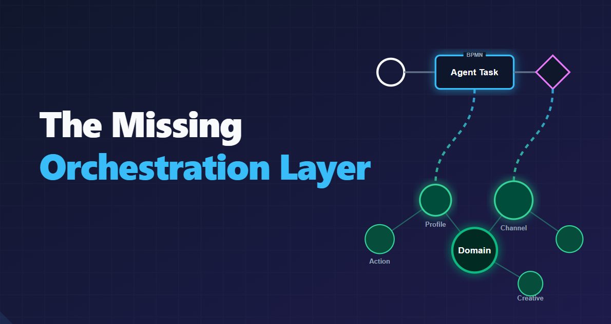
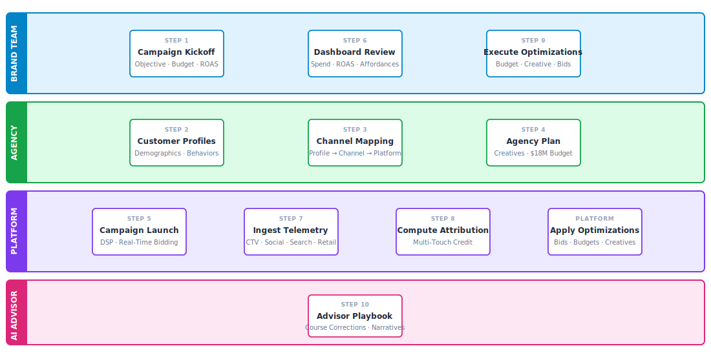
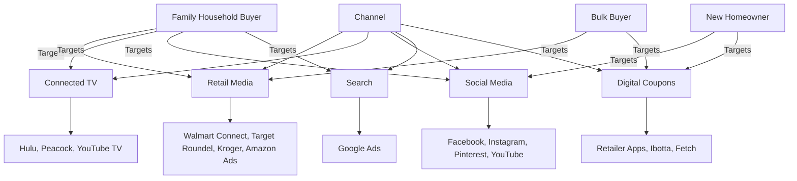
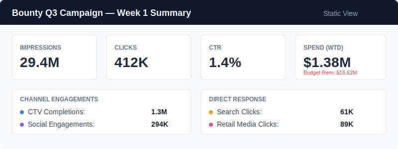
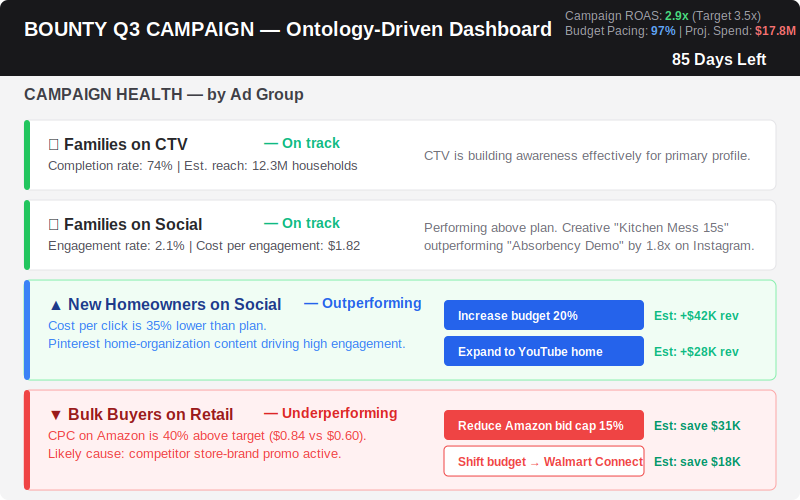
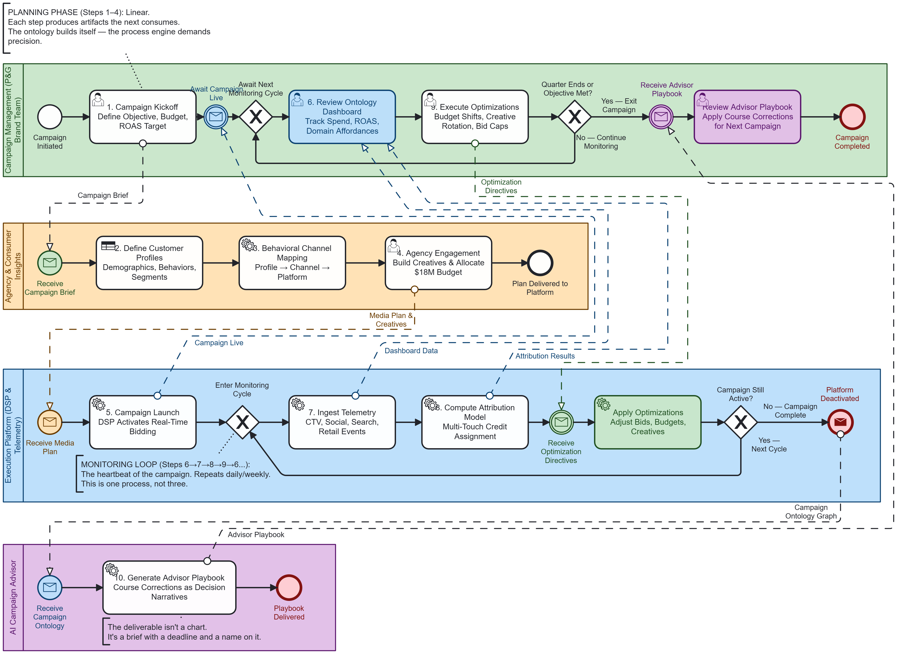

# The Ontology Process

## Orchestration, Dashboards, and Agentic Tasks

{ width=75% }

**A Simplified Single-Process Walkthrough Using P&G Bounty Paper Towels**

**Author:** Gary Samuelson  
**Date:** April 2026  
**Series:** Semantic Process Intelligence — Applied White Papers  
**Status:** Final — April 2026  

---

## The Bidirectional Loop: Let the Process Write the Ontology

The current rush to "just build agents" skips past the building blocks that make agents useful. An agent without a domain model is a language model with an API key — it can talk, but it doesn't know what anything means, what actions are available, or what constraints govern the business.

The missing step is the one nobody wants to do: define the process. Map the workflow. Force the engine to answer hard questions — what data moves from Step A to Step B, what rules govern that transition, what decisions require human authority vs. machine authority. This is the orchestration layer that Nate Watkin calls "invisible or misunderstood by most builders" — an infrastructure shift as significant as the move to cloud or microservices, but one that companies are skipping by snap-fitting incompatible agent parts together and pretending they work like Lego bricks (*"The Missing Orchestration Layer," April 2026*).

When teams do the unglamorous work of building an executable Business Process Model and Notation (BPMN) workflow, something happens: the ontology builds itself. The process engine demands precision, and that precision generates the domain semantics — Concepts, Relationships, Constraints, and Actions — that AI-assisted engineering actually needs to function.

An $18 million consumer packaged goods (CPG) ad campaign demonstrates this directly. Ten steps, four teams, no design workshop — and the ontology that emerges powers the orchestration coordinating those teams, generates an intelligent dashboard with domain-aware actions, and grounds the agentic tasks that produce the Advisor Playbook. The architectural foundation is in *Domain Semantics as the Driver of Agent Orchestration*. 

---

## Why Bounty Paper Towels?

Paper towels are boring. And that's the point.

Procter & Gamble is the world's largest advertiser. Bounty is one of their flagship household brands—"the quicker picker-upper" since 1965. P&G spends billions annually on advertising across every channel imaginable, and they do it for products that sit on grocery store shelves. There is no regulatory drama. There is no compliance cliff. There is just a company trying to sell more paper towels to the people most likely to buy them.

When the domain is this simple, the *process itself* becomes visible. And when the process is visible, the ontology that emerges from it is unmistakably natural—not engineered, but *harvested* from the business case.

---

## The Campaign in Ten Steps

Here is how P&G actually runs an advertising campaign for a product like Bounty. Each step is a real activity that real people do. The ontology doesn't get designed up front—it *appears* as we walk through the work. By tracing this process, you are effectively watching an ontology write itself. By Step 10, that ontology is doing three jobs: coordinating orchestration across pools, driving dashboard UX, and grounding agentic tasks — all without a schema or design workshop.



### Step 1: Campaign Kickoff — "Grow Bounty Market Share in Q3"

P&G kicks off the fiscal year with brand plans. For Bounty, the Q3 objective is straightforward: **increase market share by 1.5 points** in the premium paper towel segment. The marketing VP sets a campaign budget of **$18 million** for the quarter across all channels. A campaign manager is assigned.

The campaign goal translates into a measurable business outcome: move Bounty's share from 38.2% to 39.7% in tracked retail channels (Nielsen/IRI panel data), with a target return-on-ad-spend (ROAS) of 3.5x.

**What just entered the ontology (whether we realize it or not):**

```yaml
Campaign
  ├── name: "Bounty Q3 Market Share Growth"
  ├── brand: Bounty
  ├── owner: Procter & Gamble
  ├── objective: increase market share +1.5 pts
  ├── budget: $18M / quarter
  ├── target ROAS: 3.5x
  └── timeframe: Q3 2026 (Jul 1 – Sep 30)
```

We haven't built an ontology — we've described a campaign brief to a BPMN process engine. But the brief *is* the first layer of the domain model. The engine demanded structure, and the structure became semantics. This is the step that gets skipped in the rush to AI.

---

### Step 2: Customer Profile — "Who Buys Premium Paper Towels?"

P&G's consumer insights team builds a **target customer profile**. This isn't demographic guesswork—it's constructed from purchase panel data, loyalty card signals, and behavioral research.

The primary target: **suburban households with children, household income $75K+, primary grocery shopper aged 28-55.** These are families where messes are frequent, cleaning matters, and the buyer reaches for the brand they trust rather than the cheapest option on the shelf.

Secondary profiles emerge: **new homeowners** (setting up households, establishing brand preferences) and **bulk buyers** (Costco/Sam's Club shoppers who buy in volume when the price-per-roll is right).

**What just entered the ontology:**

```yaml
Customer Profile
  ├── "Family Household Buyer"
  │     ├── household: suburban, with children
  │     ├── income: $75K+
  │     ├── age of primary shopper: 28-55
  │     └── buying behavior: brand-loyal, quality-over-price
  ├── "New Homeowner"
  │     ├── life stage: recently purchased home
  │     └── buying behavior: establishing brand preferences
  └── "Bulk Buyer"
        ├── shopping channel: warehouse clubs
        └── buying behavior: price-per-unit sensitive, volume purchaser
```

Notice: these profiles aren't abstract "audience segments" yet. They're descriptions of real people that the brand team recognizes from years of selling paper towels. The ontology is just writing down what the business already knows.

---

### Step 3: Behavioral Targeting — "Where Do They Shop, Watch, and Scroll?"

The customer profiles now get connected to **observable behaviors**. P&G's data team (and their agency's data partners) map each profile to the channels where these people can actually be found and influenced.

**Family Household Buyer:**
- **Where they shop:** Walmart, Target, Kroger, Amazon — trackable via retailer media networks and loyalty card data
- **What they watch:** Streaming services (Hulu, Peacock, YouTube TV) — reachable via connected TV (CTV) ad insertion during family-oriented programming
- **What they scroll:** Facebook, Instagram, Pinterest — reachable via social media ads, especially in home/family/cooking content feeds
- **What they search:** Google — "best paper towels," "paper towel deals," brand vs. brand comparisons

**New Homeowner:**
- **Detectable signal:** Recent mortgage or address change data (available through data brokers for targeting)
- **Active on:** Home improvement content on YouTube, Pinterest boards for home organization
- **Shopping shift:** Transitioning from one grocery store to another; reachable through digital coupons

**Bulk Buyer:**
- **Where they shop:** Costco.com, Sam's Club, Amazon Subscribe & Save
- **Responsive to:** Price-per-roll promotions, digital coupons, warehouse club apps

**What just entered the ontology:**



Something important happened here: **the ontology now has a graph structure.** Profiles connect to channels. Channels have specific platforms. Platforms have different ad formats and pricing models. Nobody sat in a workshop and designed this graph. It emerged from the process team answering a workflow question: "where do we find these people?" That's the pattern — the process forces the semantics out.

This is direction one of the bidirectional loop — the process writing the ontology. Three steps into a ten-step workflow, and the domain model already has concepts (Campaign, Profile, Channel), relationships (Profile targets Channel via Platform), and the beginnings of constraints (which profiles are reachable through which channels). By the time the monitoring loop starts cycling in the BPMN collaboration, this same graph will govern direction two: the ontology writing the process back — surfacing the dashboard panels, the available actions, and the optimization decisions that the Campaign Management pool can execute. The structure that emerged without deliberate design in Step 3 becomes the coordination mechanism for four independent organizational actors.

---

### Step 4: Agency Engagement — "Build the Ads and Plan the Media"

P&G takes the customer profiles and behavioral targeting maps to their **advertising agency** (historically this would be agencies like Publicis, Grey, or Saatchi & Saatchi — P&G works with several). The agency does two things:

**Creative development:** Build the actual ads.
- A 30-second CTV spot showing a family kitchen mess cleaned up effortlessly with Bounty ("the quicker picker-upper" in action)
- Shorter 15-second social cuts for Instagram and Facebook
- Static display ads with a coupon offer for retail media placements
- Search ad copy for Google: "Bounty Paper Towels — 2x More Absorbent"

**Media plan:** Decide how the $18M budget gets allocated across channels and profiles.

| Channel | Budget Allocation | Primary Profile Target | Ad Format |
|---|---|---|---|
| Connected TV | $7.2M (40%) | Family Household Buyer | 30s and 15s video |
| Social Media | $3.6M (20%) | Family + New Homeowner | 15s video, carousel, static |
| Search | $1.8M (10%) | All profiles (intent capture) | Text ads, shopping ads |
| Retail Media | $4.5M (25%) | Family + Bulk Buyer | Sponsored products, display |
| Digital Coupons | $0.9M (5%) | New Homeowner + Bulk Buyer | Digital offers, rebates |

**What just entered the ontology:**

```yaml
Creative
  ├── "Kitchen Mess 30s" → format: video, duration: 30s, channel: CTV
  ├── "Kitchen Mess 15s" → format: video, duration: 15s, channel: Social
  ├── "Coupon Display" → format: static image, channel: Retail Media
  └── "Search Copy - Absorbent" → format: text, channel: Search

Media Plan
  ├── allocation: Campaign → Channel → Budget
  ├── schedule: flight dates, pacing rules
  └── targeting: Profile → Channel → Creative mapping

Ad Group (the operational unit that ties it together)
  ├── "Families on CTV"
  │     ├── profile: Family Household Buyer
  │     ├── channel: CTV
  │     ├── creative: Kitchen Mess 30s
  │     └── budget: portion of $7.2M CTV allocation
  ├── "Families on Social"
  ├── "New Homeowners on Social"
  ├── "Bulk Buyers on Retail"
  └── ... (one per profile × channel combination)
```

Now the ontology has **three layers** that connect naturally: Campaign → Ad Group → Creative, filtered by Profile and Channel. This is the standard structure of every advertising platform—Google Ads, Meta Ads Manager, The Trade Desk—because it reflects how the business actually works.

---

### Step 5: Campaign Launch — "Ads Go Live"

On July 1, the media agency activates the campaign across all channels simultaneously. Behind the scenes, the agency's **demand-side platform (DSP)** — tools like The Trade Desk, Google DV360, or Amazon DSP — begins bidding for ad impressions in real-time auctions.

Here's what happens in the first hour:
- The DSP reviews available CTV inventory for the evening (family programming on Hulu, Peacock, YouTube TV)
- For each available ad slot, the DSP evaluates: does this viewer match our target profile? What's the slot worth? The DSP bids.
- Auctions resolve in **milliseconds**. If P&G's DSP wins, the Bounty ad is served.
- Simultaneously, social media ads enter Meta's and Pinterest's ad delivery systems. Search ads go live on Google.
- Retail media ads appear as "Sponsored" product listings on Walmart.com and Amazon.

By end of Day 1: **4.2 million impressions** served across all channels. 186,000 of those are CTV ad completions (the viewer watched the full 30-second spot). 42,000 social media engagements (likes, shares, clicks). 8,700 search ad clicks.

**What just entered the ontology:**

```yaml
Impression (an ad shown to a person)
  ├── timestamp
  ├── channel
  ├── creative shown
  ├── profile match (which customer profile was targeted)
  ├── device (CTV set-top box, mobile phone, desktop)
  └── outcome: viewed / clicked / ignored / engaged

Ad Group Performance (aggregated)
  ├── impressions served
  ├── spend consumed
  ├── click-through rate (CTR)
  └── cost per click (CPC) or cost per thousand impressions (CPM)
```

The ontology now has its first **instance data** — not just the structure of the campaign, but actual events flowing through it. Every impression is a fact in the graph. Every click creates a relationship between a consumer profile and an ad creative.

These milliseconds-fast events are actively caught by high-speed telemetry pipelines (like Kafka and Databricks) so that operational dashboards can render them in near real-time.

---

### Step 6: The Dashboard — "Watch the Money Move"

P&G's campaign team opens their dashboard Monday morning. This is the operational surface where they track how the $18M is being spent and what it's producing.

A traditional dashboard shows numbers:



That tells you *what happened*. It doesn't tell you what it *means* or what to *do*.

An **ontology-driven dashboard** interprets the same data through the domain model:



Every recommendation on this dashboard comes from the ontology. The system knows that "Bulk Buyers on Retail" is an ad group targeting a specific customer profile through a specific channel. It knows that Amazon CPC rising while click-through falls is a pattern consistent with competitor promotion activity. It knows that Walmart Connect is an alternative retail media channel that reaches the same profile. The actions aren't generic buttons — they're **domain-aware actions** that exist because the ontology connects Profile → Channel → Budget → Performance.

---

### Step 7: Telemetry — "Every Impression Reports Back"

The campaign is not a one-way broadcast. Every ad impression generates **feedback events** that flow back into the system.

**CTV telemetry:**
- Set-top box or smart TV reports: ad was served, viewer watched 28 of 30 seconds, household ID matches target profile
- If the viewer skipped the ad after 5 seconds, that's a different signal

**Social media telemetry:**
- Facebook/Instagram reports: ad was shown, user scrolled past (impression but no engagement) — or — user liked, shared, clicked through to landing page, spent 22 seconds on the Bounty product page

**Search telemetry:**
- Google reports: user searched "bounty paper towels coupon," saw the ad, clicked, visited the Bounty.com deals page

**Retail media telemetry:**
- Amazon reports: user saw sponsored product listing for Bounty, clicked, added to cart — or viewed but chose competitor product
- Walmart Connect reports: ad impression on Walmart.com grocery page, user clicked, added to next Walmart+ delivery order

**What the ontology now captures:**

```yaml
Feedback Event
  ├── impression_id (links back to the ad that was served)
  ├── event_type: viewed | skipped | clicked | engaged | added_to_cart | purchased
  ├── device_type: CTV | mobile | desktop | tablet
  ├── timestamp
  ├── duration (how long they watched/engaged)
  └── downstream_action (did they do something after?)

Consumer Journey (built from chained feedback events)
  ├── touchpoint_1: Saw CTV ad Tuesday evening (watched 30s)
  ├── touchpoint_2: Saw Instagram ad Wednesday morning (scrolled past)
  ├── touchpoint_3: Saw Instagram ad Thursday (clicked, viewed product page)
  ├── touchpoint_4: Searched "bounty paper towels" Friday (clicked ad)
  └── touchpoint_5: Purchased on Amazon Saturday
```

This is the raw material for attribution. Every feedback event is a node in the knowledge graph. Every sequence of events for the same consumer is a **journey** — a path through the ontology that connects ad exposure to purchase behavior.

---

### Step 8: Attribution — "Which Ads Actually Drove the Purchase?"

A consumer bought Bounty paper towels on Amazon. In the two weeks before that purchase, they saw five different Bounty ads across three channels. **Which ad gets credit?**

This is the **attribution** problem, and it's where the ontology earns its keep.

**The naive answer:** "They clicked the Amazon ad right before buying, so Amazon gets all the credit." This is **last-click attribution** — and it's wrong. It ignores the CTV ad that first made them think about Bounty, the Instagram ad that reminded them, and the Google search that shows they were already interested before they ever reached Amazon.

**The ontology's answer:** Each touchpoint contributed differently based on *what it did to the consumer's journey*:

| Touchpoint | What Happened | Journey Effect | Attribution |
|---|---|---|---|
| CTV ad (Tuesday) | Watched full 30s | Planted awareness — first contact | **20%** |
| Instagram ad #1 (Wednesday) | Scrolled past | No measurable effect | **0%** |
| Instagram ad #2 (Thursday) | Clicked, viewed page 22s | Moved from awareness to consideration | **25%** |
| Google search (Friday) | Actively searched, clicked ad | Demonstrated intent — self-directed action | **35%** |
| Amazon purchase (Saturday) | Clicked sponsored listing, bought | Completed conversion | **20%** |

The attribution weights come from the **domain model**, not from a formula. The ontology knows:
- CTV first-touch for household products builds awareness (historical pattern for this product category)
- A consumer who scrolls past a social ad without engaging didn't receive meaningful value from it
- A click-through with 22 seconds on a product page indicates the consumer is actively considering
- An active search is the strongest intent signal — the consumer went looking for the product
- The final purchase click is important but overstated by last-click models — the decision was largely made before they reached the shelf

**Why this matters for P&G:** If last-click attribution were used, Amazon retail media would appear to be the only channel that matters, and P&G would shift all budget there. But CTV and social were doing the *awareness and consideration work* that made the Amazon search happen. Without the ontology-driven attribution, P&G would defund the channels that create demand in favor of the channel that captures it — a classic mistake in CPG advertising.

**What the ontology captures:**

```yaml
Attribution Model
  ├── journey_id: links a sequence of touchpoints to a conversion
  ├── touchpoint_weights: each touchpoint → fractional credit
  ├── channel_contribution: aggregated credit by channel type
  └── creative_contribution: which ad creative was most effective

Channel Effectiveness (aggregated across thousands of journeys)
  ├── CTV: strong for awareness (avg 18% attribution in converting journeys)
  ├── Social: strong for consideration (avg 22% attribution when engaged)
  ├── Search: strong for intent capture (avg 32% attribution)
  └── Retail Media: strong for conversion capture (avg 21% attribution)
```

---

### Step 9: Optimize — "Double Down on What Works, Cut What Doesn't"

Six weeks into the campaign, P&G has accumulated enough journey and attribution data to make confident optimization decisions. The dashboard now shows clear patterns:

**What's working:**
- **CTV + Social → Search → Purchase** is the dominant conversion pathway for Family Household Buyers. This three-channel sequence produces a 4.1x ROAS.
- **Pinterest for New Homeowners** is the star performer. Cost per engagement is 40% below plan, and these consumers are converting at 1.6x the rate of other channels. The ontology identifies the pattern: home-organization Pinterest content creates a natural context for household product awareness.
- **"Kitchen Mess 15s" creative** is outperforming all other social variants by 1.8x. The messaging about cleaning up after kids resonates with the primary profile.

**What's not working:**
- **Amazon retail media for Bulk Buyers** — CPC remains elevated due to a competitor's ongoing price promotion. For every dollar spent, P&G is getting $0.72 in attributable return. (ROAS: 0.72x — below the 3.5x target.)
- **"Absorbency Demo" CTV creative** — completion rates are lower than "Kitchen Mess." Viewers are skipping it more often.

**The optimization actions (each becomes a process instance):**

| Action | Rationale | Expected Impact |
|---|---|---|
| Increase Pinterest budget for New Homeowners by 25% | Outperforming channel + profile combination | +$180K attributed revenue |
| Shift $400K from Amazon Bulk Buyer → Walmart Connect | Lower CPC environment; same target profile reachable | Save $120K in wasted spend |
| Retire "Absorbency Demo" creative; promote "Kitchen Mess" to primary across all social | Creative performance data is conclusive | +8% engagement rate improvement |
| Increase CTV frequency for Family Buyer from 3x/week to 4x/week | Awareness building is working; data shows room before saturation | +$210K attributed revenue |
| Reduce Search bid caps by 10% for generic "paper towels" queries | Brand queries convert 3x better; shift budget toward branded search | Save $85K, maintain conversions |

Each of these actions executes as a **governed process instance** — approved by the campaign manager, validated against budget authority, tracked with a monitoring window, automatically reverted if performance degrades.

The campaign ROAS moves from 2.9x (Week 1) to 3.7x (Week 6), exceeding the 3.5x target. Market share data from Nielsen confirms Bounty is on track for the 1.5-point gain.

---

### Step 10: The Advisor Playbook — From Intelligence to Action

Steps 6 through 9 described how the ontology transforms raw telemetry into performance insight. But insight is not the endpoint. The endpoint is a person — a campaign manager, a media buyer, a creative director — deciding what to do next and doing it.

This is where most dashboards fail. They surface the signal. They leave the interpretation and the action to the human. The result is analytically accurate and operationally inert: a deck of charts that confirms what happened but doesn't drive what changes.

The ontology-driven Campaign Advisor closes this gap. It doesn't present data. It presents **narratives** — specific, reasoned arguments that begin with what the ontology is seeing, explain *why* it matters in domain terms, and conclude with concrete tasks for specific people.

At Week 6, the Bounty Q3 campaign has three course corrections active. Each is a full decision narrative, not a recommendation summary.

---

### Course Correction 1: Amazon Bulk Buyer — Stop the Bleed

**Urgency: Act this week. Cost of delay: ~$18,000 per week.**

#### The Situation

Since July 21 — 18 days ago — a competitor store-brand promo on Amazon drove the Bulk Buyer CPC from $0.62 to $0.97, a 56% spike. The bid cap reduction on July 28 helped; the cost is now $0.84. But it's still structurally unprofitable. The Bulk Buyer ad group on Amazon is currently delivering **ROAS 0.72x** — for every dollar spent, P&G gets back 72 cents.

#### What the Ontology Sees

The ontology's profile definition for Bulk Buyers states that this segment's *primary purchase driver is cost-per-unit value, not brand affinity*. When a competitor drops their price, the Bulk Buyer's decision function shifts immediately. The Bounty ad creative — which makes a quality case — is speaking the wrong language in a price-driven auction environment. The ontology also knows that Walmart Connect is serving the *same profile* at $0.58 CPC with **ROAS 3.1x** this week, with no competing promo activity. This isn't a profile problem. It's a channel environment problem.

#### Recommended Actions

1. **Cap Amazon Bulk Buyer daily spend at $12,000/day** (from $18,000/day), effective Monday. Hold branded search terms only — these still convert at 2.4x even during the promo, because consumers actively looking for Bounty by name are less price-sensitive.
2. **Redirect the freed $400,000 to Walmart Connect**, targeting the Bulk Buyer segment with identical parameters. At Walmart's $0.58 CPC and current conversion rate, this reallocation is projected to recover ~$280,000 in incremental attributed revenue over the remaining flight.
3. **Test a "Save more per roll — buy the 8-pack" creative variant at Walmart.** The Bulk Buyer's ontological frame is cost-per-unit; the current Bounty creative (which argues quality) is misaligned with this motive. The value message speaks the right language.
4. **Set a re-escalation rule:** if Walmart Bulk Buyer ROAS exceeds 2.5x for 7 consecutive days, expand the shifted allocation to Sam's Club Connect at equal weight.
5. **Hold Amazon at maintenance spend and revisit on August 21.** Historical data on competitor Q3 promotions in the paper products category shows a median duration of 4 weeks. If the promo ends around August 21 and CPC drops below $0.70, restore spend gradually — over 5 days, not overnight, to avoid overbidding on the way back up.

#### Expected Impact

| Metric | Current | Projected (Week 8+) |
|---|---|---|
| Bulk Buyer blended ROAS | 1.4x | 2.4x–2.6x |
| Incremental attributed revenue | — | +$280K over remaining flight |
| Weekly wasted spend (Amazon) | ~$18K/week | ~$4K/week (maintenance only) |
| Decision checkpoint | — | August 21 — reassess Amazon allocation |

> **A note on "Draft Communications":** In the architecture described in this paper, these communications are not emails composed by a person. They are the **human-readable rendering of a governed process instance**. The Advisor generates each directive as structured process variables — budget caps, target channels, audience parameters, monitoring rules, revert conditions — pre-populated from the ontology graph. That directive is routed as a **user task** in Camunda Tasklist to the named role (Retail Media Buyer, Social Media Buyer, Creative Director). The recipient reviews the task, approves or modifies it, and completes it. On approval, the orchestration engine dispatches **service tasks** — DSP API calls to adjust bids, budget caps, and creative rotation — automatically. The monitoring windows and auto-revert rules are **timer events** and **conditional gateways** in the process, not calendar reminders. What appears below as a block quote is the approval surface of that process instance, rendered in plain language so a non-technical reader can see what the Advisor produces. The same framing applies to the Draft Communications in all three course corrections.

#### Draft Communication — To: Retail Media Buyer

> **RE: Amazon Bulk Buyer — Budget Reallocation, Week 7**
>
> Effective Monday August 12:
> - Reduce Amazon Bulk Buyer daily cap from $18K → $12K/day
> - Reallocate $400K from Amazon to Walmart Connect (Bulk Buyer audience, same targeting parameters)
> - Activate "Save more per roll — buy the 8-pack" creative variant at Walmart; suppress Absorbency Demo unit
> - Set alert: if Amazon Bulk CPC drops below $0.70 for 5+ consecutive days, escalate back to $15K/day
>
> **Rationale:** Competitor store-brand promo has sustained high auction pressure since July 21. Walmart Connect shows the same profile at 3.1x ROAS — environment, not audience, is the issue.
>
> Review checkpoint: August 21 — compare Walmart ROAS vs. Amazon signal.
>
> *— Campaign Advisor / August 10*

---

### Course Correction 2: Pinterest New Homeowner — Scale Before Week 9

**Urgency: Double down now. A structural window is closing.**

#### The Situation

The New Homeowner profile is performing at **5.1x ROAS on Pinterest** — the best performing segment in the entire campaign portfolio. The +25% budget increase on August 8 generated $62,000 in incremental attributed revenue in just three days. This is not a statistical anomaly; it is a structural pattern. Pinterest home-organization content creates an unusually high-intent context for household product discovery among people who are actively setting up a new home.

#### What the Ontology Sees

The New Homeowner profile carries a temporal constraint in the ontology: *new homeowners are in a brand formation window*. They have not yet established category habits. They are actively seeking recommendations. Their consideration set is open.

That window is approximately **90 days from the time of home purchase**. The current targeting cohort was entered at the 45-90 day mark. At the time of this writing, roughly **3 weeks remain** before this cohort ages out of the high-receptivity window and begins defaulting to repeat-purchase behavior — buying what they bought last time, not what they newly discover.

After Day 90, re-acquiring these consumers requires a much stronger price or promotional incentive. The cost of acquisition climbs significantly. The window for brand formation closes and does not reopen.

#### Recommended Actions

1. **Increase Pinterest New Homeowner budget by an additional +15%** on top of the +25% already active. At 5.1x ROAS, this spend earns its way and competes favorably against any other reallocation target.
2. **Add the "Life Events: Moving" Pinterest targeting layer** — movers within 60 days of address change. This layer is available through Pinterest's native targeting and reaches people who are actively in the brand formation phase, earlier in the window. Expected CTR lift: 20–30% versus generic homeowner targeting.
3. **Build a 3-step cross-channel retargeting sequence:** Pinterest pin → Instagram Story (48-hour delay) → Ibotta/Fetch coupon offer (Day 5). Research on CPG multi-touch sequences shows this 3-step path delivers approximately 68% higher conversion rates than single-channel Pinterest exposure alone.
4. **Request a Pinterest lookalike audience expansion from Pinterest's customer success team.** Seed the model with converters from this segment — New Homeowners who purchased within 21 days of ad exposure. The resulting audience should be 2–3x larger than the direct-targeted pool.

#### Expected Impact

| Metric | Current | Projected with Scale-Up |
|---|---|---|
| New Homeowner ROAS | 5.1x | 4.8x–5.1x (minor dilution at expanded scale) |
| Incremental attributed revenue | — | +$180K over remaining flight |
| New Homeowner share of total conversions | 8% | 11%–12% |
| Opportunity cost of not scaling | — | ~$95K unrealized revenue |
| Scale-up horizon | — | Weeks 7–9 (diminishing returns expected at Week 9 as pool saturates) |

#### Draft Communication — To: Social Media Buyer

> **RE: New Homeowner Scale-Up, Weeks 7–9**
>
> Three actions needed by end of week:
>
> 1. Pinterest New Homeowner budget: increase by additional +15% on top of current allocation. Target home-organization content cluster, pin and video formats. Add "Life Events: Moving" targeting layer (movers within 60 days).
> 2. Activate retargeting sequence: Pinterest view → Instagram Story (48hr delay) → Ibotta/Fetch coupon offer (Day 5). This should increase multi-touch conversion rate by ~68% vs. single-touch.
> 3. Contact Pinterest CX to request lookalike expansion. Seed audience: converters from New Homeowner segment (purchased within 21 days). Ask for 2–3x audience size estimate before approving.
>
> **DEADLINE:** Actions 1 and 2 by August 12. Action 3 by August 14.
>
> The 90-day brand formation window for this cohort closes around August 31. After that, we're paying acquisition rates, not formation rates.
>
> *— Campaign Advisor / August 10*

---

### Course Correction 3: CTV Creative — Get Ahead of Fatigue

**Urgency: Preventive. Start production this week to be ready on September 1.**

#### The Situation

"Kitchen Mess 30s" is the campaign's CTV anchor. It is performing well: **74% completion rate, 3.4x ROAS, 68.2 million impressions.** But the completion rate has been flat — 74% to 76% — for exactly three weeks. Average household frequency has reached **3.8 impressions per household per week**. These two facts together form a recognizable pattern in broadcast advertising: the creative is approaching saturation for its current audience.

#### What the Ontology Sees

CTV completion rate plateaus typically precede measurable declines by **3 to 4 weeks**. The mechanism is well-understood: audiences don't suddenly stop watching — they gradually disengage, manifesting first as slower remote-control movement (passive completion vs. active viewing), then as increased skip behavior when skip controls are available, then as measurable completion rate decline. The plateau is the early warning; the drop follows.

At a frequency of 3.8x average, the Family Buyer CTV audience (~18 million unique households) has seen this ad three to four times in most cases. The marginal information value of the fifth impression is approaching zero. At some point, continued exposure becomes an irritation rather than a reminder.

The critical operational constraint: **CTV creative production and network clearance takes 3 to 4 weeks.** If the completion rate drop becomes visible before new creative is ready, P&G will spend 2 to 3 weeks paying full CTV rates for an ad that is degrading its own ROAS. The correct response to this signal is not to wait for the drop — it is to start the brief today.

#### Recommended Actions

1. **Brief the creative team this week** on a "Back-to-School Mess" 30-second CTV variant. The narrative arc should maintain the Kitchen Mess situational frame — family, chaos, cleanup, relief — but with a September-specific scene: morning school rush, backpack spills, school lunch preparation. Same emotional register, same product hero moment, new situation.
2. **Target a September 1 air date.** Rotate the new variant at 70% weight; keep "Kitchen Mess 30s" at 30%. Do not retire it — the portion of the audience still actively engaging responds better to a familiar ad than a new one. Forced retirement wastes that segment.
3. **Set a CTV household frequency cap at 4 impressions per week**, immediately. This extends the current creative's effective shelf life by approximately 2 additional weeks by reducing the rate of saturation in the highest-exposed households. It also provides buffer if production runs late.
4. **Do not apply the same rotation schedule to social creative.** "Kitchen Mess 15s" on Instagram and Facebook is at lower frequency and a more fragmented audience context. It has more runway and should not be disrupted by the CTV refresh timeline.
5. **Commission a 6-second bumper variant** for YouTube TV and pre-roll placements. Bumpers have dramatically longer fatigue lifespans than long-form units — short-form ads are processed differently by viewers — and they cost a fraction to produce from existing footage. The "mess → Bounty → clean" payload can be compressed to 6 seconds with a single scene and no dialogue.

#### Expected Impact

| Metric | Current Trajectory | With Creative Refresh |
|---|---|---|
| CTV completion rate (September) | ~68%–70% projected (fatigue sets in) | ≥70% maintained |
| CTV ROAS (September) | 3.0x–3.2x projected | 3.4x–3.5x |
| Revenue impact of fatigue (if not addressed) | ~−$280K over Weeks 9–13 | Avoided |
| Production lead time required | 3–4 weeks | Brief this week → ready September 1 |

#### Draft Communication — To: Creative Director

> **RE: CTV Refresh Brief — September Flight**
>
> URGENT: Brief needed by August 14 to hit September 1 air date.
>
> **UNIT:** "Back-to-School Mess" — 30s CTV + 6s Bumper
> **BRAND:** Bounty Paper Towels
>
> **Strategic Context:**
> "Kitchen Mess 30s" has been in-market 6 weeks at 3.8x average household frequency. Completion rate is plateauing — fatigue signal expected to manifest as a measurable drop in 3–4 weeks. New variant needs to be on air by September 1 to intercept the drop before it impacts ROAS.
>
> **Creative Direction:**
> - Same emotional architecture as "Kitchen Mess" — family setting, credible mess, Bounty intervenes, parent has a "relief + delight" moment
> - New scene: back-to-school situation (morning rush, packed lunch prep, backpack contents spilled on kitchen counter)
> - Tagline maintains "the quicker picker-upper" brand line
> - Mandatory: product close-up with "2x more absorbent" claim super (legal requirement)
>
> **Deliverables:**
> - 30s CTV master
> - 6s bumper cut (YouTube TV / pre-roll)
> - 15s social cut (separate scheduling — do not align with CTV rotation)
>
> **Approvals needed by:** August 28 (allows 3 days for network clearance)
>
> *— Campaign Advisor / August 10*

---

### The Advisor as Ontology Output

These three narratives are not generic best practices applied to a campaign. Every claim — the 18-day competitor promo duration, the 90-day brand formation window, the 3.8x household frequency threshold, the 3-to-4-week CTV production lead time — is a fact that exists in the ontology graph, either as measured data from the current campaign or as domain knowledge encoded when the campaign was set up.

The Advisor doesn't start from analytics and reason to actions. It starts from the ontology — a domain model that knows what the concepts mean — and surfaces the actions that the model's state implies.

This is the distinction that matters: the difference between a system that *shows you information* and a system that *understands the situation*. Showing you that Amazon CPC is $0.84 is information. Telling you that this CPC, in combination with the competitor promo signal, the Bulk Buyer profile definition, and the Walmart Connect alternative, implies a specific reallocation decision with a quantified cost of delay — that is understanding.

An agent without this ontology could look at the same CPC number and hallucinate a recommendation. It would have no concept of what a Bulk Buyer is, why Walmart Connect is a viable alternative, or what the production lead time means for a creative refresh. The orchestration layer — the BPMN workflow that forced every one of these concepts into existence — is what makes the Advisor's output trustworthy rather than plausible.

> **Why "Hallucinate" Is the Right Word — A Brief AI Primer**
>
> When an AI system "hallucinates," it generates text that sounds authoritative but is factually wrong — not because the model is broken, but because of how large language models (LLMs) work. An LLM is a next-token prediction engine: it has been trained on vast amounts of text and learned statistical patterns about what words tend to follow other words. This **parametric knowledge** — patterns frozen into the model's weights during training — is what allows it to write fluent prose about nearly anything. But it is also what makes it dangerous for domain-specific decisions: the model doesn't *know* facts the way a database knows facts. It *predicts* plausible continuations. When it doesn't have the right context, it predicts confidently and incorrectly.
>
> The standard engineering response to this problem is **Retrieval-Augmented Generation (RAG)**: before the LLM generates an answer, the system retrieves relevant documents from a knowledge base and injects them into the prompt as context. The model answers *from the retrieved evidence* rather than from memory. RAG is effective — Chip Huyen's *AI Engineering* (O'Reilly, 2024) treats it as the foundational pattern for production AI systems, and the emerging literature on knowledge-graph-augmented agents (Raieli & Iuculano, *Building AI Agents with LLMs, RAG, and Knowledge Graphs*, Packt, 2025; Montagna et al., *Knowledge Graphs and LLMs in Action*, Manning, 2025) extends this to structured retrieval over graph databases.
>
> But RAG alone retrieves *documents*. The Campaign Advisor doesn't need documents — it needs a **domain model with operational semantics**: the fact that a Bulk Buyer's purchase driver is price-per-unit, the fact that Walmart Connect reaches the same profile at a different CPC, the fact that CTV creative production takes 3–4 weeks. These aren't paragraphs to be retrieved from a filing cabinet. They are **concepts, relationships, and constraints** in a graph — the ontology that the process built across ten steps. When the Advisor generates a course correction, it isn't predicting plausible next tokens. It is traversing the ontology, evaluating the state of its nodes (ROAS falling, CPC rising, competitor promo active), and surfacing the actions that the domain model defines as available. The ontology doesn't just reduce hallucination — it replaces the prediction problem with a *reasoning* problem grounded in a structure that the business itself produced.
>
> This is the distinction between an LLM that talks about campaigns and an agent that *operates within* one.
>
> But even the ontology-grounded agent does not *think*. It traverses, evaluates, and surfaces — all operations on a structure that humans built by doing the process work. Cognition — the ability to weigh competing priorities, exercise judgment under uncertainty, recognize when the model's own assumptions have shifted — remains a human capability. Artificial intelligence is a machine construct: extraordinarily powerful at pattern recognition, retrieval, and structured inference, but incapable of the intuitive understanding that a campaign manager brings when she reads Course Correction 1 and decides, "No — hold Amazon another week; I know this competitor and their promos always end early." That judgment doesn't come from the ontology. It comes from twenty years of selling paper towels. The architecture in this paper is designed with that boundary in mind: the Advisor *surfaces*; the human *decides*. Every course correction routes through a user task — an approval gate where human cognition has the final word. AI supports and accelerates human judgment. It does not replace it.

The deliverable isn't a chart. It's a **brief with a deadline and a name on it**.

---

## The Ontology That Built Itself

We just walked through ten steps of a real CPG advertising campaign. At no point did anyone pause to "design an ontology." Nobody convened a data modeling workshop. Nobody hired an ontologist. The process engine demanded precision at every step, and that precision produced a complete domain model — the building blocks that AI-assisted engineering actually needs.

Look at what accumulated:

```yaml
CAMPAIGN ONTOLOGY — P&G Bounty Q3

Campaign
  └── has: objective, budget, timeframe, target ROAS

Customer Profile
  └── three profiles, each with demographics, behaviors, shopping patterns

Channel
  └── CTV, Social, Search, Retail Media, Digital Coupons
  └── each with: platforms, ad formats, pricing models

Creative
  └── video (30s, 15s), static, text
  └── each linked to: channel, profile, performance metrics

Ad Group
  └── the intersection of Profile × Channel × Creative × Budget

Media Plan
  └── budget allocation across ad groups
  └── flight schedule, pacing rules

Impression / Feedback Event
  └── every ad shown, every response captured
  └── device, timestamp, outcome, duration

Consumer Journey
  └── chain of touchpoints for a single consumer leading to purchase

Attribution
  └── fractional credit assignment across touchpoints
  └── channel-level and creative-level contribution scores

Performance Metrics
  └── CTR, CPC, CPM, CPA, ROAS — at every level of the hierarchy

Actions (available at each concept)
  └── Campaign: adjust budget, extend/shorten flight
  └── Ad Group: increase/decrease budget, pause, expand targeting
  └── Creative: rotate, A/B test, retire, promote
  └── Channel: shift allocation, adjust bids, change pacing
  └── Profile: expand, narrow, clone, suppress
```

This ontology has **four layers**, each of which built naturally from a step in the process:

| Layer | Steps | What It Captures |
|---|---|---|
| **Planning** | 1-4 | Campaign structure, profiles, channels, creatives, media plan |
| **Execution** | 5 | Impressions served, budget consumed, bids placed |
| **Observation** | 6-7 | Telemetry, feedback events, journey construction |
| **Intelligence** | 8-10 | Attribution, optimization, governed actions |

---

## From Ontology to Dashboard — The Single Process Model

The previous section showed direction one of the bidirectional loop: the process revealed the ontology. Every step forced precision, and that precision generated Concepts, Relationships, Constraints, and Actions that nobody sat down to design. The ontology built itself from the work.

This section shows direction two: **the ontology now governs the process back**.

The ten steps above describe a single business process — but they don't belong to a single team. The campaign brief originates with the P&G brand team. The customer profiles and media plan are built by the agency. The real-time bidding, telemetry, and attribution run on execution platforms. The Advisor playbook is generated by an AI system that consumes the ontology graph. These are four distinct organizational actors, each with their own authority, cadence, and internal logic. The question is: what coordinates them? Not a project plan. Not a shared spreadsheet. The **ontology itself** — expressed as an executable collaboration — becomes the coordination mechanism.

The BPMN collaboration diagram below makes this visible. Instead of forcing all ten steps into one pool with internal lanes, it models each organizational actor as an **independent pool** with its own process — connected by **message flows** (the dashed arrows) that represent the handoffs between them. This is how BPMN represents inter-organizational collaboration: each pool owns its sequence of work; messages cross the boundaries. But look at *what* crosses those boundaries. Every message flow carries an ontology artifact: the Campaign Brief is the Campaign concept from Step 1. The Media Plan is the Profile → Channel → Creative graph from Steps 2–4. The Dashboard Data is telemetry interpreted through the attribution model. The Advisor Playbook is the full ontology graph rendered as decision narratives. The orchestration doesn't just move work between teams — it moves the ontology between teams, and each team enriches it before passing it on.



**Four pools, top to bottom:**

| Pool | Actor | Steps Owned | Internal Logic |
|---|---|---|---|
| **Campaign Management** | P&G Brand Team | 1. Campaign Kickoff, 6. Review Campaign Dashboard, 9. Execute Optimizations | Initiates the campaign, reviews dashboards, approves optimizations, receives the Advisor playbook |
| **Agency & Consumer Insights** | Agency + data partners | 2. Define Customer Profiles, 3. Behavioral Channel Mapping, 4. Agency Engagement | Receives the brief, builds profiles, maps channels, delivers the media plan |
| **Execution Platform** | DSP, telemetry, attribution engines | 5. Campaign Launch, 7. Ingest Telemetry, 8. Compute Attribution Model | Launches the campaign, ingests telemetry, computes attribution, applies optimization directives |
| **AI Campaign Advisor** | Ontology-driven intelligence | 10. Generate Advisor Playbook | Receives the full campaign ontology graph at termination, generates the Advisor playbook |

**Planning Phase** (1. Campaign Kickoff → 2. Define Customer Profiles → 3. Behavioral Channel Mapping → 4. Agency Engagement → 5. Campaign Launch): Linear, but crossing three pools. The Brand Team executes **1. Campaign Kickoff — Define Objective, Budget, ROAS Target** and sends the **Campaign Brief** as a message to the Agency pool. The Agency executes **2. Define Customer Profiles — Demographics, Behaviors, Segments**, then **3. Behavioral Channel Mapping — Profile → Channel → Platform**, then **4. Agency Engagement — Build Creatives & Allocate $18M Budget**, and sends **Media Plan & Creatives** as a message to the Execution Platform. The Platform executes **5. Campaign Launch — DSP Activates Real-Time Bidding** and sends a **Campaign Live** signal back up to the Brand Team. Only then — when every planning step has completed and the campaign is actually running — does the Brand Team enter the monitoring loop. The process enforces what a Gantt chart cannot: you don't review a dashboard before there's data on it.

**Monitoring Loop** (6. Review Campaign Dashboard → 7. Ingest Telemetry → 8. Compute Attribution Model → 9. Execute Optimizations → 6...): This is the heartbeat, and it pulses across two pools. The Platform executes **7. Ingest Telemetry — CTV, Social, Search, Retail Events** and **8. Compute Attribution Model — Multi-Touch Credit Assignment**, then sends **Dashboard Data** and **Attribution Results** as messages up to the Brand Team. The Brand Team executes **6. Review Campaign Dashboard — Track Spend, ROAS, Domain Actions** and then **9. Execute Optimizations — Budget Shifts, Creative Rotation, Bid Caps**, sending **Optimization Directives** back down to the Platform, which applies them as governed process instances. Each pool has its own exit gateway; if the campaign is still active, the loop repeats. The dashed arrows crossing between pools are the operational pulse of a running campaign — not a one-time handoff, but a sustained, rhythmic exchange of signal and decision.

**Termination & Advisor Playbook** (10. Generate Advisor Playbook): When the campaign completes — quarter ends, objective met, or budget exhausted — the Platform's end event fires and sends the **Campaign Ontology Graph** as a message to the AI Advisor pool. The Advisor executes **10. Generate Advisor Playbook — Course Corrections as Decision Narratives**: not a data summary, but briefs with deadlines and names on them. It sends the **Advisor Playbook** back to the Brand Team as a final message. The Brand Team receives it, and the campaign ends.

This is **one process**, not four. The pools represent organizational boundaries, not separate workflows. The message flows are the connective tissue — the points where one team's output becomes another team's input. A campaign manager reading this diagram top to bottom can trace the entire lifecycle: brief → profiles → plan → launch → *wait for live* → dashboard → telemetry → attribution → optimize → *repeat* → playbook → done. Every message flow is a contract between teams. Every sequence flow within a pool is work that team owns. The collaboration diagram doesn't just describe the process — it makes the organizational architecture legible.

This is also where the bidirectional loop becomes concrete. In the **planning phase**, the process writes the ontology: each step forces a new concept into existence (Campaign, Profile, Channel, Creative, Ad Group). In the **monitoring loop**, the ontology writes the process: the dashboard that the Brand Team reviews is rendered *from* the ontology — its panels, actions, and recommendations are generated by the domain model, not designed by a UI team. When the Brand Team executes **9. Execute Optimizations**, the actions available to them — shift budget to Walmart Connect, increase Pinterest allocation, retire a creative — are **actions** that the ontology surfaced because it knows which Channels reach which Profiles, which Attribution weights are shifting, and which Creatives are fatiguing. The process didn't invent those actions. The ontology did. And when those optimization directives flow back down to the Platform as message flows, they modify the execution state — which generates new telemetry — which updates the ontology — which changes the next cycle's dashboard. The loop is not metaphorical. It is the monitoring loop in the diagram, executing continuously until termination.

At termination, the Advisor receives the *complete* ontology graph — not a data extract, but the full domain model with every concept, relationship, and performance history accumulated across the campaign lifecycle. The playbook it generates is the ontology's final output: not "here are your metrics" but "here is what the domain model learned, and here is what it implies for the next campaign." That playbook becomes the seed ontology for Q4 — and the bidirectional loop begins again.

---

## Why the Dashboard *Is* the Ontology

The dashboard from Step 6 isn't a separate artifact from the ontology. It's the same thing, rendered for human consumption. This is the payoff of doing the process work first — the UI isn't designed from a blank canvas; it's generated from a domain model that already knows what matters, what's connected, and what actions are available.

Every panel on the dashboard maps to a concept in the ontology:

| Dashboard Panel | Ontology Concept | Why It's There |
|---|---|---|
| Campaign ROAS: 2.9x | Campaign.target_ROAS vs. Campaign.actual_ROAS | The campaign has an objective; this tracks it |
| Budget Pacing: 97% | Media_Plan.daily_target vs. Media_Plan.actual_spend | The plan set pacing; reality is measured against it |
| "Families on CTV — On track" | Ad_Group.status derived from Performance_Metrics | The ad group exists because a Profile targets a Channel |
| "Pinterest outperforming" | Channel.performance vs. Channel.plan | The channel was chosen to reach a profile; it's working better than expected |
| "[Increase budget 20%]" button | Ad_Group.action: adjust_budget | The ontology knows this action is available when an ad group outperforms |
| "Bulk Buyers underperforming" | Attribution.channel_ROAS < Campaign.target_ROAS | Attribution data shows this profile+channel isn't returning |
| "[Shift budget → Walmart]" button | Channel.alternative + Profile.reachability | The ontology knows another channel reaches the same profile |

The traditional dashboard is a **window onto a database**. The ontology-driven dashboard is a **window onto a domain model** — and the domain model knows not just what the data says, but what it means and what you can do about it.

This is what AI-assisted UI generation requires as input. Not a wireframe. Not a prompt. A domain model with actions at every node — and that model came from the process, not from a design sprint.

---

## What This Means for the Executable Semantic Layer

The companion paper *From Ontology to Prototype* introduced the concept of the **executable semantic layer** — the idea that a well-formed ontology doesn't just describe a domain for querying; it becomes the foundation for action.

The Bounty campaign walkthrough demonstrates what happens when you build that foundation through process rather than theory:

| Traditional Semantic Layer | Executable Semantic Layer |
|---|---|
| Defines "Ad Group" as a dimension in a data model | Defines "Ad Group" as an entity with performance metrics, budget authority, and available actions |
| Lets you query "show me CTR by channel" | Lets you ask "which channel is underperforming for this profile and what can I do about it?" |
| Read-only | Read-write — actions execute as governed process instances |
| Analyst interprets the data | Domain model interprets the data and presents recommendations |
| Dashboard shows charts | Dashboard shows the ontology, with actions at every node |

The ontology that emerged from ten steps of a paper-towel ad campaign isn't theoretical infrastructure. It's the actual structure of how the business operates — and when you render it as a dashboard backed by process orchestration, you get a system that doesn't just show you what's happening, but participates in what you do about it.

The structure doesn't appear on its own. The agent needs this structure to function. The dashboard needs this structure to be useful. The AI-assisted UI/UX needs this structure to generate anything beyond generic layouts. And the only reliable way to produce that structure is to do the unglamorous work of mapping the process — the orchestration layer that forces the domain to reveal itself.

---

## The Machinery Beneath the Process — Why Ad Campaign Orchestration Is Hard

The ten-step walkthrough above is deliberately simplified. The clean narrative — brief, profile, plan, launch, monitor, optimize, done — lets the ontology emerge without distraction. But it compresses an enormous operational reality. Before the process engine can coordinate a live campaign, consider what actually sits beneath each step:

- **Campaign management platforms** — data science, business rules engines, workflow orchestration, and budget allocation systems that must be configured before a single ad is served.
- **Seven distinct media channels** — CTV, Open Web, Mobile, Audio, Social, Retail Networks, and Gaming — each with its own ad-serving protocols, bid mechanics, reporting APIs, and latency profiles. A CTV ad on Hulu and a sponsored product listing on Walmart.com operate in fundamentally different execution environments.
- **A privacy-safe data clean-room** — where brand first-party data, media viewing signals, and retail purchase history are joined into unified audience profiles without any party exposing raw data to another.
- **Real-time content classification** — natural language processing (NLP), computer vision, and video analysis evaluating content safety and contextual relevance in *milliseconds*, before the bid request expires.
- **Massive-scale event processing** — capturing and refining trillions of audience impressions as real people encounter ad creatives on living-room set-tops, mobile devices, and retail screens, distilling that signal into the handful of key performance indicators (KPIs) a campaign manager reads on Monday morning.
- **Multi-touch attribution and ROAS computation** — solving identity resolution (linking devices to people to purchases), distributing fractional credit across 5+ touchpoints per journey, measuring incrementality (would they have bought anyway?), and accounting for cross-channel cannibalization. The "ROAS 3.7x" on the dashboard is the output of a pipeline that has been running continuously since launch day.
- **Three tiers of dynamic adjustment** — pre-bid (milliseconds: bid shading, brand safety, frequency caps), in-flight (hourly: creative rotation, channel rebalancing), and strategic (weekly: the governed budget shifts and creative refreshes described in our Course Corrections).
- **Pre-bid and post-bid verification** — a parallel quality layer ensuring ads appear in brand-safe, contextually relevant environments, and confirming after delivery that placements matched intent.

When Step 5 says "the DSP bids," it triggers a cascade that touches every one of these systems. When Step 9 says "shift budget to Walmart," that decision must propagate through the clean-room, the DSP, the data pipeline, the verification layer, and the dashboard — all while the campaign continues running and the feedback loop continues cycling.

No spreadsheet coordinates this. No email chain captures it. No set of agents snap-fitted together without a process model can govern it. This is the operational reality that makes process orchestration not a nice-to-have but a structural necessity.

> **For the full architectural treatment** — including detailed reference architectures, the ROAS attribution formula, and the three-tier dynamic adjustment model with O'Reilly references — see the companion document: *The Machinery Beneath the Process*.

---

## From Model to Runtime — What Happens When Camunda Ingests This BPMN

Everything up to this point has been design-time: a BPMN collaboration diagram that describes how the campaign *should* work, an ontology that emerged from walking through the steps, a dashboard that renders the ontology for human consumption. The diagram is precise, but it is still a document. It lives in a modeler. It communicates intent.

The moment you deploy that BPMN file into a process runtime — in this case, Camunda 8 — something fundamentally changes. The model stops being a description and becomes an **execution engine**. The pools, tasks, gateways, and message flows that were visual communication devices now become live infrastructure that orchestrates real services, real people, and real AI agents across the campaign lifecycle.

This is the shift that Bernd Ruecker describes as the move from "automating individual tasks" to "orchestrating end-to-end processes across organizational boundaries" — the distinction between scripting a step and governing a system (*Practical Process Automation*, O'Reilly, 2021). In the expanded treatment with Leon Strauch, Ruecker frames process orchestration as the enterprise coordination layer that connects microservices, human tasks, and external systems under a single executable model, with the process engine maintaining state, enforcing sequence, and providing visibility across the entire flow (*Enterprise Process Orchestration*, Wiley, 2025). The BPMN diagram isn't an abstraction of the system. It *is* the system.

### What Camunda 8 Actually Does with the Collaboration Diagram

When the four-pool BPMN file is deployed to Camunda 8's Zeebe engine, each element in the model becomes a runtime construct:

| BPMN Element | Design-Time Meaning | Runtime Behavior in Camunda 8 |
|---|---|---|
| **Pool / Process** | Organizational boundary | An independent process definition. Each pool runs as its own process instance with its own state machine. |
| **Service Task** (e.g., 5. Campaign Launch) | "This work happens here" | A **job** published to the Zeebe broker. An external **job worker** — a microservice, a Python script, a platform API adapter — claims the job, executes it, and reports completion. The engine waits. |
| **User Task** (e.g., 6. Review Campaign Dashboard) | "A person does this" | A task routed to **Camunda Tasklist**. The campaign manager sees the task, reviews the campaign dashboard, makes decisions, completes the form. The engine waits. |
| **Message Flow** (dashed arrow between pools) | "This team hands off to that team" | A **message correlation**. When the Agency process publishes the `MediaPlan_to_Platform` message, Zeebe correlates it to the waiting Platform process instance by campaign ID. The receiving process unblocks and continues. |
| **Exclusive Gateway** (e.g., Brand Exit Check) | "Loop or exit?" | A **condition evaluation**. The engine checks process variables — `campaign_active == true` — and routes the token accordingly. No human interprets the diamond; the engine executes the logic. |
| **Message Catch Event** (e.g., Await Campaign Live) | "Wait for a signal from another pool" | A **subscription**. The Brand Team process instance subscribes to the `CampaignLive` message on a correlation key. It blocks — no polling, no timeout hack — until the Platform process publishes the event. |
| **Message End Event** (Platform termination) | "This pool's completion fires a signal" | A **message publish** on process completion. When the Platform exits its loop and reaches the end event, Zeebe publishes `Data_to_Advisor`, which correlates to the AI Advisor process and triggers Step 10. |

The critical insight: **the orchestration doesn't replace the services — it connects them**. The DSP still bids for impressions. The telemetry pipeline still ingests events. The attribution model still computes weights. The AI Advisor still generates narratives. But Camunda becomes the *connective tissue* that ensures these systems execute in the right order, wait for the right signals, and maintain shared state across the campaign lifecycle. Ruecker's term for this is "glue code elimination" — instead of each service knowing about every other service, the process engine holds the coordination logic, and each service only knows how to do its own work (*Practical Process Automation*, Ch. 2).

### The Ecosystem That Emerges

Once the four processes are running in Camunda, the campaign is no longer a project plan tracked in spreadsheets. It is a **live ecosystem** where five categories of participants collaborate through the process engine:

**1. Services** — External job workers that execute the computational steps. The DSP adapter (Step 5) calls The Trade Desk API to activate bidding. The telemetry worker (Step 7) queries Kafka/Databricks for impression events. The attribution worker (Step 8) runs the multi-touch model. Each is a stateless microservice that claims jobs from Zeebe, does its work, and returns results. Chris Richardson's foundational saga pattern applies here: the process engine coordinates the distributed transaction across these services, with each step either completing or compensating (*Microservices Patterns*, Manning, 2018). But unlike a choreography-based saga where services publish events and hope the right consumer picks them up, the Camunda orchestration explicitly sequences and monitors every handoff.

**2. People** — Human task participants who bring judgment where automation cannot. The campaign manager reviews the dashboard (Step 6) and approves optimizations (Step 9) through Camunda Tasklist. These aren't rubber-stamp approvals — they are the moments where domain expertise meets process data. The Brand Team's exclusive gateway (loop or exit?) may be evaluated by the engine, but the *inputs* to that evaluation — "is the campaign still worth running?" — come from a human reading an ontology-driven dashboard. Jim Sinur, Zbigniew Misiak, and BJ Biernatowski frame this as the distinction between "fully automated" and "augmented" process steps — the process model makes the human intervention *explicit and governed* rather than ad hoc (*Practical Business Process Modeling and Analysis*, Packt, 2025).

**3. Dashboards** — The ontology-driven campaign dashboard is not a passive reporting surface in this model. It is a **process participant**. When the monitoring loop reaches Step 6, Camunda routes the user task to the campaign manager along with the process variables — current ROAS, attribution weights, channel performance, available actions. The dashboard renders these variables through the ontology. When the manager clicks "[Shift budget → Walmart]," that action completes the user task with specific variables (`optimization_action: shift_budget, source: Amazon_BulkBuyer, target: Walmart_BulkBuyer, amount: 400000`), which the engine passes to the next service task. The dashboard isn't alongside the process. It is *inside* it.

**4. AI Agents** — The Campaign Advisor (Step 10) runs as a service task worker. When Zeebe publishes the job, the agent receives the full process state — every variable accumulated across the campaign lifecycle, which *is* the ontology graph in serialized form. The agent generates the playbook and returns it as a process variable. But the Advisor isn't the only AI participant. In an augmented model, AI agents can also operate as **decision service workers** within the monitoring loop — evaluating attribution patterns, detecting creative fatigue signals, and pre-populating the optimization recommendations that the human reviews in Step 6. The architecture that Arsanjani and Bustos describe as "agentic architectural patterns" — where AI agents operate within governed workflows rather than as autonomous actors — is exactly what this model enables (*Agentic Architectural Patterns for Building Multi-Agent Systems*, Packt, 2026). The process engine becomes the governance layer that Chip Huyen argues AI systems need: not to constrain the agent, but to make its outputs auditable, reversible, and embedded in a decision chain with human accountability (*AI Engineering*, O'Reilly, 2024).

**5. The Process Engine Itself** — Camunda 8's Zeebe broker is the fifth participant, and it is the one that makes the others cohere. It maintains the **state** of every process instance (which campaign is in which phase, which tasks are pending, which messages are awaited). It enforces **sequence** (the Brand Team cannot enter the monitoring loop until the Campaign Live message arrives). It provides **observability** (Camunda Operate shows every active process instance, every pending task, every completed path). And it enables **governance** — audit trails, SLA timers, escalation rules, compensation handlers — that turn a collaboration diagram into a compliance-grade operational record.

### What "Automation" Actually Means Here

The word "automation" is misleading if it suggests removing humans from the loop. What the Camunda runtime automates is not the *decisions* — it automates the *coordination*. Consider what happens without a process engine:

- The agency finishes the media plan and emails it to the platform team. Someone reads the email, logs into the DSP, and configures the campaign manually. If they're on vacation, the launch waits.
- The telemetry pipeline produces daily reports. Someone downloads a CSV, opens Excel, builds a pivot table, and sends a Slack message to the campaign manager. The manager opens it three days later.
- The campaign manager decides to shift budget to Walmart. They send an email to the retail media buyer, who logs a ticket, which gets picked up in the next sprint. The optimization happens two weeks after the signal appeared.

With the process engine, the coordination is instant and governed:

- The Agency process completes Step 4 and publishes `MediaPlan_to_Platform`. Zeebe correlates the message. The Platform process unblocks and begins Step 5. No email. No waiting. No ambiguity about whether the handoff happened.
- The telemetry worker completes Step 7 and writes dashboard variables. Zeebe advances to Step 8 (attribution), then publishes results to the Brand Team process. The campaign manager's Tasklist shows "Review Dashboard" with live data. No CSV. No Slack. No three-day lag.
- The campaign manager completes Step 9 with `optimization_action: shift_budget`. Zeebe publishes `Optimizations_to_Platform`. The Platform's service worker calls the Walmart Connect API and adjusts the bid configuration. No ticket. No sprint cycle. Minutes, not weeks.

This is Ruecker and Strauch's core argument: process orchestration doesn't eliminate human judgment — it eliminates the *latency and ambiguity* between judgment and action (*Enterprise Process Orchestration*, Ch. 4). The BPMN model that was a communication tool at design time becomes an execution guarantee at runtime. Every message flow that was a dashed arrow in the modeler is now a real-time event correlation in Zeebe. Every sequence flow that was a solid arrow is now a state transition in the engine. The process doesn't just describe the campaign — it *runs* it.

### The Campaign as a Digital Twin

When all four processes are executing in Camunda, something emerges that goes beyond workflow automation: the process engine becomes a **digital twin** of the campaign. Every process instance carries the full state of the campaign in its variables — budget remaining, current ROAS, attribution weights, active optimizations, creative rotation schedule. Camunda Operate provides a real-time view of where every campaign is in its lifecycle. Historical process data in Camunda Optimize enables pattern mining across campaigns — which optimization sequences produce the highest ROAS lift, which creative rotation timings minimize fatigue, which agency handoff patterns introduce the most latency.

This is what Nath and van Schalkwyk describe as the convergence of process execution and simulation models — when the operational system and the analytical model share the same data structure, the organization can both *run* the current campaign and *predict* the next one from the same platform (*Building Industrial Digital Twins*, Packt, 2021). The ontology graph that emerged from our ten steps isn't just the input to the dashboard or the Advisor. It is the process state. And the process state is the digital twin.

### What Comes Next: A Live Runtime

This paper has traced the arc from process to ontology, from ontology back to process, and from process model to runtime architecture. The BPMN collaboration diagram is not a diagram. It is a deployment artifact — a file that Camunda 8 can ingest, parse, and execute as four coordinated process definitions with message-based handoffs, human tasks, service workers, and AI agent integration.

In the companion paper (*From Model to Runtime: Building the Bounty Campaign in Camunda 8.9*), we will make this concrete. The collaboration diagram becomes a deployed process. The dashboard becomes a Camunda Tasklist form backed by the ontology. The telemetry and attribution workers become Python-based Zeebe job workers pulling from simulated campaign data. The AI Advisor becomes a large language model (LLM)-powered service worker that consumes the process state and generates playbook narratives. And the monitoring loop runs — not as a thought experiment, but as a live process instance that a campaign manager can interact with, optimize through, and watch the ontology evolve in real time.

The unglamorous work of mapping the process doesn't just reveal the ontology. It builds the runtime that makes the ontology operational.

---

## Appendix: The Knowledge Graph in Cypher

For readers interested in the graph implementation, here is how the Bounty campaign ontology translates to Neo4j:

```cypher
// Campaign structure
CREATE (c:Campaign {name: 'Bounty Q3 Market Share Growth',
                     budget: 18000000, target_roas: 3.5})

CREATE (p1:Profile {name: 'Family Household Buyer',
                     household: 'suburban, with children', income: '75K+'})
CREATE (p2:Profile {name: 'New Homeowner'})
CREATE (p3:Profile {name: 'Bulk Buyer'})

CREATE (ch_ctv:Channel {name: 'Connected TV', budget: 7200000})
CREATE (ch_social:Channel {name: 'Social Media', budget: 3600000})
CREATE (ch_search:Channel {name: 'Search', budget: 1800000})
CREATE (ch_retail:Channel {name: 'Retail Media', budget: 4500000})

CREATE (ag1:AdGroup {name: 'Families on CTV'})
CREATE (ag1)-[:TARGETS]->(p1)
CREATE (ag1)-[:USES_CHANNEL]->(ch_ctv)
CREATE (ag1)-[:BELONGS_TO]->(c)

// A consumer journey
MATCH (p1:Profile {name: 'Family Household Buyer'})
CREATE (j:Journey {consumer_id: 'HH-904821', status: 'converted'})
CREATE (t1:Touchpoint {channel: 'CTV', event: 'viewed_30s',
                        day: 'Tuesday', attribution: 0.20})
CREATE (t2:Touchpoint {channel: 'Instagram', event: 'scrolled_past',
                        day: 'Wednesday', attribution: 0.00})
CREATE (t3:Touchpoint {channel: 'Instagram', event: 'clicked_22s',
                        day: 'Thursday', attribution: 0.25})
CREATE (t4:Touchpoint {channel: 'Google', event: 'searched_clicked',
                        day: 'Friday', attribution: 0.35})
CREATE (t5:Touchpoint {channel: 'Amazon', event: 'purchased',
                        day: 'Saturday', attribution: 0.20})
CREATE (j)-[:HAS_TOUCHPOINT]->(t1)
CREATE (j)-[:HAS_TOUCHPOINT]->(t2)
CREATE (j)-[:HAS_TOUCHPOINT]->(t3)
CREATE (j)-[:HAS_TOUCHPOINT]->(t4)
CREATE (j)-[:HAS_TOUCHPOINT]->(t5)
CREATE (j)-[:FOR_PROFILE]->(p1)

// Query: What channels contribute most to Family Buyer conversions?
MATCH (j:Journey {status: 'converted'})-[:FOR_PROFILE]->(p:Profile {name: 'Family Household Buyer'})
MATCH (j)-[:HAS_TOUCHPOINT]->(t:Touchpoint)
RETURN t.channel, avg(t.attribution) as avg_attribution, count(t) as touchpoints
ORDER BY avg_attribution DESC
```

---

## Appendix: Glossary of Acronyms

| Acronym | Full Term | Notes |
|---|---|---|
| BPMN | Business Process Model and Notation | An industry-standard graphical notation for modeling business processes; the underlying format of workflows in Camunda and other process engines. |
| CPA | Cost Per Acquisition | Total advertising cost divided by the number of conversions (purchases) generated; a measure of conversion efficiency. |
| CPC | Cost Per Click | The amount paid each time a user clicks on an ad; the primary pricing unit for search and retail media. |
| CPG | Consumer Packaged Goods | Products sold quickly at relatively low cost and restocked frequently — household staples such as paper towels, cleaning products, and food brands. |
| CPM | Cost Per Mille (Thousand Impressions) | The cost to serve 1,000 ad impressions; the standard pricing unit for display and video advertising. |
| CTR | Click-Through Rate | The percentage of ad impressions that result in a click; a measure of ad engagement and creative relevance. |
| CTV | Connected Television | Internet-connected TV devices — smart TVs, streaming sticks, set-top boxes — that deliver addressable video advertising during streaming content. |
| DSP | Demand-Side Platform | Software that enables advertisers to buy digital ad inventory programmatically across multiple ad exchanges in real-time auctions (e.g., The Trade Desk, Google DV360, Amazon DSP). |
| IRI | Information Resources, Inc. | A retail measurement and consumer insights firm (merged with NielsenIQ in 2023 to form Circana) whose purchase panel data is a standard source for CPG market share tracking. |
| KPI | Key Performance Indicator | A quantified metric used to measure progress toward a defined business objective (e.g., ROAS, market share, CTR). |
| LLM | Large Language Model | A deep learning model trained on large text corpora, capable of generating, summarizing, and reasoning over natural language (e.g., GPT-4, Claude). |
| NLP | Natural Language Processing | A branch of AI focused on enabling machines to understand, interpret, and generate human language; applied here to real-time content classification for brand safety. |
| ROAS | Return on Ad Spend | Revenue attributed to advertising divided by the cost of that advertising (e.g., 3.5x means $3.50 in attributed revenue per $1.00 spent); the primary efficiency metric for paid media. |

---

*This paper is part of the Semantic Process Intelligence series.*

---

Gary Samuelson is a VP — Senior Manager, Software Engineering with 20+ years in AI architecture, process orchestration, and enterprise data platforms. He writes about semantic process intelligence, governed agentic orchestration, and the architectural foundations for enterprise AI at [garysamuelson.github.io](https://garysamuelson.github.io).

© 2026 Gary Samuelson | CC BY-NC-ND 4.0 — Share freely with attribution. No commercial use. No derivatives without permission.
