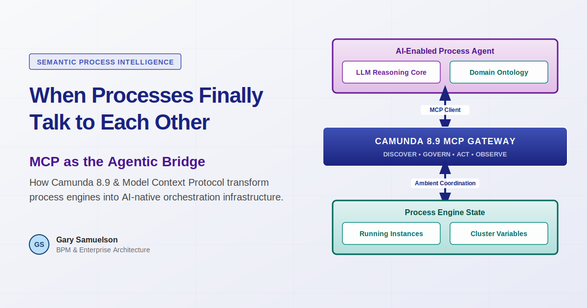
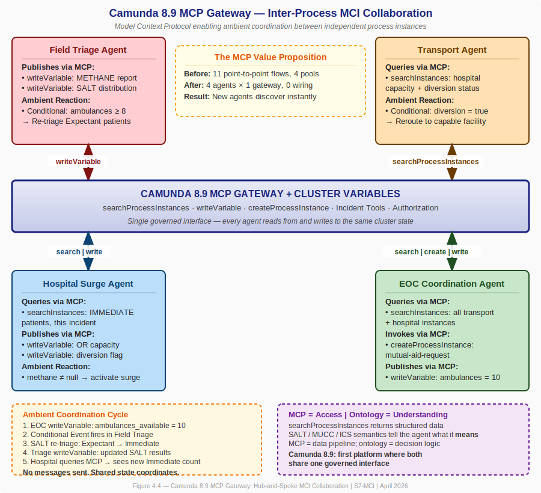
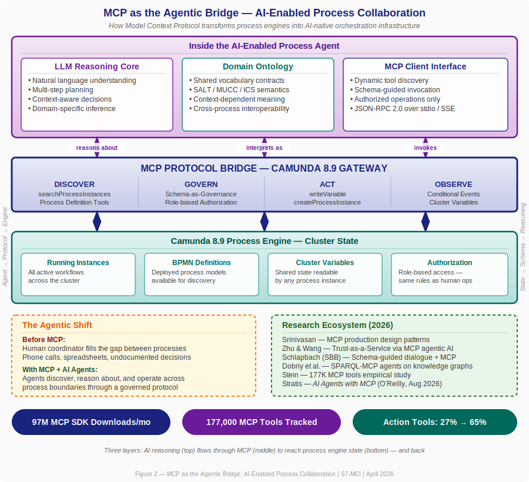

# When Processes Finally Talk to Each Other: What Mass Casualty Response Teaches Us About Camunda 8.9's MCP Gateway

**Author:** Gary Samuelson
**Date:** April 19, 2026
**Series:** Semantic Process Intelligence

---

### Foreword

Every BPM maturity model I've seen puts the same aspiration at the top: processes that are aware of each other. Not faster individual workflows. Not better automation of a single process. The real summit is **inter-process collaboration** — independent process instances discovering each other, sharing meaning, and adapting based on what's happening across the enterprise.

For twenty years, that's been a slide in a maturity deck. Nobody shipped it.

Then Camunda released 8.9 on April 7, 2026 — and for the first time, the mechanisms exist in a single platform to actually build it. In particular, the **MCP Gateway** (`gateway-mcp` module) changes the game. It exposes the entire orchestration engine as a native MCP server: any AI agent in any process instance can discover, query, and write to every other running instance in the cluster. Through a governed, authorized interface.

This article is about what that makes possible. I'm going to use a domain that most of us don't work in — mass casualty incident response — because it turns out that emergency medicine solved the inter-process coordination problem decades ago, under conditions where getting it wrong means people die. Their doctrine maps precisely onto the architectural gaps that BPM has been unable to close. And Camunda 8.9's MCP capabilities are the mechanism that finally closes them digitally.

If you're interested in how MCP works inside a process engine, how AI agents can coordinate across process boundaries, and what genuine inter-process collaboration looks like when it's built on shared state rather than point-to-point wiring — that's what this article covers.

---

## The Gap at the Top of the Maturity Model

Here's the progression that every BPM maturity framework describes:

- **Level 1–2:** Processes exist and are documented. Individual workflows are repeatable.
- **Level 3–4:** Processes are standardized, measured, and optimized. Performance is predictable.
- **Level 5:** Processes collaborate. Cross-process optimization. Portfolio-level coordination. Continuous improvement driven by inter-process intelligence.

The jump from Level 4 to Level 5 isn't a maturity gap. It's an **architectural gap**. Three things were missing from every process engine I've worked with:

1. **Discovery** — How does a running process instance know what other instances exist?
2. **Semantic Context** — When one instance reads another's state, how does it know what that state *means*?
3. **Ambient Coordination** — How do instances adapt to collective state changes without someone hand-wiring every message flow?

Without these mechanisms, humans fill the gap. A coordinator picks up the phone, checks a spreadsheet, walks to the next department. The process works — but it's undocumented, unrepeatable, and trapped in one person's head. Conway's Law takes hold: informal coordination channels calcify into permanent organizational architecture, creating fiefdoms through structural inevitability, not malice.

This is the state of most enterprise BPM today.

---

## MCI Doctrine: The Existence Proof You Didn't Expect

Here's where it gets interesting. Mass Casualty Incident response — the kind of multi-agency emergency coordination that happens when a highway pileup or building collapse overwhelms local resources — already solved all three of those problems. In the physical world. Under life-or-death pressure.

The National Incident Management System (NIMS), the Incident Command System (ICS), the SALT triage algorithm, and the MUCC interoperability criteria together form a battle-tested inter-process collaboration framework. Let me show you how the mapping works.

### Discovery — METHANE

When a mass casualty incident is declared, the first structured communication to all responding agencies uses the **METHANE** mnemonic: Major incident declared, Exact location, Type of incident, Hazards, Access routes, Number of casualties with severity breakdown, Emergency services required.

METHANE is a broadcast. The incident commander doesn't call each hospital individually. They broadcast on the common frequency, and everyone who needs the information takes it. That's discovery and context-setting in a single protocol.

### Semantic Context — MUCC

The **Model Uniform Core Criteria** (MUCC) is the meta-standard that ensures when an EMS crew classifies a patient as "Immediate" and the receiving hospital reads that classification, the term carries identical meaning. Universal triage categories. Evidence-based criteria. Mandatory re-assessment at each transition point.

In process architecture terms, MUCC is a **shared ontology contract**. It's the guarantee that terms mean the same thing across process boundaries.

### Ambient Coordination — SALT Dynamic Re-Triage

This is the one that matters most for understanding MCP's value.

The **SALT** algorithm (Sort, Assess, Lifesaving Interventions, Treatment/Transport) is the nationally endorsed MCI triage standard. Its critical feature: **the Expectant category is resource-dependent.** A patient classified as Expectant — injuries making survival unlikely given available resources — might be reclassified as Immediate if ten additional ambulances arrive from mutual aid. The triage decision isn't based solely on the patient's condition. It's based on the *relationship between the patient's condition and the collective resource pool*.

Nobody sends the triage officer a message saying "re-triage now." The triage officer *sees* the ambulances arrive at staging and re-evaluates. The shared state changed, and behavior adapted.

That's ambient coordination. And it's exactly what Camunda 8.9's Conditional Events and Cluster Variables implement digitally.

---

## Camunda 8.9: The First Platform With the Complete Mechanism Set

Camunda 8.9.0 ships three capabilities that map directly to the MCI doctrine solutions:

### Mechanism 1: MCP Gateway — The Digital METHANE

This is the centerpiece, and it's what I want to spend the most time on.

The `gateway-mcp` module exposes process orchestration as a native MCP server. Any MCP-compliant AI agent can discover it, authenticate, and call its tools. Here's what ships:

| MCP Tool | What It Does | MCI Application |
|---|---|---|
| `searchProcessInstances` | Query running instances across the cluster | Hospital agent searches all Field Triage instances to get real-time patient counts by triage category |
| `writeVariable` | Write to process/cluster variables | Triage agent publishes METHANE report and SALT distribution; visible to every other instance |
| `createProcessInstance` | Start a new BPMN process | EOC agent starts a mutual-aid-request process when transport capacity is insufficient |
| Process Definition Tools | Browse deployed BPMN models | EOC agent discovers which neighboring jurisdictions have deployed MCI response processes |
| Incident Tools | Handle process failures | EOC monitors for stuck handoffs — a failed hospital notification, a timed-out diversion response |

The key insight: **MCP gives agents *access* to the process engine. The domain ontology gives agents *understanding* of what the engine is running.**

Without an ontology, an agent calling `searchProcessInstances` gets back structured data — process IDs, variable values, states. With the MCI ontology, the agent knows that `triage_category = IMMEDIATE` combined with `mechanism = CRUSH_INJURY` and `decontamination_required = true` means "this patient needs a Level I trauma center with decontamination capability, and the closest one not currently on diversion is Regional Medical Center."

MCP moves the data. The ontology makes the answer actionable. Together, they close the gap between tool capability and semantic appropriateness.

And all of this runs through Camunda's existing authorization model. The same security governing human operators governs AI agents. A triage agent can write SALT distributions but cannot modify hospital capacity variables. An EOC agent can create mutual aid processes but cannot re-triage patients. Role-based authority, enforced at the platform level.

### Mechanism 2: Conditional Events + Cluster Variables — The Digital SALT

BPMN Conditional Events (new in 8.9) combined with Cluster Variables provide the ambient coordination mechanism:

1. EOC dispatches 6 additional ambulances → writes cluster variable `ambulances_available = 10`
2. Field Triage process has a conditional boundary event: `= ambulances_available >= 8`
3. When the condition fires, the triage agent re-evaluates Expectant patients
4. Patients with survivable injuries get reclassified to Immediate — because resources now exist to treat them

**No one sent the Field Triage process a message.** The Resource Dispatch process changed the shared state, and the Field Triage process reacted because its conditional event was semantically relevant.

This is SALT's resource-dependent dynamic re-triage, running as cluster-level ambient coordination.

### Mechanism 3: A2A Protocol — ICS Unified Command

The A2A connectors in 8.9 enable structured delegation between AI agents across process instances. A triage agent can invoke a surgical assessment specialist inside the Hospital Surge process to pre-evaluate whether a patient's injury mechanism warrants trauma team activation. The invocation carries context, identity, and authority — mirroring ICS's delegation structure where each handoff preserves the authority chain.

---

## The Architecture at a Glance

Before I walk through a worked example, here's the picture. Everything I've described — and everything that follows — connects back to this diagram.

**Figure 1 — The Hub-and-Spoke MCP Collaboration Model.**

Four independent agent processes — Field Triage (red), Transport (amber), Hospital Surge (blue), and EOC Coordination (green) — each connect to one shared layer: the Camunda 8.9 MCP Gateway and Cluster Variables (the indigo band in the center).

No agent connects directly to any other agent. Every query, every state update, every protocol invocation passes through the shared MCP layer.

Read it in three passes:

**The center band** — the MCP Gateway isn't a message broker. It's the cluster's shared state made queryable. Any instance can call `searchProcessInstances` to discover every other running instance. It can call `writeVariable` to publish its own state. One interface. Every agent. Full incident awareness.

**The colored boxes** — each shows what that agent does *through* MCP. Field Triage publishes. Transport queries. Hospital Surge both queries and publishes. EOC does all three — reads, writes, and invokes new processes.

**The callouts** — the amber box traces the Ambient Coordination Cycle: EOC writes one variable → a Conditional Event fires in Field Triage → SALT re-triage executes → Hospital reads the new counts. Five steps, zero messages sent between agents. The purple box states the foundational point: MCP provides access; the domain ontology provides understanding.

---

## A Highway Collision, Four Processes, Thirty-Eight Minutes

Let me make this concrete.

**April 19, 2026, 14:32 — Interstate 101, Mile Post 42.** A chain-reaction collision involving a tanker truck, a commercial bus, and seven passenger vehicles. Fuel spill. Structural instability. Estimated 38 casualties: 6 Immediate, 12 Delayed, 18 Minimal, 2 Expectant.

Three process instances activate:

- **Field Triage** (Fire/EMS) — executing the SALT protocol for each patient, managing scene safety, coordinating patient movement
- **Hospital Surge** (Regional Trauma Network) — activating surge protocols at trauma centers, allocating patients by injury mechanism and hospital capability
- **Resource Dispatch** (County EOC) — dispatching initial resources, activating mutual aid, tracking everything

Here's how MCP makes them collaborate.

### T+0:00 — METHANE Broadcast

The Field Triage process publishes the METHANE report via `writeVariable`. Every process in the cluster can now query it through the MCP Gateway. No point-to-point message flows. One write, universal visibility.

### T+0:08 — Surgical Pre-Assessment

For the 6 Immediate patients, the Triage Agent invokes the Hospital Surge process's Surgical Assessment Agent via A2A. It sends MUCC-enriched patient profiles. The assessment agent evaluates each against hospital capabilities: Patient 007 (flail chest) → Memorial Level 1 Trauma Center. Patient 003 (crush injury) → Regional Level 2. Patient 012 (burns + inhalation) → University Burn Center.

### T+0:12 — Resource Shortfall Detected

The Dispatch Agent queries the MCP Gateway: how many Immediate patients are awaiting transport, and what's current ambulance availability? Answer: 6 Immediate patients, 4 ambulances. Shortfall. The agent calls `createProcessInstance` to start a mutual-aid-request process — a governed BPMN workflow that handles the notification chain, resource commitments, and staging assignments.

### T+0:18 — The Ambient Coordination Moment

Six mutual aid ambulances arrive. EOC writes `ambulances_available = 10` via `writeVariable`.

The Field Triage process has a Conditional Boundary Event: `= ambulances_available >= 8`. It fires. The triage agent re-evaluates the 2 Expectant patients.

**Patient 031** — bilateral femur fractures, hemorrhagic shock, previously classified Expectant because every ambulance was committed — is reclassified to **Immediate**. Resources now exist to transport and treat.

Nobody called the Field Triage process. Nobody sent a message. Shared state changed, and the process reacted based on its own domain logic.

### T+0:25 — Hospital Diversion

Memorial Level 1 Trauma Center hits surgical capacity. The Hospital Surge process writes `hospital_diversion_memorial = true` to a cluster variable. The Resource Dispatch process's conditional event fires. All transports routed to Memorial are rerouted to the next available Level 1 facility.

Again — no one called the Dispatch process. The hospital's action changed the shared state. The dispatch process reacted because its conditional event was semantically relevant.

### T+0:38 — Outcome

In thirty-eight minutes, the three-process collaboration triaged 38 patients, pre-assessed all critical patients with receiving hospitals, detected and resolved a resource shortfall, dynamically re-triaged 1 Expectant patient to Immediate, and rerouted transports when a hospital diverted. All without a single human coordinator making phone calls.

This is BPM Level 5. And MCI doctrine is the existence proof that it works.

---

## Six Concrete MCP Values

Let me pull this back to what MCP specifically delivers, because I think these values apply well beyond the MCI domain.

### 1. Runtime Discovery

In traditional BPMN collaboration, every inter-pool message flow must be designed at modeling time. You have to know, before deployment, which instances will talk to each other. In MCI, that's impossible — nobody knows how many hospitals will activate, how many ambulances will arrive, or whether mutual aid from a neighboring county will show up.

`searchProcessInstances` eliminates this constraint. A Hospital Surge process that activates twenty minutes into the incident immediately discovers every Field Triage instance already running. No pre-wiring.

### 2. One Write, Universal Visibility

Traditional inter-process communication requires the sender to know the receivers. Four consumers need four message flows. A fifth consumer means a model redesign.

`writeVariable` inverts this. Write once to a cluster variable. Every current and future process instance can read it. That's METHANE's broadcast protocol, digitized.

### 3. Ambient Coordination

This is the big one. The EOC doesn't call Field Triage. Field Triage doesn't call the Hospital. Shared state changes, and each process reacts based on its own domain logic. Conditional Events on cluster variables are the digital equivalent of the triage officer seeing ambulances arrive at staging.

### 4. Protocol Invocation, Not Function Calls

When the EOC determines transport capacity is insufficient, it doesn't execute mutual aid logic inline. It calls `createProcessInstance` to start a governed BPMN process — `mutual-aid-request` — with audit trails, authorization gates, timeout escalations. The agent invokes the protocol; the process definition controls execution.

### 5. Governed Access

Every MCP tool call passes through Camunda's authorization framework. The triage agent can write SALT distributions but cannot modify hospital capacity. The transport agent can query diversion status but cannot declare diversion. Same role-based boundaries as ICS — enforced at the platform level.

### 6. Linear Scaling

The full MCI BPMN has 11 point-to-point message flows between 4 pools — nearly the theoretical maximum of N×(N-1). Adding a fifth agent (HazMat, say) would require up to 8 additional flows.

With MCP: one connection to the gateway. The HazMat agent writes decontamination status, queries patient exposure data, and reacts to incident state via Conditional Events. Every existing agent sees the data on its next query. No existing model redeployed. No message flow modified.

In MCI response, incidents evolve. Mutual aid arrives. Specialized teams deploy. An architecture that requires remodeling every time a new capability joins cannot keep up with a real incident. MCP's hub-and-spoke topology scales with the incident, not against it.

---

## MCP as the Agentic Bridge

Everything above describes what MCP does at the protocol level. But there's a deeper question the architecture diagram (Figure 1) doesn't answer: **what's inside each of those colored boxes?**

They aren't scripts. They aren't rule engines. Each agent in the MCI architecture is an AI-enabled reasoning system — an LLM with a domain ontology and an MCP client interface. And that combination is what makes the whole pattern work.

**Figure 2 — The Three-Layer Agentic Architecture.**

Read this diagram as a sandwich. The top layer is what's inside the agent: an LLM reasoning core that can plan and make context-dependent decisions, a domain ontology that gives terms like "Immediate" and "diversion" their operational meaning, and an MCP client interface that knows how to discover and invoke tools through a standard protocol. The middle layer — the MCP Protocol Bridge — is what the Camunda 8.9 Gateway exposes: four capabilities (Discover, Govern, Act, Observe) that together make the process engine accessible to any MCP-compliant agent. The bottom layer is the process engine itself: running instances, BPMN definitions, cluster variables, and the authorization framework.

The arrows are bidirectional. An agent reasons *about* process state (top → middle → bottom), and process state changes flow *back up* through the bridge into the agent's reasoning context (bottom → middle → top). That round-trip — state observation triggering re-evaluation triggering new actions — is the ambient coordination cycle running inside every agent in Figure 1.

### Why This Matters: The Bridge Function

Most people encounter MCP as "how Claude talks to tools" or "how my IDE connects to a database." That's accurate but incomplete. In the process orchestration context, MCP serves three specific bridge functions that make AI-enabled tasks possible:

**1. Tool Discovery replaces hard-wired integration.** When a Field Triage agent starts up, it doesn't need a pre-configured list of other processes to talk to. It calls the MCP Gateway's tool listing and discovers what's available: `searchProcessInstances`, `writeVariable`, `createProcessInstance`, plus whatever process definitions are deployed. The agent adapts to what exists at runtime, not what was designed at build time. Dobriy et al. (2026) demonstrate this same pattern with SPARQL endpoints — MCP-enabled agents discovering and federating queries across knowledge graphs they've never seen before.

**2. Schema-as-Governance constrains what agents can do.** This is the insight from Schlapbach's work at Swiss Federal Railways (2026): MCP schemas don't just describe function signatures. They encode *operational constraints and reasoning guidance*. When Camunda exposes `writeVariable` through the MCP Gateway, the schema can declare which variables an agent is authorized to write, what types they accept, what preconditions must hold. The schema IS governance. Same role boundaries as ICS — a triage agent writes SALT distributions but cannot declare hospital diversion. Enforced at the protocol level, auditable, and identical to the rules governing human operators.

**3. The process engine becomes an AI-native resource.** This is the fundamental shift. Before MCP, a process engine was infrastructure that humans interacted with through task lists and forms. With MCP, the engine is a first-class resource that AI agents can discover, query, and operate through a standard protocol. Srinivasan (2026) documents this at enterprise scale — 97 million monthly MCP SDK downloads, 10,000+ production MCP servers — and identifies three production patterns (context-aware brokering, adaptive timeout budgeting, structured error recovery) that make the bridge reliable.

### The Research Confirms the Pattern

I went looking for external validation of this architecture, and the 2026 literature is remarkably convergent:

- **Srinivasan** (arXiv:2603.13417) — deployed MCP agent patterns at a major cloud provider. Confirms MCP as the standard agent-tool interface but identifies three gaps for production: identity propagation, tool budgeting, error semantics. These are exactly the gaps Camunda's authorization model already addresses.

- **Zhu & Wang** (arXiv:2604.07065) — propose "Trust-as-a-Service" where a central server-side agent orchestrates device-side agents that expose capabilities via MCP. Their hub-and-spoke topology mirrors our MCI architecture directly. They report 100% collaborator selection accuracy when MCP provides the discovery layer.

- **Schlapbach** (arXiv:2602.18764, Swiss Federal Railways) — establishes that Schema-Guided Dialogue and MCP are converging into a unified paradigm. Five design principles: Semantic Completeness, Explicit Action Boundaries, Failure Mode Documentation, Progressive Disclosure, Inter-Tool Relationship Declaration. Every one of these applies to how Camunda exposes its tools through the MCP Gateway.

- **Dobriy et al.** (arXiv:2603.06582) — SPARQL-MCP agents that discover, explore, and query federated knowledge graphs. This is the ontology bridge: MCP connecting AI agents to structured knowledge through a standard protocol. The pattern is identical to our agents querying process state through the MCP Gateway.

- **Stein** (arXiv:2603.23802) — empirical study of 177,000 MCP tools created between November 2024 and February 2026. The key finding: action tools (tools that modify external state, like `writeVariable` and `createProcessInstance`) rose from 27% to 65% of total usage. The ecosystem is moving from observation to action. That's exactly the trajectory the MCI architecture requires.

- **Bandara et al.** (arXiv:2604.05987) — Flowr, an MCP-enabled agentic system for retail supply chain. Specialized AI agents coordinated by a central reasoning LLM through MCP interfaces, with human-in-the-loop oversight. Validated at enterprise scale with a real supermarket chain. Their architecture is a domain-independent blueprint — and it maps directly to the MCI pattern.

Kyle Stratis's forthcoming *AI Agents with MCP* (O'Reilly, August 2026) is the first book-length treatment of building production agent systems on the MCP protocol. Bernd Rücker and Leon Strauch's *Enterprise Process Orchestration* (Wiley, April 2025) provides the Camunda-side platform context.

### What This Means for the MCI Architecture

Go back to Figure 1 — the four agents connected to the MCP Gateway. Now you know what's inside each one. The Field Triage Agent isn't executing a decision table. It's an LLM that understands SALT semantics, reasons about whether ambulance arrival changes a patient's survivability calculation, and acts through `writeVariable` to publish the result. The Hospital Surge Agent isn't running a capacity spreadsheet. It's reasoning about surgical capability versus injury mechanism, querying the MCP Gateway for incoming patient profiles, and writing diversion flags when capacity is exhausted.

The MCP Gateway is what makes this possible — not because it moves data (message brokers do that), but because it exposes the entire orchestration engine as a standard AI resource. Any agent, from any process, can discover every other running instance, read its state with semantic understanding, and act within governed boundaries.

That's the agentic bridge. And it's already shipping.

---

## An IPC Maturity Model

Based on the MCI doctrine mapping and the Camunda 8.9 mechanism analysis, I'm proposing a six-level Inter-Process Collaboration (IPC) maturity model:

| Level | Name | What It Means | Mechanism |
|---|---|---|---|
| **IPC-0** | Isolated | Instances run independently; no awareness of others | None — the default |
| **IPC-1** | Notified | Instances receive broadcast notifications | Event bus, message correlation |
| **IPC-2** | Queried | Instances discover and query other instances' state | MCP Gateway |
| **IPC-3** | Delegated | Instances delegate work to specialists with authority and identity | A2A Protocol |
| **IPC-4** | Ambient | Instances react to shared state changes without point-to-point wiring | Conditional Events + Cluster Variables |
| **IPC-5** | Semantic | All of the above, plus a shared domain ontology for context-dependent interpretation | Domain ontology + all mechanisms |

Most enterprises operate at IPC-0 or IPC-1. Well-architected service meshes reach IPC-2. MCI doctrine has operated at IPC-5 for decades — in the physical world. Camunda 8.9 provides the first complete digital mechanism set for IPC-5.

---

## Why This Domain, Why Now

Three things converge:

**The platform.** Camunda 8.9 ships all three mechanisms simultaneously. Before this release, each existed in isolation — A2A in research, MCP in AI tooling, Conditional Events in the BPMN specification but not in execution. The simultaneous availability in one platform is unprecedented.

**The doctrine.** MCI coordination has been refined through decades of real incidents — from the 1970s California wildfires that birthed ICS, through the World Trade Center attacks that led to NIMS, to the MUCC standardization effort that created universal triage interoperability. This isn't theoretical. It's battle-tested.

**The AI capability.** A2A (Google, April 2025) and MCP (Anthropic, November 2024) provide the inter-agent protocols. LLMs provide the reasoning that turns structured data into situational understanding. The agent inside a Field Triage process can now *reason* about whether a patient's injury mechanism warrants trauma team activation — not just route data. And the 2026 research ecosystem confirms this isn't speculative — Srinivasan documents 97 million monthly MCP SDK downloads, Stein tracks 177,000 MCP tools with action tools rising from 27% to 65% of usage, and Bandara demonstrates an MCP-enabled agentic system validated at enterprise scale in retail supply chain. The pattern works. It's being built. Right now.

And MCI is the right validation domain because the stakes enforce rigor. Every protocol element exists because its absence caused a preventable death. The processes are genuinely independent — different agencies, different systems, different command structures. The semantics are standardized. The ambient coordination is clinically validated. And every source document is published by U.S. federal agencies and freely available.

---

## What This Means for Practitioners

I want to end with the practical takeaway, because the MCI domain — while powerful as a reference architecture — is specialized.

The patterns here generalize. Consider:

- **Supply chain orchestration** — procurement, manufacturing, logistics, and distribution are independent processes that need ambient coordination when disruptions cascade. A port closure (shared state change) should trigger automatic re-routing in logistics and re-scheduling in manufacturing — without someone calling a meeting.

- **Financial trade lifecycle** — order management, risk assessment, settlement, and regulatory reporting are separate process instances that share state. A margin breach (shared state change) should trigger position adjustments across all related orders — ambient coordination, not manual intervention.

- **Healthcare beyond MCI** — care coordination across primary care, specialist referral, lab, pharmacy, and insurance authorization. A lab result (shared state change) should trigger care plan adjustment, medication review, and insurance pre-authorization simultaneously.

In every case, the pattern is the same: independent processes, shared state through MCP, ambient coordination through Conditional Events, structured delegation through A2A, and a domain ontology that tells each agent what the data *means*.

Camunda 8.9 doesn't just add AI features to a process engine. It provides the architectural foundation for processes that are genuinely aware of each other. The MCI domain proves the pattern works. The platform makes it buildable.

---

## Further Study

The full research paper — with complete BPMN collaboration diagrams, detailed MCI doctrine citations, the worked YAML semantic message examples, the MUCC compliance analysis, and a Conway's Law argument for why this architecture breaks organizational silos — is available in the Semantic Process Intelligence series:

- **S7-MCI** (full version): *When Processes Collaborate: Inter-Instance Semantic Orchestration in Mass Casualty Response*
- **S1** (foundation): *The Ontology Process: How Process Definition Reveals Domain Structure*
- **S4** (single-process proof): *Domain Semantics as the Driver of Agent Orchestration*

For the bidirectional thesis — domain semantics drives orchestration, and orchestration reveals semantics — start with S1. For how that thesis extends from single-process to multi-process scope using MCI as the reference domain, that's S7-MCI.

---

## Key Sources

- FEMA. *National Incident Management System (NIMS)*, 3rd ed. DHS, October 2017.
- Lerner, E.B., et al. "SALT mass casualty triage." *Disaster Med Public Health Prep*, 2008; 2(4):245-6.
- NHTSA. *Model Uniform Core Criteria for Mass Casualty Incident Triage*. EMS.gov, 2014.
- Camunda. *Camunda 8.9.0 Release Notes*, April 7, 2026.
- Google. *Agent-to-Agent (A2A) Protocol Specification*, v0.2, April 2025.
- Anthropic. *Model Context Protocol (MCP) Specification*, v1.0, November 2024.
- Rosemann, M. and de Bruin, T. "Towards a Business Process Management Maturity Model." *ECIS*, 2005.
- Conway, M.E. "How Do Committees Invent?" *Datamation*, 14(5), April 1968.
- Srinivasan, A. "Bridging Protocol and Production: Design Patterns for Deploying AI Agents with Model Context Protocol." arXiv:2603.13417, March 2026.
- Zhu, Y. and Wang, X. "Trust-as-a-Service: Task-Specific Orchestration for Effective Task Completion via Model Context Protocol-Aided Agentic AI." arXiv:2604.07065, April 2026.
- Schlapbach, C. "The Convergence of Schema-Guided Dialogue Systems and the Model Context Protocol." arXiv:2602.18764, February 2026.
- Dobriy, D. et al. "Agentic SPARQL: Evaluating SPARQL-MCP-powered Intelligent Agents on the Federated KGQA Benchmark." arXiv:2603.06582, January 2026 (revised April 2026).
- Stein, M. "How are AI agents used? Evidence from 177,000 MCP tools." arXiv:2603.23802, March 2026.
- Bandara, H.M.N.D. et al. "Flowr — Scaling Up Retail Supply Chain Operations Through Agentic AI." arXiv:2604.05987, April 2026.
- Stratis, K. *AI Agents with MCP*. O'Reilly Media, August 2026.
- Rücker, B. and Strauch, L. *Enterprise Process Orchestration*. Wiley, April 2025.

---

*Part of the Semantic Process Intelligence series. For the complete research with full BPMN models, ontology mappings, and doctrine citations, see S7-MCI.*

*The author's previous work on BPM architecture, including straight-through processing with Camunda and Apache Camel, is available at [garysamuelson.com/blog](https://garysamuelson.com/blog).*
